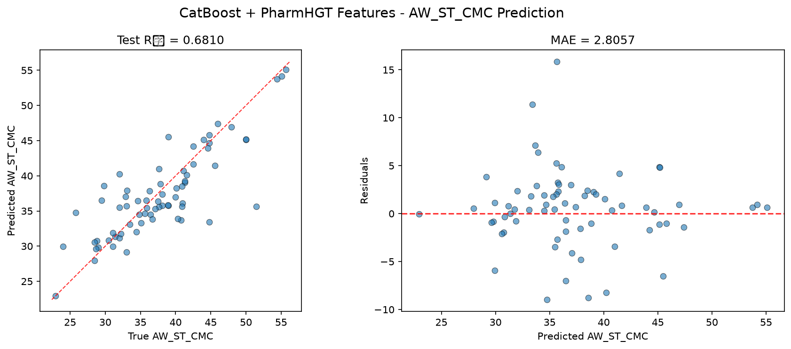
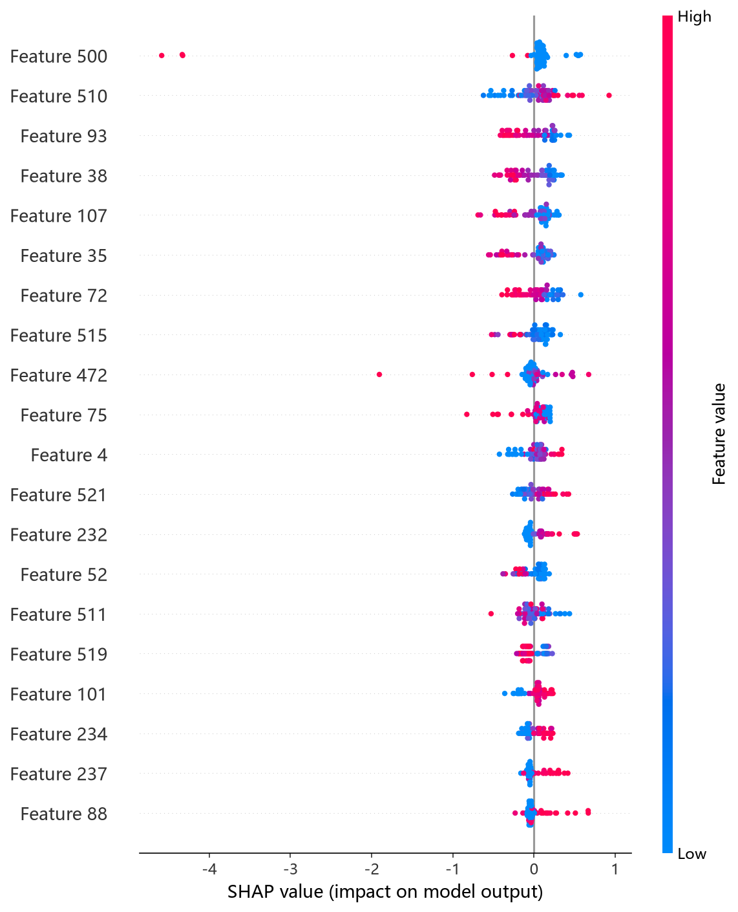
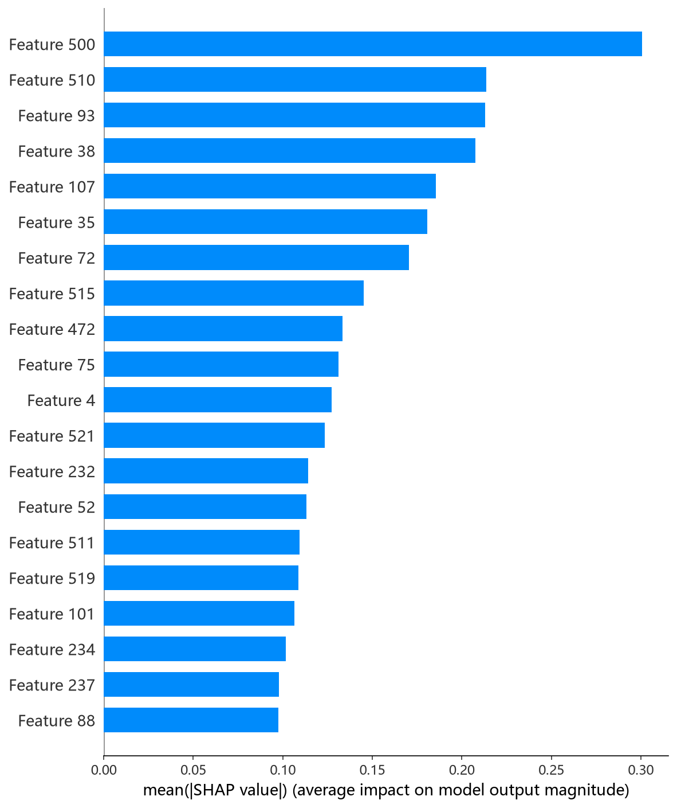

# CatBoost 模型报告 — AW_ST_CMC 预测

## 报告信息

| 项目 | 内容 |
|------|------|
| 目标变量 | AW_ST_CMC（表面活性剂在 CMC 时的表面张力，单位 mN/m） |
| 运行目录 | `runs\AW_ST_CMC\AW_ST_CMC_catboost_20260804_184720` |
| 运行时间 | 18:47 开始 ~ 21:31 结束（约 164 分钟） |
| 特征类型 | PharmHGT 522 维手工特征 |
| 报告生成日期 | 2026-08-07 |

## 概述

CatBoost 是 Yandex 提出的梯度提升框架，以其对**类别特征的原生支持（ordered target statistics）**、**对称树（oblivious trees）**结构与**ordered boosting**抗偏移机制著称。本项目全部特征均为连续数值型，类别特征优势未直接发挥，但其稳健的默认实现与自带早停的收敛方式在本任务中依然表现可靠。

在 AW_ST_CMC 任务中，CatBoost 的 Test R² = 0.6810、Test RMSE = 4.0407，在 10 个模型中排名第 3，处于第一梯队（NGBoost、XGBoost 之后）。

## 数据与方法

- **特征**：522 维 PharmHGT 风格特征，从缓存加载（`[Cache HIT]`），与其余模型一致。
- **数据规模**：训练集 843 条（737 训练 + 106 验证），测试集 70 条。
- **数据划分**：`train_test_split(0.125, random_state=42)`，固定随机种子。

## 超参数与调优

采用 **Optuna 50 轮 × 5 折交叉验证**（TPE 采样器 + MedianPruner），搜索空间覆盖 depth[4,10]、learning_rate[5e-3,0.3]、iterations[500,3000]、l2_leaf_reg[1,50]，并附加 random_strength / bagging_temperature / border_count / one_hot_max_size / leaf_estimation_iterations / min_data_in_leaf 等次要参数。

**最优试验（Trial 14，CV RMSE = 3.8285）：**

| 参数 | 值 |
|------|-----|
| depth | 8 |
| learning_rate | 0.0321 |
| iterations | 1339 |
| l2_leaf_reg | 1.9111 |
| random_strength | 3.3097 |
| bagging_temperature | 2.9460 |
| border_count | 208 |
| one_hot_max_size | 35 |
| leaf_estimation_iterations | 8 |
| min_data_in_leaf | 41 |
| Best CV RMSE | 3.8285 |

**Optuna 参数重要度：**

| 参数 | 重要度 |
|------|--------|
| l2_leaf_reg | 0.2614 |
| min_data_in_leaf | 0.2181 |
| iterations | 0.1969 |
| depth | 0.1799 |
| learning_rate | 0.0503 |
| 其余（one_hot_max_size 等） | < 0.04 |

参数重要度显示 **l2_leaf_reg（叶节点 L2 正则）与 min_data_in_leaf（最小叶样本数）合计权重近半（0.48）**，说明本任务中**抑制过拟合的正则项是 CatBoost 表现的首要杠杆**；深度与迭代数紧随其后（depth 0.18、iterations 0.20），而学习率（0.05）影响较小。最终参数 depth=8、l2_leaf_reg=1.9、min_data_in_leaf=41 是"中等深度 + 较强叶约束"的组合，与 CV 收敛过程相互印证。

## 训练过程

- **调参阶段**：50 轮 Optuna 中 26 轮正常完成、**24 轮被 MedianPruner 剪枝**（接近半数），说明搜索后期大量采样落入已探明的低质量区域，收敛充分。最优值从 Trial 0 的 4.0443 一路改善至 Trial 14 的 **3.8285**，此后 30 余轮未能突破，搜索稳定。
- **最终训练**：以最优参数在 737 条训练集上训练，CatBoost 内置早停于 **iteration 828**（bestTest = 3.8999）触发，随后 **"Stopped by overfitting detector (150 iterations wait)"**，模型收缩至前 829 轮权重交付。

## 测试结果

| 指标 | 值 |
|------|-----|
| Test RMSE | **4.0407** |
| Test MAE | **2.8057** |
| Test R² | **0.6810** |
| Best CV RMSE | 3.8285 |

> 图：预测值 vs 真实值散点图与残差图见 [pred_vs_true.png](../../../runs/AW_ST_CMC/AW_ST_CMC_catboost_20260804_184720/pred_vs_true.png)。
>
> 

Test RMSE（4.0407）与最终训练早停点的验证 RMSE（3.8999）接近但略高，测试集（70 条）上 R² = 0.6810，处于 10 个模型第三位。Test MSE = 16.3270 与之印证。MAE（2.8057）在 10 个模型中最低，说明其预测残差整体最小、对多数分子都接近真实值。

## 特征重要性（Top 20）

CatBoost 输出原生 Top-20 特征重要度（PredictionValuesChange 口径），前 5 名为：

1. **brics_30**（2.3）— BRICS 碎片 CRC32 直方图桶
2. **MolWt**（2.2）— 分子量
3. **brics_2**（2.1）— BRICS 碎片桶
4. **atom_mean_3**（1.8）— 原子特征均值
5. **atom_std_38**（1.6）— 原子特征标准差

其下依次为 LogP、atom_mean_48、HBD、atom_std_52、atom_mean_38 等。**BRICS 碎片（brics_30/brics_2 占据前 3 的两席）与分子量 MolWt 位居前列**，这与"表面张力受分子骨架结构与分子尺寸共同控制"的物理直觉一致；LogP、HBD 等疏水/氢键描述符紧随其后，指向亲水头基与疏水尾链的平衡对界面活性贡献关键。SHAP 依赖图中前 5 名（brics_30、MolWt、atom_std_38、atom_mean_38、atom_std_52）与日志 Top-20 高度吻合。

*SHAP 蜜蜂图：每个点是一个测试样本，x 轴为 SHAP 值，颜色代表特征取值高低。*

*Top-20 平均 |SHAP| 条形图：brics_30、MolWt、brics_2 位列前三，与日志 Top-20 一致。*

## 结论与评价

**优点：**
- 精度第 3（R² = 0.6810），与 NGBoost（0.6924）、XGBoost（0.6852）几乎并列，处于第一梯队。
- **MAE 全模型最低**（2.8057），预测残差整体最小，对多数分子都稳定接近真实值。
- 内置 early stopping + overfitting detector 自动收敛，无需手工指定迭代数。

**不足：**
- 调参成本高（50 轮约 164 分钟，24 轮被剪枝仍耗时较长），在 10 个模型中耗时前列。
- 相对 NGBoost（3.9679）仍有约 0.07 的 RMSE 差距，未登顶。
- 特征重要度靠前的 brics_30/brics_2 为 CRC 桶，物理可解释性弱于显式描述符。

**横向定位（10 个模型中按 Test RMSE 排序）：**

| 排名 | 模型 | Test RMSE | Test R² |
|------|------|-----------|---------|
| 1 | NGBoost | 3.9679 | 0.6924 |
| 2 | XGBoost | 4.0139 | 0.6852 |
| **3** | **CatBoost** | **4.0407** | **0.6810** |
| 4 | MLP | 4.3235 | 0.6348 |
| 5 | HistGB | 4.4287 | 0.6168 |

CatBoost 与 NGBoost、XGBoost 构成差距小于 0.08 RMSE 的**紧密第一梯队**；其 MAE 优势（2.8057）在"多数分子都预测准"的语义下是三个模型中表现最均衡的。作为自带正则与早停的开箱即用模型，CatBoost 适合作为**稳健的默认选择**；若追求不确定性可优先 NGBoost，追求最复杂调参流程可优先 XGBoost。
