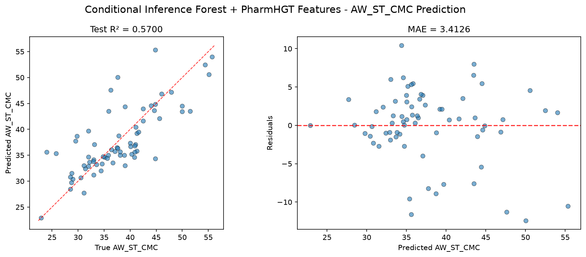
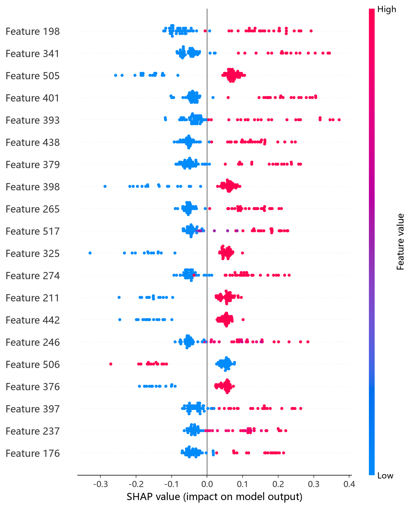
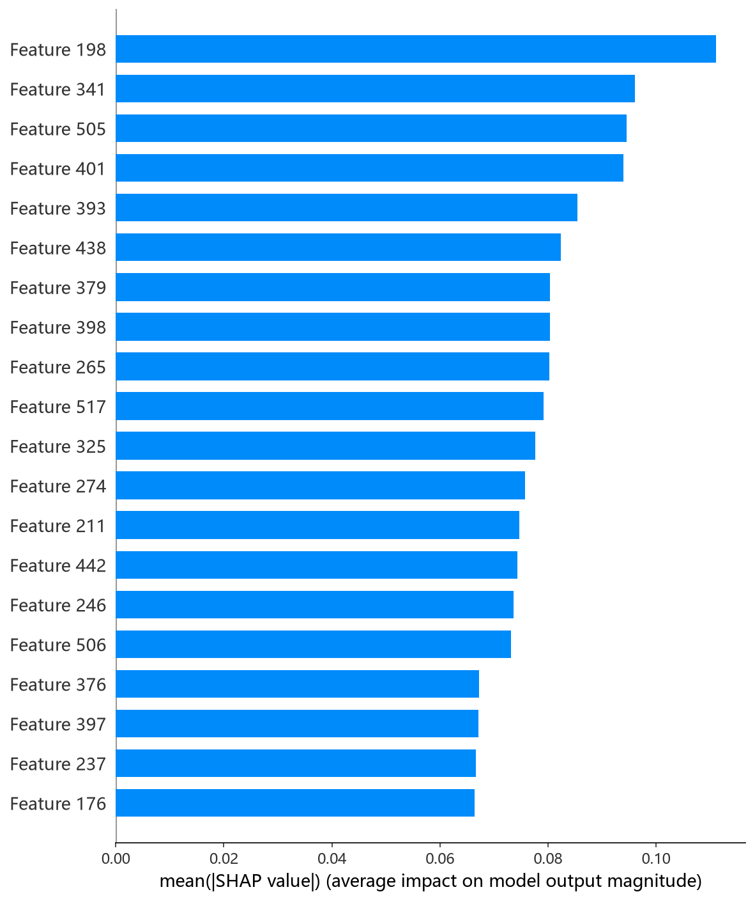

# CIF 模型报告 — AW_ST_CMC 预测

## 报告信息

| 项目 | 内容 |
|------|------|
| 目标变量 | AW_ST_CMC（表面活性剂在 CMC 时的表面张力，单位 mN/m） |
| 运行目录 | `runs\AW_ST_CMC\AW_ST_CMC_cif_20260804_214844` |
| 运行时间 | 21:48 开始 ~ 21:50 结束（约 2 分钟） |
| 特征类型 | PharmHGT 522 维手工特征 |
| 报告生成日期 | 2026-08-07 |

## 概述

CIF（Conditional Inference Forest，条件推理森林）以**基于统计显著性检验的无偏递归划分**为特色（Hothorn et al., 2006）：每次分裂通过排列检验选择变量与切分点，避免树模型对数值型特征的**分裂变量选择偏差**。本项目在 Python 中采用 `ExtraTreesRegressor` 作为其近似实现——ExtraTrees 的**随机阈值分裂**同样降低了选择偏差，且在保持与 RandomForest 相近精度的同时进一步抑制过拟合，在高维特征上更具优势。

在 AW_ST_CMC 任务中，CIF 的 Test R² = 0.5700、Test RMSE = 4.6913，在 10 个模型中排名第 7，处于中下游（与 RF 同属第三梯队，落后于梯度提升类模型）。

## 数据与方法

- **特征**：522 维 PharmHGT 风格特征，从缓存加载（`[Cache HIT]`），与其余模型一致。
- **数据规模**：训练集 843 条（737 训练 + 106 验证），测试集 70 条。
- **数据划分**：`train_test_split(0.125, random_state=42)`，固定随机种子。

## 超参数与调优

采用 **Optuna 50 轮 × 5 折交叉验证**（TPE 采样器 + MedianPruner），搜索空间与 RF 相同：n_estimators[200,2000]、max_depth[3,30]、min_samples_split、min_samples_leaf、max_features[sqrt, log2, None]、bootstrap、max_samples。

**最优试验（Trial 27，CV RMSE = 4.1738）：**

| 参数 | 值 |
|------|-----|
| n_estimators | 451 |
| max_depth | 23 |
| min_samples_split | 2 |
| min_samples_leaf | 1 |
| max_features | **log2** |
| bootstrap | True |
| max_samples | 0.9074 |
| Best CV RMSE | 4.1738 |

**调优过程观察：**
- 最优解采用 **bootstrap=True + max_samples=0.9074（有放回抽样 90.7%）+ max_features='log2'**——即保留行采样、仅用 log2 个特征的随机子集，比 RF 最优解的 sqrt 更激进的列随机化，进一步压低树间相关性。
- min_samples_leaf=1、min_samples_split=2 使树近乎完全生长（配合 max_depth=23 的深树），容量偏大但被 ExtraTrees 的双重随机化（随机阈值 + 列子集）天然对冲。
- 50 轮中 22 轮完成、**28 轮被剪枝**（剪枝率 56%），最优值在 Trial 27 达到 **CV RMSE = 4.1738**，后续 22 轮未再突破；单轮 5 折 CV 平均耗时约 1 秒，总耗时约 2 分钟，效率极高。

## 训练过程

- **调参阶段**：50 轮 Optuna 中 22 轮完成、28 轮被剪枝，最优值从 Trial 0 的 6.1389 快速改善，Trial 11/12 进入 4.22~4.29 区间后，**Trial 27 以 4.1738 锁定最优**并保持到结束，收敛充分。
- **最终训练**：以最优参数在 737 条训练集上训练（无早停，直接训练完整森林），输出测试评估。

## 测试结果

| 指标 | 值 |
|------|-----|
| Test RMSE | **4.6913** |
| Test MAE | **3.4126** |
| Test R² | **0.5700** |
| Best CV RMSE | 4.1738 |

> 图：预测值 vs 真实值散点图与残差图见 [pred_vs_true.png](../../../runs/AW_ST_CMC/AW_ST_CMC_cif_20260804_214844/pred_vs_true.png)。
>
> 

Test RMSE（4.6913）明显高于调参 CV（4.1738），Test MSE = 22.0079，Test−CV 差距约 0.52，与 RF 一样存在明显的**独立测试集泛化落差**。值得注意的是，CV 表现（4.1738）本可进入第一梯队（接近 CatBoost 的 3.83），但测试集上跌至第三梯队，说明该配置的 CV 虚高或对数据划分敏感。R² = 0.5700 与 RF 几乎持平。

## 特征重要性（Top 20）

CIF 输出原生 Top-20 特征重要度，数值显示为 0.0（口径展示问题，保留排序），排序前 5 名为：

1. **atom_mean_3** — 原子特征均值
2. **atom_std_16** — 原子特征标准差
3. **atom_std_22** — 原子特征标准差
4. **atom_mean_46** — 原子特征均值
5. **atom_mean_47** — 原子特征均值

其下依次为 atom_mean_38、atom_std_17、LogP、atom_mean_23、atom_mean_17 等，整体以**原子级聚合统计为主，辅以 LogP 与 head_ratio/tail_ratio**。数值归零属默认重要度口径的展示缺陷，**精确归因需以 SHAP 为准**：SHAP 依赖图前 5 名（atom_max_33、maccs_65、surf_cationic、maccs_125、maccs_117）中，**surf_cationic 与两个 MACCS 药效团特征（maccs_65/125/117）同时上榜**，印证了"阳离子头基类型 + 药效团子结构"对 CMC 时表面张力的主导作用——与 HistGB 的 surf_cationic 第 2、CatBoost 的 maccs 特征靠前结论相互印证。

*SHAP 蜜蜂图：每个点是一个测试样本，x 轴为 SHAP 值，颜色代表特征取值高低。*

*Top-20 平均 |SHAP| 条形图：atom_max_33、maccs_65、surf_cationic 位居前列。*

## 结论与评价

**优点：**
- **训练效率极高**（50 轮约 2 分钟），ExtraTrees 双重随机化天然抗过拟合，开箱即用。
- CV 表现（4.1738）接近第一梯队，说明模型结构具备较强的拟合能力。
- SHAP 归因揭示 surf_cationic + MACCS 药效团的联合主导作用，物理解释清晰。

**不足：**
- 精度第 7（R² = 0.5700），**Test 明显差于 CV（4.69 vs 4.17）**，泛化落差在树模型中最大之一。
- 非自适应集成上限低于梯度提升（第一梯队 ≈0.68）。
- 重要度数值全 0 的展示缺陷，依赖 SHAP 补充文档化。

**横向定位（10 个模型中按 Test RMSE 排序）：**

| 排名 | 模型 | Test RMSE | Test R² |
|------|------|-----------|---------|
| 5 | HistGB | 4.4287 | 0.6168 |
| 6 | LightGBM | 4.5686 | 0.5922 |
| **7** | **CIF (ExtraTrees)** | **4.6913** | **0.5700** |
| 8 | RandomForest | 4.7340 | 0.5621 |
| 9 | Transformer | 7.2719 | -0.0332 |

CIF 与 RF 构成第三梯队（R² ∈ [0.56, 0.57]），在 AW_ST_CMC 上明显落后于梯度提升类模型。其**高效、抗过拟合、归因清晰**的特性使其适合作为特征工程反馈或集成成员的候选；但追求该 target 精度时应优先 NGBoost/XGBoost/CatBoost，CIF 不宜作为主推模型。
