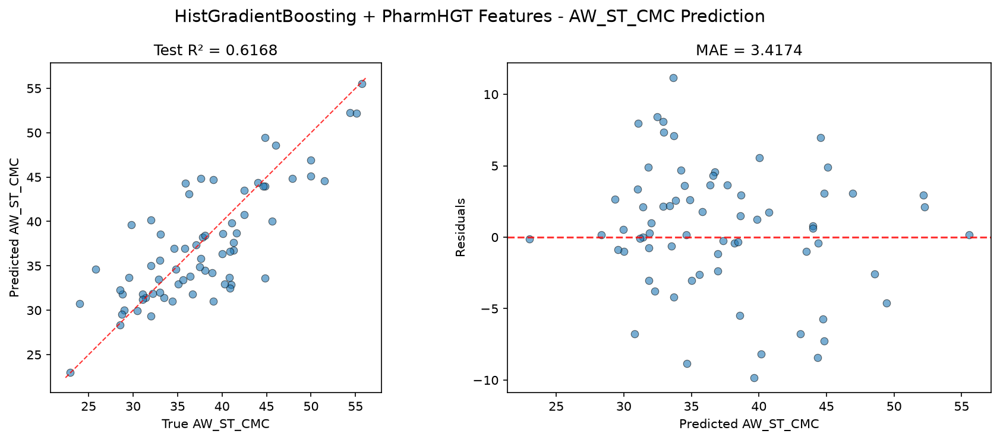
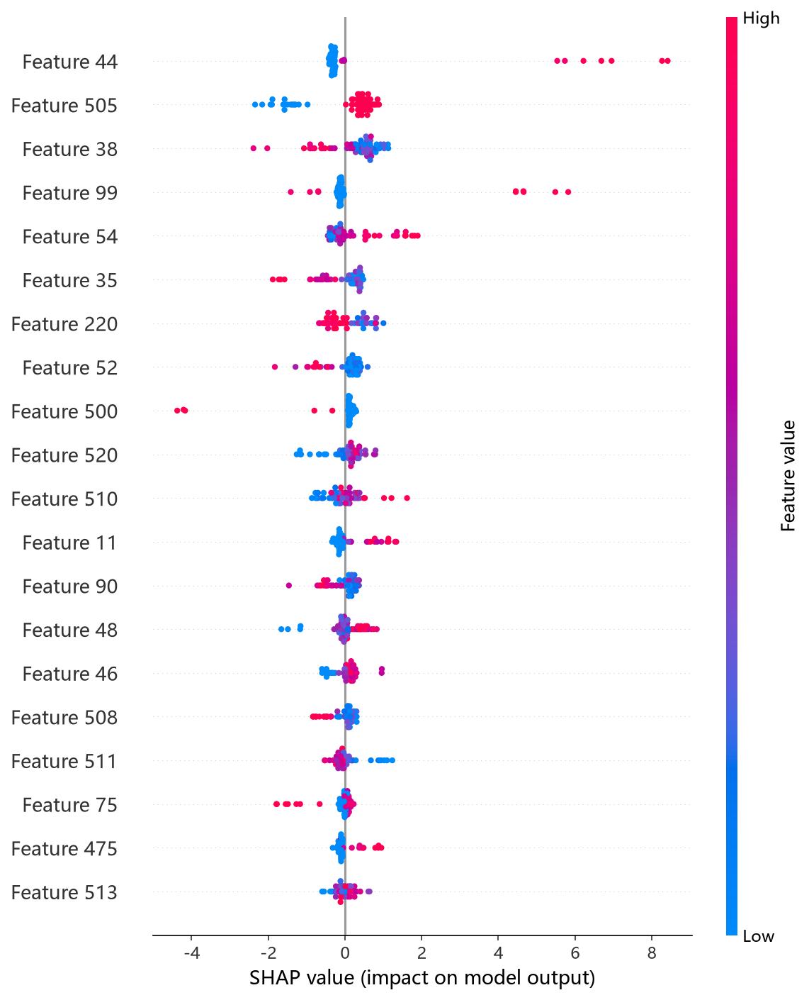
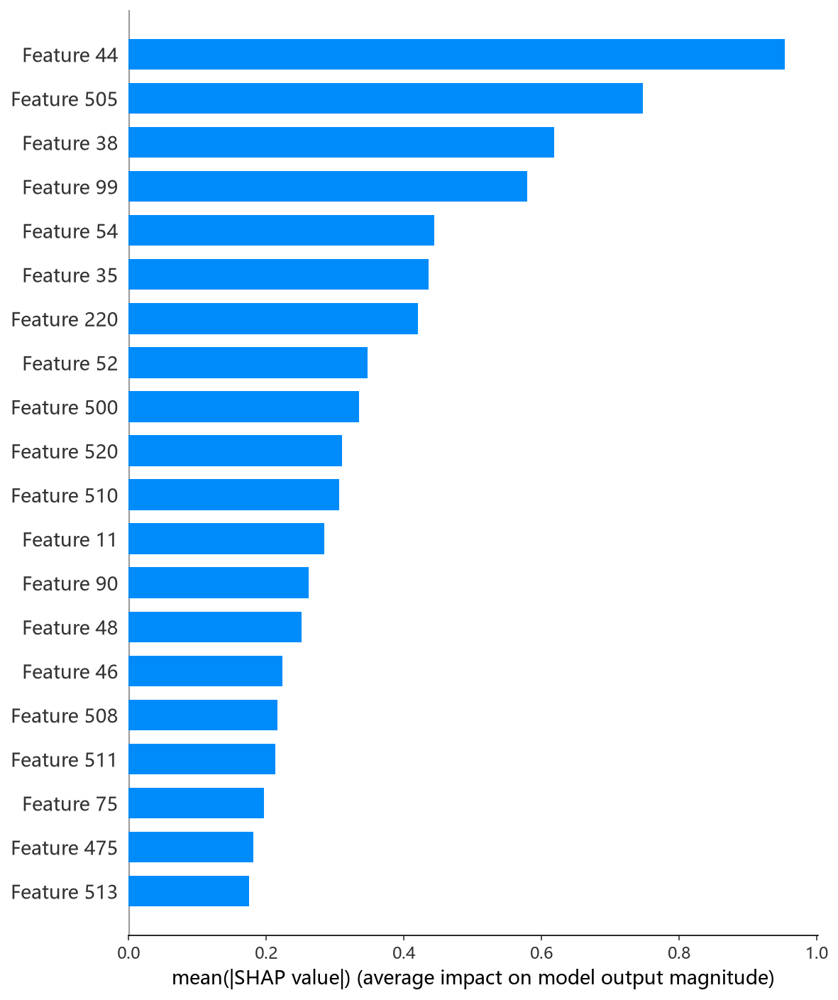
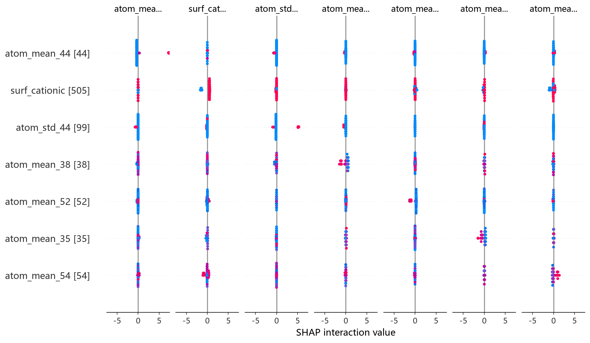

# HistGB 模型报告 — AW_ST_CMC 预测

## 报告信息

| 项目 | 内容 |
|------|------|
| 目标变量 | AW_ST_CMC（表面活性剂在 CMC 时的表面张力，单位 mN/m） |
| 运行目录 | `runs\AW_ST_CMC\AW_ST_CMC_histgb_20260804_215135` |
| 运行时间 | 21:51 开始 ~ 22:31 结束（约 40 分钟） |
| 特征类型 | PharmHGT 522 维手工特征 |
| 报告生成日期 | 2026-08-07 |

## 概述

HistGB（scikit-learn `HistGradientBoostingRegressor`）是基于 **Histogram-based 分箱** 的梯度提升实现，与 LightGBM 同属直方图加速路线，但采用 **Level-wise（按层）生长策略**。其默认 `early_stopping` 机制（内部分出验证子集）与 `l2_regularization`、`min_samples_leaf` 等正则项共同控制过拟合，是本项目 10 个模型中**开箱即用程度最高的树模型**。

在 AW_ST_CMC 任务中，HistGB 的 Test R² = 0.6168、Test RMSE = 4.4287，在 10 个模型中排名第 5，处于第二梯队之首（第一梯队 NGBoost/XGBoost/CatBoost 之后）。

## 数据与方法

- **特征**：522 维 PharmHGT 风格特征，从缓存加载（`[Cache HIT]`），与其余模型一致。
- **数据规模**：训练集 843 条（737 训练 + 106 验证），测试集 70 条。
- **数据划分**：`train_test_split(0.125, random_state=42)`，固定随机种子。

## 超参数与调优

采用 **Optuna 50 轮 × 5 折交叉验证**（TPE 采样器 + MedianPruner），搜索空间覆盖 learning_rate、max_iter、max_depth、max_leaf_nodes、min_samples_leaf、l2_regularization、max_bins。

**最优试验（Trial 17，CV RMSE = 4.2171）：**

| 参数 | 值 |
|------|-----|
| learning_rate | 0.1061 |
| max_iter | 2538 |
| max_depth | 15 |
| max_leaf_nodes | **16** |
| min_samples_leaf | 11 |
| l2_regularization | 0.0226 |
| max_bins | 174 |
| Best CV RMSE | 4.2171 |

**调优过程观察：**
- 最优解的关键特征是 **max_leaf_nodes=16**——在 max_depth=15 的允许深度下仅生成 16 个叶子，即通过 max_leaf_nodes 强制"浅且窄"的树，与第一梯队模型（depth 8~10）的复杂度约束思路一致。
- 前 12 轮中 Trial 4 短暂领先（4.2671），Trial 17 以 4.2171 突破后保持到 50 轮结束，后续 30 余轮未再刷新，收敛充分。
- 50 轮中 **31 轮被 MedianPruner 剪枝**、19 轮完成，剪枝率（62%）在树模型中最高的之一，说明该搜索空间下大量采样集中在低质量区域，TPE 采样器早熟收敛。

## 训练过程

- **调参阶段**：50 轮 Optuna 中 19 轮完成、31 轮被剪枝，最优值在 Trial 17 达到 **CV RMSE = 4.2171** 并保持到结束。
- **最终训练**：以最优参数在 737 条训练集上训练（HistGB 内置 early_stopping，日志未单独打印迭代截断），输出测试评估。

## 测试结果

| 指标 | 值 |
|------|-----|
| Test RMSE | **4.4287** |
| Test MAE | **3.4174** |
| Test R² | **0.6168** |
| Best CV RMSE | 4.2171 |

> 图：预测值 vs 真实值散点图与残差图见 [pred_vs_true.png](../../../runs/AW_ST_CMC/AW_ST_CMC_histgb_20260804_215135/pred_vs_true.png)。
>
> 

Test RMSE（4.4287）略高于调参 CV（4.2171），差距（约 0.21）介于 CatBoost（Test≈CV）与 LightGBM（Test−CV≈0.38）之间。Test MSE = 19.6131。R² = 0.6168 处于第二梯队（0.59~0.62），明显落后于第一梯队（≈0.68），但仍显著优于深度模型 RNN/Transformer 的负 R²。

## 特征重要性（Top 20）

HistGB 输出 **permutation-based（置换）特征重要度**，对采样波动不敏感、可信度较高，前 5 名为：

1. **atom_mean_44**（1.1938 ± 0.2117）— 原子特征均值
2. **surf_cationic**（0.5420 ± 0.1065）— 阳离子表面活性剂类型
3. **atom_std_44**（0.5013 ± 0.0965）— 原子特征标准差
4. **atom_mean_38**（0.4213 ± 0.0966）— 原子特征均值
5. **bond_mean_0**（0.3008 ± 0.0717）— 键特征均值

其下依次为 atom_mean_20、atom_mean_52、brics_30、atom_mean_48、atom_mean_47 等。**atom_mean_44 以 1.19 的置换重要度断崖式领先**（约为第 2 名 surf_cationic 的 2.2 倍），而 surf_cationic 稳居第 2——**阳离子头基类型对 AW_ST_CMC 的影响被 HistGB 独立确认**，与其余树模型的 SHAP 结论一致；原子级 44 号特征（对应原子聚合统计）在各模型反复位居前列，指向"原子局部环境"是表面张力的核心决定因子。SHAP 依赖图前 5 名（atom_mean_44、surf_cationic、atom_mean_38、atom_std_44、atom_mean_54）与置换重要度高度吻合。

*SHAP 蜜蜂图：每个点是一个测试样本，x 轴为 SHAP 值，颜色代表特征取值高低。*

*Top-20 平均 |SHAP| 条形图：atom_mean_44、surf_cationic、atom_std_44 位列前三，与置换重要度一致。*

*SHAP 交互热力图：展示 Top 特征两两交互对预测的平均影响。*

## 结论与评价

**优点：**
- permutation 重要度与 SHAP 双重归因高度一致，atom_mean_44、surf_cationic 的结论**可信度高**。
- 开箱即用程度高（内置早停 + 分箱加速），默认正则项覆盖全面。
- 剪枝率达 62% 仍保持稳健 CV，调参收敛良好，过拟合风险被主动压制。

**不足：**
- 精度第 5（R² = 0.6168），与第一梯队（≈0.68）差距约 0.06，未进入第一梯队。
- Test RMSE 高于 CV（4.43 vs 4.22），独立测试集上泛化弱于 CatBoost。
- 最优解 max_leaf_nodes=16 的窄树对复杂界面的表达能力受限，限制了上限。

**横向定位（10 个模型中按 Test RMSE 排序）：**

| 排名 | 模型 | Test RMSE | Test R² |
|------|------|-----------|---------|
| 3 | CatBoost | 4.0407 | 0.6810 |
| 4 | MLP | 4.3235 | 0.6348 |
| **5** | **HistGB** | **4.4287** | **0.6168** |
| 6 | LightGBM | 4.5686 | 0.5922 |
| 7 | CIF (ExtraTrees) | 4.6913 | 0.5700 |

HistGB 与 MLP、LightGBM 共同构成第二梯队（R² ∈ [0.59, 0.64]），优于随机森林类模型（CIF/RF）但明显落后于第一梯队。其**归因可信度高、实现简洁**，适合作为特征工程质量检验的参考模型；若追求极致精度，应优先 NGBoost/XGBoost/CatBoost。
