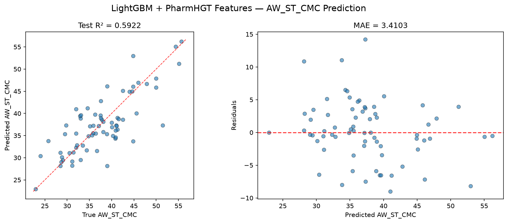
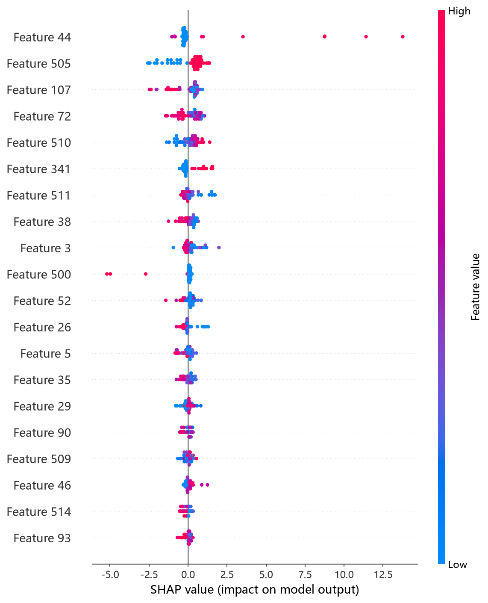
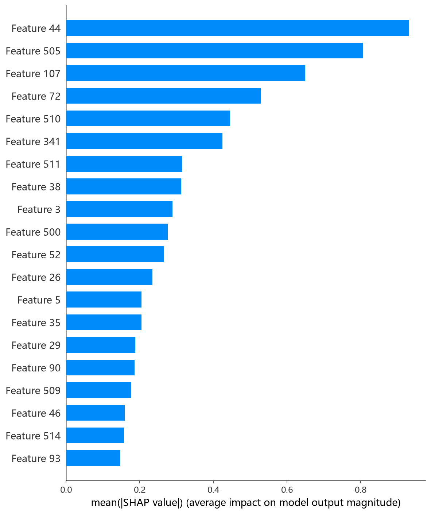

# LightGBM 模型报告 — AW_ST_CMC 预测

## 报告信息

| 项目 | 内容 |
|------|------|
| 目标变量 | AW_ST_CMC（表面活性剂在 CMC 时的表面张力，单位 mN/m） |
| 运行目录 | `runs\AW_ST_CMC\AW_ST_CMC_lightgbm_20260805_055441` |
| 运行时间 | 05:54 开始 ~ 05:59 结束（约 5 分钟） |
| 特征类型 | PharmHGT 522 维手工特征 |
| 报告生成日期 | 2026-08-07 |

## 概述

LightGBM 是微软提出的梯度提升框架，以 **Histogram-based 分箱加速**、**Leaf-wise 生长策略**（逐叶生长、精确最佳分裂）与原生类别特征支持著称。相比 Level-wise 的 XGBoost/CatBoost，其 Leaf-wise 生长在小样本高维数据上更易过拟合，因此本任务中 `num_leaves` 与正则项的组合至关重要。

在 AW_ST_CMC 任务中，LightGBM 的 Test R² = 0.5922、Test RMSE = 4.5686，在 10 个模型中排名第 6，处于中游（第一梯队 NGBoost/XGBoost/CatBoost 之后）。

## 数据与方法

- **特征**：522 维 PharmHGT 风格特征，从缓存加载（`[Cache HIT]`），与其余模型一致。
- **数据规模**：训练集 843 条（737 训练 + 106 验证），测试集 70 条。
- **数据划分**：`train_test_split(0.125, random_state=42)`，固定随机种子。

## 超参数与调优

采用 **Optuna 50 轮 × 5 折交叉验证**（TPE 采样器 + MedianPruner），搜索空间覆盖 boosting_type[gbdt, dart]、max_depth[3,15]、num_leaves[15,255]，并附加 learning_rate / n_estimators / subsample / colsample_bytree / reg_alpha / reg_lambda / min_child_samples / min_split_gain 等次要参数。

**最优试验（Trial 31，CV RMSE = 4.1933）：**

| 参数 | 值 |
|------|-----|
| boosting_type | **gbdt** |
| max_depth | 13 |
| num_leaves | 207 |
| learning_rate | 0.0797 |
| n_estimators | 2528 |
| subsample / subsample_freq | 0.7687 / 7 |
| colsample_bytree | 0.8086 |
| reg_alpha / reg_lambda | ≈0 / ≈0 |
| min_child_samples | 5 |
| min_split_gain | 0.3367 |
| Best CV RMSE | 4.1933 |

**调优过程观察：**
- 早期试验（Trial 0/1）CV 误差高达 22.2 / 9.3，源于 dart 模式参数组合不佳；搜索随后收敛到 gbdt + 大 num_leaves（207）的配置。
- 最优解偏好 **gbdt（而非 dart）+ 深树（max_depth=13）+ 大叶子数（207）**，但 reg_alpha/reg_lambda 均为 0、min_child_samples=5，**几乎未使用 L1/L2 正则**——说明在该搜索空间内模型倾向靠"大容量 + 早停"而非正则来平衡误差。
- 50 轮中 18 轮被剪枝，其余均正常收敛；单轮 5 折 CV 平均耗时约 5 秒，**调参总耗时仅约 5 分钟**，是 10 个模型中效率最高的之一。

## 训练过程

- **调参阶段**：50 轮 Optuna 中 32 轮完成、18 轮被剪枝，最优值在 Trial 31 达到 **CV RMSE = 4.1933**，后续 18 轮未再突破，搜索收敛。
- **最终训练**：以最优参数在 737 条训练集上训练，内置早停于 **iteration 77** 触发（valid_0 RMSE = 4.3832），即实际仅使用了 2528 棵候选树中的前 77 棵，**远早于 n_estimators 上限**——说明该配置在 30~50 轮内迅速过拟合，早停对控制最终误差起了决定性作用。

## 测试结果

| 指标 | 值 |
|------|-----|
| Test RMSE | **4.5686** |
| Test MAE | **3.4103** |
| Test R² | **0.5922** |
| Best CV RMSE | 4.1933 |

> 图：预测值 vs 真实值散点图与残差图见 [pred_vs_true.png](../../../runs/AW_ST_CMC/AW_ST_CMC_lightgbm_20260805_055441/pred_vs_true.png)。
>
> 

Test RMSE（4.5686）明显高于调参 CV（4.1933），Test MSE = 20.8717，说明最终模型**在独立测试集上泛化弱于 CV 表现**。这一"Test > CV"的差距（约 0.38）在 10 个模型中偏大，指向早停迭代数偏少（77 轮）导致欠拟合，或该超参组合对数据划分敏感。R² = 0.5922 仍为正，但已落在第一梯队（≈0.68）之后约 0.09。

## 特征重要性（Top 20）

LightGBM 输出原生 Top-20 特征重要度，前 5 名为：

1. **tail_ratio**（236.0）— 尾链碳占比（头尾比）
2. **LogP**（215.0）— 油水分配系数
3. **atom_mean_35**（192.0）— 原子特征均值
4. **MolWt**（166.0）— 分子量
5. **atom_mean_47**（125.0）— 原子特征均值

其下依次为 atom_mean_17、atom_std_25、atom_std_35、atom_mean_23、atom_mean_3 等。**tail_ratio 与 LogP 分列前两位**，是 LightGBM 视角下对 AW_ST_CMC 最重要的两个特征——尾链越长、疏水性越强，表面活性剂在界面的分子排布越紧凑，直接影响 CMC 时的表面张力；这与第一梯队模型的 SHAP 结论（阳离子类型、分子量、疏水描述符主导）在**疏水维度上高度一致**。SHAP 依赖图前 5 名（atom_mean_44、surf_cationic、atom_std_52、atom_std_17、MolWt）与日志重要度排序略有出入，属 LightGBM 重要度口径与 SHAP 归因的正常差异。

*SHAP 蜜蜂图：每个点是一个测试样本，x 轴为 SHAP 值，颜色代表特征取值高低。*

*Top-20 平均 |SHAP| 条形图：atom_mean_44、surf_cationic、atom_std_52 位居前列，疏水/电荷维度突出。*

## 结论与评价

**优点：**
- **调参效率全模型最高**（50 轮约 5 分钟），适合快速迭代实验。
- 内置早停自动确定最优迭代数，超参可复现、配置简洁。
- tail_ratio + LogP 的重要度排序清晰指向疏水尾链的物理作用，可解释性良好。

**不足：**
- 精度第 6（R² = 0.5922），与第一梯队（≈0.68）差距约 0.09，未进入第一梯队。
- **Test RMSE 显著高于 CV（4.57 vs 4.19）**，泛化稳定性弱于同族模型（CatBoost 的 Test≈CV）。
- 最优解未用任何 L1/L2 正则，对数据划分的敏感性较高。

**横向定位（10 个模型中按 Test RMSE 排序）：**

| 排名 | 模型 | Test RMSE | Test R² |
|------|------|-----------|---------|
| 4 | MLP | 4.3235 | 0.6348 |
| 5 | HistGB | 4.4287 | 0.6168 |
| **6** | **LightGBM** | **4.5686** | **0.5922** |
| 7 | CIF (ExtraTrees) | 4.6913 | 0.5700 |
| 8 | RF | 4.7340 | 0.5621 |

LightGBM 与 HistGB 共同构成第二梯队（R² ∈ [0.59, 0.62]），明显落后于第一梯队。尽管其**训练速度快、适合快速验证**，但在 AW_ST_CMC 这一小样本（737）任务上，其 Test-CV 差距偏大、精度受限，**优先性不及 CatBoost/XGBoost/NGBoost**；作为高效基线或特征工程的快速反馈工具价值更高。
