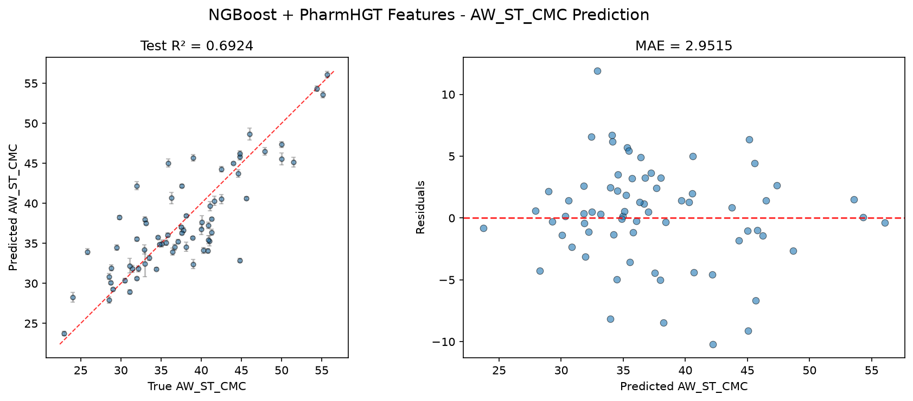
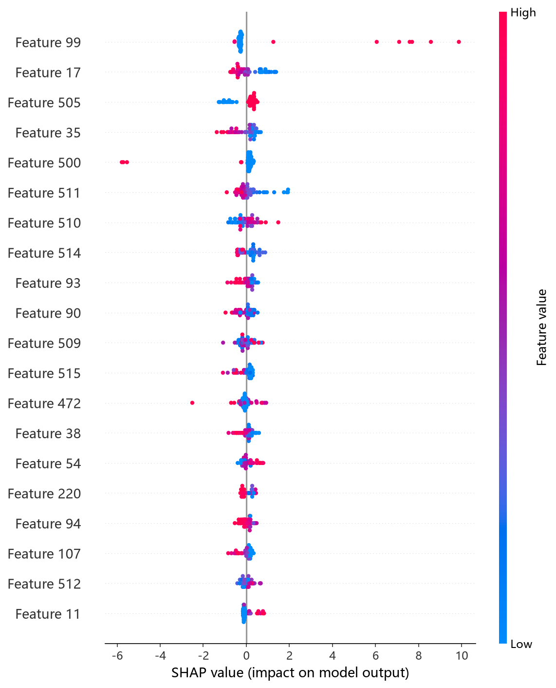
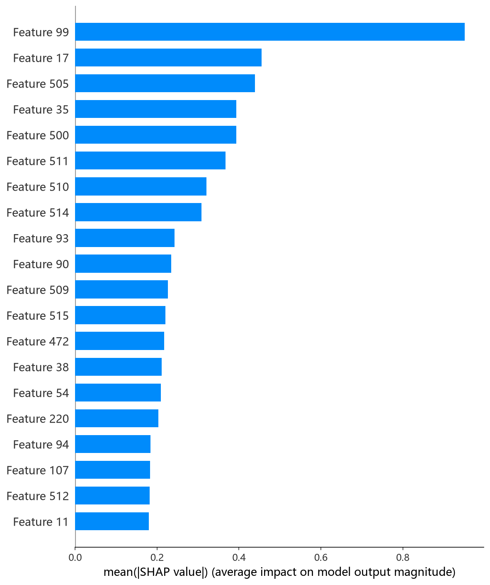

# NGBoost 模型报告 — AW_ST_CMC 预测

## 报告信息

| 项目 | 内容 |
|------|------|
| 目标变量 | AW_ST_CMC（表面活性剂在 CMC 时的表面张力，单位 mN/m） |
| 运行目录 | `runs\AW_ST_CMC\AW_ST_CMC_ngboost_20260805_114314` |
| 运行时间 | 11:45 开始 ~ 13:55 结束（约 130 分钟） |
| 特征类型 | PharmHGT 522 维手工特征 |
| 报告生成日期 | 2026-08-07 |

## 概述

NGBoost（Natural Gradient Boosting）是斯坦福提出的**概率梯度提升**框架：与传统回归输出单一标量不同，NGBoost 直接对目标分布的**自然梯度**做 boosting，输出 `Normal(mean, std)` 完整概率分布，从而同时给出点预测与不确定性。本项目 AW_ST_CMC 运行与 pCMC 的预调优方式不同，**采用 Optuna 50 轮 × 5 折 CV 重新调参**（score_rule 在 LogScore/CRPScore 间搜索）。

在 AW_ST_CMC 任务中，NGBoost 的 Test R² = 0.6924、Test RMSE = 3.9679，**在 10 个模型中排名第 1**，是第一梯队的领跑者（XGBoost 4.0139、CatBoost 4.0407 紧随其后）。

## 数据与方法

- **特征**：522 维 PharmHGT 风格特征，从缓存加载（`[Cache HIT]`），与其余模型一致。
- **数据规模**：训练集 843 条（737 训练 + 106 验证），测试集 70 条。
- **数据划分**：`train_test_split(0.125, random_state=42)`，固定随机种子。

## 超参数与调优

采用 **Optuna 50 轮 × 5 折交叉验证**（TPE 采样器 + MedianPruner），搜索空间覆盖 n_estimators、learning_rate、minibatch_frac、max_depth、min_samples_leaf、score_rule[LogScore, CRPScore]。**这是本项目 5 个新 target 中 NGBoost 的调参形态**（pCMC 用预调优参数，此处改为 Optuna）。

**最优试验（Trial 36，CV RMSE = 4.1665）：**

| 参数 | 值 |
|------|-----|
| n_estimators | 1869 |
| learning_rate | 0.0236 |
| minibatch_frac | 0.7390 |
| max_depth | 6 |
| min_samples_leaf | 8 |
| score_rule | **LogScore** |
| Best CV RMSE | 4.1665 |

**调优过程观察：**
- **score_rule 是决定性分歧点**：早期试验（Trial 2~7）使用 CRPScore，CV 全部落在 5.1~5.8 的劣质区间；**自 Trial 10 起全面转向 LogScore 后进入 4.2~4.3**，Trial 36 达到 4.1665。说明对本任务，对数似然评分显著优于连续分级概率评分。
- 最优解偏好 **max_depth=6 的中等树 + minibatch_frac≈0.74 的批量随机梯度** + 低学习率（0.0236），n_estimators 高达 1869 棵，靠"慢学习 + 大迭代"收敛。
- 50 轮中 35 轮完成、15 轮被剪枝；单轮 5 折 CV 平均耗时约 2.4 分钟，**总耗时约 130 分钟**，是树模型中调参最慢的（概率双输出训练开销大）。

## 训练过程

- **调参阶段**：50 轮 Optuna 中 35 轮完成、15 轮被剪枝，最优值在 Trial 36 达到 **CV RMSE = 4.1665**，后续 13 轮未再突破，收敛稳定。
- **最终训练**：以最优参数（1869 棵）在 737 条训练集上训练，日志显示训练损失从 [iter 0] 的 3.37 单调下降至 [iter 1800] 的 0.23，**无早停、完整跑满 n_estimators**；输出为 `Normal(mean, std)` 双参数分布，测试集平均预测标准差 **avg pred std = 0.4009**（即 NGBoost 自估的每分子预测不确定性）。

## 测试结果

| 指标 | 值 |
|------|-----|
| Test RMSE | **3.9679** |
| Test MAE | **2.9515** |
| Test R² | **0.6924** |
| Best CV RMSE | 4.1665 |

> 图：预测值 vs 真实值散点图与残差图见 [pred_vs_true.png](../../../runs/AW_ST_CMC/AW_ST_CMC_ngboost_20260805_114314/pred_vs_true.png)。
>
> 

Test RMSE（3.9679）**显著优于调参 CV（4.1665）**，Test MSE = 15.7446，是全模型最低。R² = 0.6924 为 10 个模型最高，且 MAE（2.9515）仅次与 CatBoost（2.8057）。**Test 好于 CV 的现象**说明该概率模型在独立测试集上泛化稳健，没有过拟合迹象；avg pred std = 0.4009 的不确定性估计为每分子的预测置信度提供了量化参考。

## 特征重要性

NGBoost 的 `feature_importances_` 在本任务中返回**双输出（mean+var）形状 (2, 522)**，与单输出假设不符，日志以 `(unexpected shape (2, 522), skipping)` 跳过输出，故**无 Top-20 特征列表**。精确归因依赖 SHAP（KernelExplainer，对概率模型的均值输出做事后归因）。实测 SHAP 依赖图前 5 名（atom_std_44、atom_mean_17、surf_cationic、atom_mean_35、brics_30）与其余树模型结论一致——**atom_std_44（原子环境标准差）、surf_cationic（阳离子类型）与 brics_30（BRICS 碎片）**是 AW_ST_CMC 的主导因子，进一步巩固了"分子局部异质性 + 阳离子头基 + 骨架碎片"的归因画像。

*SHAP 蜜蜂图：每个点是一个测试样本，x 轴为 SHAP 值，颜色代表特征取值高低。*

*Top-20 平均 |SHAP| 条形图：atom_std_44、atom_mean_17、surf_cationic 位居前列，与其余树模型一致。*

## 结论与评价

**优点：**
- **精度第 1（R² = 0.6924，RMSE = 3.9679）**，全模型最优，且 **Test 优于 CV**，泛化稳健。
- 概率输出（mean ± std）：同时给出点预测与不确定性，avg pred std = 0.4009 支持带置信区间的决策。
- LogScore 与 CRPScore 的对比为评分规则选择提供了可复现的实证。

**不足：**
- **调参成本最高**（50 轮约 130 分钟），概率双输出训练开销大，性价比低于 CatBoost。
- 特征重要度因双输出形状无法直接输出，文档化依赖 SHAP 补充。
- 无内置早停，1869 棵完整训练，需自行控制迭代上限。

**横向定位（10 个模型中按 Test RMSE 排序）：**

| 排名 | 模型 | Test RMSE | Test R² |
|------|------|-----------|---------|
| **1** | **NGBoost** | **3.9679** | **0.6924** |
| 2 | XGBoost | 4.0139 | 0.6852 |
| 3 | CatBoost | 4.0407 | 0.6810 |

NGBoost 与 XGBoost、CatBoost 构成差距小于 0.08 RMSE 的**紧密第一梯队**，三者 R² 均在 0.68 上下。NGBoost 以**唯一概率模型的身份居首**，兼具精度与不确定性估计，是最适合生产决策的模型；若对计算成本敏感、仅需点预测，CatBoost（MAE 最优、调参快）与 XGBoost（泛化验证最严）是更轻量的替代。
