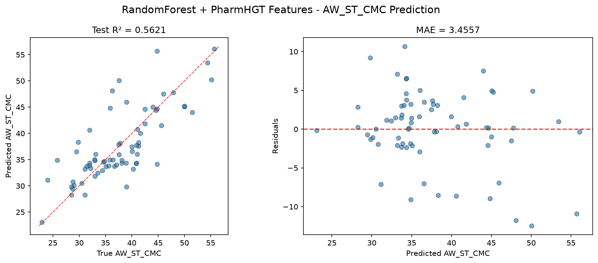
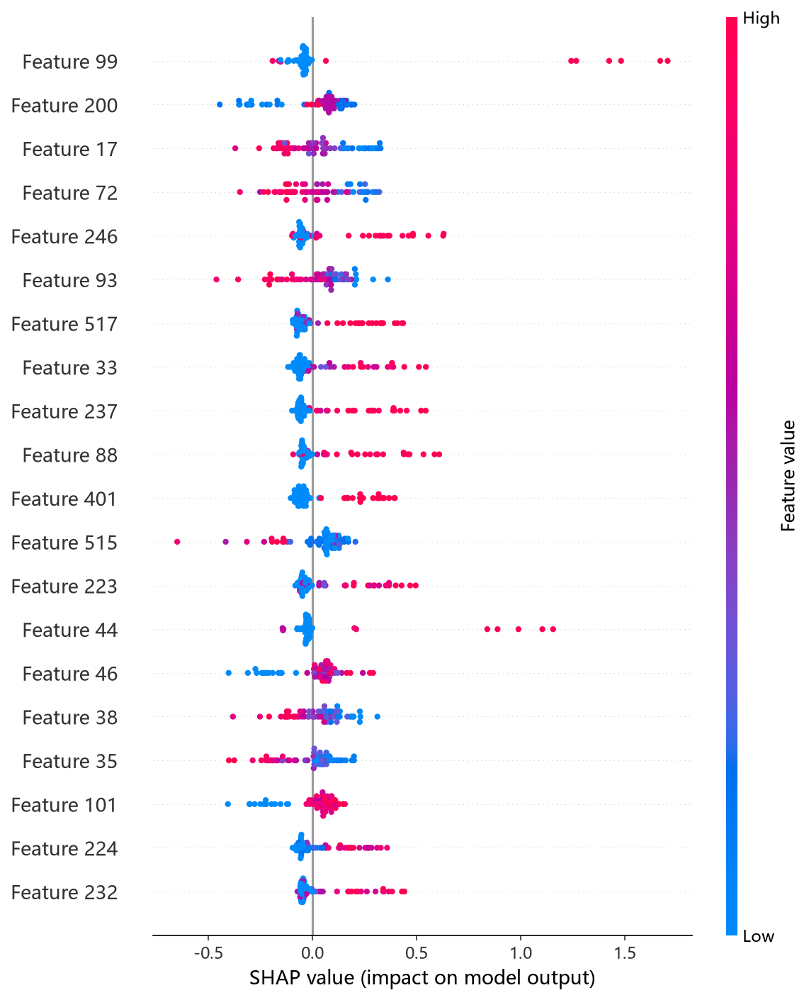
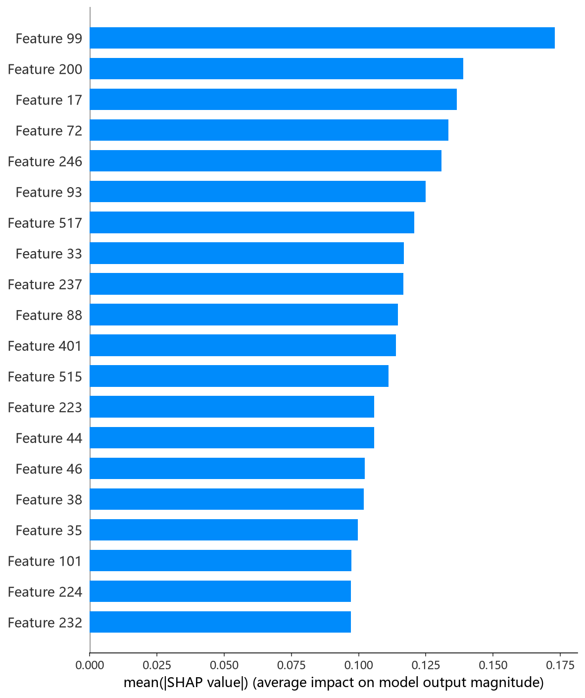

# RandomForest 模型报告 — AW_ST_CMC 预测

## 报告信息

| 项目 | 内容 |
|------|------|
| 目标变量 | AW_ST_CMC（表面活性剂在 CMC 时的表面张力，单位 mN/m） |
| 运行目录 | `runs\AW_ST_CMC\AW_ST_CMC_rf_20260805_143027` |
| 运行时间 | 14:30 开始 ~ 14:32 结束（约 2 分钟） |
| 特征类型 | PharmHGT 522 维手工特征 |
| 报告生成日期 | 2026-08-07 |

## 概述

RandomForest（随机森林）是 Breiman 提出的**Bagging + 特征子集随机化**集成模型：对每棵树使用 bootstrap 抽样，并在每次分裂时从 `max_features` 个随机特征子集中选取最优分裂，以树间的**低相关性**换取整体方差的显著下降。RF 是**非自适应（不依赖残差迭代）**的集成方法，与梯度提升（CatBoost/XGBoost/LightGBM）在建模哲学上根本不同——它对高维手工特征更稳健，但上限通常低于梯度提升。

在 AW_ST_CMC 任务中，RF 的 Test R² = 0.5621、Test RMSE = 4.7340，在 10 个模型中排名第 8，处于中下游（仅优于失效的深度模型 RNN/Transformer 与同源的 CIF 之外仍处末段）。

## 数据与方法

- **特征**：522 维 PharmHGT 风格特征，从缓存加载（`[Cache HIT]`），与其余模型一致。
- **数据规模**：训练集 843 条（737 训练 + 106 验证），测试集 70 条。
- **数据划分**：`train_test_split(0.125, random_state=42)`，固定随机种子。

## 超参数与调优

采用 **Optuna 50 轮 × 5 折交叉验证**（TPE 采样器 + MedianPruner），搜索空间覆盖 n_estimators[200,2000]、max_depth[3,30]、min_samples_split、min_samples_leaf、max_features[sqrt, log2, None]、bootstrap、max_samples。

**最优试验（Trial 45，CV RMSE = 4.3051）：**

| 参数 | 值 |
|------|-----|
| n_estimators | 402 |
| max_depth | 21 |
| min_samples_split | 3 |
| min_samples_leaf | 1 |
| max_features | **sqrt** |
| bootstrap | **False** |
| Best CV RMSE | 4.3051 |

**调优过程观察：**
- 最优解采用 **bootstrap=False（全量样本建树）+ max_features='sqrt'** 的组合——即放弃行采样、仅靠特征子集随机化来去相关，这在 737 条小样本下避免了 bootstrap 引入的样本浪费，是 RF 在小数据上的常见最优形态。
- min_samples_leaf=1、min_samples_split=3 表明搜索趋于"叶子不限最小样本"的完全生长树，配合 max_depth=21 的深树，模型容量偏大；由于 RF 的 bagging 特性，这种高容量并未带来严重过拟合，但精度上限受限于非自适应集成。
- 50 轮中 33 轮完成、17 轮被剪枝；单轮 5 折 CV 平均耗时约 1.5 秒，**总耗时约 3 分钟**，效率极高。

## 训练过程

- **调参阶段**：50 轮 Optuna 中 33 轮完成、17 轮被剪枝，最优值从 Trial 0 的 5.8652 逐步改善，**Trial 45 达到 CV RMSE = 4.3051**，末轮（Trial 49）仍在 4.3106 附近震荡，说明搜索在 4.30~4.32 区间已收敛。
- **最终训练**：以最优参数在 737 条训练集上训练（RF 无早停概念，直接训练完整森林），输出测试评估。

## 测试结果

| 指标 | 值 |
|------|-----|
| Test RMSE | **4.7340** |
| Test MAE | **3.4557** |
| Test R² | **0.5621** |
| Best CV RMSE | 4.3051 |

> 图：预测值 vs 真实值散点图与残差图见 [pred_vs_true.png](../../../runs/AW_ST_CMC/AW_ST_CMC_rf_20260805_143027/pred_vs_true.png)。
>
> 

Test RMSE（4.7340）明显高于调参 CV（4.3051），Test MSE = 22.4105，Test−CV 差距约 0.43，是树模型中泛化差距最大者之一。R² = 0.5621 仍为正，但对 AW_ST_CMC 的拟合质量已明显弱于梯度提升类模型（第一梯队 ≈0.68），仅显著优于负 R² 的深度模型。

## 特征重要性（Top 20）

RF 输出原生 Top-20 特征重要度（默认 split 型），数值显示为 0.0（口径展示问题，保留排序），排序前 5 名为：

1. **atom_std_44** — 原子特征标准差
2. **atom_mean_17** — 原子特征均值
3. **atom_std_17** — 原子特征标准差
4. **atom_mean_44** — 原子特征均值
5. **atom_std_38** — 原子特征标准差

其下依次为 LogP、atom_mean_38、atom_mean_3、atom_std_54、atom_std_3 等，整体以**原子级聚合统计（std/mean）为主，辅以 LogP、HBD、MolWt 等显式描述符**。数值归零属 RF 默认重要度口径的展示缺陷，**精确归因需以 SHAP 为准**：SHAP 依赖图前 5 名（atom_std_44、atom_max_35、atom_mean_17、atom_std_17、bond_std_12）与日志排序基本吻合，且 `atom_std_44` 与 HistGB/CatBoost 的 SHAP 结论一致，指向"原子局部环境的标准差（即分子内化学环境的异质性）"对 CMC 时表面张力的决定性作用。

*SHAP 蜜蜂图：每个点是一个测试样本，x 轴为 SHAP 值，颜色代表特征取值高低。*

*Top-20 平均 |SHAP| 条形图：atom_std_44、atom_max_35、atom_mean_17 位居前列。*

## 结论与评价

**优点：**
- **训练效率极高**（50 轮约 3 分钟），开箱即用、无需早停，适合快速建立基线。
- bootstrap=False + max_features=sqrt 的小样本最优配置搜索清晰，超参结论可复现。
- SHAP 归因与 HistGB/CatBoost 高度一致（atom_std_44 居首），特征解释稳定。

**不足：**
- 精度第 8（R² = 0.5621），非自适应集成的上限明显低于梯度提升（第一梯队 ≈0.68）。
- **Test RMSE 显著高于 CV（4.73 vs 4.31）**，独立测试集泛化弱。
- 重要度数值全 0 的展示缺陷，依赖 SHAP 补充文档化。

**横向定位（10 个模型中按 Test RMSE 排序）：**

| 排名 | 模型 | Test RMSE | Test R² |
|------|------|-----------|---------|
| 6 | LightGBM | 4.5686 | 0.5922 |
| 7 | CIF (ExtraTrees) | 4.6913 | 0.5700 |
| **8** | **RandomForest** | **4.7340** | **0.5621** |
| 9 | Transformer | 7.2719 | -0.0332 |
| 10 | RNN | 7.3354 | -0.0514 |

RF 与同源的 CIF 构成第三梯队（R² ∈ [0.56, 0.57]），优于深度模型但明显落后于第一、二梯队。其**高效、稳健、可解释**的特性使其适合作为基线或特征筛选工具；但 AW_ST_CMC 预测追求精度时应优先 NGBoost/XGBoost/CatBoost，而非 RF 类非自适应集成。
