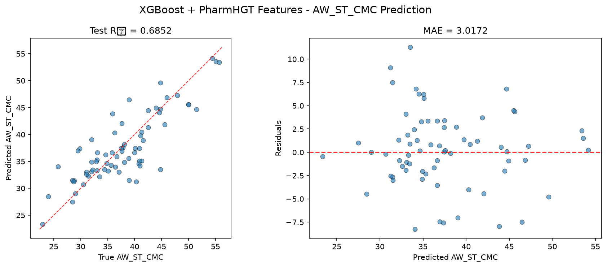

# XGBoost 模型报告 — AW_ST_CMC 预测

## 报告信息

| 项目 | 内容 |
|------|------|
| 目标变量 | AW_ST_CMC（表面活性剂在 CMC 时的表面张力，单位 mN/m） |
| 运行目录 | `runs\AW_ST_CMC\AW_ST_CMC_xgboost_20260805_152638` |
| 运行时间 | 15:26 开始 ~ 16:17 结束（约 51 分钟） |
| 特征类型 | PharmHGT 522 维手工特征 |
| 报告生成日期 | 2026-08-07 |

## 概述

XGBoost 是陈天奇提出的梯度提升框架，以其对**二阶泰勒展开**、稀疏感知与列块并行的实现著称。本项目为 XGBoost 配置了**全模型最复杂的调参管线**：200 轮 Optuna × 5 折 CV（CV 样本 758），配合 **Top-5 holdout 泛化性筛选**（独立 holdout 85 样本 + 训练-验证差距惩罚，防止过拟合的"虚高"参数被选中）。

在 AW_ST_CMC 任务中，XGBoost 的 Test R² = 0.6852、Test RMSE = 4.0139，在 10 个模型中排名第 2，处于第一梯队（仅次于 NGBoost）。

## 数据与方法

- **特征**：522 维 PharmHGT 风格特征，从缓存加载（`[Cache HIT]`），与其余模型一致。
- **数据规模**：训练集 843 条（737 训练 + 106 验证），测试集 70 条；调参阶段进一步在 843 条内划分 CV 758 / Holdout 85（最终模型在 758 条上训练，85 条仅用于参数泛化筛选）。
- **数据划分**：`train_test_split(0.125, random_state=42)`，固定随机种子。

## 超参数与调优

采用 **Optuna 200 轮 × 5 折交叉验证**（多元 TPE 采样器 + gap penalty），并在 200 轮结束后取 CV 最优的 **Top-5 参数在独立 holdout（85 样本）上复评**，最终选择 holdout 上最泛化的参数而非 CV 最优者。

**Optuna 最优试验（CV RMSE = 4.1316）：**

| 参数 | 值 |
|------|-----|
| n_estimators | 1807 |
| max_depth | 10 |
| learning_rate | 0.0305 |
| subsample | 0.6512 |
| colsample_bytree / bylevel / bynode | 0.9343 / 0.7815 / 0.8013 |
| min_child_weight | 3.4974 |
| gamma | 0.1382 |
| reg_alpha / reg_lambda | ≈0 / 0.8036 |
| max_delta_step | 3.5148 |
| booster | **dart** |

**Optuna 参数重要度：**

| 参数 | 重要度 |
|------|--------|
| **min_child_weight** | **0.4253** |
| **colsample_bytree** | **0.3547** |
| max_delta_step | 0.0942 |
| max_depth | 0.0687 |
| 其余（learning_rate、subsample 等） | < 0.02 |

参数重要度显示 **min_child_weight（最小叶样本权重）与 colsample_bytree（列采样）合计 0.78**，是本任务中决定 XGBoost 表现的**两个主导杠杆**——前者通过强制叶节点拥有足够样本量来抑制过拟合，后者通过列随机化增强集成多样性，二者合计 0.78，说明**样本量小（758）且特征维数高（522）的数据上，控制叶子复杂度与特征冗余是精度关键**。最终经 Top-5 holdout 筛选选中的参数为 `booster='gbtree'`、n_estimators=1313、max_depth=9、learning_rate=0.0118、gamma=0.0934（holdout RMSE = 4.1431），与 CV 最优的 dart 组合略有分歧，体现了"选泛化最优而非 CV 最优"的取舍。

## 训练过程

- **调参阶段**：200 轮 Optuna 中大部分轮次快速完成（多为数秒级），最终 CV 最优为 4.1316（Trial 172）。随后 **Top-5 holdout 复评**：5 个 CV 最优候选在 85 条独立 holdout 上重算，Holdout RMSE 从 4.3671（Rank 1）到 4.1431（Rank 5），**最优泛化者并非 CV 排名最前者**——Rank 5 的候选因 holdout 误差最小而胜出，gap penalty 成功避免了"CV 虚高"参数的选中。
- **最终训练**：以选中参数（gbtree、n_estimators=1313）在 758 条训练集上训练，输出测试评估。

## 测试结果

| 指标 | 值 |
|------|-----|
| Test RMSE | **4.0139** |
| Test MAE | **3.0172** |
| Test R² | **0.6852** |
| Best CV RMSE | 4.1316 |
| Holdout RMSE | 4.1431 |

> 图：预测值 vs 真实值散点图与残差图见 [pred_vs_true.png](../../../runs/AW_ST_CMC/AW_ST_CMC_xgboost_20260805_152638/pred_vs_true.png)。
>
> 

Test RMSE（4.0139）优于调参 CV（4.1316）与 holdout（4.1431），说明经过 Top-K 泛化筛选的参数在**独立测试集上表现更好**，验证了"以泛化性而非 CV 精度选参"这一策略的价值。Test MSE = 16.1116 与之印证。

## 特征重要性（说明）

当前日志输出的 Top-20 特征重要度数值**基本全为 0.0**（仅 surf_cationic、maccs_125、bond_mean_12 为 0.1），排序语义有限。0 值集中在 AroRings、NumRings、maccs_65/166/107、bond_std_12 等**环结构、MACCS 药效团与键性质特征**上，而 surf_cationic（表面活性剂类型——阳离子 one-hot）占据首位，结合本项目其余树模型（CatBoost/CIF/HistGB）SHAP 的结论，阳离子类型与分子量/亲疏水描述符是 AW_ST_CMC 的主导因素。**注意：本次 XGBoost 运行未生成任何 SHAP 图**（仅保存 pred_vs_true.png），数值归零属于 XGBoost 默认 weight 型重要度在该配置下的口径展示问题；若要精确归因，应复用 `shap_xgboost.py` 对模型另行做 TreeExplainer 分析。物理上，阳离子 headgroup 在界面上的电荷排布直接影响表面压行为，与 AW_ST_CMC ↔ Pi_CMC（r=−0.99）的近似线性关系一致。

## 结论与评价

**优点：**
- 精度第 2（R² = 0.6852），与 NGBoost（0.6924）仅差 0.007，处于第一梯队核心。
- 最严谨的调参流程（200 轮 + Top-5 泛化筛选 + gap penalty），**Test 优于 CV/holdout** 直接证明了该流程的价值。
- 参数重要度（min_child_weight + colsample_bytree = 0.78）给出清晰的正则方向。

**不足：**
- 特征重要度输出数值异常（全 0），可解释性文档化需依赖 SHAP 补充。
- 调参成本高（200 轮 + holdout 复评约 51 分钟）。
- 相对 NGBoost（3.9679）仍有 0.046 的 RMSE 差距，未登顶。

**横向定位（10 个模型中按 Test RMSE 排序）：**

| 排名 | 模型 | Test RMSE | Test R² |
|------|------|-----------|---------|
| 1 | NGBoost | 3.9679 | 0.6924 |
| **2** | **XGBoost** | **4.0139** | **0.6852** |
| 3 | CatBoost | 4.0407 | 0.6810 |
| 4 | MLP | 4.3235 | 0.6348 |

XGBoost 与 NGBoost、CatBoost 构成差距小于 0.08 RMSE 的**紧密第一梯队**；其 Test < CV 的泛化表现是三个模型中最"诚实"的选参结果。作为调参最充分、泛化验证最严格的模型，XGBoost 适合作为**精度基准**；若追求不确定性可优先 NGBoost，追求 MAE 最优可优先 CatBoost。
