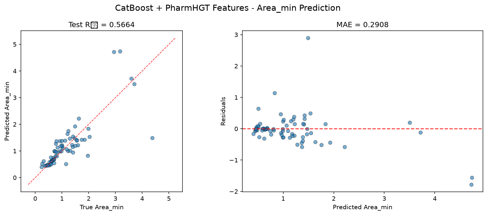
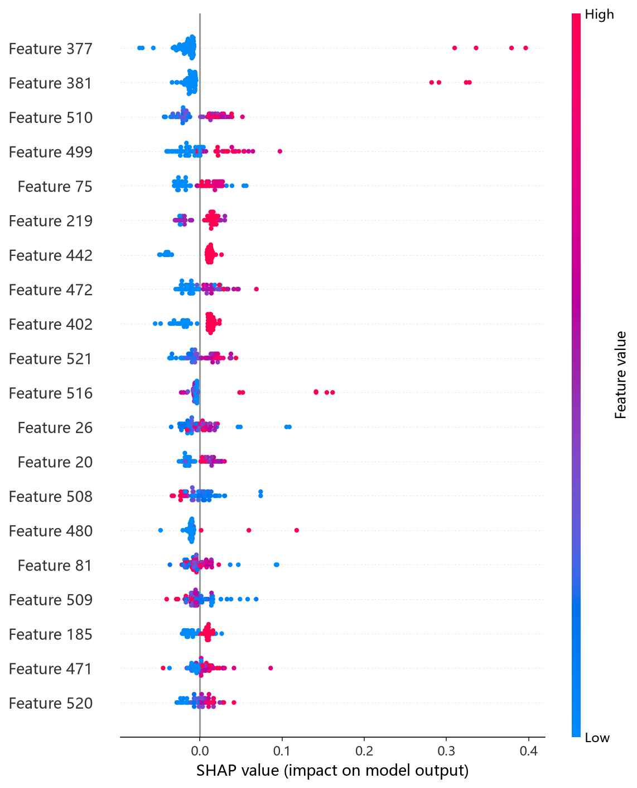
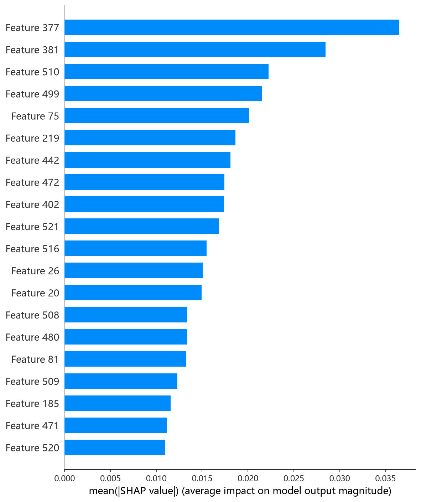

# CatBoost 模型报告 — Area_min 预测

## 报告信息

| 项目 | 内容 |
|------|------|
| 目标变量 | Area_min（每分子最小面积，nm²） |
| 运行目录 | `runs\Area_min\Area_min_catboost_20260806_205305` |
| 调参日志 | 同上运行目录 `train.log`（Optuna 50 轮） |
| 运行时间 | 20:53 ~ 22:46（约 1 小时 53 分钟） |
| 特征类型 | PharmHGT 522 维手工特征 |
| 报告生成日期 | 2026-08-07 |

## 概述

CatBoost 是 Yandex 开源的梯度提升框架，以**对称树（oblivious trees）**与**有序目标编码**著称：每层所有叶子共享同一分裂特征，天然抗过拟合且支持分类特征的有序统计编码。其内置**过拟合检测器**在验证误差停止改善时自动早停，训练流程高度自动化。

在 Area_min 任务中，CatBoost 的 Test R² = 0.5664、Test RMSE = 0.5315，**在 9 个模型中排名第 6**，处于中游偏后。Area_min 描述表面活性剂分子在气-液界面单分子膜中的最小截面积（nm²），与 Gamma_max 负相关（r = −0.62）。CatBoost 是本 target 首个运行的模型，日志开头为 `[Cache MISS]`（触发 522 维特征首次计算并缓存）。

## 数据与方法

- **特征**：522 维 PharmHGT 风格特征。本次运行为**首个运行**（`[Cache MISS]`），现场计算 607/607、70/70 个有效分子的特征并缓存至 `data\features\surfpro\Area_min\`，后续模型全部复用（`[Cache HIT]`）。构成：原子聚合 220 + 键聚合 56 + 药效团 MACCS 194 + 反应活性 BRICS 34 + 表面活性剂类型 4 + 头尾比 2 + 分子描述符 12。
- **数据规模**：训练池 607 条（531 训练 + 76 验证），测试集 70 条；调参阶段采用 5 折交叉验证。
- **数据划分**：`train_test_split(0.125, random_state=42)`，固定随机种子。

## 超参数与调优

采用 **Optuna 50 轮 × 5 折交叉验证**（TPE 采样器 + MedianPruner），搜索空间覆盖 `depth[4,10]`、`learning_rate[5e-3,0.3]`、`iterations[500,3000]`、`l2_leaf_reg[1,50]` 等。

**最优试验（Trial 38，CV RMSE = 0.4033）：**

| 参数 | 值 |
|------|-----|
| depth | 7 |
| learning_rate | 0.0127 |
| iterations | 2622 |
| l2_leaf_reg | 3.80 |
| random_strength | 1.60 |
| bagging_temperature | 7.95 |
| border_count | 42 |
| one_hot_max_size | 21 |
| leaf_estimation_iterations | 6 |
| min_data_in_leaf | 8 |
| Best CV RMSE | 0.4033 |

**Optuna 参数重要度：**

| 参数 | 重要度 |
|------|--------|
| **l2_leaf_reg** | **0.4657** |
| random_strength | 0.2069 |
| learning_rate | 0.1625 |
| iterations | 0.0727 |
| 其余（border_count/bagging_temperature/depth…） | < 0.04 |

**调优过程观察：**
- **l2_leaf_reg（叶子 L2 正则）重要度压倒性（0.47）**，其次为 random_strength 与 learning_rate——说明在 522 维高维特征上，正则强度是 CatBoost 表现的首要杠杆，`l2_leaf_reg=3.8` + `random_strength=1.6` 的组合有效抑制了分裂过拟合。
- 最优解采用**低学习率（0.013）+ 长迭代（2622）**的保守路线；搜索过程在 Trial 38 后继续收敛到 0.41~0.42 的稳定区间，未再突破 0.40。
- 50 轮中仅 1 轮被剪枝（Trial 7）；单轮 5 折 CV 平均数分钟，**整体调参耗时约 1 小时 53 分钟**，为 9 个模型中最长（CatBoost 全量迭代训练昂贵）。

## 训练过程

调参完成后以最优参数在 531 条训练集上训练最终模型，**过拟合检测器在 bestIteration = 1012 触发早停**（patience=150，训练日志显示 test RMSE 自迭代 1012 后不再改善，`Stopped by overfitting detector`），最终模型收缩至前 1013 轮迭代。学习曲线显示 learn RMSE 持续下降（0.83→0.10）而 test RMSE 在 0.288 附近触底，印证早停必要性。

## 测试结果

| 指标 | 值 |
|------|-----|
| Test RMSE | **0.5315** |
| Test MAE | **0.2908** |
| Test R² | **0.5664** |
| Best CV RMSE | 0.4033 |

> 图：预测值 vs 真实值散点图与残差图见 [pred_vs_true.png](../../../runs/Area_min/Area_min_catboost_20260806_205305/pred_vs_true.png)。
>
> 

Test RMSE（0.5315）较 Best CV（0.4033）回退约 **0.13**，是 9 个模型中回退幅度最大者之一——尽管 CV 上 CatBoost 在树模型中表现最优（0.4033，仅逊于深度模型 MLP 的 0.3687），但在 70 条独立测试集上表现却滑落至中游（MAE 0.2908 尚可）。Test MSE = 0.2825 与之印证。这一"CV 高、Test 低"的落差提示其最优参数对验证集存在一定过拟合，或测试集与 CV 分布存在差异。

## 特征重要性（Top 20）

CatBoost 输出特征重要度（Top 20，CatBoost 内部重要性口径，数值为相对权重），前 5 位为：

1. **maccs_101**（MACCS 药效团子结构键，4.9）
2. **maccs_105**（MACCS 药效团子结构键，4.0）
3. **brics_10**（BRICS 片段直方图桶，2.4）
4. **atom_mean_48**（Gasteiger 电荷分箱聚合，1.9）
5. **atom_mean_26**（氢键供体 one-hot 聚合，1.6）

MACCS 子结构位（maccs_101 / maccs_105）与 BRICS 碎片（brics_10）居首，与 HistGB 的 permutation 结论**高度一致**；紧随其后的原子电子结构特征（Gasteiger 电荷、H 键供体、配位度）与 NumRings/MolWt/NAtoms 等尺寸特征共同构成归因图景。这说明 Area_min 的预测由**子结构身份为主、尺寸/电子结构为辅**共同决定。下方为 `shap_catboost.py` 生成的 SHAP 实测结果：

*SHAP 蜜蜂图：每个点是一个测试样本，x 轴为 SHAP 值，颜色代表特征取值高低。*

*Top-20 平均 |SHAP| 条形图：maccs_101、maccs_105、brics_10 等子结构特征居前，与日志重要度排序一致。*

*Top-1 特征依赖图：maccs_101 的 SHAP 贡献随取值发生翻转，体现该子结构存在/缺失对预测的二元作用。*

## 结论与评价

**优点：**
- **Best CV RMSE 0.4033 为树模型中最低**，调参阶段表现突出，说明 CatBoost + 有序编码在 531 条数据上拟合能力极强。
- 内置过拟合检测器自动早停（bestIteration=1012），训练流程稳健。
- 参数重要度（l2_leaf_reg=0.47）给出明确的正则方向洞察，指导了该 target 的整体正则策略。

**不足：**
- **Test R² = 0.5664 仅排第 6**，Test 相对 CV 回退约 0.13，为树模型中最大落差——CV 高估了其真实泛化，交付精度低于第一梯队。
- 调参成本全模型最高（约 1 小时 53 分钟），性价比低。
- 依赖 l2 正则程度强，参数敏感，需 SHAP 图才能完成精确归因。

**横向定位（9 个模型中按 Test RMSE 排序）：**

| 排名 | 模型 | Test RMSE | Test R² |
|------|------|-----------|---------|
| 4 | RF | 0.5179 | 0.5884 |
| 5 | NGBoost | 0.5240 | 0.5786 |
| **6** | **CatBoost** | **0.5315** | **0.5664** |
| 7 | XGBoost | 0.5495 | 0.5366 |
| 8 | MLP | 0.5547 | 0.5278 |

CatBoost 的 CV 与 Test 指标差异巨大，是本 target 的一个警示案例：**CV 最优 ≠ Test 最优**。若以 CV 作为选型依据会误选 CatBoost；实际交付应以 HistGB/CIF（Test R² ≈ 0.64）为准。在后续 target 训练中应关注"CV-Test 落差"这一泛化信号。
