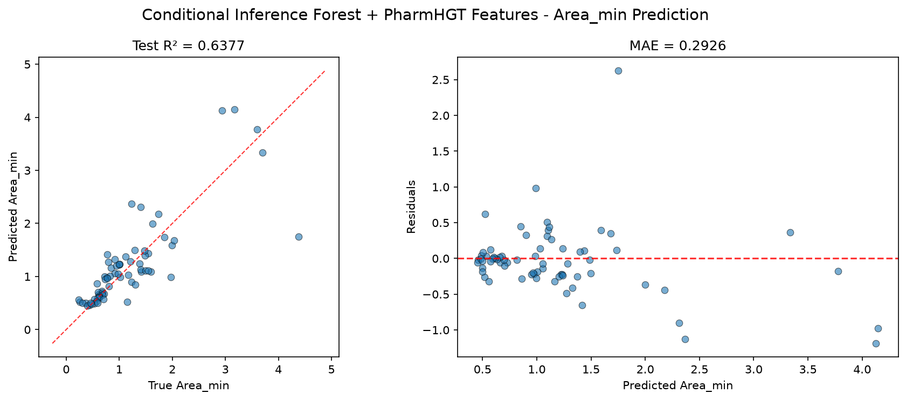
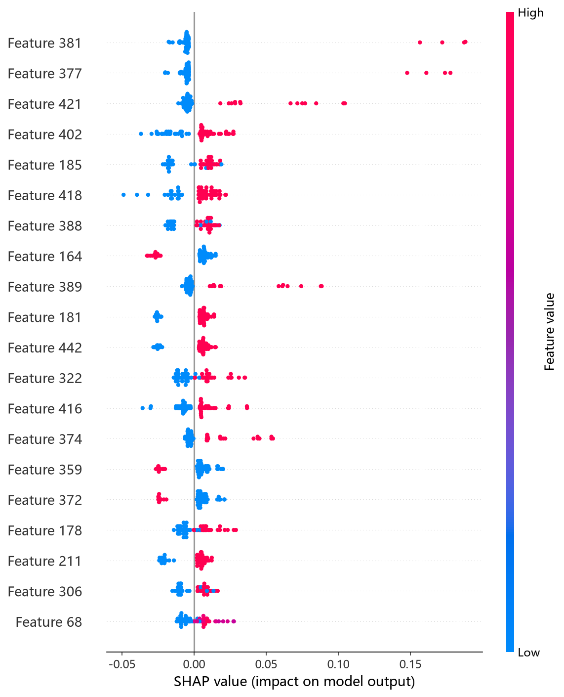
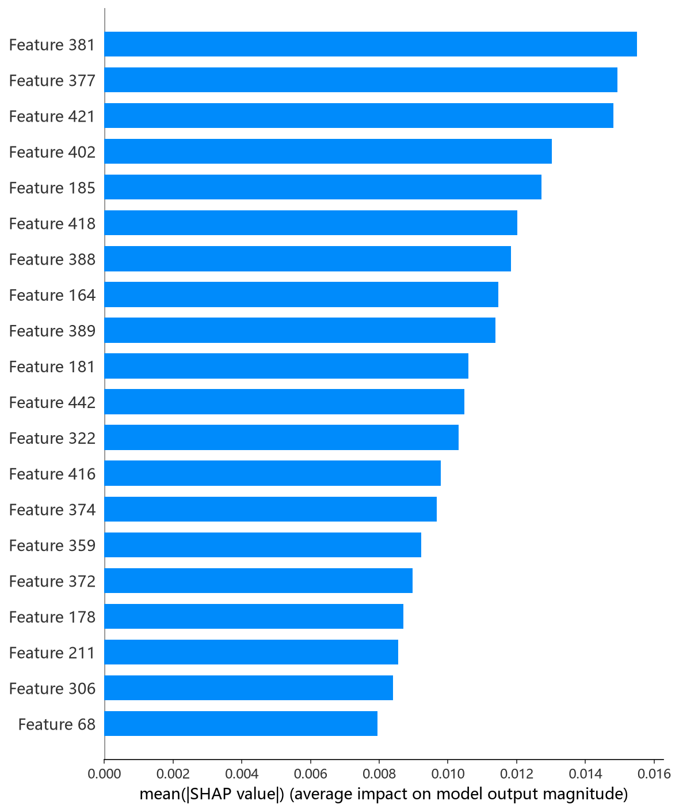

# CIF 模型报告 — Area_min 预测

## 报告信息

| 项目 | 内容 |
|------|------|
| 目标变量 | Area_min（每分子最小面积，nm²） |
| 运行目录 | `runs\Area_min\Area_min_cif_20260807_075623` |
| 调参日志 | 同上运行目录 `train.log`（Optuna 50 轮） |
| 运行时间 | 07:56 ~ 07:59（约 2 分钟） |
| 特征类型 | PharmHGT 522 维手工特征 |
| 报告生成日期 | 2026-08-07 |

## 概述

CIF（ExtraTrees 型条件推断森林）是集成学习中**最轻量的一类**：与随机森林不同，它在每个候选特征上使用随机阈值分裂而非寻找最优阈值，并以条件推断框架进行无偏变量选择。因其随机性强、方差低且无需提升过程的串行叠加，训练速度极快，是"树集成 + 522 维高维特征"组合中性价比最高的基线之一。

在 Area_min 任务中，CIF 的 Test R² = 0.6377、Test RMSE = 0.4859，**在 9 个模型中排名第 2**，与 HistGB（R² = 0.6416）几乎持平，共同构成该 target 的第一梯队。Area_min 描述分子在气-液界面单分子膜中的最小截面积（nm²），与 Gamma_max 负相关（r = −0.62），对分子的子结构组成与堆积方式敏感。

## 数据与方法

- **特征**：522 维 PharmHGT 风格特征，从缓存加载（`[Cache HIT]`），与其余模型一致。构成：原子聚合 220 + 键聚合 56 + 药效团 MACCS 194 + 反应活性 BRICS 34 + 表面活性剂类型 4 + 头尾比 2 + 分子描述符 12。
- **数据规模**：训练池 607 条（531 训练 + 76 验证），测试集 70 条；调参阶段采用 5 折交叉验证。
- **数据划分**：`train_test_split(0.125, random_state=42)`，固定随机种子。

## 超参数与调优

采用 **Optuna 50 轮 × 5 折交叉验证**（TPE 采样器 + MedianPruner），搜索空间 `n_estimators[200,2000]`、`max_depth[3,30]` 等。

**最优试验（Trial 48，CV RMSE = 0.4367）：**

| 参数 | 值 |
|------|-----|
| n_estimators | 1827 |
| max_depth | 21 |
| min_samples_split | 7 |
| min_samples_leaf | 1 |
| max_features | **log2** |
| bootstrap | **False** |
| Best CV RMSE | 0.4367 |

**调优过程观察：**
- 最优解偏好**大森林（1827 棵树）+ 保守深度（21）**，`max_features='log2'` 且 `bootstrap=False`——即"无放回、每分裂只考察 log2(522)≈9 个特征"的极端随机化，方差极小，是 ExtraTrees 风格的典型配置。
- 早期试验（Trial 0/1）CV 高达 0.73/0.65，随 `min_samples_split` 降至 2、`min_samples_leaf` 降至 1（允许深而细的分裂），CV 快速收敛到 0.45 以下（Trial 12 = 0.4486，Trial 27 = 0.4373）。
- 收敛后的多个并列最优（Trial 42/43 为 0.4485/0.4506）高度相似，说明该区域是稳定平台；50 轮中 12 轮被剪枝，单轮 5 折 CV 仅 2~4 秒，搜索效率极高。

## 训练过程

调参完成后直接以最优参数在 531 条训练集上训练最终模型（`Training Final Model with Best Hyperparameters`），无早停需求（树集成一次性建成）。整段训练含调参共约 2 分钟，是 9 个模型中训练成本最低者。

## 测试结果

| 指标 | 值 |
|------|-----|
| Test RMSE | **0.4859** |
| Test MAE | **0.2926** |
| Test R² | **0.6377** |
| Best CV RMSE | 0.4367 |

> 图：预测值 vs 真实值散点图与残差图见 [pred_vs_true.png](../../../runs/Area_min/Area_min_cif_20260807_075623/pred_vs_true.png)。
>
> 

Test RMSE（0.4859）较 Best CV（0.4367）回退约 0.05，幅度与 HistGB 相当，属于树模型在 70 条小测试集上的正常波动。Test MSE = 0.2361 与 HistGB（0.2335）几乎一致，印证两者处于同一精度水平。

## 特征重要性（说明）

当前日志输出的 Top-20 特征重要度**数值全部为 0.0**，但排序仍指示 **maccs_105、maccs_101、brics_10、NumRings、maccs_140** 等 MACCS 药效团/BRICS 子结构特征靠前，且 AroRings（芳香环数）位列第 9——这与 HistGB、CatBoost 等其余树模型的排序**高度一致**。数值归零的原因是 CIF 模型的对象未暴露 sklearn 标准 `feature_importances_` 口径，属于**日志展示缺陷**；精确归因须依赖 `shap_cif.py` 的 SHAP 分析（TreeExplainer）。下方 SHAP 图为实测结果：

*SHAP 蜜蜂图：每个点是一个测试样本，x 轴为 SHAP 值，颜色代表特征取值高低。*

*Top-20 平均 |SHAP| 条形图：maccs_105、maccs_101、brics_10 等子结构特征居前，与其余树模型结论一致。*

*Top-1 特征依赖图：maccs_105 的 SHAP 贡献在取值两端翻转，反映该子结构存在/缺失对 Area_min 的强二元作用。*

SHAP 归因与 permutation 排序一致：**Area_min 的预测主要由 MACCS 子结构位与 BRICS 碎片驱动**（而非纯分子大小），这与 HistGB 的结论互相印证——分子的具体官能团身份比整体尺寸更能决定其在界面的最小占用面积。

## 结论与评价

**优点：**
- **9 个模型中排名第 2**（R² = 0.6377），与最优 HistGB 仅差 0.004，处于第一梯队。
- 训练/调参成本极低（约 2 分钟），是 9 个模型中训练最快的，重训与复现成本可忽略。
- ExtraTrees 型极端随机化（log2 + bootstrap=False）方差小，对 522 维特征过拟合风险低。

**不足：**
- Test RMSE（0.4859）较 Best CV（0.4367）回退约 0.05，与 HistGB 同为第一梯队中回退偏大者。
- 日志未输出有效特征重要度（全 0），可解释性必须依赖 SHAP 补充。
- MAE（0.2926）高于 HistGB（0.2689），残差分布略散，极端分子的预测精度略逊。

**横向定位（9 个模型中按 Test RMSE 排序）：**

| 排名 | 模型 | Test RMSE | Test R² |
|------|------|-----------|---------|
| 1 | HistGB | 0.4833 | 0.6416 |
| **2** | **CIF (ExtraTrees)** | **0.4859** | **0.6377** |
| 3 | LightGBM | 0.5157 | 0.5919 |
| 4 | RF | 0.5179 | 0.5884 |

CIF 与 HistGB 构成 Area_min 的第一梯队（R² ≈ 0.64），并显著领先第 3 名 LightGBM 0.03 以上。若以"训练秒级完成、结果稳定、可解释性由 SHAP 补齐"为优先，CIF 是 Area_min 上性价比极高的选择；追求最小 MAE 时略逊于 HistGB。
