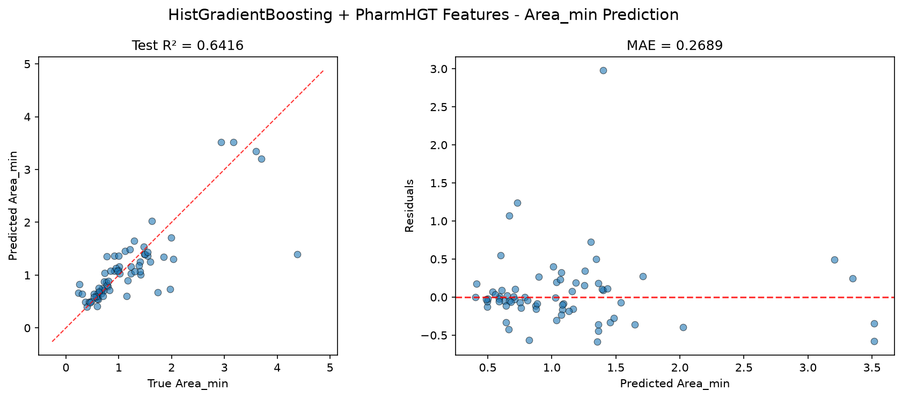
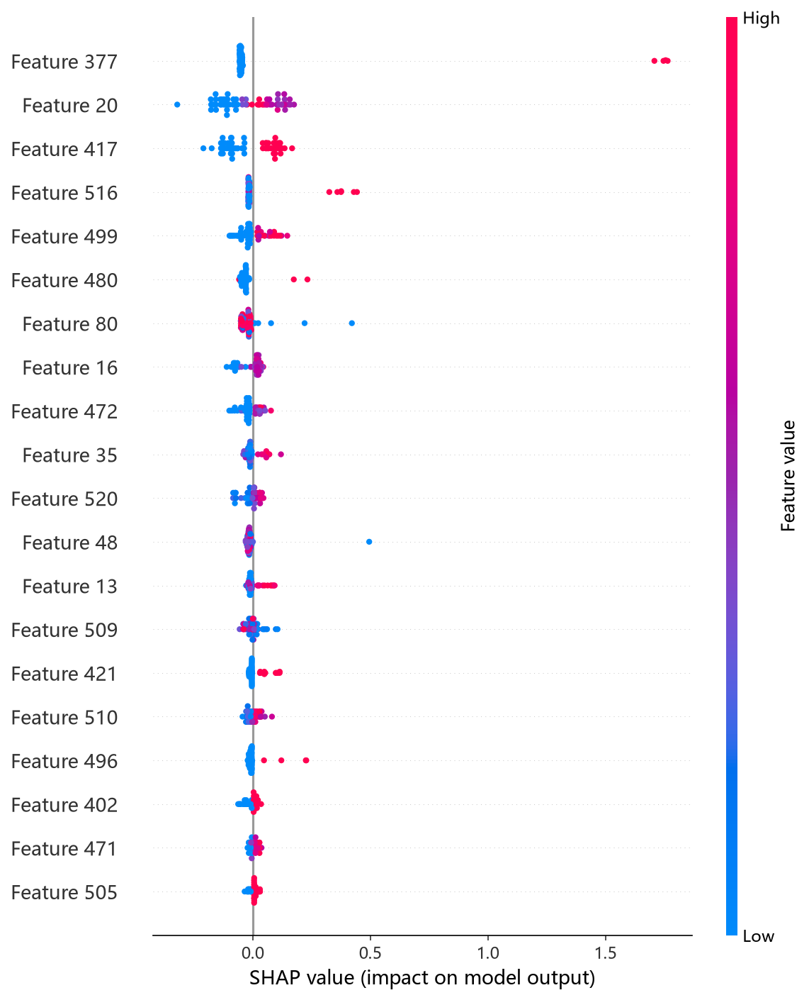
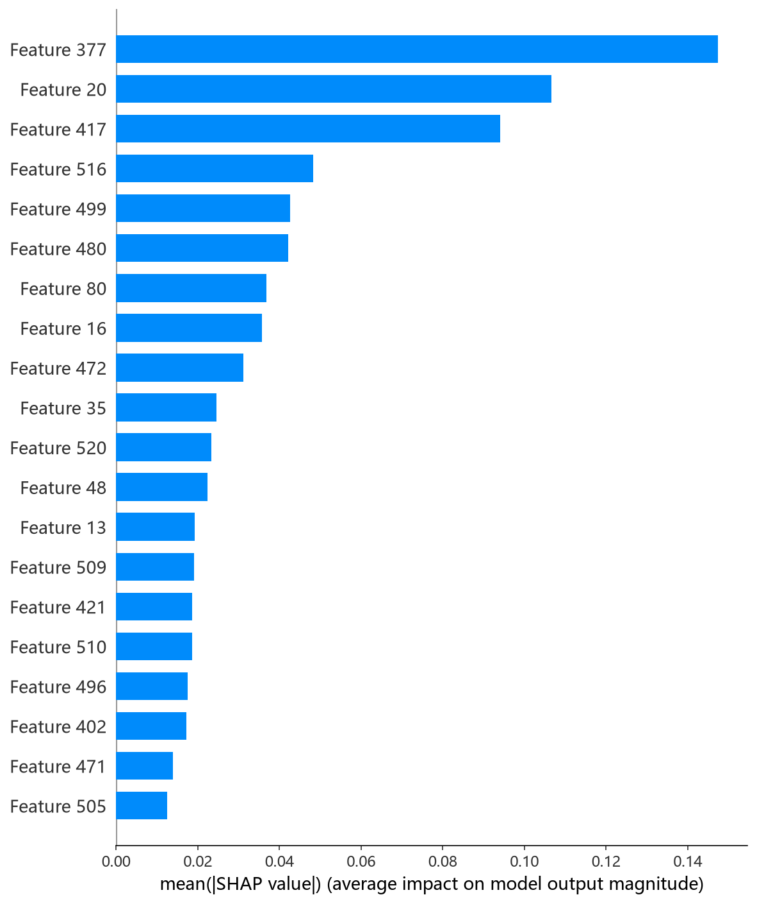

# HistGB 模型报告 — Area_min 预测

## 报告信息

| 项目 | 内容 |
|------|------|
| 目标变量 | Area_min（每分子最小面积，nm²） |
| 运行目录 | `runs\Area_min\Area_min_histgb_20260807_075850` |
| 调参日志 | 同上运行目录 `train.log`（Optuna 50 轮） |
| 运行时间 | 07:58 ~ 09:03（约 64 分钟） |
| 特征类型 | PharmHGT 522 维手工特征 |
| 报告生成日期 | 2026-08-07 |

## 概述

HistGB（`sklearn.ensemble.HistGradientBoostingRegressor`）是 sklearn 对梯度提升树的**直方图加速**实现：将连续特征离散化为 `max_bins` 个分箱，以近似分箱代替精确分裂点搜索，从而在大样本上显著提速，同时保持了梯度提升的强非线性拟合能力，并内置 L2 正则与早停。

在 Area_min 任务中，HistGB 的 Test R² = 0.6416、Test RMSE = 0.4833，**在 9 个模型中排名第 1**，与 CIF（R² = 0.6377）共同构成该 target 的第一梯队——这是全部 6 个 target 中少数几个"直方图梯度提升登顶"的场景。Area_min 描述表面活性剂分子在气-液界面单分子膜中所占的最小截面积（nm²），与 Gamma_max 负相关（r = −0.62），主要受分子头部/尾部结构与整体疏水体积驱动。

## 数据与方法

- **特征**：522 维 PharmHGT 风格特征，从缓存加载（`[Cache HIT]`），与其余模型一致。构成：原子聚合 220 + 键聚合 56 + 药效团 MACCS 194 + 反应活性 BRICS 34 + 表面活性剂类型 4 + 头尾比 2 + 分子描述符 12。
- **数据规模**：训练池 607 条（531 训练 + 76 验证），测试集 70 条；调参阶段采用 5 折交叉验证。
- **数据划分**：`train_test_split(0.125, random_state=42)`，固定随机种子。

## 超参数与调优

采用 **Optuna 50 轮 × 5 折交叉验证**（TPE 采样器 + MedianPruner）。

**最优试验（Trial 22，CV RMSE = 0.4512）：**

| 参数 | 值 |
|------|-----|
| learning_rate | 0.0171 |
| max_iter | 2475 |
| max_depth | 12 |
| max_leaf_nodes | 49 |
| min_samples_leaf | 15 |
| l2_regularization | 4.18e-4 |
| max_bins | 241 |
| Best CV RMSE | 0.4512 |

**调优过程观察：**
- 最优解呈现典型的**保守配置**：学习率偏低（0.017）、迭代充分（2475 轮），配合较小的叶子数（49）与适度 L2 正则，说明 Area_min 上每棵树的单次贡献宜小、靠增加迭代次数逼近目标。
- 早期试验（Trial 0/4）即进入 0.45~0.46 的较高水平，随后 Trial 20~23 围绕 `learning_rate≈0.014~0.017`、`max_iter≈2300~2500`、`max_leaf_nodes≈49~59` 收敛，说明该参数组合是稳定的局部最优。
- 50 轮中仅 1 轮被剪枝（Trial 8），搜索效率高。

## 训练过程

调参完成后直接以最优参数在 531 条训练集上训练最终模型（`Training Final Model with Best Hyperparameters`），随后在 70 条测试集上评估。max_iter 固定为 2475 且无提前终止触发，训练过程平稳无早停。

## 测试结果

| 指标 | 值 |
|------|-----|
| Test RMSE | **0.4833** |
| Test MAE | **0.2689** |
| Test R² | **0.6416** |
| Best CV RMSE | 0.4512 |

> 图：预测值 vs 真实值散点图与残差图见 [pred_vs_true.png](../../../runs/Area_min/Area_min_histgb_20260807_075850/pred_vs_true.png)。
>
> 

Test RMSE（0.4833）略高于调参 CV（0.4512），属于可接受的回退幅度；**Test MAE = 0.2689 为 9 个模型中最低**，说明残差分布集中、对多数分子的预测都贴近真实值。Test MSE = 0.2335 与之印证。

## 特征重要性（Top 20）

HistGB 输出基于 **permutation 置换重要度**（Top 20），前 5 位为：

1. **maccs_101**（MACCS 药效团子结构键，0.2745 ± 0.0262）
2. **brics_10**（BRICS 片段直方图桶，0.2667 ± 0.0268）
3. **atom_mean_20**（原子四配位 one-hot 的均值聚合，0.1237 ± 0.0247）
4. **atom_mean_48**（Gasteiger 电荷分箱聚合，0.0703 ± 0.0050）
5. **maccs_141**（MACCS 药效团子结构键，0.0596 ± 0.0113）

MACCS 药效团位（maccs_101 / maccs_141）与 BRICS 碎片（brics_10）占据前两位，权重总和超 0.5——这与 Area_min 的物理本质高度吻合：最小截面积主要由分子所含的具体官能团/子结构（亲水头基的极性取代模式）决定，而非单纯的分子大小。`atom_mean_20`（配位度）、`atom_mean_48`（Gasteiger 电荷）反映分子局部电子结构对界面堆积的调制。NumRings、HeavyAtoms、MolWt 等尺寸类描述符排名偏后（第 6、12、15 位），说明**子结构身份比整体尺寸更能预测 Area_min**。

下方为 `shap_histgb.py` 生成的 SHAP 分析实测结果：

*SHAP 蜜蜂图：每个点是一个测试样本，x 轴为 SHAP 值，颜色代表特征取值高低。*

*Top-20 平均 |SHAP| 条形图：maccs_101、brics_10 等子结构特征居前，与 permutation 重要度排序一致。*

*Top-1 特征依赖图：maccs_101 取值越高，SHAP 贡献方向发生翻转，体现子结构存在/缺失对预测的二元作用。*

## 结论与评价

**优点：**
- **9 个模型中 Test R² 最高（0.6416）**，且 **MAE 全模型最低**（0.2689），是 Area_min 的最优模型。
- 直方图实现训练/调参速度快（50 轮约 64 分钟，含最终训练），性价比高于 CIF。
- 内置 L2 正则与分箱，对 522 维高维稀疏特征抗过拟合能力强。

**不足：**
- Test RMSE（0.4833）较 Best CV（0.4512）回退 0.03，存在轻度过拟合于验证集。
- 与 CIF（0.4859）差距极小（0.003），领先优势不显著，需结合 SHAP 图进一步确认稳定性。
- 依赖 permutation 重要度（约 50 次重排），单次运行耗时较长，且结果存在随机波动（±0.02 量级）。

**横向定位（9 个模型中按 Test RMSE 排序）：**

| 排名 | 模型 | Test RMSE | Test R² |
|------|------|-----------|---------|
| **1** | **HistGB** | **0.4833** | **0.6416** |
| 2 | CIF (ExtraTrees) | 0.4859 | 0.6377 |
| 3 | LightGBM | 0.5157 | 0.5919 |

HistGB 与 CIF 构成 Area_min 的第一梯队（R² ≈ 0.64），明显领先其余模型 0.03 以上。两者的特征归因高度一致（子结构主导），互为印证。若追求**最小残差集中度（MAE）**优先选 HistGB；若追求更强的稳定鲁棒性可同等考虑 CIF。
