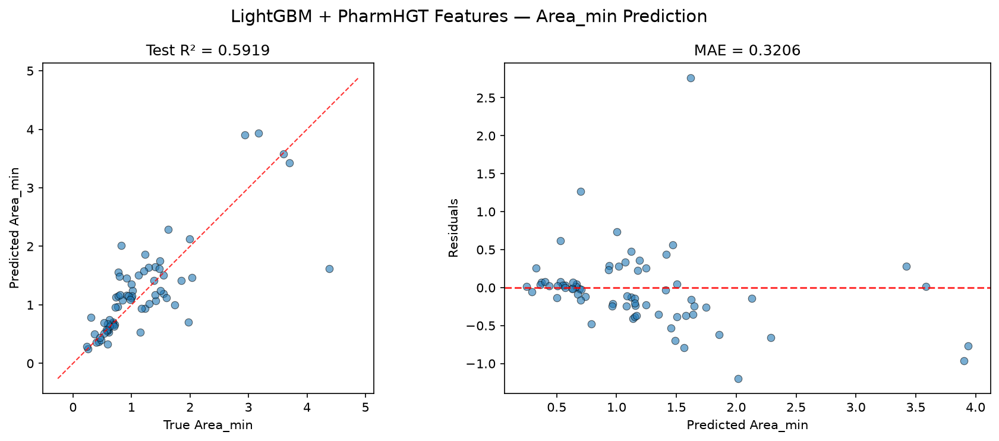
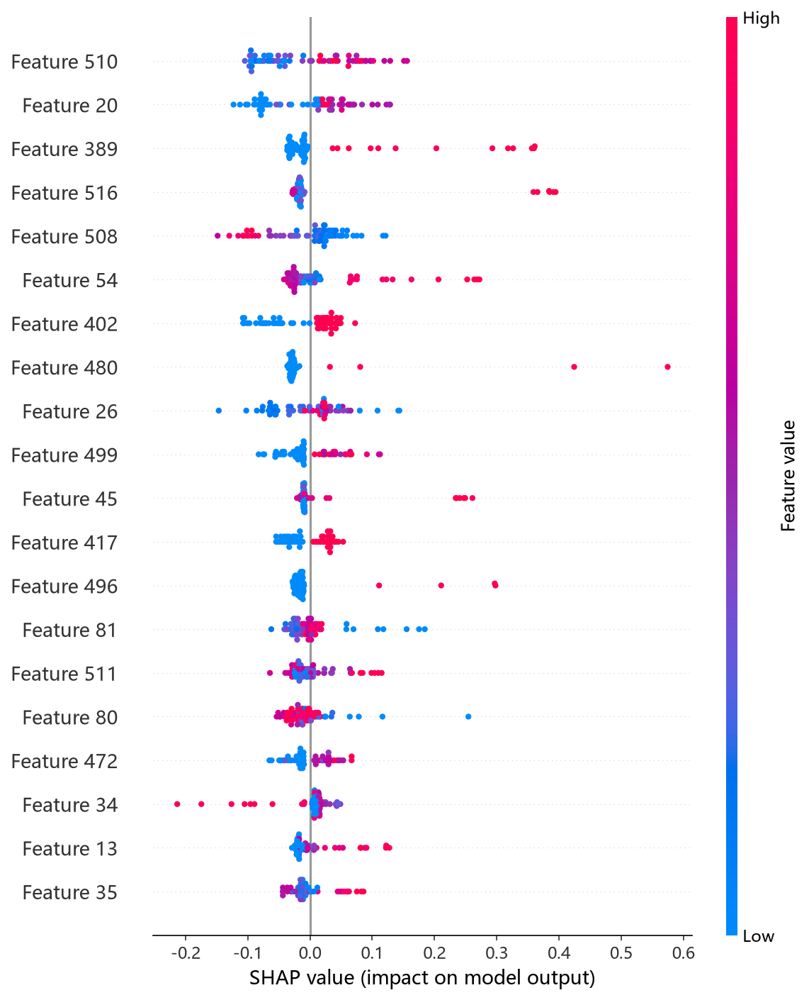
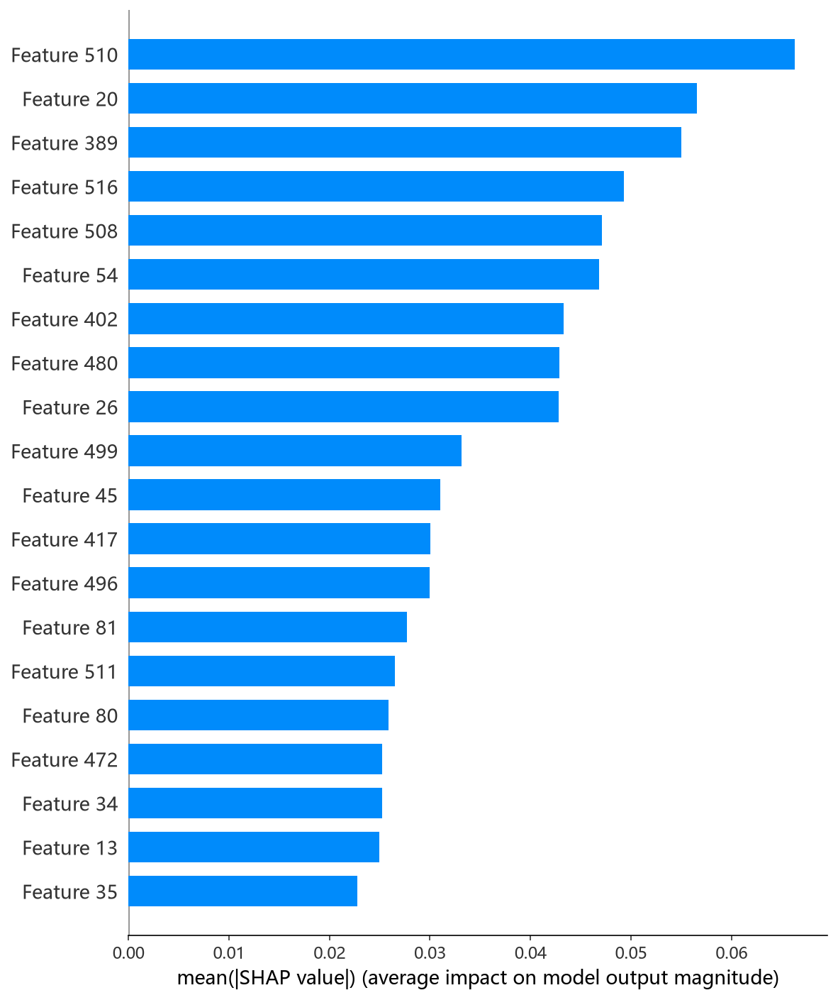

# LightGBM 模型报告 — Area_min 预测

## 报告信息

| 项目 | 内容 |
|------|------|
| 目标变量 | Area_min（每分子最小面积，nm²） |
| 运行目录 | `runs\Area_min\Area_min_lightgbm_20260807_090524` |
| 调参日志 | 同上运行目录 `train.log`（Optuna 50 轮） |
| 运行时间 | 09:05 ~ 09:07（约 2 分钟） |
| 特征类型 | PharmHGT 522 维手工特征 |
| 报告生成日期 | 2026-08-07 |

## 概述

LightGBM（Light Gradient Boosting Machine）是微软开源的梯度提升框架，采用**叶子生长（leaf-wise）策略**与直方图分箱，能在固定叶子数下优先分裂损失最大的叶子，配合基于梯度的单边采样（GOSS）与互斥特征捆绑（EFB），训练效率在主流 GBDT 中首屈一指。

在 Area_min 任务中，LightGBM 的 Test R² = 0.5919、Test RMSE = 0.5157，**在 9 个模型中排名第 3**，处于第二梯队首位（紧随第一梯队的 HistGB/CIF 之后）。Area_min 描述表面活性剂分子在气-液界面单分子膜中的最小截面积（nm²），与 Gamma_max 负相关（r = −0.62）。

## 数据与方法

- **特征**：522 维 PharmHGT 风格特征，从缓存加载（`[Cache HIT]`），与其余模型一致。构成：原子聚合 220 + 键聚合 56 + 药效团 MACCS 194 + 反应活性 BRICS 34 + 表面活性剂类型 4 + 头尾比 2 + 分子描述符 12。
- **数据规模**：训练池 607 条（531 训练 + 76 验证），测试集 70 条；调参阶段采用 5 折交叉验证。
- **数据划分**：`train_test_split(0.125, random_state=42)`，固定随机种子。

## 超参数与调优

采用 **Optuna 50 轮 × 5 折交叉验证**（TPE 采样器 + MedianPruner），搜索空间覆盖 `boosting_type[gbdt, dart]`、`max_depth[3,15]`、`num_leaves[15,255]` 等。

**最优试验（Best Trial，CV RMSE = 0.4651）：**

| 参数 | 值 |
|------|-----|
| boosting_type | **gbdt** |
| max_depth | 7 |
| num_leaves | 227 |
| learning_rate | 0.0578 |
| n_estimators | 2073 |
| subsample | 0.835 |
| colsample_bytree | 0.746 |
| reg_alpha / reg_lambda | ~2.2e-8 / 1.05e-3 |
| min_child_samples | 18 |
| min_split_gain | 0.035 |
| Best CV RMSE | 0.4651 |

**调优过程观察：**
- 最优解收敛到 **gbdt + 中等深度（7）+ 大叶子数（227）+ 低学习率（0.058）+ 长迭代（2073）**：leaf-wise 策略下叶子数偏大、深度受限，靠加大迭代次数逼近目标，与 Area_min 平滑的回归面相适应。
- 早期试验（Trial 0）使用 dart 提升时 CV 高达 1.03（drop-out 正则在该任务上反而拖累拟合），dart 类试验普遍表现不佳并被 MedianPruner 快速剪枝；最终最优为传统 gbdt，说明该 target 无需 dropout 型正则。
- 50 轮中多轮被剪枝（Trial 6/7 等），单轮 5 折 CV 秒级完成，整体调参约 1 分钟，效率极高。

## 训练过程

调参完成后以最优参数在 531 条训练集上训练最终模型，**早停在 best iteration 138 触发**（验证 RMSE = 0.3221，patience=50）。早停较早（<150 轮）说明模型在验证集上快速收敛，继续训练对验证误差无改善；最终以验证最优权重作为交付模型。

## 测试结果

| 指标 | 值 |
|------|-----|
| Test RMSE | **0.5157** |
| Test MAE | **0.3206** |
| Test R² | **0.5919** |
| Best CV RMSE | 0.4651 |

> 图：预测值 vs 真实值散点图与残差图见 [pred_vs_true.png](../../../runs/Area_min/Area_min_lightgbm_20260807_090524/pred_vs_true.png)。
>
> 

Test RMSE（0.5157）较 Best CV（0.4651）回退约 0.05，为第一梯队模型的普遍回退水平；**MAE（0.3206）在 9 个模型中偏高**（仅优于 MLP/RNN），说明对中间区间分子存在系统性偏差，残差分布比 HistGB 更散。Test MSE = 0.2659 与之印证。

## 特征重要性（Top 20）

LightGBM 输出 **split-based（分裂次数）重要度**（Top 20），前 5 位为：

1. **LogP**（脂水分配系数，79 次分裂）
2. **tail_ratio**（尾链碳比例，58）
3. **atom_mean_26**（氢键供体 one-hot 聚合，56）
4. **atom_std_25**（杂化态 one-hot 标准差聚合，47）
5. **MolWt**（分子量，47）

与 HistGB 的 permutation 排序**明显不同**：LightGBM 把疏水性（LogP）、头尾结构（tail_ratio / head_ratio）与分子尺寸（MolWt、RotBonds）放在首位，而 HistGB 更看重 MACCS/BRICS 子结构。这一差异源于两种重要度口径不同（分裂次数 vs 置换），但均指示**疏水性-尺寸-头尾结构**在 Area_min 预测中的核心地位。SHAP 归因（下方图）进一步将 MolWt 排在首位，与 split 重要度大体一致。

*SHAP 蜜蜂图：每个点是一个测试样本，x 轴为 SHAP 值，颜色代表特征取值高低。*

*Top-20 平均 |SHAP| 条形图：MolWt、atom_mean_20、maccs_113、NumRings、head_ratio 居前。*

*Top-1 特征依赖图：MolWt 与 SHAP 贡献近似正相关，分子量增大 → 预测的每分子最小面积增大，符合界面堆积的物理直觉。*

## 结论与评价

**优点：**
- **9 个模型中排名第 3**（R² = 0.5919），稳居第二梯队首位。
- 训练/调参成本极低（约 2 分钟），与 CIF 并列最快档；gbdt + 早停的配置稳定可复现。
- split 与 SHAP 双重重要度相互印证，特征归因清晰（疏水性/尺寸/头尾结构主导）。

**不足：**
- 与第一梯队（HistGB/CIF，R² ≈ 0.64）存在约 0.05 的 R² 差距，未进入最优梯队。
- MAE（0.3206）偏高，对中间区间分子的系统性偏差大于 HistGB（0.2689）。
- dart 提升在该任务上失效（最优试验 CV 差），搜索空间对该 target 部分无效，探索略浪费。

**横向定位（9 个模型中按 Test RMSE 排序）：**

| 排名 | 模型 | Test RMSE | Test R² |
|------|------|-----------|---------|
| 1 | HistGB | 0.4833 | 0.6416 |
| 2 | CIF (ExtraTrees) | 0.4859 | 0.6377 |
| **3** | **LightGBM** | **0.5157** | **0.5919** |
| 4 | RF | 0.5179 | 0.5884 |
| 5 | NGBoost | 0.5240 | 0.5786 |

LightGBM 与 RF 几乎并列（差 0.002），是第二梯队的代表；相对第一梯队有 0.03 的 RMSE 差距，但训练速度快、可解释性好。若追求"速度 + 可用精度"兼顾，LightGBM 是不错的工程化选择；追求精度上限仍以 HistGB/CIF 为优。
