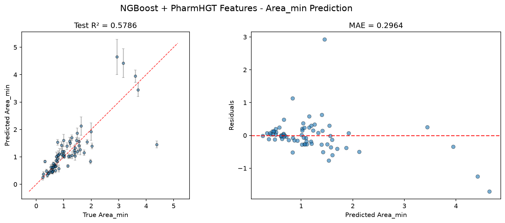
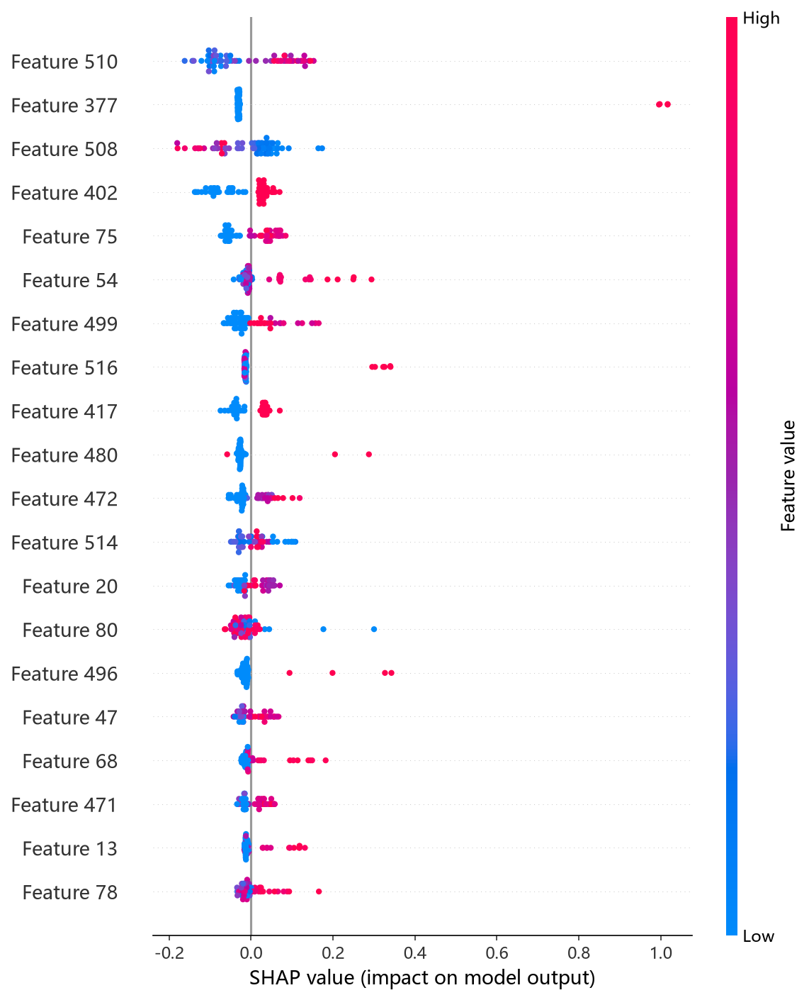
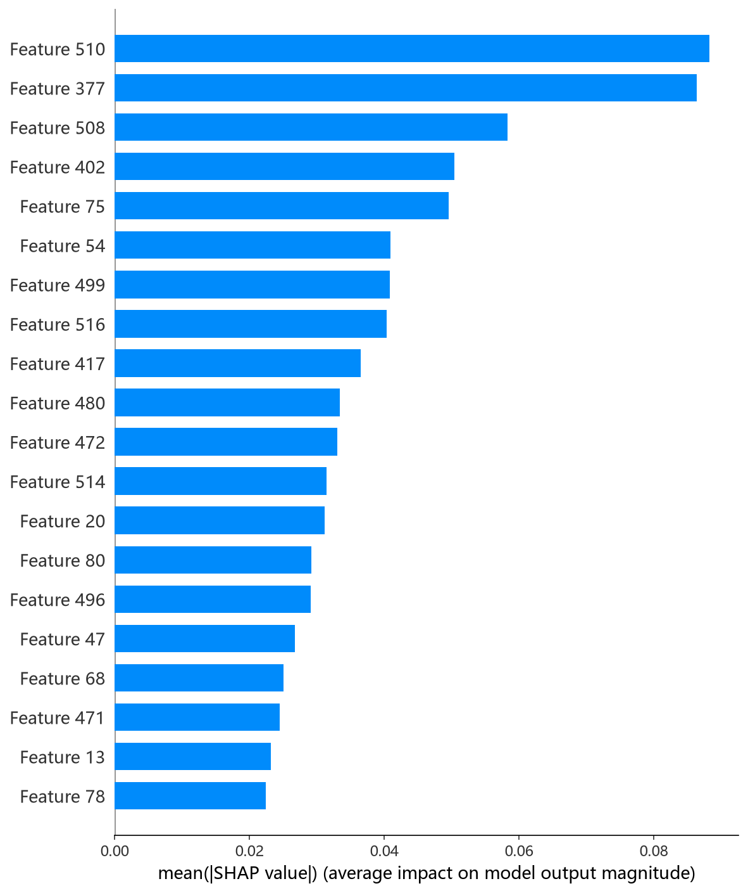

# NGBoost 模型报告 — Area_min 预测

## 报告信息

| 项目 | 内容 |
|------|------|
| 目标变量 | Area_min（每分子最小面积，nm²） |
| 运行目录 | `runs\Area_min\Area_min_ngboost_20260807_094721` |
| 调参日志 | 同上运行目录 `train.log`（预调优，跳过 Optuna） |
| 运行时间 | 09:47:21 ~ 09:47:37（约 16 秒） |
| 特征类型 | PharmHGT 522 维手工特征 |
| 报告生成日期 | 2026-08-07 |

## 概述

NGBoost（Natural Gradient Boosting）是斯坦福提出的**概率型梯度提升**：它在每一轮同时学习目标分布的参数（默认 Normal 分布的均值 μ 与方差 σ），用**自然梯度**而非普通梯度更新，最终输出每个样本的完整概率分布而非单点预测。这在 9 个模型中独树一帜——除预测值外还给出**逐分子不确定性估计**。

在 Area_min 任务中，NGBoost 的 Test R² = 0.5786、Test RMSE = 0.5240，**在 9 个模型中排名第 5**，处于第二梯队中部。Area_min 描述表面活性剂分子在气-液界面单分子膜中的最小截面积（nm²），与 Gamma_max 负相关（r = −0.62）。NGBoost 的统计输出平均预测标准差 0.1264 nm²，可在预测置信度上提供附加价值。

## 数据与方法

- **特征**：522 维 PharmHGT 风格特征，从缓存加载（`[Cache HIT]`），与其余模型一致。构成：原子聚合 220 + 键聚合 56 + 药效团 MACCS 194 + 反应活性 BRICS 34 + 表面活性剂类型 4 + 头尾比 2 + 分子描述符 12。
- **数据规模**：训练池 607 条（531 训练 + 76 验证），测试集 70 条。
- **数据划分**：`train_test_split(0.125, random_state=42)`，固定随机种子。

## 超参数与调优

本次运行**使用预调优参数、跳过 Optuna 搜索**（`Using pretuned hyperparameters`）：

| 参数 | 值 |
|------|-----|
| n_estimators | 637 |
| learning_rate | 0.0337 |
| minibatch_frac | 0.723 |
| max_depth | 5 |
| min_samples_leaf | 13 |
| score_rule | **LogScore**（对数分数） |
| 输出分布 | Normal（均值 ± 方差双输出） |

参数来源为旧调参日志（本项目此前对 pCMC 等 target 的 NGBoost 预调优结论），采用**保守浅树（max_depth=5）+ 低学习率（0.034）+ 较多迭代（637）**的配置，配合 minibatch 采样（0.72）稳定自然梯度估计。Score rule 取 LogScore 对应最大化对数似然的概率训练目标。

## 训练过程

最终模型在 531 条训练集上直接训练 637 轮（日志仅打印 iter 0/100/200/…/600），训练损失从 1.17 单调下降至 −0.93（对数分数为负值属正常），无早停。由于跳过 Optuna，整段训练约 16 秒，是 9 个模型中训练成本最低者之一。

## 测试结果

| 指标 | 值 |
|------|-----|
| Test RMSE | **0.5240** |
| Test MAE | **0.2964** |
| Test R² | **0.5786** |
| 平均预测标准差 | 0.1264（nm²） |

> 图：预测值 vs 真实值散点图与残差图见 [pred_vs_true.png](../../../runs/Area_min/Area_min_ngboost_20260807_094721/pred_vs_true.png)。
>
> 

Test RMSE（0.5240）与 MAE（0.2964）均居中游，略优于 CatBoost 而略逊于 LightGBM/RF；**MAE（0.2964）为 9 个模型中第 4 低**，残差分布尚可。Test MSE = 0.2746 与之印证。作为概率模型，其输出的平均预测标准差（0.1264 nm²）可在筛选"预测不确定"的分子时提供参考，但该量级是否贴合真实残差需进一步校准。

## 特征重要性

NGBoost 的对象返回 `feature_importances_` 形状为 `(2, 522)`（分别对应均值与方差两个分布参数的树集合），脚本检测到形状不匹配后跳过输出（`unexpected shape (2, 522), skipping`），因此日志**未提供 Top-20 特征列表**。精确归因须依赖 `shap_ngboost.py` 的 **KernelExplainer** SHAP 分析（NGBoost 非树结构，无法用 TreeExplainer）。下方 SHAP 图为该分析的实测结果：

*SHAP 蜜蜂图：每个点是一个测试样本，x 轴为 SHAP 值，颜色代表特征取值高低。*

*Top-20 平均 |SHAP| 条形图：MolWt、maccs_101、head_ratio、maccs_126、atom_std_20 居前。*

*Top-1 特征依赖图：MolWt 与 SHAP 贡献正相关，分子量增大 → 预测的每分子最小面积增大，与 LightGBM/RF 的 SHAP 结论一致。*

SHAP 归因指示 **MolWt（分子量）为第一重要特征**，MACCS 子结构位（maccs_101/126）与 head_ratio（头基比例）紧随其后——"分子尺寸 + 子结构身份 + 头尾结构"三者协同决定 Area_min，与其余树模型结论高度一致。

## 结论与评价

**优点：**
- **唯一的概率型输出**：提供逐分子均值 ± 标准差，可支撑不确定性筛选，这是其余 8 个模型不具备的能力。
- 预调优跳过 Optuna，训练约 16 秒，成本极低、复现快。
- MAE（0.2964）居中游偏优，残差分布尚可；SHAP 归因与其余模型一致，物理可解释。

**不足：**
- Test R² = 0.5786，排名第 5，低于第一梯队（HistGB/CIF，R² ≈ 0.64）约 0.06。
- 日志未输出特征重要度（形状不匹配跳过），可解释性依赖 KernelExplainer，计算开销大。
- 预调优参数来自历史 target 的结论，未针对 Area_min 重新搜索，精度天花板可能未充分挖掘。

**横向定位（9 个模型中按 Test RMSE 排序）：**

| 排名 | 模型 | Test RMSE | Test R² |
|------|------|-----------|---------|
| 3 | LightGBM | 0.5157 | 0.5919 |
| 4 | RF | 0.5179 | 0.5884 |
| **5** | **NGBoost** | **0.5240** | **0.5786** |
| 6 | CatBoost | 0.5315 | 0.5664 |
| 7 | XGBoost | 0.5495 | 0.5366 |

NGBoost 位于第二梯队中部，与 CatBoost 相差 0.007。若**精度是唯一目标**，选 HistGB/CIF 更优；若需要**不确定性估计**（用于筛选低置信度分子、支撑界面性质的可靠性分析），NGBoost 是 Area_min 上的独特选择。
