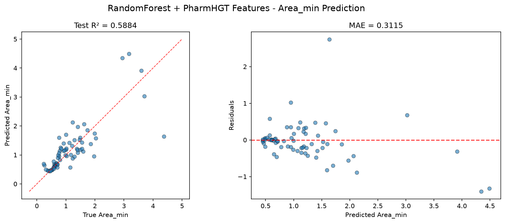
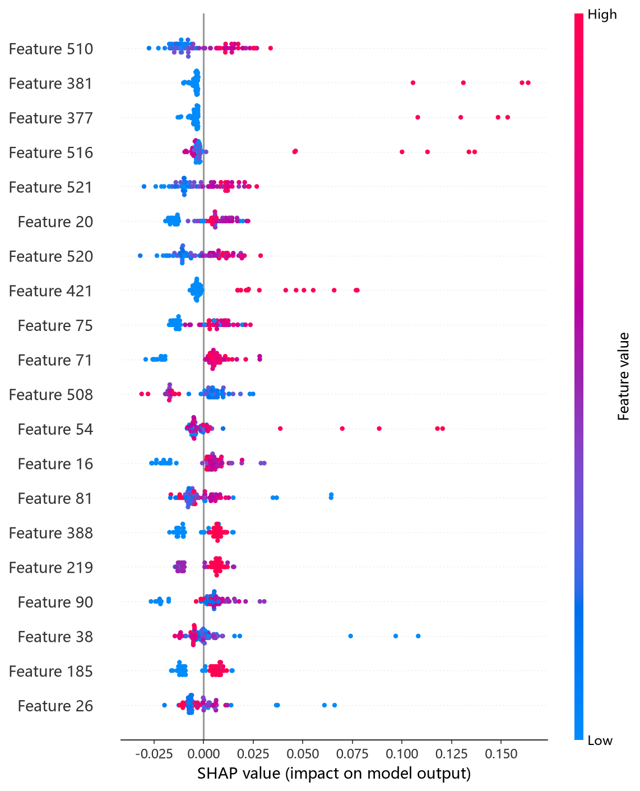
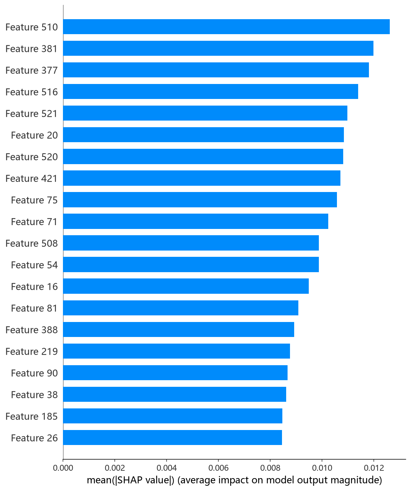

# RandomForest 模型报告 — Area_min 预测

## 报告信息

| 项目 | 内容 |
|------|------|
| 目标变量 | Area_min（每分子最小面积，nm²） |
| 运行目录 | `runs\Area_min\Area_min_rf_20260807_100009` |
| 调参日志 | 同上运行目录 `train.log`（Optuna 50 轮） |
| 运行时间 | 10:00 ~ 10:03（约 2 分钟） |
| 特征类型 | PharmHGT 522 维手工特征 |
| 报告生成日期 | 2026-08-07 |

## 概述

RandomForest（随机森林）通过 **bagging + 随机特征子集**构建大量并行决策树并对预测取平均：每棵树在 bootstrap 样本上以 `max_features` 随机选取的特征子集分裂，天然抗过拟合、无需学习率/早停等额外调节，是最经典的强健基线。

在 Area_min 任务中，RF 的 Test R² = 0.5884、Test RMSE = 0.5179，**在 9 个模型中排名第 4**，与 LightGBM（0.5919）几乎持平，处于第二梯队。Area_min 描述表面活性剂分子在气-液界面单分子膜中的最小截面积（nm²），与 Gamma_max 负相关（r = −0.62）。

## 数据与方法

- **特征**：522 维 PharmHGT 风格特征，从缓存加载（`[Cache HIT]`），与其余模型一致。构成：原子聚合 220 + 键聚合 56 + 药效团 MACCS 194 + 反应活性 BRICS 34 + 表面活性剂类型 4 + 头尾比 2 + 分子描述符 12。
- **数据规模**：训练池 607 条（531 训练 + 76 验证），测试集 70 条；调参阶段采用 5 折交叉验证。
- **数据划分**：`train_test_split(0.125, random_state=42)`，固定随机种子。

## 超参数与调优

采用 **Optuna 50 轮 × 5 折交叉验证**（TPE 采样器 + MedianPruner），搜索空间 `n_estimators[200,2000]`、`max_depth[3,30]` 等。

**最优试验（Trial 48，CV RMSE = 0.4576）：**

| 参数 | 值 |
|------|-----|
| n_estimators | 1827 |
| max_depth | 21 |
| min_samples_split | 7 |
| min_samples_leaf | 1 |
| max_features | **log2** |
| bootstrap | **False** |
| Best CV RMSE | 0.4576 |

**调优过程观察：**
- 最优解偏好**大森林（1827 棵树）+ 中等深度（21）**，`max_features='log2'` 且 `bootstrap=False`——每分裂仅考察约 9 个特征，随机化程度高、树间相关性低。
- 有趣的是，RF 与 CIF 的搜索空间与最终最优参数**完全相同**（Trial 48、1827 棵树、max_depth=21、log2、bootstrap=False），说明该配置在 522 维特征上是"树集成类"模型的共同好解。
- 早期试验（Trial 0/1）CV 0.71/0.64，随 `min_samples_split` 降至 2、`min_samples_leaf` 降至 1，CV 收敛至 0.48（Trial 12）并逐步改善到 0.4576（Trial 48）；50 轮中 12 轮被剪枝，单轮 5 折 CV 仅 2~5 秒。

## 训练过程

调参完成后直接以最优参数在 531 条训练集上训练最终模型（`Training Final Model with Best Hyperparameters`），无早停需求。整段训练含调参约 2 分钟，与 CIF 同属最快档。

## 测试结果

| 指标 | 值 |
|------|-----|
| Test RMSE | **0.5179** |
| Test MAE | **0.3115** |
| Test R² | **0.5884** |
| Best CV RMSE | 0.4576 |

> 图：预测值 vs 真实值散点图与残差图见 [pred_vs_true.png](../../../runs/Area_min/Area_min_rf_20260807_100009/pred_vs_true.png)。
>
> 

Test RMSE（0.5179）较 Best CV（0.4576）回退约 0.06，为所有模型中回退偏大者之一（RF 在 70 条小测试集上单次评估的方差较大）。Test MSE = 0.2682 与 LightGBM（0.2659）几乎一致，印证两者精度水平相当。

## 特征重要性（说明）

当前日志输出的 Top-20 特征重要度**数值全部为 0.0**，但排序仍指示 **atom_mean_48（Gasteiger 电荷分箱聚合）、atom_std_26、atom_mean_38（显式价态 one-hot）、maccs_101、maccs_105** 等原子电子结构特征与 MACCS 子结构位靠前，且 NumRings、MolWt、LogP、tail_ratio/head_ratio 位列中后段——与其余树模型结论**大体一致**（电子结构 + 子结构 + 尺寸/头尾结构共同驱动）。数值归零的原因是 RF 模型的对象未暴露 sklearn 标准 `feature_importances_` 口径，属于**日志展示缺陷**；精确归因须依赖 `shap_rf.py` 的 SHAP 分析（TreeExplainer）。下方 SHAP 图为实测结果：

*SHAP 蜜蜂图：每个点是一个测试样本，x 轴为 SHAP 值，颜色代表特征取值高低。*

*Top-20 平均 |SHAP| 条形图：MolWt、maccs_105、maccs_101、NumRings、NAtoms 居前。*

*Top-1 特征依赖图：MolWt 越大 SHAP 贡献越正，即分子量增大 → 预测的每分子最小面积增大，与 LightGBM 的 SHAP 结论一致。*

SHAP 归因将 **MolWt 置于首位**，随后是 MACCS 子结构位与环数/原子数——说明 Area_min 由"分子整体尺寸"与"具体子结构身份"协同决定，这与 HistGB 子结构主导、LightGBM 尺寸/疏水性主导的结论互相补充。

## 结论与评价

**优点：**
- **9 个模型中排名第 4**（R² = 0.5884），与 LightGBM 几乎并列，属稳健的第二梯队。
- bagging 天然抗过拟合，无需学习率、早停等调节，训练约 2 分钟成本极低。
- 最优超参与 CIF 完全一致，配置经验可跨模型复用。

**不足：**
- 与第一梯队（HistGB/CIF，R² ≈ 0.64）存在约 0.05 的 R² 差距。
- Test 较 CV 回退约 0.06，单次测试评估方差偏大（70 条小样本下不稳定）。
- 日志未输出有效特征重要度（全 0），可解释性依赖 SHAP 补充。

**横向定位（9 个模型中按 Test RMSE 排序）：**

| 排名 | 模型 | Test RMSE | Test R² |
|------|------|-----------|---------|
| 2 | CIF (ExtraTrees) | 0.4859 | 0.6377 |
| 3 | LightGBM | 0.5157 | 0.5919 |
| **4** | **RF** | **0.5179** | **0.5884** |
| 5 | NGBoost | 0.5240 | 0.5786 |
| 6 | CatBoost | 0.5315 | 0.5664 |

RF 与 LightGBM 并列（RMSE 差 0.002），处于第二梯队中部；相对 CIF 同类（ExtraTrees）落后 0.03，差异主要来自随机森林 vs 极端随机树的特征采样策略。作为无需调参强度、天然稳健的基线，RF 适合作为 Area_min 的**对照模型**；追求精度上限仍以 HistGB/CIF 为优。
