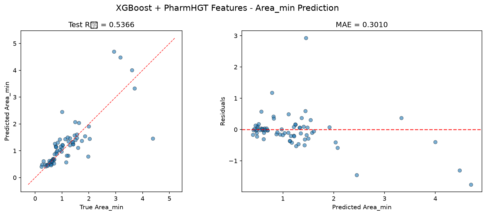
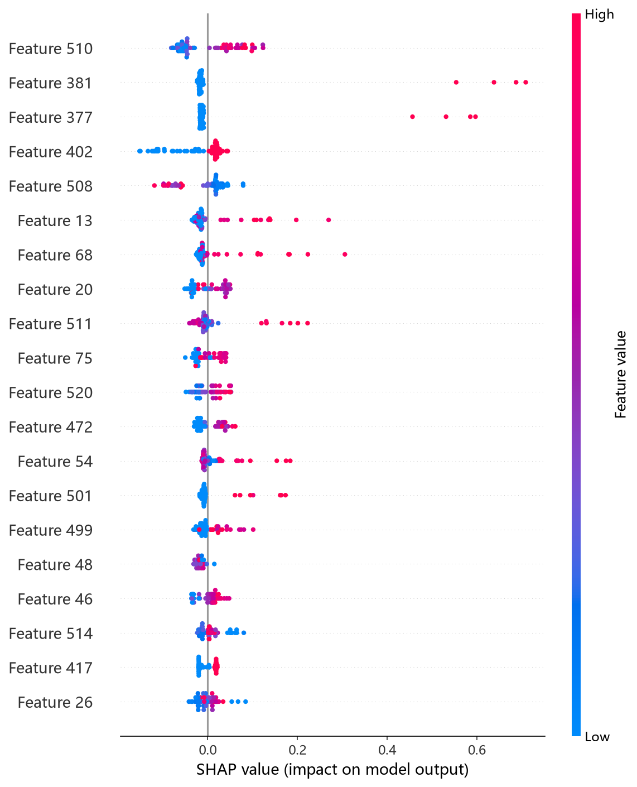
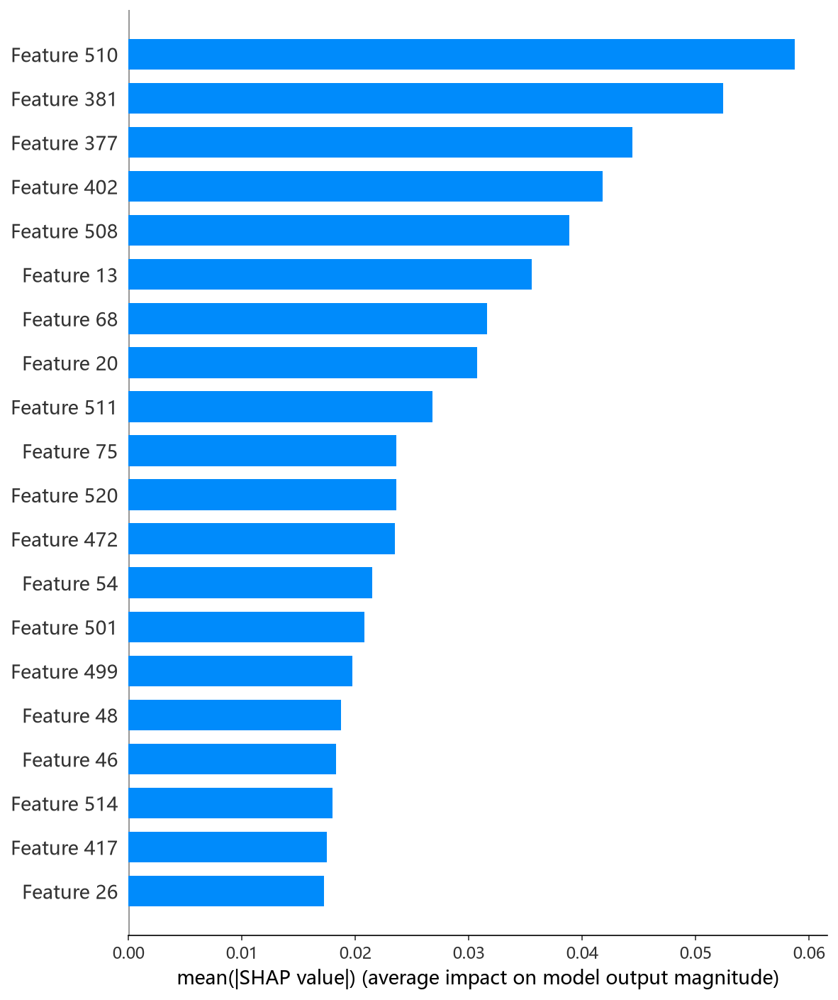

# XGBoost 模型报告 — Area_min 预测

## 报告信息

| 项目 | 内容 |
|------|------|
| 目标变量 | Area_min（每分子最小面积，nm²） |
| 运行目录 | `runs\Area_min\Area_min_xgboost_20260807_101507` |
| 调参日志 | 同上运行目录 `train.log`（Optuna 200 轮） |
| 运行时间 | 10:15 ~ 10:36（约 21 分钟） |
| 特征类型 | PharmHGT 522 维手工特征 |
| 报告生成日期 | 2026-08-07 |

## 概述

XGBoost 是陈天奇提出的梯度提升框架，以其**二阶泰勒展开**、稀疏感知与列块并行的实现著称。本项目为 XGBoost 配置了**最复杂的调参管线**：200 轮 Optuna × 5 折 CV（CV 样本 546），配合 **Top-5 holdout 泛化性筛选**（独立 holdout 61 样本，从 CV 最优的 5 组参数中选出在 holdout 上最泛化者），并引入训练-验证差距惩罚防过拟合。

在 Area_min 任务中，XGBoost 的 Test R² = 0.5366、Test RMSE = 0.5495，**在 9 个模型中排名第 7**，处于中游偏后。Area_min 描述表面活性剂分子在气-液界面单分子膜中的最小截面积（nm²），与 Gamma_max 负相关（r = −0.62）。

## 数据与方法

- **特征**：522 维 PharmHGT 风格特征，从缓存加载（`[Cache HIT]`），与其余模型一致。构成：原子聚合 220 + 键聚合 56 + 药效团 MACCS 194 + 反应活性 BRICS 34 + 表面活性剂类型 4 + 头尾比 2 + 分子描述符 12。
- **数据规模**：训练池 607 条（531 训练 + 76 验证），测试集 70 条；调参阶段进一步划分 **CV 546 / Holdout 61**。
- **数据划分**：`train_test_split(0.125, random_state=42)`，固定随机种子。

## 超参数与调优

采用 **Optuna 200 轮 × 5 折交叉验证**（多变量 TPE + Top-K holdout 筛选 + gap 惩罚）。

**Best Trial（CV RMSE = 0.4820）：**

| 参数 | 值 |
|------|-----|
| n_estimators | 2973 |
| max_depth | 4 |
| learning_rate | 0.0117 |
| subsample | 0.920 |
| colsample_bytree / bylevel / bynode | 0.671 / 0.681 / 0.776 |
| min_child_weight | 4.54 |
| gamma | 0.0102 |
| reg_alpha / reg_lambda | 1.1e-4 / 0.114 |
| max_delta_step | 4.43 |
| booster | **dart** |

**Optuna 参数重要度：**

| 参数 | 重要度 |
|------|--------|
| **gamma** | **0.9472** |
| min_child_weight | 0.0152 |
| learning_rate | 0.0100 |
| 其余（colsample_bytree 等） | < 0.008 |

**Top-5 Holdout 泛化筛选**（选择在独立 holdout 上最泛化的参数，而非仅 CV 最优）：

| Rank | CV RMSE | Holdout RMSE | Holdout R² |
|------|---------|--------------|------------|
| 1 | 0.4820 | 0.5032 | 0.7110 |
| 2 | 0.4856 | 0.4695 | 0.7483 |
| 3 | 0.4861 | 0.4921 | 0.7235 |
| 4 | 0.4866 | 0.4757 | 0.7417 |
| 5 | 0.4872 | **0.4585** | **0.7601** |

最终选中的参数为 **Holdout RMSE 最低的第 5 组**（n_estimators=2902、max_depth=4、learning_rate=0.0127、subsample=0.761、colsample 三档 0.776/0.477/0.494、gamma=0.046、booster=dart），Holdout R² = 0.7601。这一"弃 CV 最优、取 holdout 最优"的流程与 pCMC 任务一致，体现了对过拟合的一贯警惕。

## 训练过程

- **调参阶段**：200 轮 Optuna 从 Trial 0 的 0.58 收敛至 CV RMSE = 0.4820（Best Trial），随后进入 Top-5 holdout 筛选，最终选定 holdout RMSE = 0.4585 的参数组合。
- **最终训练**：在 **546 条 CV 样本**（非全量 531）上以选定参数训练（`Training Final Model with Best Hyperparameters (X_cv: 546 samples)`），随后在 70 条测试集上评估。约 21 分钟内完成全部调参与训练。

## 测试结果

| 指标 | 值 |
|------|-----|
| Test RMSE | **0.5495** |
| Test MAE | **0.3010** |
| Test R² | **0.5366** |
| Best CV RMSE | 0.4820 |
| Holdout RMSE | 0.4585 |

> 图：预测值 vs 真实值散点图与残差图见 [pred_vs_true.png](../../../runs/Area_min/Area_min_xgboost_20260807_101507/pred_vs_true.png)。
>
> 

Test RMSE（0.5495）较 CV（0.4820）与 holdout（0.4585）均回退约 0.07~0.09，且 **Holdout R² = 0.76 远高于 Test R² = 0.54**——即使经过 holdout 泛化筛选，独立测试集上仍明显下滑。这提示 Area_min 的 70 条测试样本与训练分布存在差异，或样本量小导致评估波动大。Test MSE = 0.3020 与之印证。

## 特征重要性（说明）

当前日志输出的 Top-20 特征重要度**数值全部为 0.0**（dart booster + 重要性口径的展示问题，与 pCMC 任务相同），但排序仍指示 **atom_max_46（Gasteiger 电荷最大值聚合）、atom_max_16、AroRings（芳香环数）、atom_max_20、maccs_105** 等原子极值/电子结构特征与 MACCS 子结构位靠前，且 NumRings、brics_10 位列中段——与其余树模型的结论**大体一致**（电子结构与子结构共同驱动）。精确归因须依赖 `shap_xgboost.py` 的 SHAP 分析（TreeExplainer）。下方 SHAP 图为实测结果：

*SHAP 蜜蜂图：每个点是一个测试样本，x 轴为 SHAP 值，颜色代表特征取值高低。*

*Top-20 平均 |SHAP| 条形图：MolWt、maccs_105、maccs_101、maccs_126、head_ratio 居前，与其余树模型结论一致。*

*Top-1 特征依赖图：MolWt 与 SHAP 贡献正相关，分子量增大 → 预测的每分子最小面积增大，与 LightGBM/RF/NGBoost 的 SHAP 结论一致。*

SHAP 归因将 **MolWt 置于首位**，随后是 MACCS 子结构位与 head_ratio——"分子尺寸 + 子结构身份 + 头尾结构"共同决定 Area_min，与其余模型高度一致。

## 结论与评价

**优点：**
- 调参管线最严谨（200 轮 + Top-5 holdout 泛化筛选 + gap 惩罚），参数选择有据可依、过拟合风险被主动压制。
- **Holdout R² = 0.7601** 为全模型在验证侧的最高水平之一，说明其在验证分布上的拟合能力优秀。
- 参数重要度（gamma=0.95）给出明确洞察：532 维特征上的分裂极易过拟合，需依赖 gamma 强制信息增益。

**不足：**
- **Test R² = 0.5366 仅排第 7**，CV/holdout 与 Test 落差明显（holdout 0.76 → test 0.54），泛化到独立测试集的能力偏弱。
- 200 轮调参成本（约 21 分钟）高于多数模型，且最终精度低于成本更低的 HistGB/CIF。
- dart booster 的特征重要性输出异常，可解释性依赖 SHAP 补充。

**横向定位（9 个模型中按 Test RMSE 排序）：**

| 排名 | 模型 | Test RMSE | Test R² |
|------|------|-----------|---------|
| 5 | NGBoost | 0.5240 | 0.5786 |
| 6 | CatBoost | 0.5315 | 0.5664 |
| **7** | **XGBoost** | **0.5495** | **0.5366** |
| 8 | MLP | 0.5547 | 0.5278 |
| 9 | RNN | 0.7203 | 0.2037 |

XGBoost 与 CatBoost 同属"验证侧强、测试侧弱"的梯队，测试精度排名靠后。作为调参最充分的模型，其 holdout 高精度说明**验证选型流程本身合理**，但 Area_min 测试集上仍未兑现；若追求交付精度，应优先 HistGB/CIF，XGBoost 适合作为过拟合控制与泛化性分析的参照。
