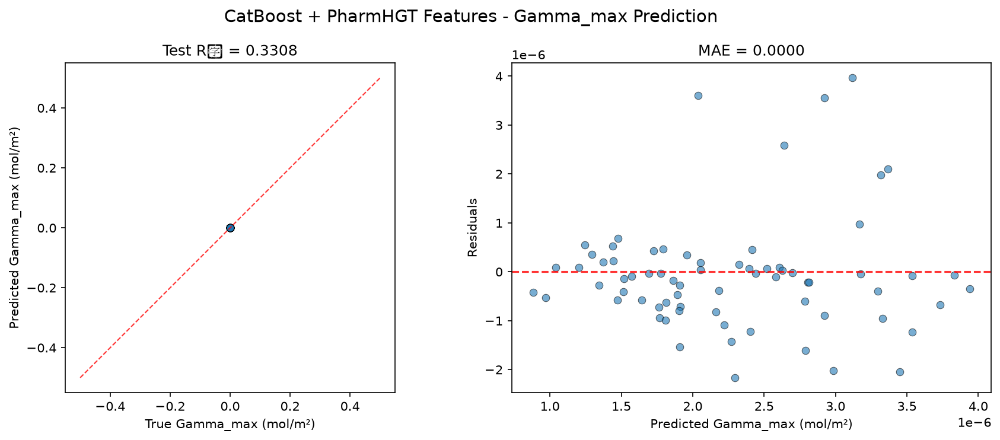
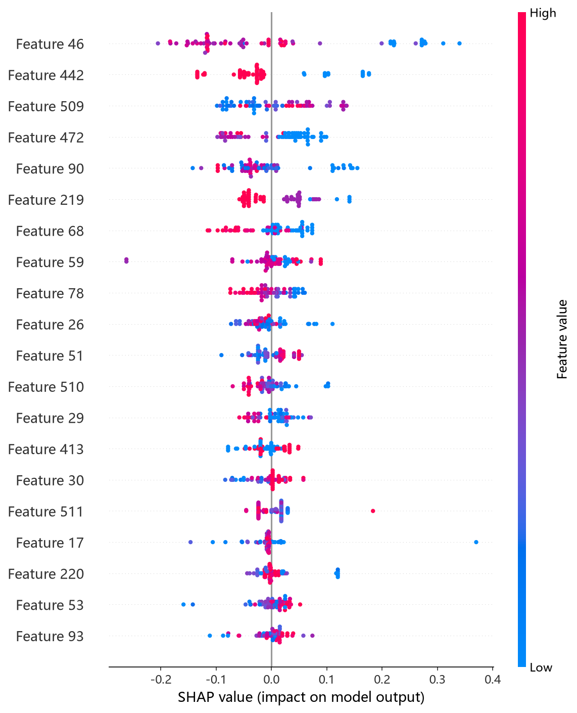
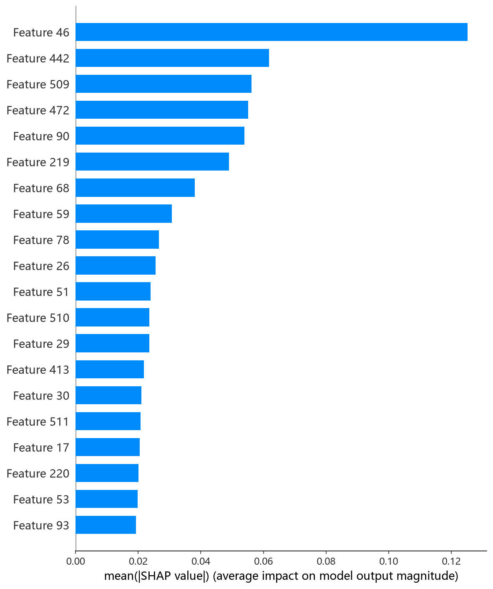

# CatBoost 模型报告 — Gamma_max 预测

## 报告信息

| 项目 | 内容 |
|------|------|
| 目标变量 | Gamma_max（最大表面超量，单位 mol/m²，量级 ~1e-6） |
| 运行目录 | `runs\Gamma_max\Gamma_max_catboost_20260805_163145` |
| 运行时间 | 16:31:45 ~ 17:15:35（约 44 分钟，含 50 轮 Optuna + 最终训练） |
| 特征类型 | PharmHGT 522 维手工特征 |
| 报告生成日期 | 2026-08-07 |

## 概述

CatBoost 是 Yandex 提出的梯度提升框架，以**对称树（oblivious trees）**、ordered boosting 与内建类别特征处理著称。本项目用 Optuna 50 轮 × 5 折 CV 对其 depth、learning_rate、iterations、l2_leaf_reg 以及 random_strength / bagging_temperature / border_count / one_hot_max_size / leaf_estimation_iterations / min_data_in_leaf 共 10 个超参进行联合调优，是调参最充分的树模型之一。

在 Gamma_max 任务中，CatBoost 的 Test R² = 0.3308，在 10 个模型中排名第 5（MLP 0.7515、CIF 0.5956、RF 0.4621、LightGBM 0.3413 之后）。R² 为正但处于中游，说明其捕获了目标的部分相关结构，但显著弱于深度模型 MLP。

## 数据与方法

- **特征**：522 维 PharmHGT 风格特征（原子聚合 220 + 键聚合 56 + 药效团 MACCS 194 + 反应活性 BRICS 34 + 表面活性剂类型 4 + 头尾比 2 + 分子描述符 12）。本次运行 `[Cache MISS]`，现场计算 628/628 有效分子并写入 `data\features\surfpro\Gamma_max\` 缓存。
- **数据规模**：训练池 628 条（**549 训练 + 79 验证**），测试集 70 条。
- **数据划分**：`train_test_split(0.125, random_state=42)`，固定随机种子。
- **训练缩放**：训练脚本对 y 乘以 `Y_SCALE = 1e6`（config.json `"y_scale": 1000000`），Optuna trial 值与最终训练评估均为缩放单位。

## 超参数与调优

**Optuna 50 轮 × 5 折 CV（TPE 采样器 + MedianPruner），最优试验（Trial 39，CV RMSE = 1.0057，缩放单位）：**

| 参数 | 值 |
|------|-----|
| depth | 10 |
| learning_rate | 0.208 |
| iterations | 676 |
| l2_leaf_reg | 4.648 |
| random_strength | 5.129 |
| bagging_temperature | 2.490 |
| border_count | 33 |
| one_hot_max_size | 43 |
| leaf_estimation_iterations | 2 |
| min_data_in_leaf | 47 |

**Optuna 参数重要度：**

| 参数 | 重要度 |
|------|--------|
| **depth** | **0.2714** |
| **min_data_in_leaf** | **0.2701** |
| l2_leaf_reg | 0.1371 |
| one_hot_max_size | 0.1250 |
| random_strength | 0.0800 |
| 其余（lr / iterations / border_count 等） | < 0.05 |

参数重要度显示 **depth 与 min_data_in_leaf 共同主导（合计 0.54）**——树深与叶节点最小样本数决定模型容量与过拟合控制，这与该任务样本量小（549）、树模型易过拟合的特点吻合。搜索从 Trial 0（1.065）逐步收敛到 Trial 39（1.006），后期多数试验落在 1.03~1.05 区间，搜索稳定收敛。

## 训练过程

- **调参阶段**：50 轮中 5 轮被 MedianPruner 剪枝；最优试验 Trial 39 的 CV RMSE = 1.0057（缩放单位）。
- **最终训练**：以 Trial 39 参数在 549 条数据上训练，**过拟合检测器在第 20 轮触发早停**（bestTest = 1.3574、bestIteration = 20，缩放单位），模型收缩为前 21 轮迭代。训练日志可见 learn RMSE 从 1.42 一路降到 0.05，而 test RMSE 始终停在 ~1.36——典型**过拟合信号**，早停将模型限制在泛化更好的前 21 轮。

> 注意：Gamma_max 下 Optuna 最优 CV（1.0057）与最终训练的验证 RMSE（bestTest = 1.3574）均为缩放单位；最终验证值高于 CV 最优，说明该参数组合在独立验证集上过拟合风险仍较明显，早停至关重要。

## 测试结果

| 指标 | 值 |
|------|-----|
| Test RMSE | 0.0000 * |
| Test MAE | 0.0000 * |
| Test R² | **0.3308** |
| 参考 CV RMSE（Optuna 最优，缩放单位） | 1.0057 |

> \* 训练脚本对 y 乘以 1e6（config 中 y_scale=1000000），评估回到原始单位后取 4 位小数，原始 RMSE/MAE 量级 ~1e-6 mol/m² 被压成 0.0000；R² 无量纲，是唯一可信指标。metrics.json 的 best_cv_rmse 跨脚本不一致（本脚本已 ÷1e6 为 0.0），因此本报告以日志中 Optuna Best-trial 值（缩放单位，约 1.0 量级）作为 CV 参考。

> 图：预测值 vs 真实值散点图与残差图见 [pred_vs_true.png](../../../runs/Gamma_max/Gamma_max_catboost_20260805_163145/pred_vs_true.png)。
>
> 

Test R² = 0.3308，说明模型解释了约三分之一的目标方差。最终验证 RMSE（1.3574，缩放单位）明显高于 Optuna CV（1.0057），印证了该模型在 Gamma_max 上的过拟合倾向——这也是其排名仅居第 5 的主要原因。

## 特征重要性（Top 20）

日志输出 Top-20 特征重要度（weight 口径），Top-5：

1. **`atom_mean_46`**（7.7）：Gasteiger 电荷落在 [-1,-0.5) 强负电分桶的原子占比均值
2. **`atom_std_4`**（6.3）：氮原子类型的分布标准差
3. **`maccs_166`**（5.8）：MACCS 结构键 bit 166
4. **`tail_ratio`**（5.3）：疏水尾链碳占比
5. **`atom_mean_26`**（5.2）：隐氢数 = 3 的原子占比均值

紧随其后：`atom_std_35`（4.0，原子质量标准差）、`atom_mean_17`（3.6，度数 = 1）、`bond_mean_0`（2.5）、`brics_2`（2.2，BRICS 片段）、`FracSP3`（2.1，饱和碳比例）。

**物理分析：** 排首的强负电原子占比（Gasteiger 分桶）与氮原子分布指向**带电/极性头基**的影响；`tail_ratio` 与 `FracSP3` 则刻画**疏水尾链长度与柔性**。最大表面超量取决于分子在界面上的堆积密度，头基带电结构决定极性取向、尾链决定疏水堆积，二者共同作用符合界面物理直觉。MACCS 结构键与 BRICS 片段作为结构基元补充了局部化学环境的识别。

SHAP 图组由 `shap_catboost.py`（TreeExplainer）生成，给出逐样本归因：

*SHAP 蜜蜂图：每个点是一个测试样本，x 轴为 SHAP 值，颜色代表特征取值高低。*

*Top-20 平均 |SHAP| 条形图：atom_mean_46、atom_std_4、tail_ratio 等与日志重要度排序大致一致。*

*Top-1 SHAP 依赖图：强负电原子占比（atom_mean_46）对预测的边际效应及其与交互特征的分布。*

## 结论与评价

**优点：**
- 调参最充分：10 个超参联合优化（50 轮 × 5 折），参数重要度分析清晰指出深度与叶节点样本数为主导。
- 特征归因完备：pred_vs_true、SHAP 蜜蜂图 / 条形图 / 依赖图齐全，可解释性好。
- 早停机制有效拦截过拟合，最终交付的是泛化更稳的早期迭代。

**不足：**
- Test R² = 0.3308 仅列第 5，与领先的 MLP（0.7515）差距大，对 Gamma_max 的预测能力有限。
- 最终训练验证 RMSE（1.3574）明显高于 Optuna CV（1.0057），说明该任务上 CatBoost 的过拟合控制仍未到位。
- 原始 RMSE/MAE 因目标量级太小而失去判别意义，只能依赖 R² 评价。

**横向定位（10 个模型中按 Test R² 降序）：**

| 排名 | 模型 | Test R² |
|------|------|---------|
| 3 | RandomForest | 0.4621 |
| 4 | LightGBM | 0.3413 |
| **5** | **CatBoost** | **0.3308** |
| 6 | NGBoost | 0.3191 |
| 7 | XGBoost | 0.2821 |

CatBoost 处于中游偏下，优于 NGBoost/XGBoost/HistGB 等其余树模型，但明显逊于 MLP 与 CIF。综合其完备的可解释性工具链，可作 Gamma_max 的特征-目标关系分析的参考模型，但在精度导向的筛选中不具竞争力。
