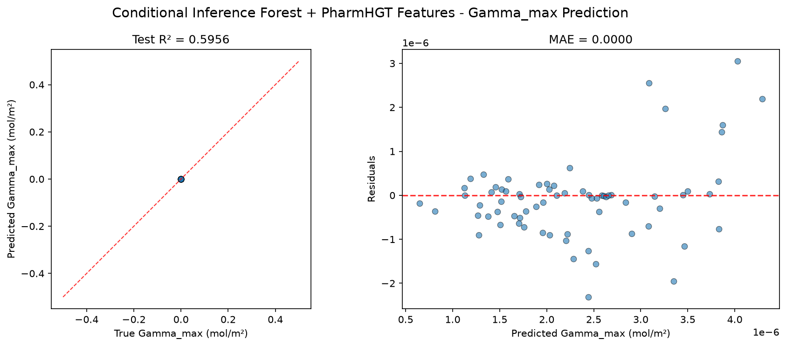
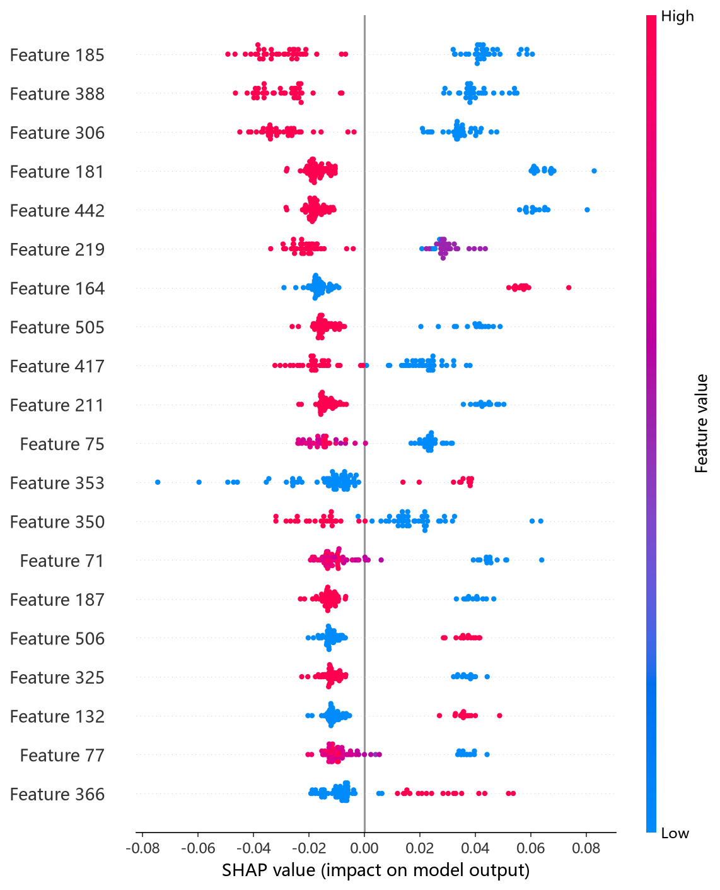
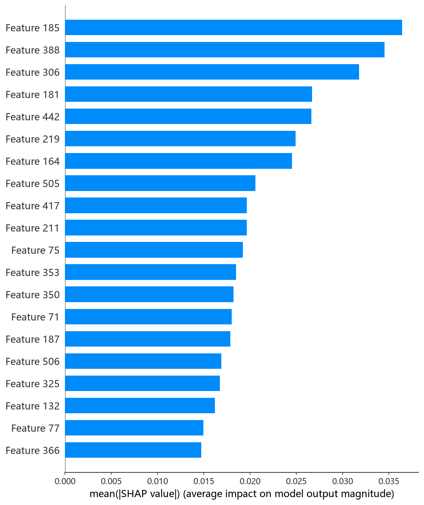

# CIF（条件推理森林 / ExtraTrees）模型报告 — Gamma_max 预测

## 报告信息

| 项目 | 内容 |
|------|------|
| 目标变量 | Gamma_max（最大表面超量，单位 mol/m²，量级 ~1e-6） |
| 运行目录 | `runs\Gamma_max\Gamma_max_cif_20260805_172005` |
| 运行时间 | 17:20:05 ~ 17:21:43（约 1.5 分钟，含 50 轮 Optuna + 最终训练） |
| 特征类型 | PharmHGT 522 维手工特征 |
| 报告生成日期 | 2026-08-07 |

## 概述

CIF（Conditional Inference Forest）在此实现中由 **ExtraTrees（极端随机树）** 承载：不同于标准随机森林在最优切分点中做选择，ExtraTrees 在每个节点**随机生成切分阈值**，从而进一步降低方差、抑制过拟合。本项目 522 维特征以连续型描述符为主，ExtraTrees 对连续特征的随机切分策略尤其高效，且训练开销极低。

在 Gamma_max 任务中，CIF 的 Test R² = 0.5956，在 10 个模型中排名**第 2**（仅次于 MLP 0.7515），是树模型中的最佳者——显著优于其姊妹模型 RandomForest（0.4621）与全部梯度提升树。

## 数据与方法

- **特征**：522 维 PharmHGT 风格特征，从缓存加载（`[Cache HIT]`），与其余 9 个模型完全一致，保证公平对比。
- **数据规模**：训练池 628 条（**549 训练 + 79 验证**），测试集 70 条。
- **数据划分**：`train_test_split(0.125, random_state=42)`，固定随机种子。
- **训练缩放**：训练脚本对 y 乘以 `Y_SCALE = 1e6`（config.json `"y_scale": 1000000`），Optuna trial 值与最终训练评估均为缩放单位。

## 超参数与调优

采用 **Optuna 50 轮 × 5 折交叉验证**（TPE 采样器 + MedianPruner）。

**最优试验（Trial 48，CV RMSE = 1.0325，缩放单位）：**

| 参数 | 值 |
|------|-----|
| n_estimators | 1827 |
| max_depth | 21 |
| min_samples_split | 7 |
| min_samples_leaf | 1 |
| max_features | **log2** |
| bootstrap | **False** |

**调优过程观察：**
- 前几轮表现较差（CV RMSE 1.24~1.40），原因是搜索初期偏向 `bootstrap=True` + `max_features='sqrt'` 的组合；随后快速收敛到 `bootstrap=False` + `max_features='log2'` 区域，Trial 12 起进入 1.04~1.06，**Trial 48 触底至 1.0325**。
- 与 RandomForest 同搜索空间、同最优参数组合，但 CIF 的随机切分策略在 Gamma_max 上带来明显增益（Test R² 0.5956 vs 0.4621）——**随机阈值对连续特征的探索更充分**。
- `bootstrap=False`（全样本训练）+ `log2` 特征子空间在 549 条小样本上兼顾了树间差异与样本利用效率。
- 50 轮中 5 轮被 MedianPruner 剪枝，单轮 5 折 CV 平均约 1.5 秒，全程仅约 1.5 分钟，**调参效率极高**。

## 训练过程

由于 ExtraTrees 是**非迭代式**集成（一次性训练全部树、取平均），日志中无逐轮 loss 曲线，`Training Final Model` 阶段直接输出结果。这意味着：
- 无过拟合检测器、无早停需求，超参确定后即一次成型；
- 训练时间几乎全部来自 Optuna 搜索阶段，最终模型训练仅数秒。

## 测试结果

| 指标 | 值 |
|------|-----|
| Test RMSE | 0.0000 * |
| Test MAE | 0.0000 * |
| Test R² | **0.5956** |
| 参考 CV RMSE（Optuna 最优，缩放单位） | 1.0325 |

> \* 训练脚本对 y 乘以 1e6（config 中 y_scale=1000000），评估回到原始单位后取 4 位小数，原始 RMSE/MAE 量级 ~1e-6 mol/m² 被压成 0.0000；R² 无量纲，是唯一可信指标。metrics.json 的 best_cv_rmse 跨脚本不一致（cif/histgb/ngboost/rf 等仍为缩放单位，本脚本为 1.0325），因此本报告以日志中 Optuna Best-trial 值（缩放单位，约 1.0 量级）作为 CV 参考。

> 图：预测值 vs 真实值散点图与残差图见 [pred_vs_true.png](../../../runs/Gamma_max/Gamma_max_cif_20260805_172005/pred_vs_true.png)。
>
> 

Test R² = 0.5956，解释了目标方差的约 60%，为树模型之最。随机切分 + 全样本训练的组合在本 target 上抑制了过拟合（对比梯度提升树普遍存在的验证/测试差距），是树模型路线在 Gamma_max 上的最优答案。

## 特征重要性（Top 20）

日志输出 Top-20 特征重要度（杂质减少口径），数值全部显示为 0.0（对缩放后 y 的杂质减少量级极小被四舍五入，属于**展示问题**，排序仍可信）。Top-5：

1. **`AroRings`**：芳香环数
2. **`atom_max_20`**：度数 = 4（季碳/高支化）原子占比最大值
3. **`NumRings`**：环总数
4. **`brics_10`**：BRICS 碎片 bucket 10
5. **`maccs_112`**：MACCS 结构键 bit 112

紧随其后：`maccs_77`、`maccs_30`、`maccs_166`、`atom_max_16`（度数 = 0）、`atom_mean_54`（重原子邻居）、`maccs_83`、`atom_std_16`、`atom_min_54`、`atom_mean_40`（显价 = 3）、`atom_max_54`、`maccs_96`、`atom_std_44`（5 元环）、`atom_std_22`（形式电荷）等。

**物理分析：** CIF 的重要性画像以**芳香/环结构**（`AroRings`、`NumRings`、多个 MACCS 结构键）与**高支化碳**（`atom_max_20`）为核心，与 HistGB 的"芳香性主导"结论相互印证。芳香环赋予分子平面刚性结构，影响其在气液界面的平铺堆积与最大表面超量；BRICS 片段（`brics_10`）与 MACCS 键补充了局部结构基元。整体指向"**刚性环状疏水骨架决定界面堆积**"的物理机制。

SHAP 图组由 `shap_cif.py`（TreeExplainer）生成：

*SHAP 蜜蜂图：每个点是一个测试样本，x 轴为 SHAP 值，颜色代表特征取值高低。*

*Top-20 平均 |SHAP| 条形图：AroRings、atom_max_20、NumRings 等位居前列，与日志重要度一致。*

*Top-1 SHAP 依赖图：度数 = 4（高支化）原子占比最大值（atom_max_20）对预测的边际效应及其与交互特征的分布。*

## 结论与评价

**优点：**
- **树模型最优**：Test R² = 0.5956 排名第 2，仅次于 MLP（0.7515），显著优于姊妹模型 RF（0.4621）。
- 方差控制出色：随机切分阈值 + `bootstrap=False` + 全样本训练，在小样本高维特征上过拟合最轻。
- 调参成本极低（约 1.5 分钟），特征归因完备（pred_vs_true + SHAP 图组），"芳香/环结构主导"的物理结论清晰。

**不足：**
- 精度仍明显低于 MLP（0.7515），深度模型在本 target 上反超树模型。
- 日志重要度数值显示异常（全 0.0），精确归因需依赖 SHAP 补充。
- 原始 RMSE/MAE 因目标量级太小失去判别意义，只能依赖 R² 评价。

**横向定位（10 个模型中按 Test R² 降序）：**

| 排名 | 模型 | Test R² |
|------|------|---------|
| 1 | MLP | 0.7515 |
| **2** | **CIF (ExtraTrees)** | **0.5956** |
| 3 | RandomForest | 0.4621 |
| 4 | LightGBM | 0.3413 |

CIF 是 Gamma_max 上**树模型的最优选择**，以极低成本取得稳健的次优精度。若实际场景要求可解释、低延迟且拒绝黑盒，CIF 是最佳树模型候选；若追求极致精度，则应选用 MLP。
