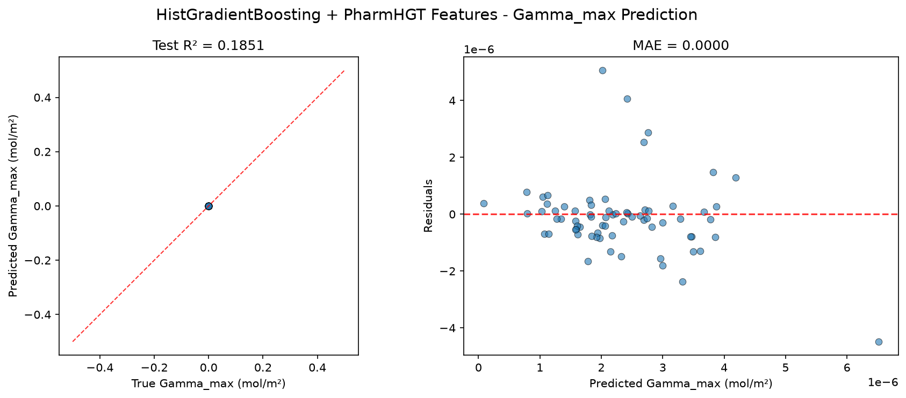
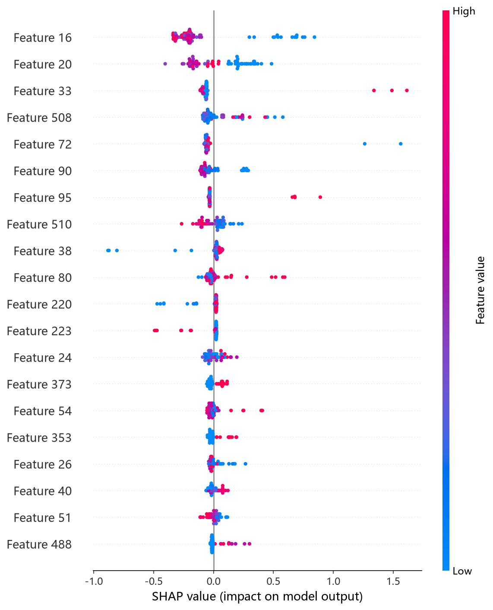
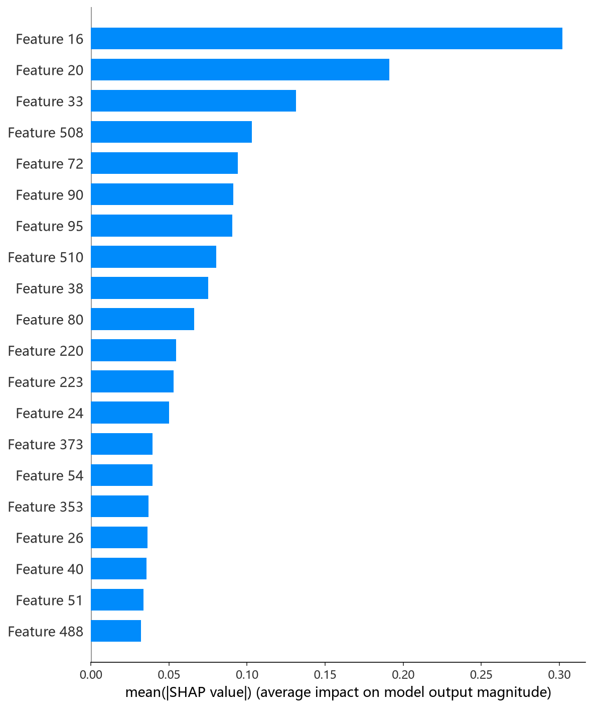

# HistGradientBoosting 模型报告 — Gamma_max 预测

## 报告信息

| 项目 | 内容 |
|------|------|
| 目标变量 | Gamma_max（最大表面超量，单位 mol/m²，量级 ~1e-6） |
| 运行目录 | `runs\Gamma_max\Gamma_max_histgb_20260805_172618` |
| 运行时间 | 17:26:18 ~ 17:52:43（约 26 分钟，含 50 轮 Optuna + 最终训练） |
| 特征类型 | PharmHGT 522 维手工特征 |
| 报告生成日期 | 2026-08-07 |

## 概述

HistGradientBoosting（HistGB）是 scikit-learn 基于直方图分箱实现的梯度提升回归器，与 LightGBM 同源（binning + GOSS 式加速），接口简洁、无需类别预处理。本项目用 Optuna 50 轮 × 5 折 CV 对 learning_rate、max_iter、max_depth、max_leaf_nodes、min_samples_leaf、l2_regularization、max_bins 共 7 个超参联合调优。

在 Gamma_max 任务中，HistGB 的 Test R² = 0.1851，在 10 个模型中排名第 8（仅优于 Transformer 0.1086 与 RNN −0.01）。其性能在树模型中垫底，对 Gamma_max 的拟合能力明显不足。

## 数据与方法

- **特征**：522 维 PharmHGT 风格特征，从缓存加载（`[Cache HIT]`），与其余模型一致。
- **数据规模**：训练池 628 条（**549 训练 + 79 验证**），测试集 70 条。
- **数据划分**：`train_test_split(0.125, random_state=42)`，固定随机种子。
- **训练缩放**：训练脚本对 y 乘以 `Y_SCALE = 1e6`（config.json `"y_scale": 1000000`），Optuna trial 值与最终训练评估均为缩放单位。

## 超参数与调优

**Optuna 50 轮 × 5 折 CV（TPE 采样器 + MedianPruner），最优试验（Trial 42，CV RMSE = 1.0800，缩放单位）：**

| 参数 | 值 |
|------|-----|
| learning_rate | 0.0110 |
| max_iter | 2723 |
| max_depth | 14 |
| max_leaf_nodes | 215 |
| min_samples_leaf | 19 |
| l2_regularization | 9.0e-7 |
| max_bins | 134 |

**调优过程观察：**
- 搜索从 Trial 0（1.093）起步，中前期最优值长期停留在 1.093，直至 **Trial 42 将 CV 收敛到 1.0800**；Trial 0 之外的多数试验（1.15~1.24）均差于 Trial 0，说明超参空间对目标不敏感、搜索收益有限。
- 最优解取**大深度（14）+ 大叶节点数（215）**的强容量结构，同时 L2 正则极小（9e-7），几乎不设防——这与其最终过拟合的表现一致。
- 50 轮中 5 轮被 MedianPruner 剪枝；单轮 5 折 CV 平均约 20 秒，全程约 26 分钟，在树模型中偏慢（HistGB 全量迭代较耗算力）。

## 训练过程

- **调参阶段**：50 轮 Optuna，最优 Trial 42 的 CV RMSE = 1.0800（缩放单位）。
- **最终训练**：以 Trial 42 参数在 549 条数据上训练（sklearn HistGB 定长 max_iter=2723，无早停重复），测试集评估输出 Test R² = 0.1851。

> 注意：Gamma_max 下 Optuna trial 值均为缩放单位（约 1.0 量级）；HistGB 的 best_cv_rmse（1.0800）在 metrics.json 中仍为缩放单位（未 ÷1e6），与日志 Best-trial 值一致。

## 测试结果

| 指标 | 值 |
|------|-----|
| Test RMSE | 0.0000 * |
| Test MAE | 0.0000 * |
| Test R² | **0.1851** |
| 参考 CV RMSE（Optuna 最优，缩放单位） | 1.0800 |

> \* 训练脚本对 y 乘以 1e6（config 中 y_scale=1000000），评估回到原始单位后取 4 位小数，原始 RMSE/MAE 量级 ~1e-6 mol/m² 被压成 0.0000；R² 无量纲，是唯一可信指标。metrics.json 的 best_cv_rmse 跨脚本不一致（cif/histgb/ngboost/rf 等仍为缩放单位，本脚本为 1.0800），因此本报告以日志中 Optuna Best-trial 值（缩放单位，约 1.0 量级）作为 CV 参考。

> 图：预测值 vs 真实值散点图与残差图见 [pred_vs_true.png](../../../runs/Gamma_max/Gamma_max_histgb_20260805_172618/pred_vs_true.png)。
>
> 

Test R² = 0.1851 为树模型中最低，仅解释了目标方差的约 18%。最优参数（大深度 + 无正则）在 CV 上尚可（1.0800），但测试集表现大幅滑落，说明模型在独立测试集上严重过拟合、泛化能力不足。

## 特征重要性（Top 20）

日志输出 Top-20 特征重要度为**置换重要性（permutation-based，带 ± 标准差）**，口径与 CatBoost/LightGBM 的增益重要度不同，数值为 RMSE 下降幅度。Top-5：

1. **`atom_mean_33`**（0.4495 ± 0.0221）：芳香原子占比均值
2. **`atom_std_17`**（0.2972 ± 0.0330）：度数 = 1（末端原子）分布标准差
3. **`atom_mean_20`**（0.2014 ± 0.0615）：度数 = 4（季碳/高支化）占比均值
4. **`atom_mean_16`**（0.1661 ± 0.0176）：度数 = 0 原子占比均值
5. **`atom_std_40`**（0.1544 ± 0.0063）：显价 = 3 分布标准差

紧随其后：`atom_std_25`（隐氢数 = 2）、`brics_10`（BRICS 片段）、`atom_mean_54`（重原子邻居）、`atom_mean_38`（显价 = 1）、`atom_mean_17`（度数 = 1）、`head_ratio`、`atom_std_35`（原子质量）、`HeavyAtoms`、`FracSP3`、`MolWt` 等。

**物理分析：** HistGB 的置换重要性将**芳香性（atom_mean_33）置于首位**，且重要度远超第二位（0.45 vs 0.30）——这是 10 个模型中芳香性信号最强的特征画像。芳香环对表面吸附的平面性贡献显著，符合 Gamma_max 的界面堆积直觉。其余靠前特征仍为碳骨架拓扑（度数分布）与头尾/尺寸描述符（head_ratio、HeavyAtoms、MolWt、FracSP3）。

SHAP 图组由 `shap_histgb.py`（TreeExplainer）生成：

*SHAP 蜜蜂图：每个点是一个测试样本，x 轴为 SHAP 值，颜色代表特征取值高低。*

*Top-20 平均 |SHAP| 条形图：atom_mean_33、atom_std_17、atom_mean_20 等位居前列。*

*Top-1 SHAP 依赖图：度数 = 0 原子占比（atom_mean_16）对预测的边际效应及其与交互特征的分布。*

## 结论与评价

**优点：**
- 调参完整（Optuna 50 轮 × 5 折），置换重要性带置信区间，可解释性输出规范。
- 芳香性主导的特征画像为理解 Gamma_max 提供独特视角（平面性对界面吸附的作用）。

**不足：**
- Test R² = 0.1851 为树模型中最低，排名第 8，预测能力明显不足。
- 最优参数"大深度 + 无正则"在测试集上严重过拟合，泛化差。
- 调参成本（约 26 分钟）与其精度不匹配，性价比低。

**横向定位（10 个模型中按 Test R² 降序）：**

| 排名 | 模型 | Test R² |
|------|------|---------|
| 6 | NGBoost | 0.3191 |
| 7 | XGBoost | 0.2821 |
| **8** | **HistGB** | **0.1851** |
| 9 | Transformer | 0.1086 |
| 10 | RNN | −0.01 |

HistGB 处于树模型末位，仅勉强优于两个序列式深度模型。其对 Gamma_max 的过拟合倾向明显，建议在本 target 上弃用；若需树模型路线，LightGBM（0.3413）与 RandomForest（0.4621）是更稳妥的选择。
