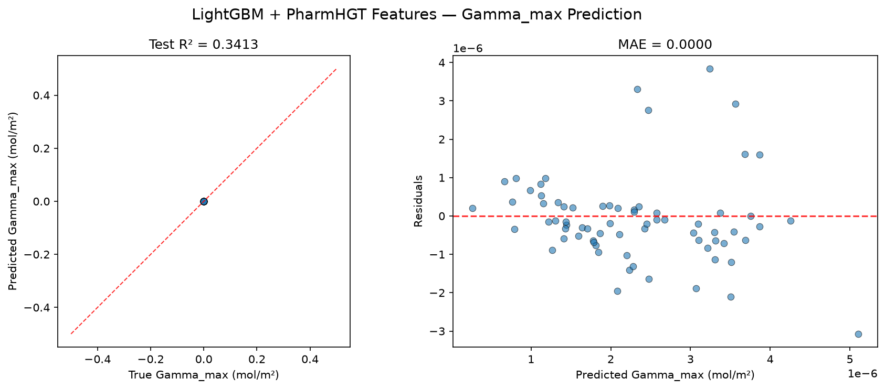
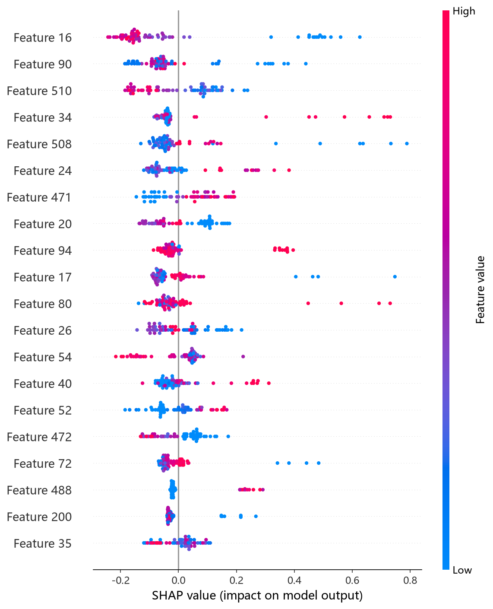
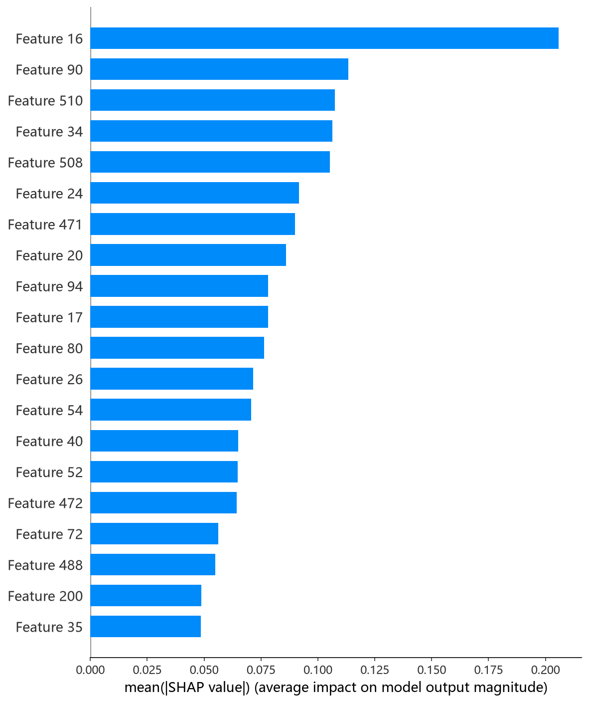

# LightGBM 模型报告 — Gamma_max 预测

## 报告信息

| 项目 | 内容 |
|------|------|
| 目标变量 | Gamma_max（最大表面超量，单位 mol/m²，量级 ~1e-6） |
| 运行目录 | `runs\Gamma_max\Gamma_max_lightgbm_20260805_180756` |
| 运行时间 | 18:07:56 ~ 18:09:09（约 1.5 分钟，含 50 轮 Optuna + 最终训练） |
| 特征类型 | PharmHGT 522 维手工特征 |
| 报告生成日期 | 2026-08-07 |

## 概述

LightGBM 是微软提出的梯度提升框架，以**直方图（Histogram）分箱**、**单边梯度采样（GOSS）**与**互斥特征捆绑（EFB）**著称，训练速度在树模型中居首。本项目用 Optuna 50 轮 × 5 折 CV 对 boosting_type、max_depth、num_leaves、learning_rate、正则参数及 dart 专属参数等 16 个超参联合调优。

在 Gamma_max 任务中，LightGBM 的 Test R² = 0.3413，在 10 个模型中排名第 4（MLP、CIF、RF 之后），是传统树模型中的较优者之一，但显著弱于深度模型 MLP（0.7515）。

## 数据与方法

- **特征**：522 维 PharmHGT 风格特征，从缓存加载（`[Cache HIT]`），与其余模型一致。
- **数据规模**：训练池 628 条（**549 训练 + 79 验证**），测试集 70 条。
- **数据划分**：`train_test_split(0.125, random_state=42)`，固定随机种子。
- **训练缩放**：训练脚本对 y 乘以 `Y_SCALE = 1e6`（config.json `"y_scale": 1000000`），Optuna trial 值与最终训练评估均为缩放单位。

## 超参数与调优

**Optuna 50 轮 × 5 折 CV（TPE 采样器 + MedianPruner），最优试验（Trial 41，CV RMSE = 1.0865，缩放单位）：**

| 参数 | 值 |
|------|-----|
| boosting_type | **gbdt** |
| max_depth | 8 |
| num_leaves | 126 |
| learning_rate | 0.0945 |
| n_estimators | 2736 |
| subsample / subsample_freq | 0.772 / 1 |
| colsample_bytree | 0.981 |
| reg_alpha / reg_lambda | 3.3e-4 / 2.9e-5 |
| min_child_samples / min_child_weight | 25 / 0.024 |
| min_split_gain | 0.048 |

**调优过程观察：**
- 搜索从 Trial 0（2.010）快速收敛：Trial 1（1.415）→ Trial 16（1.096）→ **Trial 41（1.0865）**，中后期多数试验稳定在 1.10~1.13，收敛充分。
- 最优解选择 **gbdt**（而非 dart），且 `num_leaves=126`、`max_depth=8` 构成中等容量的树结构；正则项整体取值温和，说明 522 维特征上 LightGBM 的过拟合压力小于 CatBoost。
- 每折均早停（30 轮耐心），单轮 5 折 CV 秒级完成，全程约 1.5 分钟——10 个模型中调参成本最低之一。

## 训练过程

- **调参阶段**：50 轮 Optuna，最优 Trial 41 的 CV RMSE = 1.0865（缩放单位）。
- **最终训练**：以 Trial 41 参数在 549 条数据上训练，**早停触发于第 158 轮迭代**（验证 RMSE = 1.4654，缩放单位），耐心值 50 轮。早停使模型以验证最优迭代交付，未出现明显过拟合蔓延。

> 注意：Gamma_max 下 Optuna trial 值均为缩放单位（约 1.0 量级）；最终训练验证 RMSE（1.4654）高于 CV 最优（1.0865），为独立验证集上的通常表现。

## 测试结果

| 指标 | 值 |
|------|-----|
| Test RMSE | 0.0000 * |
| Test MAE | 0.0000 * |
| Test R² | **0.3413** |
| 参考 CV RMSE（Optuna 最优，缩放单位） | 1.0865 |

> \* 训练脚本对 y 乘以 1e6（config 中 y_scale=1000000），评估回到原始单位后取 4 位小数，原始 RMSE/MAE 量级 ~1e-6 mol/m² 被压成 0.0000；R² 无量纲，是唯一可信指标。metrics.json 的 best_cv_rmse 跨脚本不一致（本脚本已 ÷1e6 为 0.0），因此本报告以日志中 Optuna Best-trial 值（缩放单位，约 1.0 量级）作为 CV 参考。

> 图：预测值 vs 真实值散点图与残差图见 [pred_vs_true.png](../../../runs/Gamma_max/Gamma_max_lightgbm_20260805_180756/pred_vs_true.png)。
>
> 

Test R² = 0.3413，在树模型中排名靠前。结合 LogP/TPSA/MolWt 等高重要性描述符（见下节），LightGBM 主要依靠全局物化性质刻画目标，对中值区分子预测相对可靠。

## 特征重要性（Top 20）

日志输出 Top-20 特征重要度（split 口径），Top-5：

1. **`atom_std_25`**（92.0）：隐氢数 = 2 的分布标准差
2. **`head_ratio`**（82.0）：头基原子数 / 总原子数
3. **`atom_mean_35`**（69.0）：原子质量 / 100 的均值
4. **`LogP`**（55.0）：脂水分配系数
5. **`atom_mean_17`**（53.0）：度数 = 1（末端原子）占比均值

紧随其后：`MolWt`（50.0）、`tail_ratio`（48.0）、`atom_mean_26`（43.0）、`atom_std_35`（41.0）、`atom_std_39`（显价 = 2）、`atom_mean_40`（显价 = 3）、`TPSA`、`atom_mean_54`（重原子邻居）、`RotBonds` 等。

**物理分析：** 与 CatBoost 侧重原子聚合特征不同，LightGBM 的 Top-20 中**全局分子描述符密集出现**——`LogP`、`TPSA`、`MolWt`、`RotBonds` 同时进入前 20，配合 `head_ratio`（82.0）与 `tail_ratio`（48.0），形成"**疏水尾链 + 极性头基 + 分子尺寸/柔性**"的完整物化画像。这符合最大表面超量的界面物理：头尾结构决定取向，分子尺寸与柔性决定界面堆积效率。`atom_std_25`（隐氢数分布异质性）居首则反映碳骨架的氢化状态差异。

SHAP 图组由 `shap_lightgbm.py`（TreeExplainer）生成：

*SHAP 蜜蜂图：每个点是一个测试样本，x 轴为 SHAP 值，颜色代表特征取值高低。*

*Top-20 平均 |SHAP| 条形图：atom_std_25、head_ratio、LogP 等位列前茅，与日志重要度基本一致。*

*Top-1 SHAP 依赖图：度数 = 0 原子占比（atom_mean_16）对预测的边际效应及其与交互特征的分布。*

## 结论与评价

**优点：**
- 树模型中排名第 4（R² = 0.3413），优于 CatBoost/NGBoost/XGBoost/HistGB 等多数树模型。
- 调参成本极低（约 1.5 分钟），gbdt + 中等容量树结构在 522 维特征上表现稳健。
- 特征归因完备（pred_vs_true + 完整 SHAP 图组），且重要性信号物理含义清晰。

**不足：**
- Test R² = 0.3413 与领先的 MLP（0.7515）差距明显，对 Gamma_max 的预测能力有限。
- 最终验证 RMSE（1.4654）明显高于 Optuna CV（1.0865），过拟合压力在独立验证集上显现。
- 原始 RMSE/MAE 因目标量级太小失去判别意义，只能依赖 R² 评价。

**横向定位（10 个模型中按 Test R² 降序）：**

| 排名 | 模型 | Test R² |
|------|------|---------|
| 2 | CIF (ExtraTrees) | 0.5956 |
| 3 | RandomForest | 0.4621 |
| **4** | **LightGBM** | **0.3413** |
| 5 | CatBoost | 0.3308 |
| 6 | NGBoost | 0.3191 |

LightGBM 以极低调参成本换取树模型中靠前的精度，性价比突出；其依赖全局物化描述符的特征画像也为理解 Gamma_max 的物理驱动因素提供了有价值的视角。若需更高精度，应转向 MLP。
