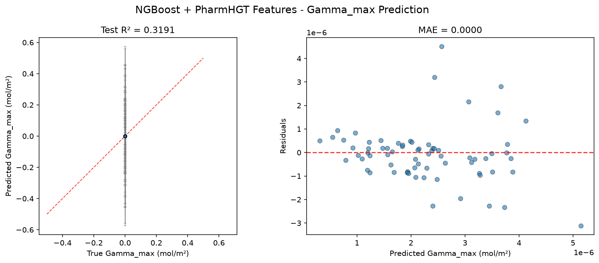
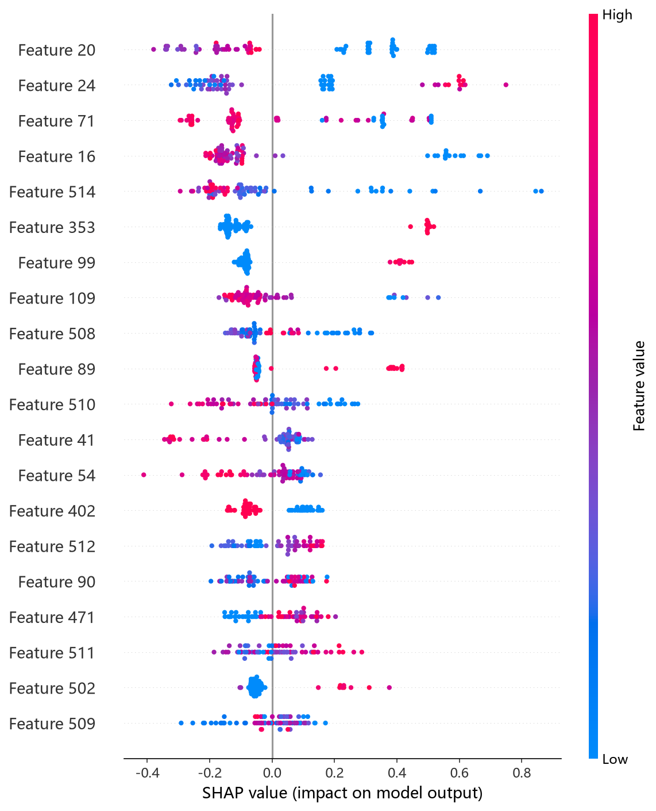
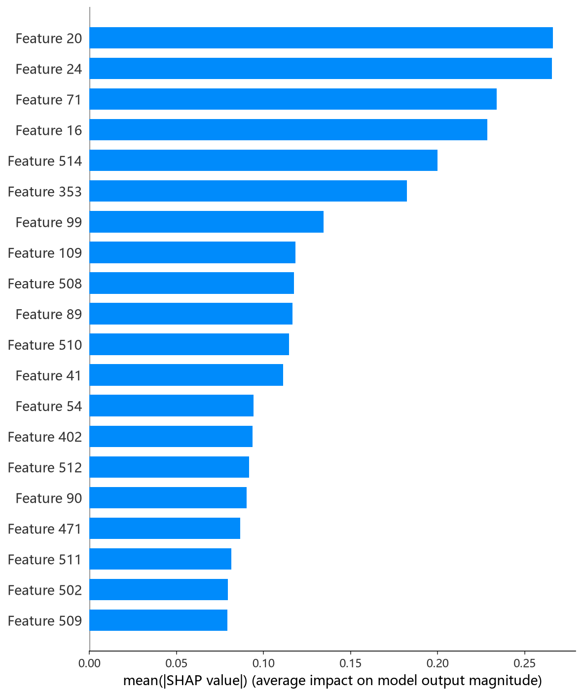

# NGBoost 模型报告 — Gamma_max 预测

## 报告信息

| 项目 | 内容 |
|------|------|
| 目标变量 | Gamma_max（最大表面超量，单位 mol/m²，量级 ~1e-6） |
| 运行目录 | `runs\Gamma_max\Gamma_max_ngboost_20260805_192211` |
| 运行时间 | 19:22:11 ~ 20:15:48（约 54 分钟，含 50 轮 Optuna + 最终训练） |
| 特征类型 | PharmHGT 522 维手工特征 |
| 报告生成日期 | 2026-08-07 |

## 概述

NGBoost（Natural Gradient Boosting）是概率性梯度提升框架：以**自然梯度**优化概率分布的参数（本项目为 Normal 分布，同时预测 **mean 与 std 两个输出**），从而在给出点预测的同时提供**不确定性估计**——这是其区别于其他 9 个模型的独特能力。本项目对 5 个新 target 的 NGBoost 采用 Optuna 调参（50 轮 × 5 折 CV，score_rule 在 LogScore/CRPScore 间选择）。

在 Gamma_max 任务中，NGBoost 的 Test R² = 0.3191，在 10 个模型中排名第 6（MLP、CIF、RF、LightGBM、CatBoost 之后），处于中游。相比其在 pCMC 任务中第 2 名的表现，本 target 上优势不再。

## 数据与方法

- **特征**：522 维 PharmHGT 风格特征，从缓存加载（`[Cache HIT]`），与其余模型一致。
- **数据规模**：训练池 628 条（**549 训练 + 79 验证**），测试集 70 条。
- **数据划分**：`train_test_split(0.125, random_state=42)`，固定随机种子。
- **训练缩放**：训练脚本对 y 乘以 `Y_SCALE = 1e6`（config.json `"y_scale": 1000000`），Optuna trial 值与最终训练评估均为缩放单位。
- **概率输出**：Normal 分布，测试集平均预测标准差 Avg pred std = 0.2084（缩放单位）。

## 超参数与调优

**Optuna 50 轮 × 5 折 CV（TPE 采样器 + MedianPruner），最优试验（Trial 18，CV RMSE = 1.1241，缩放单位）：**

| 参数 | 值 |
|------|-----|
| n_estimators | 749 |
| learning_rate | 0.4226 |
| minibatch_frac | 0.758 |
| max_depth | 4 |
| min_samples_leaf | 57 |
| score_rule | **LogScore** |

**调优过程观察：**
- Trial 0（1.139）即成为较长一段时间的基线，多数试验（1.14~1.39）无法超越；**Trial 18 收敛到 1.1241** 后保持至调参结束，搜索稳定。
- 最优解偏好 **LogScore + 相对深（max_depth=4）的树 + 大 min_samples_leaf=57**——叶节点样本数大提供正则，与 NGBoost 双输出（mean+var）对树形稳定的要求一致。
- CRPScore 的试验整体劣于 LogScore（1.30+），说明本任务中 CRPS 评分规则收益不明显。
- 50 轮中 5 轮被剪枝；单轮 5 折 CV 平均约 1 分钟，全程约 54 分钟，为树模型中调参最慢者（NGBoost 需对每个分布参数建基学习器）。

## 训练过程

- **调参阶段**：50 轮 Optuna，最优 Trial 18 的 CV RMSE = 1.1241（缩放单位）。
- **最终训练**：以 Trial 18 参数在 549 条数据上训练，训练 loss（负对数似然）从 iter 0 的 1.78 持续下降至 iter 700 的 −0.39（对数似然上升），**700+ 轮完整收敛无早停**；最终以 Normal 分布（mean ± std）交付，测试集平均预测标准差 0.2084（缩放单位）。

> 注意：Gamma_max 下 Optuna trial 值均为缩放单位（约 1.0 量级）；NGBoost 的 best_cv_rmse（1.1241）在 metrics.json 中仍为缩放单位（未 ÷1e6），与日志 Best-trial 值一致。

## 测试结果

| 指标 | 值 |
|------|-----|
| Test RMSE | 0.0000 * |
| Test MAE | 0.0000 * |
| Test R² | **0.3191** |
| 参考 CV RMSE（Optuna 最优，缩放单位） | 1.1241 |
| 平均预测标准差（缩放单位） | 0.2084 |

> \* 训练脚本对 y 乘以 1e6（config 中 y_scale=1000000），评估回到原始单位后取 4 位小数，原始 RMSE/MAE 量级 ~1e-6 mol/m² 被压成 0.0000；R² 无量纲，是唯一可信指标。metrics.json 的 best_cv_rmse 跨脚本不一致（cif/histgb/ngboost/rf 等仍为缩放单位，本脚本为 1.1241），因此本报告以日志中 Optuna Best-trial 值（缩放单位，约 1.0 量级）作为 CV 参考。

> 图：预测值 vs 真实值散点图与残差图见 [pred_vs_true.png](../../../runs/Gamma_max/Gamma_max_ngboost_20260805_192211/pred_vs_true.png)。
>
> 

Test R² = 0.3191，解释了目标方差的约 32%，排名第 6。平均预测标准差（0.2084）相对目标的缩放尺度（均值附近 ~1.0）较小，说明其不确定性估计较为自信；但点预测精度仅为中游，远逊于 MLP。

## 特征重要性

NGBoost 的 `feature_importances_` 因双输出（mean + var）形状为 (2, 522)，日志打印时被跳过（`unexpected shape (2, 522), skipping`），未输出 Top-20 列表。特征归因以 `shap_ngboost.py` 的 SHAP 分析（KernelExplainer）为准，依 SHAP 依赖图文件名可归纳 **SHAP 排名 Top-5**：

1. **`atom_mean_20`**：度数 = 4（季碳/高支化）原子占比均值
2. **`atom_mean_24`**：隐氢数 = 1 原子占比均值
3. **`atom_std_16`**：度数 = 0 原子分布标准差
4. **`atom_mean_16`**：度数 = 0 原子占比均值
5. **`HBA`**：氢键受体数 / n_atoms

**物理分析：** NGBoost 的归因集中于**碳骨架拓扑（度数分布）**，同时引入唯一的极性特征 **HBA**——亲水头基的氢键受体能力。这与"疏水尾链拓扑决定堆积 + 头基极性决定取向"的界面物理直觉吻合：最大表面超量同时受尾链支化/长度与头基氢键位点影响。注意其归因范围较窄（主要依赖原子聚合与 HBA），未见芳香性/尺寸描述符，可能是其精度受限的原因之一。

SHAP 图组（由 `shap_ngboost.py` 生成，KernelExplainer）：

*SHAP 蜜蜂图：每个点是一个测试样本，x 轴为 SHAP 值，颜色代表特征取值高低。*

*Top-20 平均 |SHAP| 条形图：atom_mean_20、atom_mean_24、HBA 等位居前列。*

*Top-1 SHAP 依赖图：度数 = 4（高支化）原子占比（atom_mean_20）对预测的边际效应及其与交互特征的分布。*

## 结论与评价

**优点：**
- **唯一提供不确定性估计的模型**：输出 Normal 分布（mean ± std），Avg pred std = 0.2084，可用于可靠区间与风险规避场景。
- 本次采用 Optuna 充分调参（score_rule、树结构、学习率等），参数选择有依据。
- 双输出梯度提升机制天然适合"均值 + 不确定度"联合建模。

**不足：**
- Test R² = 0.3191 排名第 6，明显低于其姊妹树模型 CIF（0.5956）与 RF（0.4621），更远逊于 MLP（0.7515）。
- 调参成本高（约 54 分钟），为树模型中最慢；特征归因范围窄，未见芳香性/尺寸等维度。
- 原始 RMSE/MAE 因目标量级太小失去判别意义，只能依赖 R² 评价。

**横向定位（10 个模型中按 Test R² 降序）：**

| 排名 | 模型 | Test R² |
|------|------|---------|
| 4 | LightGBM | 0.3413 |
| 5 | CatBoost | 0.3308 |
| **6** | **NGBoost** | **0.3191** |
| 7 | XGBoost | 0.2821 |
| 8 | HistGB | 0.1851 |

NGBoost 处于中游。其点预测精度不占优，但在需要**不确定性量化**（如筛选时对置信度低的分子的二次确认）的场景下，其 Normal 双输出是独特价值；若仅追求精度，应选择 MLP 或 CIF。
