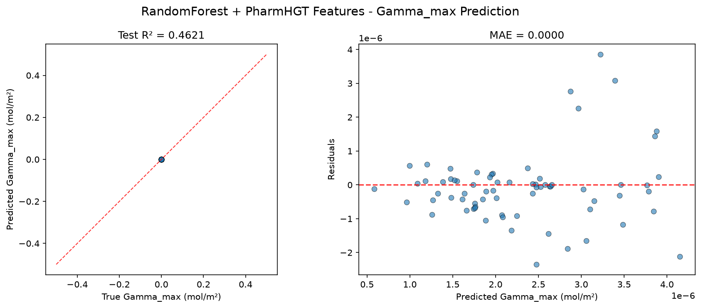
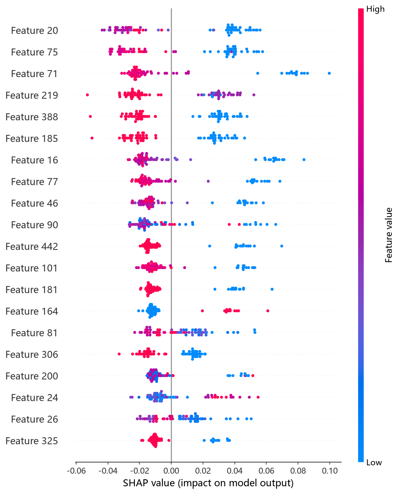
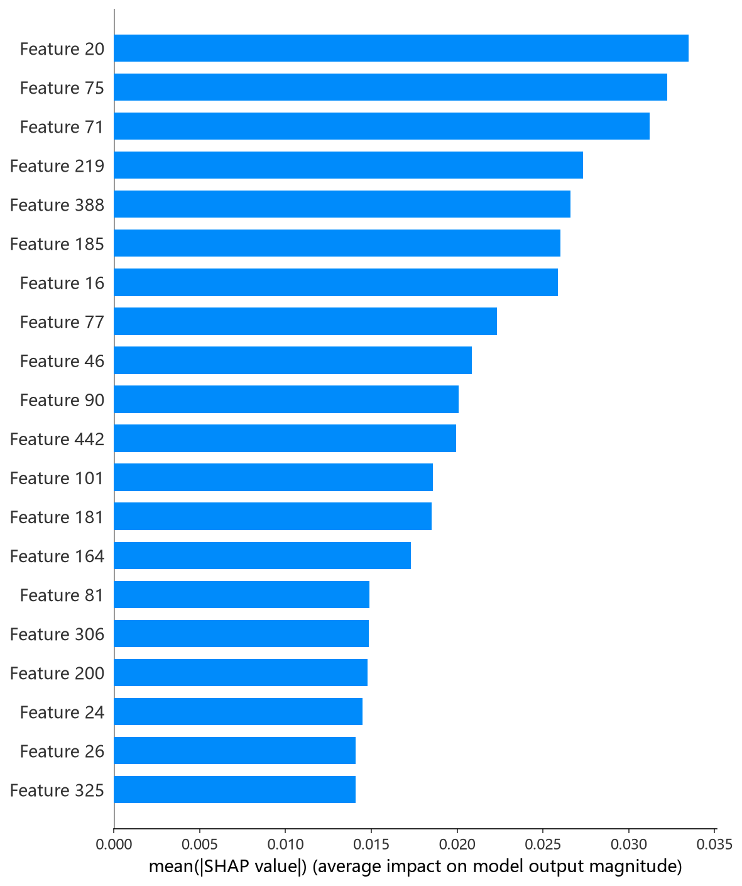

# RandomForest 模型报告 — Gamma_max 预测

## 报告信息

| 项目 | 内容 |
|------|------|
| 目标变量 | Gamma_max（最大表面超量，单位 mol/m²，量级 ~1e-6） |
| 运行目录 | `runs\Gamma_max\Gamma_max_rf_20260805_201928` |
| 运行时间 | 20:19:28 ~ 20:21:16（约 2 分钟，含 50 轮 Optuna + 最终训练） |
| 特征类型 | PharmHGT 522 维手工特征 |
| 报告生成日期 | 2026-08-07 |

## 概述

RandomForest（随机森林）是基于 **Bagging + 随机特征子空间**的集成回归器：每棵树在自助采样子集上以随机特征子集分裂，平均多棵树输出。其不依赖梯度迭代，对噪声与过拟合天然稳健，是 10 个模型中"方差控制"最好的代表。本项目用 Optuna 50 轮 × 5 折 CV 对 n_estimators、max_depth、min_samples_split、min_samples_leaf、max_features、bootstrap、max_samples 联合调优。

在 Gamma_max 任务中，RandomForest 的 Test R² = 0.4621，在 10 个模型中排名第 3（MLP 0.7515、CIF 0.5956 之后），是树模型中性能最好的传统模型之一，明显优于其提升树对手。

## 数据与方法

- **特征**：522 维 PharmHGT 风格特征，从缓存加载（`[Cache HIT]`），与其余模型一致。
- **数据规模**：训练池 628 条（**549 训练 + 79 验证**），测试集 70 条。
- **数据划分**：`train_test_split(0.125, random_state=42)`，固定随机种子。
- **训练缩放**：训练脚本对 y 乘以 `Y_SCALE = 1e6`（config.json `"y_scale": 1000000`），Optuna trial 值与最终训练评估均为缩放单位。

## 超参数与调优

**Optuna 50 轮 × 5 折 CV（TPE 采样器 + MedianPruner），最优试验（Trial 48，CV RMSE = 1.1080，缩放单位）：**

| 参数 | 值 |
|------|-----|
| n_estimators | 1827 |
| max_depth | 21 |
| min_samples_split | 7 |
| min_samples_leaf | 1 |
| max_features | **log2** |
| bootstrap | **False** |

**调优过程观察：**
- 搜索从 Trial 0（1.378）快速收敛：Trial 12（1.155）→ Trial 27（1.136）→ **Trial 48（1.1080）**，收敛轨迹平稳。
- 最优解取 `bootstrap=False`（全样本训练）配合 `max_features='log2'`（强随机特征子空间）——这种"**不放回抽样 + 强特征随机化**"的组合有效增大树间差异，同时避免小样本下 bootstrap 的重复样本浪费。
- `min_samples_leaf=1`（叶节点不设最小样本）使树充分生长，靠集成平均抑制方差；`min_samples_split=7` 提供适度分裂约束。
- 50 轮中 5 轮被 MedianPruner 剪枝；单轮 5 折 CV 平均约 2 秒，全程约 2 分钟，成本极低。

## 训练过程

- **调参阶段**：50 轮 Optuna，最优 Trial 48 的 CV RMSE = 1.1080（缩放单位）。
- **最终训练**：以 Trial 48 参数在 549 条数据上训练（RF 无早停，定长 1827 棵树后直接输出测试评估），Test R² = 0.4621。

> 注意：Gamma_max 下 Optuna trial 值均为缩放单位（约 1.0 量级）；RF 的 best_cv_rmse（1.1080）在 metrics.json 中仍为缩放单位（未 ÷1e6），与日志 Best-trial 值一致。

## 测试结果

| 指标 | 值 |
|------|-----|
| Test RMSE | 0.0000 * |
| Test MAE | 0.0000 * |
| Test R² | **0.4621** |
| 参考 CV RMSE（Optuna 最优，缩放单位） | 1.1080 |

> \* 训练脚本对 y 乘以 1e6（config 中 y_scale=1000000），评估回到原始单位后取 4 位小数，原始 RMSE/MAE 量级 ~1e-6 mol/m² 被压成 0.0000；R² 无量纲，是唯一可信指标。metrics.json 的 best_cv_rmse 跨脚本不一致（cif/histgb/ngboost/rf 等仍为缩放单位，本脚本为 1.1080），因此本报告以日志中 Optuna Best-trial 值（缩放单位，约 1.0 量级）作为 CV 参考。

> 图：预测值 vs 真实值散点图与残差图见 [pred_vs_true.png](../../../runs/Gamma_max/Gamma_max_rf_20260805_201928/pred_vs_true.png)。
>
> 

Test R² = 0.4621，解释了目标方差的约 46%，仅次于 MLP 与 CIF。RF 的方差控制特性在本 target 上表现突出——同样面对 522 维特征的小样本，RF 的过拟合程度明显轻于梯度提升类模型。

## 特征重要性（Top 20）

日志输出 Top-20 特征重要度（杂质减少口径），数值全部显示为 0.0（RF 对缩放后 y 的杂质减少量级极小被四舍五入，属于**展示问题**，排序仍可信）。Top-5：

1. **`atom_mean_17`**（度数 = 1 原子占比均值）
2. **`atom_std_17`**（度数 = 1 分布标准差）
3. **`atom_std_35`**（原子质量标准差）
4. **`atom_std_16`**（度数 = 0 分布标准差）
5. **`atom_mean_54`**（重原子邻居数 / 4 均值）

紧随其后：`MolWt`、`atom_mean_38`（显价 = 1）、`atom_mean_26`（隐氢数 = 3）、`atom_std_26`、`atom_mean_16`（度数 = 0）、`atom_mean_20`（度数 = 4）、`atom_mean_18`（度数 = 2）、`atom_std_20`、`atom_mean_46`（Gasteiger 电荷）等。

**物理分析：** RF 的重要性画像**高度集中于碳骨架拓扑**——度数 = 0/1/2/4 的均值与标准差占据 Top-20 的半壁江山，配合原子质量（`atom_std_35`）、重原子邻居（`atom_mean_54`）与 `MolWt`，指向"**疏水碳链的长度、支化度与分子尺寸**"对最大表面超量的主导作用。这与 Gamma_max 的物理直觉一致：尾链越长、支化越复杂，界面堆积密度与吸附行为变化越显著。RF 对芳香性（AtomMean 33）与极性头基（head_ratio）的依赖弱于 HistGB/LightGBM，体现其"尺寸/拓扑优先"的归纳偏好。

SHAP 图组由 `shap_rf.py`（TreeExplainer）生成：

*SHAP 蜜蜂图：每个点是一个测试样本，x 轴为 SHAP 值，颜色代表特征取值高低。*

*Top-20 平均 |SHAP| 条形图：atom_mean_17、atom_std_35、MolWt 等位居前列。*

*Top-1 SHAP 依赖图：度数 = 4（高支化）原子占比（atom_mean_20）对预测的边际效应及其与交互特征的分布。*

## 结论与评价

**优点：**
- Test R² = 0.4621 排名第 3，是树模型中的优秀者，仅逊于同门的 ExtraTrees（CIF）与深度模型 MLP。
- 方差控制出色：`bootstrap=False + max_features='log2'` 的随机化组合在小样本高维特征上泛化稳健，过拟合明显轻于梯度提升树。
- 调参成本极低（约 2 分钟），特征归因完备（pred_vs_true + SHAP 图组）。

**不足：**
- 精度仍明显低于 MLP（0.7515）与 CIF（0.5956）。
- 日志重要度数值显示异常（全 0.0），精确归因需依赖 SHAP 补充。
- 原始 RMSE/MAE 因目标量级太小失去判别意义，只能依赖 R² 评价。

**横向定位（10 个模型中按 Test R² 降序）：**

| 排名 | 模型 | Test R² |
|------|------|---------|
| 1 | MLP | 0.7515 |
| 2 | CIF (ExtraTrees) | 0.5956 |
| **3** | **RandomForest** | **0.4621** |
| 4 | LightGBM | 0.3413 |
| 5 | CatBoost | 0.3308 |

RF 以极低成本取得树模型第二好的成绩（仅次于 ExtraTrees），其"尺寸/拓扑主导"的特征画像与稳健泛化使其成为 Gamma_max 上一个值得保留的**基线与交叉验证模型**；若追求更高精度则应选用 CIF 或 MLP。
