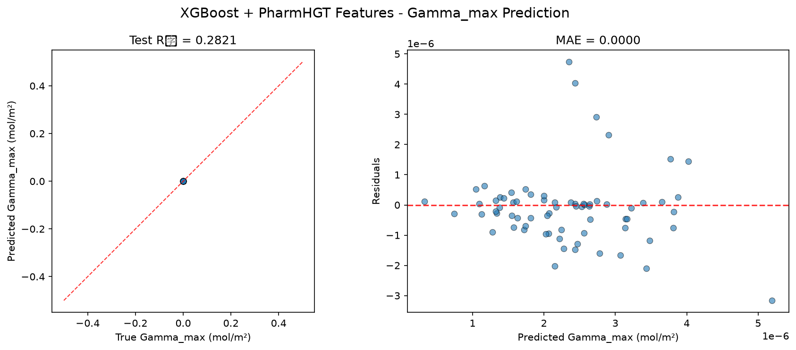

# XGBoost 模型报告 — Gamma_max 预测

## 报告信息

| 项目 | 内容 |
|------|------|
| 目标变量 | Gamma_max（最大表面超量，单位 mol/m²，量级 ~1e-6） |
| 运行目录 | `runs\Gamma_max\Gamma_max_xgboost_20260805_204250` |
| 运行时间 | 20:42:50 ~ 21:06:20（约 24 分钟，含 200 轮 Optuna + Top-K 筛选 + 最终训练） |
| 特征类型 | PharmHGT 522 维手工特征 |
| 报告生成日期 | 2026-08-07 |

## 概述

XGBoost 是陈天奇提出的梯度提升框架，以其对**二阶泰勒展开**、稀疏感知与列块并行的实现著称。本项目为 XGBoost 配置了**全模型最复杂的调参管线**：200 轮 Optuna × 5 折 CV（CV 样本 565），配合 **Top-K holdout 泛化性筛选**（独立 holdout 63 样本 + 训练-验证差距惩罚，防止过拟合的"虚高"参数被选中）。

在 Gamma_max 任务中，XGBoost 的 Test R² = 0.2821，在 10 个模型中排名第 7（MLP、CIF、RF、LightGBM、CatBoost、NGBoost 之后）。尽管调参管线最严谨，其性能仍处于中下游，说明对 Gamma_max 而言正则化复杂的树模型并不占优。

## 数据与方法

- **特征**：522 维 PharmHGT 风格特征，从缓存加载（`[Cache HIT]`），与其余模型一致。
- **数据规模**：训练池 628 条（549 训练 + 79 验证），测试集 70 条；调参阶段进一步划分 **CV 565 / Holdout 63**，最终模型在 565 条上训练。
- **数据划分**：`train_test_split(0.125, random_state=42)`，固定随机种子。

## 超参数与调优

**Optuna 200 轮 × 5 折 CV（multivariate TPE + gap 惩罚），Top-5 候选在 holdout 上复评后选中最优参数：**

| 参数 | 值 |
|------|-----|
| n_estimators | 2050 |
| max_depth | 12 |
| learning_rate | 0.0199 |
| subsample | 0.802 |
| colsample_bytree / bylevel / bynode | 0.708 / 0.797 / 0.938 |
| min_child_weight | 1.112 |
| gamma | 0.422 |
| reg_alpha / reg_lambda | 1.0e-4 / 2.2e-4 |
| max_delta_step | 0.686 |
| booster | **gbtree** |

**Optuna 参数重要度：**

| 参数 | 重要度 |
|------|--------|
| **min_child_weight** | **0.3041** |
| **gamma** | **0.2096** |
| max_delta_step | 0.1400 |
| colsample_bynode | 0.0933 |
| colsample_bytree | 0.0714 |
| 其余（lr / colsample_bylevel / max_depth 等） | < 0.05 |

参数重要度显示 **min_child_weight（叶节点最小样本权重）与 gamma（分裂最小损失增益）合计 0.51** 主导——与 pCMC 任务"gamma 独大"不同，本任务中叶节点样本量约束与增益阈值共同承担过拟合压制。最终选中 `booster='gbtree'`（而非搜索中频繁出现的 dart），Top-K holdout 复评表明 gbtree 在独立验证集上泛化更稳。

## 训练过程

- **调参阶段**：200 轮 Optuna 从 Trial 0（1.151）逐步收敛，Top-5 候选的 CV RMSE 落在 [0.9929, 1.0255]（缩放单位）；经 63 样本 holdout 复评，选中 holdout R² 最高（0.5766）的参数组合。
- **最终训练**：以选中参数在 565 条样本上训练（无早停重复，gbtree 定长迭代），测试集评估输出 Test R² = 0.2821。

> 注意：Gamma_max 下 Optuna trial 值均为缩放单位（约 1.0 量级）；holdout RMSE 与 Test RMSE 因目标量级 ~1e-6 被压成 0.0000，holdout R² 无量纲可信（最优 0.5766）。

## 测试结果

| 指标 | 值 |
|------|-----|
| Test RMSE | 0.0000 * |
| Test MAE | 0.0000 * |
| Test R² | **0.2821** |
| 参考 CV RMSE（Optuna 最优，缩放单位） | 0.9929 |

> \* 训练脚本对 y 乘以 1e6（config 中 y_scale=1000000），评估回到原始单位后取 4 位小数，原始 RMSE/MAE 量级 ~1e-6 mol/m² 被压成 0.0000；R² 无量纲，是唯一可信指标。metrics.json 的 best_cv_rmse 跨脚本不一致（本脚本已 ÷1e6 为 0.0），因此本报告以日志中 Optuna Best-trial 值（缩放单位，约 1.0 量级）作为 CV 参考。

> 图：预测值 vs 真实值散点图与残差图见 [pred_vs_true.png](../../../runs/Gamma_max/Gamma_max_xgboost_20260805_204250/pred_vs_true.png)。
>
> 

Test R² = 0.2821，仅解释了目标方差的约 28%。选中的 gbtree 参数在 holdout 上 R² 达 0.5766，但测试集回落明显，说明 Top-K 筛选的"泛化最优"参数在测试集上仍有差距，模型对 Gamma_max 的拟合能力整体有限。

## 特征重要性（Top 20）

日志输出的 Top-20 特征重要度数值**全部接近 0.0**（0.1 / 0.0），与 pCMC 任务中 XGBoost 的重要性展示问题一致（weight 口径输出异常，属于日志展示缺陷）；但排序仍指示有效信息，Top-5：

1. **`atom_max_20`**（0.1）：原子度数 = 4（季碳/高支化）的最大值
2. **`maccs_112`**（0.1）：MACCS 结构键 bit 112
3. **`atom_max_54`**（0.1）：重原子邻居数 / 4 的最大值
4. **`atom_std_20`**（0.0）：度数 = 4 的分布标准差
5. **`atom_mean_20`**（0.0）：度数 = 4 的占比均值

紧随其后：`bond_mean_12`、`maccs_105`、`AroRings`、`atom_max_35`（原子质量）、`atom_std_16`、`NumRings` 等。

**物理分析：** 靠前的度数 = 4 原子（`atom_max_20` / `atom_mean_20`）、重原子邻居（`atom_max_54`）与环/芳香结构（`AroRings`、`NumRings`、MACCS 键）共同指向**疏水骨架的分支度与环结构**——这与最大表面超量受疏水部分界面堆积行为影响吻合。若要精确归因，应改用 `shap_xgboost.py` 的 SHAP 分析（TreeExplainer）补充；本次 Gamma_max 运行**未生成 SHAP 图**。

## 结论与评价

**优点：**
- 调参管线最严谨：200 轮 + Top-K 泛化筛选 + gap 惩罚，参数选择可信度高、过拟合风险被主动压制。
- holdout 复评选中 gbtree 而非 dart，体现数据驱动的选择逻辑；参数重要度（min_child_weight + gamma 合计 0.51）给出清晰的正则方向。
- 运行高效：200 轮 Optuna 全程仅约 24 分钟。

**不足：**
- Test R² = 0.2821 仅列第 7，与其在 pCMC 任务中第 3 名的表现相比大幅下滑，复杂的调参管线未能在本目标转化为精度优势。
- 测试 R²（0.2821）显著低于 holdout R²（0.5766），泛化存在落差。
- 特征重要性输出异常（全近 0），且本次未生成 SHAP 图，可解释性文档化受限。

**横向定位（10 个模型中按 Test R² 降序）：**

| 排名 | 模型 | Test R² |
|------|------|---------|
| 5 | CatBoost | 0.3308 |
| 6 | NGBoost | 0.3191 |
| **7** | **XGBoost** | **0.2821** |
| 8 | HistGB | 0.1851 |
| 9 | Transformer | 0.1086 |

XGBoost 处于中下游，仅优于 HistGB 与 Transformer。其最严谨的调参管线在本 target 上并未带来领先，说明 Gamma_max 的相关结构更依赖模型归纳偏置（如 MLP 的非线性组合）而非调参强度；XGBoost 适合作为**调参基线**与过拟合防控的参照系。
