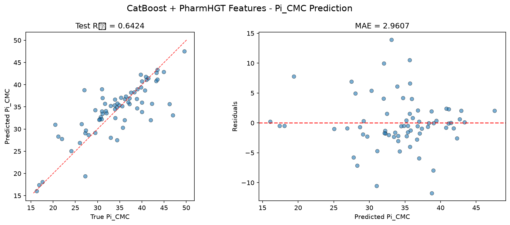
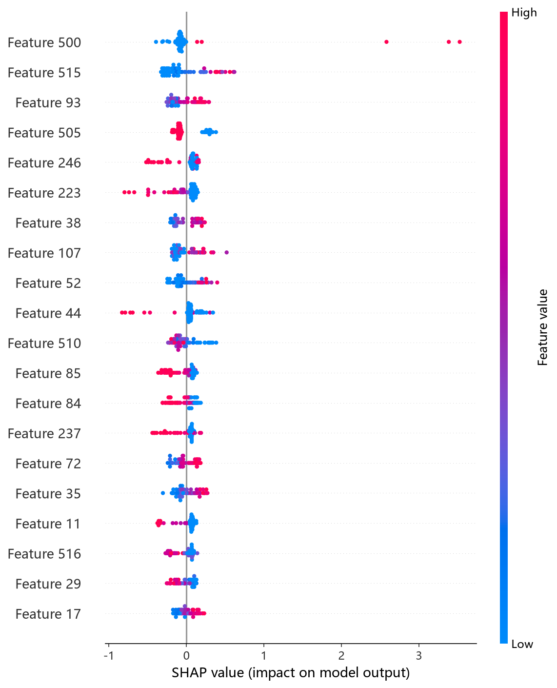
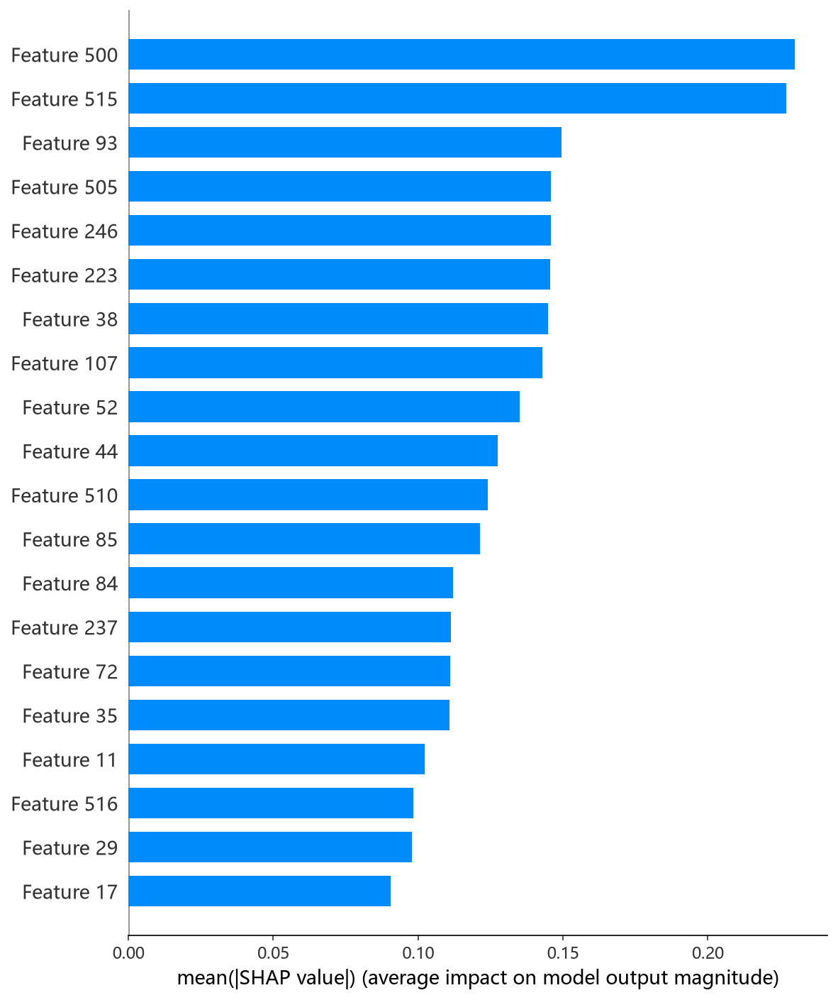

# CatBoost 模型报告 — Pi_CMC 预测

## 报告信息

| 项目 | 内容 |
|------|------|
| 目标变量 | Pi_CMC（CMC 时的表面压，= γ₀ − γ_CMC，单位 mN/m） |
| 运行目录 | `runs\Pi_CMC\Pi_CMC_catboost_20260806_155128` |
| 运行时间 | 15:51 ~ 17:09（约 1 小时 18 分钟，含 Optuna 50 轮调参与最终训练） |
| 特征类型 | PharmHGT 522 维手工特征 |
| 报告生成日期 | 2026-08-07 |

## 概述

CatBoost 是 Yandex 推出的梯度提升库，核心创新在于**对称树（oblivious tree）**与**有序目标编码（ordered target statistics）**，对类别特征友好且几乎无需调参即可取得稳定结果。本项目以 522 维稠密数值特征为输入，使用 Optuna 50 轮 × 5 折交叉验证搜索 `depth / learning_rate / iterations / l2_leaf_reg` 等关键超参。

在 Pi_CMC 任务中，CatBoost 的 Test R² = 0.6424、Test RMSE = 4.3069，在 10 个模型中**排名第 2**，与榜首 XGBoost（4.2675）仅差 0.0395，同属第一梯队（R² ≈ 0.64）。

## 数据与方法

- **特征**：522 维 PharmHGT 风格特征，本次运行**缓存未命中**（`[Cache MISS]`），现场计算并写缓存，631/631 与 70/70 分子全部有效。
- **数据规模**：训练池 631 条（552 训练 + 79 验证），测试集 70 条。
- **数据划分**：`train_test_split(0.125, random_state=42)`，固定随机种子。

## 超参数与调优

采用 **Optuna 50 轮 × 5 折交叉验证**（TPE 采样器 + MedianPruner）。

**最优试验（Trial 16，CV RMSE = 3.7878）：**

| 参数 | 值 |
|------|-----|
| depth | 9 |
| learning_rate | 0.02024 |
| iterations | 964 |
| l2_leaf_reg | 1.8127 |
| random_strength | 4.3621 |
| bagging_temperature | 3.5595 |
| border_count | 207 |
| one_hot_max_size | 35 |
| leaf_estimation_iterations | 8 |
| min_data_in_leaf | 47 |
| Best CV RMSE | 3.7878 |

**Optuna 参数重要度：**

| 参数 | 重要度 |
|------|--------|
| **l2_leaf_reg** | **0.2946** |
| depth | 0.2036 |
| random_strength | 0.1142 |
| one_hot_max_size | 0.1127 |
| min_data_in_leaf | 0.1084 |
| learning_rate | 0.0814 |
| 其余（iterations 等） | < 0.05 |

**调优过程观察：**
- 最优解集中在 **depth=9、learning_rate≈0.02、iterations≈1000** 的组合，属中等深度 + 慢学习率的稳健配置；50 轮中有约 20 轮被剪枝，说明搜索有效避开了明显次优的深度-学习率组合。
- 参数重要度显示 **l2_leaf_reg（叶节点 L2 正则，0.295）与 depth（0.204）合占近半**——在 Pi_CMC 这一样本量较小的任务（CV 552）上，控制模型复杂度（正则 + 树深）是决定泛化的首要因素，与 XGBoost 中 min_child_weight 居首的结论相互印证。
- `one_hot_max_size=35` 表明对少数低基数特征仍保留 one-hot 编码能力；`min_data_in_leaf=47` 较高，进一步抑制小样本上的分裂过拟合。

## 训练过程

- **调参阶段**：50 轮 Optuna 从 Trial 0 的 CV RMSE 3.9780 收敛至 Trial 16 的 **3.7878**，后续 30 余轮未见显著改进，搜索收敛。
- **最终训练**：以最优参数在 552 条训练集上训练，**早停在第 417 轮触发**（overfitting detector，150 轮无改进即停），`bestTest = 4.7427`，最终模型收缩为前 418 轮（`Shrink model to first 418 iterations`）。学习曲线显示训练损失（learn）持续降至 1.1 而验证损失在 400 轮附近触底，早停机制有效防止了过拟合蔓延。

## 测试结果

| 指标 | 值 |
|------|-----|
| Test RMSE | **4.3069** |
| Test MAE | **2.9607** |
| Test R² | **0.6424** |
| 参考 CV RMSE（调参时） | 3.7878 |
| Best val RMSE（早停迭代） | 4.7427 |

> 图：预测值 vs 真实值散点图与残差图见 [pred_vs_true.png](../../../runs/Pi_CMC/Pi_CMC_catboost_20260806_155128/pred_vs_true.png)。
>
> 

Test RMSE（4.3069）介于调参 CV（3.7878）与早停验证（4.7427）之间，处于正常泛化区间。Test MSE = 18.5491 与之印证。CatBoost 的 R² = 0.6424 位列第 2，MAE（2.9607）与 XGBoost（2.9343）几乎持平，是第一梯队中稳健的精度选择。

## 特征重要性（Top 20）

日志输出的 gain 特征重要度前五（Top 20 头部）：

1. **brics_30**（2.7）—— BRICS 片段反应活性描述符
2. **HBD**（1.8）—— 氢键供体数量
3. **MolWt**（1.6）—— 分子量
4. **atom_mean_44**（1.6）—— 原子特征聚合（均值）
5. **atom_mean_3**（1.4）—— 原子特征聚合（均值）

头部特征分布比 pCMC 任务更**分散**（前五仅 2.7~1.4，无一家独大的强信号），其余还包括 `atom_mean_52`、`bond_mean_3`、`atom_std_29`、`head_ratio`、`NAtoms` 等。**物理分析**：Pi_CMC（表面压 = γ₀ − γ_CMC）由表面活性剂把表面张力压低的效率决定，`HBD`（头基氢键供体）与 `head_ratio`（头基原子占比）的入选表明**极性头基的氢键能力与头尾比例**直接调控界面吸附层的分子间作用力；`MolWt`/`NAtoms` 反映分子尺寸对吸附量的影响；`brics_30` 作为反应活性片段则体现了特定结构基元对表面活性的贡献。

SHAP 分析（TreeExplainer）给出的 top-5 依赖图为 brics_30、HBD、atom_std_38、surf_cationic、bond_std_12，与 gain 排序大致呼应，并额外凸显了 **surf_cationic（阳离子表面活性剂类型）** 的重要性——电荷类型对界面吸附的影响在 Pi_CMC 上比 pCMC 更显著：

*SHAP 蜜蜂图：每个点是一个测试样本，x 轴为 SHAP 值，颜色代表特征取值高低。*

*Top-20 平均 |SHAP| 条形图：brics_30、HBD 等靠前，与 gain 排序一致。*

## 结论与评价

**优点：**
- 精度第 2（R² = 0.6424，Test RMSE = 4.3069），与榜首 XGBoost 仅差 0.0395，属第一梯队。
- MAE（2.9607）与 XGBoost 几乎持平，多数分子预测残差小。
- 早停 + 较高 min_data_in_leaf + l2_leaf_reg 三重防过拟合，泛化稳健；对称树训练效率高。

**不足：**
- 调参成本较高（50 轮 5 折 CV 约 1 小时 18 分钟，为同梯队模型中最耗时）。
- 相对 XGBoost 仍有 0.0395 的 RMSE 差距，未登顶。
- R² = 0.6424 仍属中上水平，对 Pi_CMC 高值区间的残差偏大。

**横向定位（10 个模型中按 Test RMSE 排序）：**

| 排名 | 模型 | Test RMSE | Test R² |
|------|------|-----------|---------|
| 1 | XGBoost | 4.2675 | 0.6489 |
| **2** | **CatBoost** | **4.3069** | **0.6424** |
| 3 | NGBoost | 4.3943 | 0.6277 |
| 4 | LightGBM | 4.4858 | 0.6121 |

CatBoost 与 XGBoost 构成 Pi_CMC 的第一梯队（R² ≈ 0.64），二者几乎并列。若追求最优 MAE 可优先 XGBoost；CatBoost 的对称树在稳定可复现与防过拟合上同样值得信赖，是**稳健的高精度选择**。
