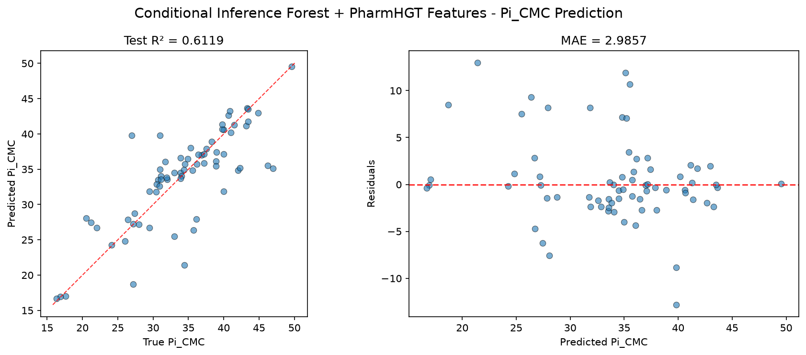
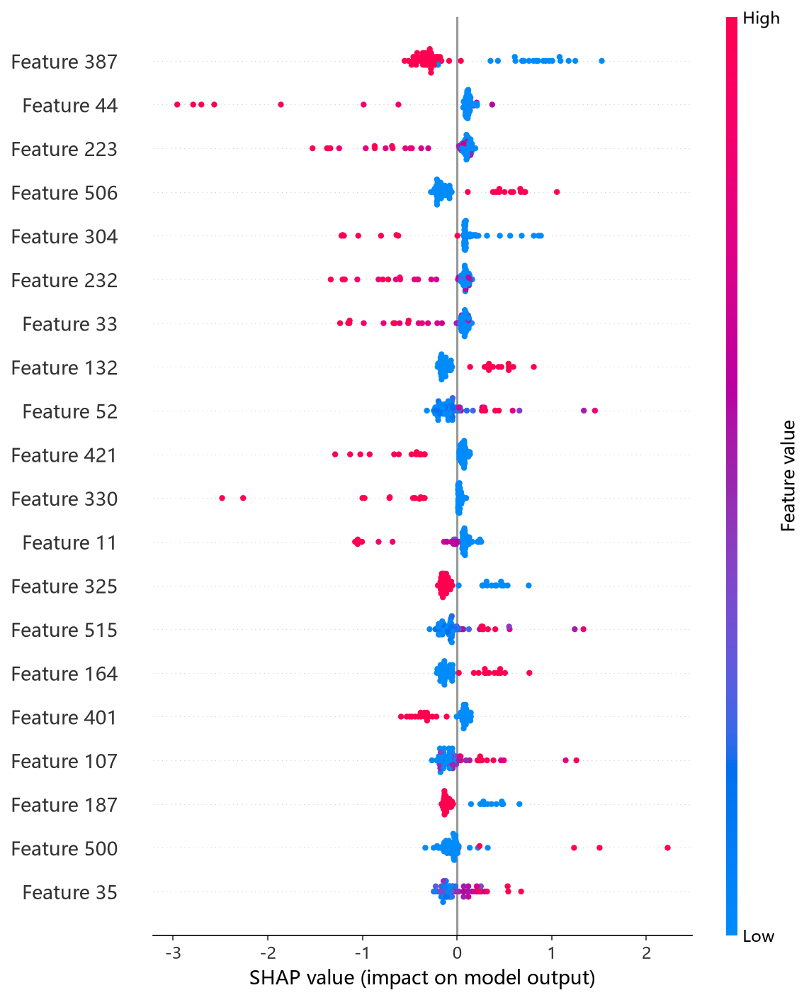
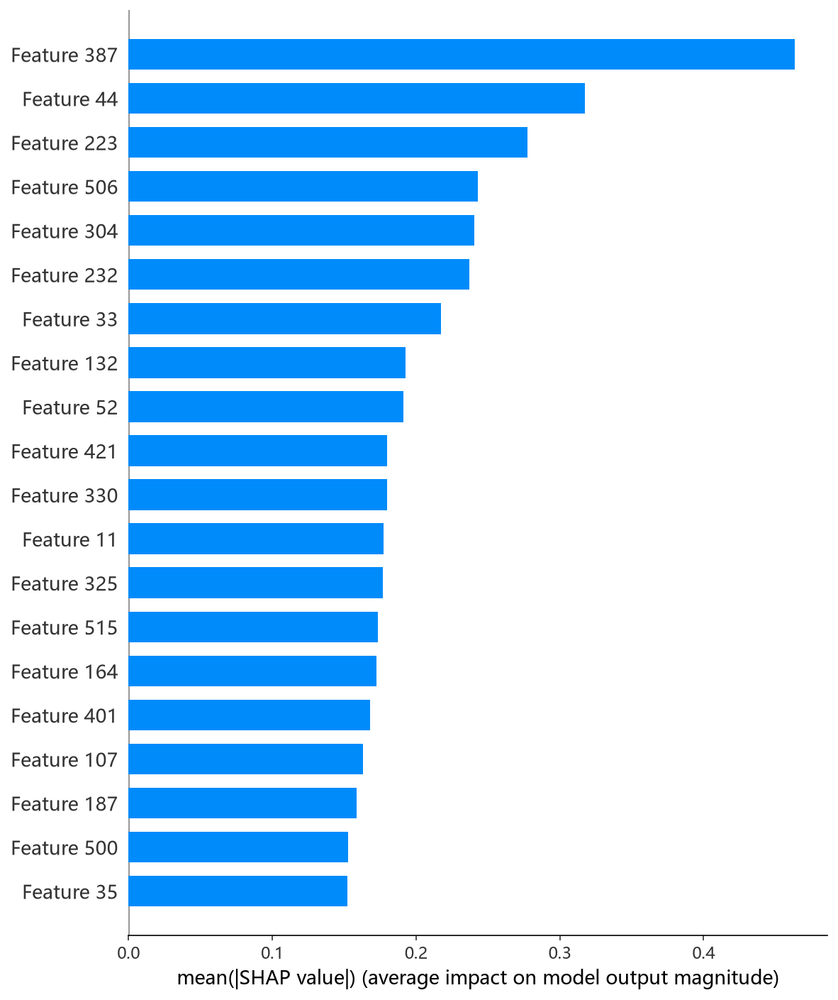

# CIF（条件推理森林 / ExtraTrees）模型报告 — Pi_CMC 预测

## 报告信息

| 项目 | 内容 |
|------|------|
| 目标变量 | Pi_CMC（CMC 时的表面压，= γ₀ − γ_CMC，单位 mN/m） |
| 运行目录 | `runs\Pi_CMC\Pi_CMC_cif_20260806_171025` |
| 运行时间 | 17:10 ~ 17:13（约 3 分钟，含 Optuna 50 轮调参与最终训练） |
| 特征类型 | PharmHGT 522 维手工特征 |
| 报告生成日期 | 2026-08-07 |

## 概述

CIF（Conditional Inference Forest）在此实现中由 **ExtraTrees（极端随机树）** 承载：不同于标准随机森林在最优切分点中做选择，ExtraTrees 在每个节点**随机生成切分阈值**，从而进一步降低方差、抑制过拟合。本项目 522 维特征以连续型描述符为主，ExtraTrees 对连续特征的随机切分策略尤其高效，且训练开销极低。

在 Pi_CMC 任务中，CIF 的 Test R² = 0.6119、Test RMSE = 4.4869，在 10 个模型中**排名第 5**，与第 4 名 LightGBM（4.4858）几乎并列，位于第二梯队头部（该模型在 pCMC 任务中曾为综合最优，但 Pi_CMC 上表现回落）。

## 数据与方法

- **特征**：522 维 PharmHGT 风格特征，从缓存加载（`[Cache HIT]`），与其余 9 个模型完全一致，保证公平对比。
- **数据规模**：训练池 631 条（552 训练 + 79 验证），测试集 70 条。
- **数据划分**：`train_test_split(0.125, random_state=42)`，固定随机种子。

## 超参数与调优

采用 **Optuna 50 轮 × 5 折交叉验证**。

**最优试验（Trial 33，CV RMSE = 3.8665）：**

| 参数 | 值 |
|------|-----|
| n_estimators | 845 |
| max_depth | 14 |
| min_samples_split | 5 |
| min_samples_leaf | 3 |
| max_features | None（用全部特征） |
| bootstrap | False |
| Best CV RMSE | 3.8665 |

**调优过程观察：**
- 前 8 轮表现很差（CV RMSE 4.88~6.07），原因是最优参数搜索初期倾向于 `bootstrap=True` + `max_features='sqrt'/'log2'` 的组合——对 522 维连续特征而言，随机子集特征容易丢失关键描述符，且自助采样引入额外噪声。
- 搜索快速收敛到 `bootstrap=False` + `max_features=None`（全特征）+ `min_samples_leaf=3` 的区域，Trial 33 触底至 3.8665，Trial 42~49 稳定在 3.92~4.03，搜索收敛。
- 50 轮中约 20 轮被 MedianPruner 剪枝，整体训练仅耗时约 3 分钟，**调参效率为 10 个模型中最高之一**。

## 训练过程

由于 ExtraTrees 是**非迭代式**集成（一次性训练全部树、取平均），日志中无逐轮 loss 曲线，`Training Final Model` 阶段直接输出结果。这意味着：
- 无过拟合检测器、无早停需求，超参确定后即一次成型；
- 训练时间几乎全部来自 Optuna 搜索阶段，最终模型训练仅数秒。

## 测试结果

| 指标 | 值 |
|------|-----|
| Test RMSE | **4.4869** |
| Test MAE | **2.9857** |
| Test R² | **0.6119** |
| Best CV RMSE | 3.8665 |

> 图：预测值 vs 真实值散点图与残差图见 [pred_vs_true.png](../../../runs/Pi_CMC/Pi_CMC_cif_20260806_171025/pred_vs_true.png)。
>
> 

Test RMSE（4.4869）高于 CV RMSE（3.8665），存在一定的测试-调参差距（约 16%），说明 Pi_CMC 上该模型不如 pCMC 任务（测试优于 CV）那般占优。Test MSE = 20.1321 与之印证。CIF 的 R² = 0.6119 位列第 5，与 LightGBM 几乎并列。

## 特征重要性（Top 20）

ExtraTrees 的 `feature_importances_` 基于分裂减少不纯度加权，且因为切分阈值随机，重要度分布**高度分散**（Top 1 仅 0.1），绝对值参考意义有限，但**相对排序**仍具指示性：

1. **atom_mean_44**（0.1）— 原子特征聚合（均值，Gasteiger 电荷类）
2. **maccs_28**（0.0）— MACCS 药效团子结构键
3. **bond_mean_3**（0.0）— 键特征聚合（均值）
4. **maccs_111**（0.0）— MACCS 药效团子结构键
5. **atom_std_44**（0.0）— 原子特征聚合（标准差）

**物理分析**：与 pCMC 任务（LogP/HeavyAtoms 等全局描述符主导）不同，CIF 在 Pi_CMC 上的头部特征转向 **原子聚合统计（atom_mean_44 / atom_std_44，电荷类）＋ MACCS 药效团（maccs_28 / maccs_111）＋ 键级聚合（bond_mean_3）**，与 CatBoost/HistGB 的结论呼应——Pi_CMC 更依赖**极性基团的电荷/药效团信息**而非单纯疏水链长度。`surf_nonionic`（非离子类型）与 `HBD`（氢键供体）亦进入 Top-20，提示表面活性剂类型与氢键能力对表面压的贡献。

SHAP 分析（TreeExplainer）给出的 top-5 依赖图为 maccs_111、atom_mean_44、bond_mean_3、surf_nonionic、maccs_28，与排序大致呼应：

*SHAP 蜜蜂图：每个点是一个测试样本，x 轴为 SHAP 值，颜色代表特征取值高低。*

*Top-20 平均 |SHAP| 条形图：maccs_111、atom_mean_44、bond_mean_3 靠前。*

## 结论与评价

**优点：**
- 训练/调参极快（约 3 分钟），几乎无调参成本，调参效率为 10 个模型中最高之一。
- 无迭代、无早停，训练确定性高，结果可复现性强。
- 随机切分抑制过拟合，对 522 维高维连续特征鲁棒；MAE（2.9857）在树模型中偏低，多数分子预测残差较小。

**不足：**
- 特征重要性绝对值近零、分散，难以做精确的逐特征归因（相对排序仍可靠）。
- 相对第一梯队（XGBoost/CatBoost）有约 0.18~0.22 的 RMSE 差距，未进入 R² ≈ 0.64 梯队。
- 预测为点估计，**不提供不确定性度量**（对比 NGBoost 可输出方差）。

**横向定位（10 个模型中按 Test RMSE 排序）：**

| 排名 | 模型 | Test RMSE | Test R² |
|------|------|-----------|---------|
| 3 | NGBoost | 4.3943 | 0.6277 |
| 4 | LightGBM | 4.4858 | 0.6121 |
| **5** | **CIF (ExtraTrees)** | **4.4869** | **0.6119** |
| 6 | HistGB | 4.5919 | 0.5935 |
| 7 | RandomForest | 4.7542 | 0.5642 |

CIF 与 LightGBM 几乎并列构成第二梯队头部。CIF 在 pCMC 任务上曾登顶，但 Pi_CMC 上表现回落，说明**不同目标的最佳模型并不一致**；在 Pi_CMC 上，若偏好低训练成本的稳健树模型，CIF 仍是性价比高的选择。
