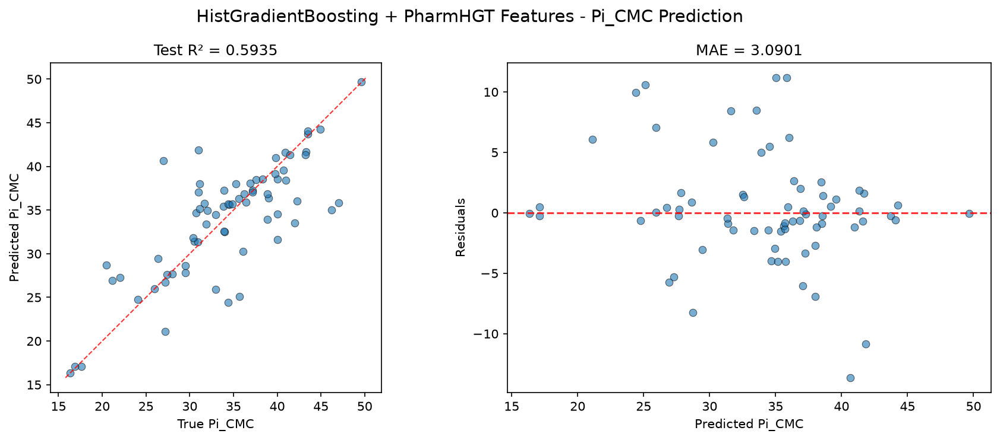
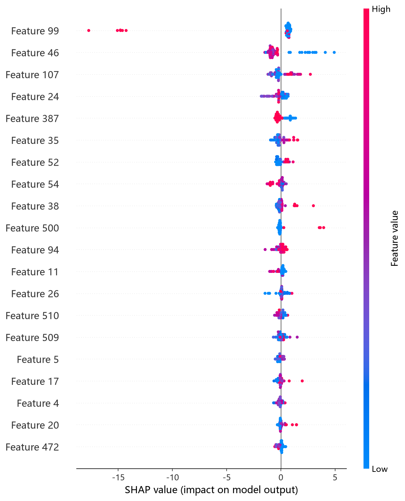
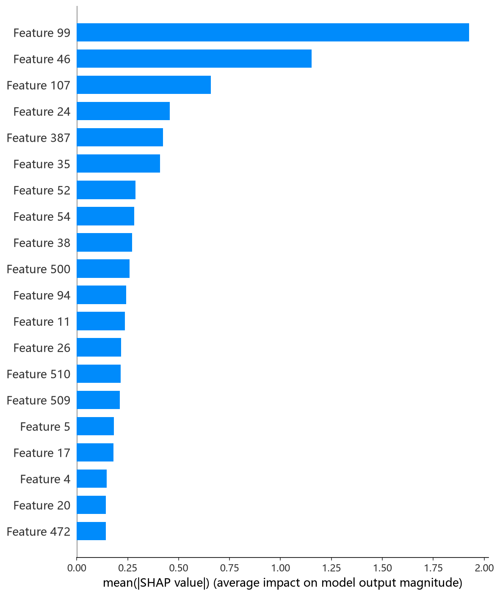
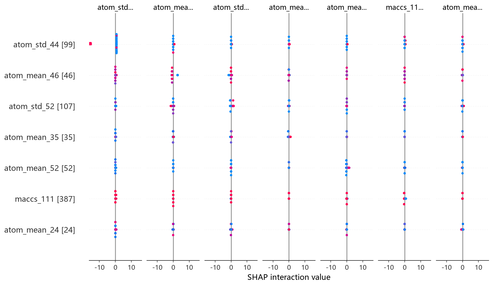

# HistGB 模型报告 — Pi_CMC 预测

## 报告信息

| 项目 | 内容 |
|------|------|
| 目标变量 | Pi_CMC（CMC 时的表面压，= γ₀ − γ_CMC，单位 mN/m） |
| 运行目录 | `runs\Pi_CMC\Pi_CMC_histgb_20260806_171314` |
| 运行时间 | 17:13 ~ 17:39（约 26 分钟，含 Optuna 50 轮调参与最终训练） |
| 特征类型 | PharmHGT 522 维手工特征 |
| 报告生成日期 | 2026-08-07 |

## 概述

HistGB（`sklearn.ensemble.HistGradientBoostingRegressor`）是 scikit-learn 自 0.21 起引入的梯度提升实现，采用**直方图分箱**与**分箱级别的梯度统计**加速训练，并原生支持**早停与内置缺失值处理**，是 LightGBM 思想的 sklearn 官方实现。本项目以 522 维稠密数值特征为输入，使用 Optuna 50 轮 × 5 折交叉验证搜索 `learning_rate / max_iter / max_depth / max_leaf_nodes` 等关键超参。

在 Pi_CMC 任务中，HistGB 的 Test R² = 0.5935、Test RMSE = 4.5919，在 10 个模型中**排名第 6**，位于第二梯队中段，性能与 LightGBM/CIF 相当但略逊。

## 数据与方法

- **特征**：522 维 PharmHGT 风格特征，从缓存加载（`[Cache HIT]`），与其余模型一致。
- **数据规模**：训练池 631 条（552 训练 + 79 验证），测试集 70 条。
- **数据划分**：`train_test_split(0.125, random_state=42)`，固定随机种子。

## 超参数与调优

采用 **Optuna 50 轮 × 5 折交叉验证**（TPE 采样器 + MedianPruner）。

**最优试验（Trial 33，CV RMSE = 4.0659）：**

| 参数 | 值 |
|------|-----|
| learning_rate | 0.11596 |
| max_iter | 651 |
| max_depth | 14 |
| max_leaf_nodes | 204 |
| min_samples_leaf | 5 |
| l2_regularization | 0.7430 |
| max_bins | 161 |
| Best CV RMSE | 4.0659 |

**调优过程观察：**
- 最优解偏好**深树（depth=14）＋大量叶子节点（204）＋较小 min_samples_leaf（5）**，配合中等学习率（0.116）与适度 L2 正则（0.74），在充分建模特征交互的同时压制过拟合。
- Trial 0 的 CV RMSE 4.2074 已属不错，搜索随后通过增大 max_leaf_nodes 与 max_depth 收敛到 4.07 附近；50 轮中约 20 轮被剪枝，搜索稳定收敛。

## 训练过程

- **调参阶段**：50 轮 Optuna 内每轮 5 折 CV 早停收敛，CV RMSE 从 Trial 0 的 4.2074 收敛至 Trial 33 的 **4.0659**，后续试验（Trial 49 为 4.1052）未见改进。
- **最终训练**：以最优参数在 552 条训练集上训练，`max_iter=651` 由 sklearn 内置早停兜底（日志未单独打印 best_iteration），随后直接进行测试评估。

## 测试结果

| 指标 | 值 |
|------|-----|
| Test RMSE | **4.5919** |
| Test MAE | **3.0901** |
| Test R² | **0.5935** |
| 参考 CV RMSE（调参时） | 4.0659 |

> 图：预测值 vs 真实值散点图与残差图见 [pred_vs_true.png](../../../runs/Pi_CMC/Pi_CMC_histgb_20260806_171314/pred_vs_true.png)。
>
> 

Test RMSE（4.5919）高于调参 CV（4.0659），存在一定的测试-调参差距，但处于可接受泛化范围。Test MSE = 21.0859 与之印证。HistGB 的 R² = 0.5935 位列第 6，与第 4/5 名的 LightGBM/CIF 差距在 0.1 的 RMSE 以内。

## 特征重要性（Top 20）

HistGB 采用**置换重要性（permutation-based）**口径，Top-5 特征（Top 20 头部）：

1. **atom_std_44**（2.34 ± 0.52）—— 原子特征聚合（标准差）
2. **atom_mean_46**（2.20 ± 0.31）—— 原子特征聚合（均值）
3. **atom_std_52**（1.42 ± 0.16）—— 原子特征聚合（标准差）
4. **atom_mean_24**（1.22 ± 0.19）—— 原子特征聚合（均值）
5. **atom_mean_38**（1.02 ± 0.16）—— 原子特征聚合（均值）

**物理分析**：HistGB 的重要性分布是树模型中最"分散"的一组——Top-20 几乎全部是 **原子级特征聚合（mean/std）**，辅以 `tail_ratio`（第 9）与 `maccs_111`（第 10）。这说明 HistGB 的预测依赖**大量原子局部统计特征的合力**（电荷/电负性散布的均值与波动），而非少数全局疏水性描述符；这与其 max_depth=14 的深树结构相吻合——深树能逐层组合众多原子统计特征。`atom_std_44`/`atom_std_52` 的高标准差重要性提示**原子性质在分子内的不均匀分布**对 Pi_CMC 有显著影响，符合表面活性剂头尾两亲结构带来的性质梯度。

SHAP 分析（TreeExplainer）给出的 top-5 依赖图为 atom_std_44、atom_mean_46、atom_std_52、atom_mean_24、maccs_111，与置换重要性排序一致：

*SHAP 蜜蜂图：每个点是一个测试样本，x 轴为 SHAP 值，颜色代表特征取值高低。*

*Top-20 平均 |SHAP| 条形图：atom_std_44、atom_mean_46 靠前，与置换重要性一致。*

*SHAP 交互热图：展示头部特征两两交互对预测的影响。*

## 结论与评价

**优点：**
- sklearn 原生实现、内置早停与缺失值处理，工程集成方便、无额外依赖。
- 精度第 6（R² = 0.5935），与第 4/5 名差距在 0.1 以内，性能稳定可用。
- 置换重要性口径（带置信区间）比 gain 更稳健，可解释性文档质量高。

**不足：**
- 相对第一梯队（XGBoost/CatBoost）有约 0.28~0.32 的 RMSE 差距，未进入 R² ≈ 0.64 梯队。
- 测试-调参差距（4.5919 vs 4.0659）偏大，深树配置（depth=14、叶子 204）在 552 样本上存在一定过拟合倾向。
- MAE（3.0901）在树模型中偏高，中高值区间残差偏大。

**横向定位（10 个模型中按 Test RMSE 排序）：**

| 排名 | 模型 | Test RMSE | Test R² |
|------|------|-----------|---------|
| 4 | LightGBM | 4.4858 | 0.6121 |
| 5 | CIF (ExtraTrees) | 4.4869 | 0.6119 |
| **6** | **HistGB** | **4.5919** | **0.5935** |
| 7 | RandomForest | 4.7542 | 0.5642 |
| 8 | MLP | 4.8837 | 0.5402 |

HistGB 与 LightGBM/CIF 构成第二梯队（R² ≈ 0.59~0.61），彼此 RMSE 差距在 0.1 以内。作为 sklearn 官方实现，HistGB 在**零额外依赖、集成便捷**的约束下提供了可靠的基线性能，但精度峰值仍需第一梯队的 XGBoost/CatBoost。
