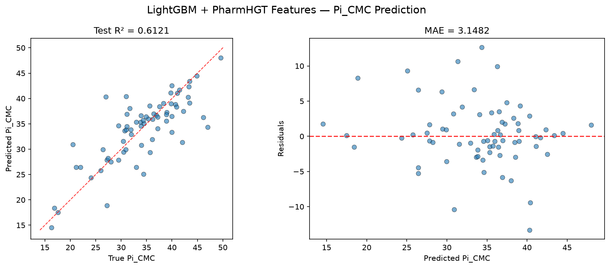
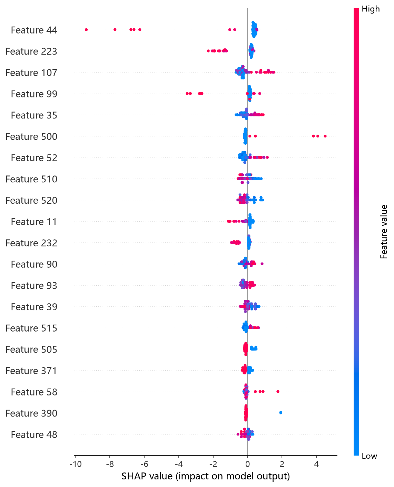
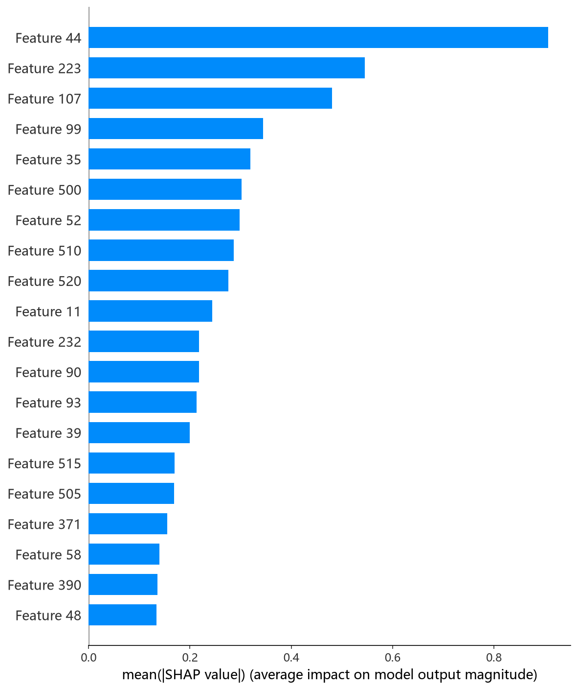

# LightGBM 模型报告 — Pi_CMC 预测

## 报告信息

| 项目 | 内容 |
|------|------|
| 目标变量 | Pi_CMC（CMC 时的表面压，= γ₀ − γ_CMC，单位 mN/m） |
| 运行目录 | `runs\Pi_CMC\Pi_CMC_lightgbm_20260806_174010` |
| 运行时间 | 17:40 ~ 17:42（约 2 分钟，含 Optuna 50 轮调参与最终训练） |
| 特征类型 | PharmHGT 522 维手工特征 |
| 报告生成日期 | 2026-08-07 |

## 概述

LightGBM 是微软开源的梯度提升框架，以 **Leaf-wise（按叶子生长）树**、**直方图分箱**与 **GOSS/EFB 采样**著称，训练速度快、内存占用低。本项目以 522 维稠密数值特征为输入，使用 Optuna 50 轮 × 5 折交叉验证搜索 `boosting_type / max_depth / num_leaves / learning_rate` 等关键超参。

在 Pi_CMC 任务中，LightGBM 的 Test R² = 0.6121、Test RMSE = 4.4858，在 10 个模型中**排名第 4**，与第 5 名 CIF（4.4869）几乎并列，位于第二梯队的头部。

## 数据与方法

- **特征**：522 维 PharmHGT 风格特征，从缓存加载（`[Cache HIT]`），与其余模型一致。
- **数据规模**：训练池 631 条（552 训练 + 79 验证），测试集 70 条。
- **数据划分**：`train_test_split(0.125, random_state=42)`，固定随机种子。

## 超参数与调优

采用 **Optuna 50 轮 × 5 折交叉验证**（TPE 采样器 + MedianPruner）。

**最优试验（Trial 45，CV RMSE = 4.0237）：**

| 参数 | 值 |
|------|-----|
| boosting_type | **gbdt** |
| max_depth | 12 |
| num_leaves | 115 |
| learning_rate | 0.03624 |
| n_estimators | 1749 |
| subsample / freq | 0.9262 / 6 |
| colsample_bytree | 0.5048 |
| reg_alpha / reg_lambda | ≈0 / 1.6e-4 |
| min_child_samples | 11 |
| min_split_gain | 0.6819 |
| cat_smooth / cat_l2 | 18.71 / 20.38 |

**调优过程观察：**
- Trial 0 用 dart + 大 depth/大 num_leaves 时 CV RMSE 高达 21.94（严重过拟合），Trial 1 的 dart 也达 9.16；**搜索迅速转向 gbdt 并收敛到 4.02 附近**，最终最优试验为 gbdt。
- 最优解偏好**较深的树（depth=12）＋较多叶子（115）**，但配合 `colsample_bytree=0.50`（列采样）与 `min_split_gain=0.68` 控制分裂，避免过拟合——说明在 522 维特征上，LightGBM 需要同时用"深树挖掘交互"和"列采样/分裂增益阈值"压制噪声。
- 50 轮中多数试验在 5 折内早停收敛，每轮平均仅数秒，整个调参约 2 分钟，是 10 个模型中调参最快之一。

## 训练过程

- **调参阶段**：50 轮 Optuna 内，每轮 5 折 CV 均以"验证集 30 轮无改进即停"早停，CV RMSE 从 Trial 0 的 21.94 收敛至 Trial 45 的 **4.0237**。
- **最终训练**：以最优参数在 552 条训练集上训练，**早停在第 138 轮触发**（50 轮无改进等待），`bestIteration = 138`，验证集 RMSE = 4.8822。学习曲线显示验证损失在 ~140 轮即触底，训练高效收敛。

## 测试结果

| 指标 | 值 |
|------|-----|
| Test RMSE | **4.4858** |
| Test MAE | **3.1482** |
| Test R² | **0.6121** |
| 参考 CV RMSE（调参时） | 4.0237 |
| Best val RMSE（早停迭代） | 4.8822 |

> 图：预测值 vs 真实值散点图与残差图见 [pred_vs_true.png](../../../runs/Pi_CMC/Pi_CMC_lightgbm_20260806_174010/pred_vs_true.png)。
>
> 

Test RMSE（4.4858）介于调参 CV（4.0237）与早停验证（4.8822）之间，处于正常泛化区间。Test MSE = 20.1220 与之印证。LightGBM 的 R² = 0.6121 位列第 4，与第 5 名 CIF 仅差 0.0002，性能相当但训练成本低得多。

## 特征重要性（Top 20）

日志输出的 gain 特征重要度前五（Top 20 头部）：

1. **MolWt**（148.0）—— 分子量
2. **atom_mean_35**（132.0）—— 原子特征聚合（均值）
3. **tail_ratio**（130.0）—— 尾碳占比
4. **LogP**（107.0）—— 脂水分配系数
5. **atom_std_25**（86.0）—— 原子特征聚合（标准差）

**物理分析**：LightGBM 的特征排序是树模型中**最接近 pCMC 任务典型画像**的一组——`MolWt`、`LogP`、`HeavyAtoms`、`RotBonds` 等疏水性/尺寸描述符集体靠前，且 `tail_ratio`（尾链占比）进入前三，直观呼应表面活性剂的**两亲结构**：尾链越长、疏水体积越大，表面活性剂在界面的吸附趋势越强，Pi_CMC 相应越高。`atom_mean_35`/`atom_std_25` 等原子聚合统计反映局部电负性与电荷散布对界面吸附层的作用。

SHAP 分析（TreeExplainer）给出的 top-5 依赖图为 atom_mean_44、bond_mean_3、atom_std_52、atom_std_44、atom_mean_35，与 gain 排序大致呼应，共同指向**原子局部统计与分子尺寸**的主导作用：

*SHAP 蜜蜂图：每个点是一个测试样本，x 轴为 SHAP 值，颜色代表特征取值高低。*

*Top-20 平均 |SHAP| 条形图：atom_mean_44、bond_mean_3 等靠前。*

## 结论与评价

**优点：**
- **调参极快**（约 2 分钟），是 10 个模型中训练/调参成本最低的之一，性价比高。
- 精度第 4（R² = 0.6121），与第 5 名 CIF 几乎并列。
- 早停机制 + 列采样 + 分裂增益阈值多重重正化，泛化稳健。

**不足：**
- 相对第一梯队（XGBoost/CatBoost）仍有约 0.18~0.22 的 RMSE 差距，未进入 R² ≈ 0.64 梯队。
- MAE（3.1482）在树模型中偏高，说明存在中等偏差的预测点。
- 深树（depth=12、叶子 115）配置有轻微过拟合倾向，依赖早停兜底。

**横向定位（10 个模型中按 Test RMSE 排序）：**

| 排名 | 模型 | Test RMSE | Test R² |
|------|------|-----------|---------|
| 2 | CatBoost | 4.3069 | 0.6424 |
| 3 | NGBoost | 4.3943 | 0.6277 |
| **4** | **LightGBM** | **4.4858** | **0.6121** |
| 5 | CIF (ExtraTrees) | 4.4869 | 0.6119 |
| 6 | HistGB | 4.5919 | 0.5935 |

LightGBM 与 CIF 构成第二梯队头部，二者 RMSE 几乎相同，但 LightGBM 训练时间仅为 CIF 的零头。若预算有限、需要快速迭代，LightGBM 是**高性价比**的选择；追求精度峰值仍需 XGBoost/CatBoost。
