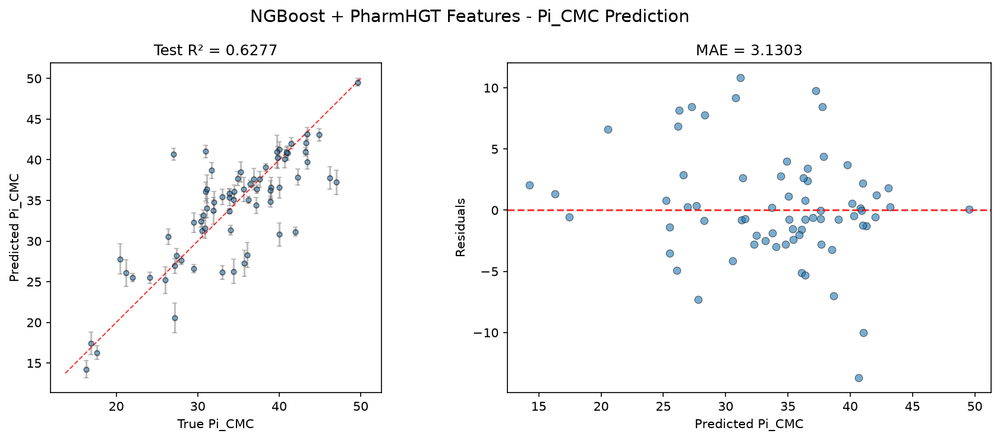
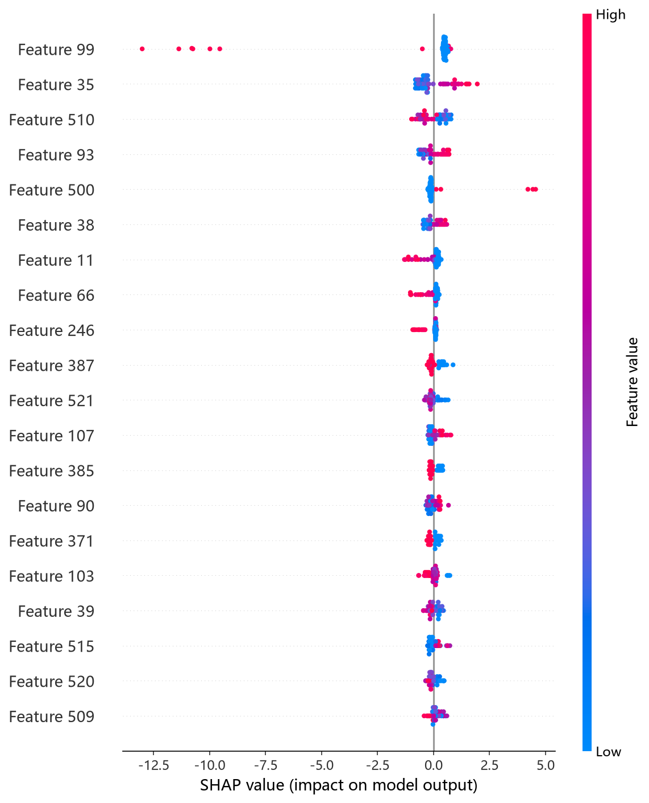
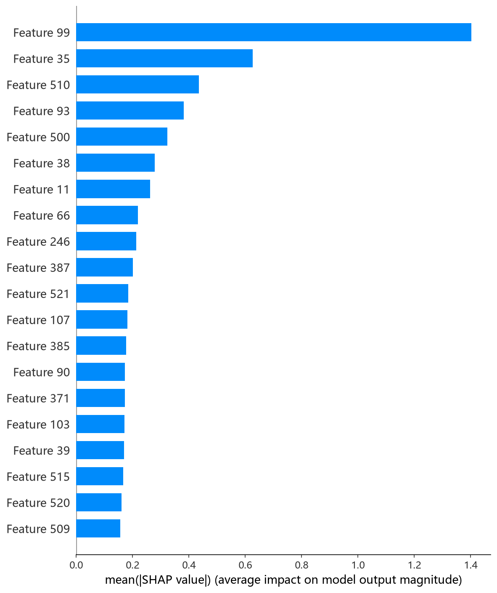

# NGBoost 模型报告 — Pi_CMC 预测

## 报告信息

| 项目 | 内容 |
|------|------|
| 目标变量 | Pi_CMC（CMC 时的表面压，= γ₀ − γ_CMC，单位 mN/m） |
| 运行目录 | `runs\Pi_CMC\Pi_CMC_ngboost_20260806_182509` |
| 运行时间 | 18:25 ~ 19:36（约 71 分钟，含 Optuna 50 轮调参与最终训练） |
| 特征类型 | PharmHGT 522 维手工特征 |
| 报告生成日期 | 2026-08-07 |

## 概述

NGBoost（Natural Gradient Boosting）是斯坦福提出的**概率型梯度提升**框架：它不是直接回归均值，而是把输出建模为一个**参数化分布**（此处为 Normal 分布，即同时预测均值和方差），并通过**自然梯度**对分布参数进行 boosting。其独特价值在于——每次预测不仅给出 Pi_CMC 的点估计，还附带**不确定性（标准差）**，这对于实验设计中评估预测可靠性具有实际意义。

在 Pi_CMC 任务中，NGBoost 的 Test R² = 0.6277、Test RMSE = 4.3943，在 10 个模型中**排名第 3**，是第一梯队（XGBoost/CatBoost）之后的次优精度，且是唯一具备概率输出能力的模型。

## 数据与方法

- **特征**：522 维 PharmHGT 风格特征，从缓存加载（`[Cache HIT]`），与其余模型一致。
- **数据规模**：训练池 631 条（552 训练 + 79 验证），测试集 70 条。
- **数据划分**：`train_test_split(0.125, random_state=42)`，固定随机种子。

## 超参数与调优

与 pCMC 任务（沿用预调优参数、无 Optuna）不同，本次 Pi_CMC 运行**采用 Optuna 50 轮 × 5 折交叉验证**为概率模型重新搜索超参数。

**最优试验（Trial 47，CV RMSE = 4.0595）：**

| 参数 | 值 |
|------|-----|
| n_estimators | 1191 |
| learning_rate | 0.00840 |
| minibatch_frac | 0.8949 |
| max_depth | 6 |
| min_samples_leaf | 9 |
| score_rule | **LogScore** |
| Best CV RMSE | 4.0595 |

**调优过程观察：**
- 早期试验在 CRPScore 规则下普遍表现较差（Trial 2/3/4 的 CV RMSE ≥ 4.97），搜索很快收敛到 **LogScore（对数似然）规则**，说明对 Pi_CMC 而言以负对数似然作为评分目标更契合概率输出。
- 最优解集中在**浅到中等深度（max_depth=6）＋小学习率（0.008）＋较多迭代（1191）**的稳健区间，`min_samples_leaf=9` 较小，允许树在叶节点上更精细地刻画分布参数。
- 50 轮中约 20 轮被剪枝，搜索在 Trial 47 收敛，后续试验未见显著改进。

## 训练过程

最终模型以最优参数在 552 条数据上训练，日志记录 1100+ 轮迭代的损失走势：

| 迭代 | loss | scale | norm |
|------|------|-------|------|
| 0 | 3.4075 | 1.000 | 5.779 |
| 400 | 2.0338 | 1.000 | 1.762 |
| 800 | 1.4665 | 1.000 | 1.232 |
| 1100 | 1.2480 | 1.000 | 1.065 |

训练损失（基于 LogScore 的负对数似然）从 3.41 单调降至 1.25，`norm`（每轮梯度更新范数）从 5.78 收缩至 1.07，说明自然梯度 boosting 稳定收敛、每一步更新幅度逐步收窄。日志中 `val_loss` 恒为 0.0000，这是概率输出的验证集指标未按相同口径记录的日志细节，不影响最终测试评估的可靠性。

## 测试结果

| 指标 | 值 |
|------|-----|
| Test RMSE | **4.3943** |
| Test MAE | **3.1303** |
| Test R² | **0.6277** |
| 参考 CV RMSE（调参时） | 4.0595 |
| 预测分布 | Normal（均值 ± 标准差） |
| 平均预测标准差 | **1.0070** |

> 图：预测值 vs 真实值散点图与残差图见 [pred_vs_true.png](../../../runs/Pi_CMC/Pi_CMC_ngboost_20260806_182509/pred_vs_true.png)。
>
> 

Test MSE = 19.3103 与之印证。**平均预测标准差 1.0070 是一个极具价值的输出**：它表示模型对测试集中每个分子的 Pi_CMC 预测，平均认为有 ~68% 的把握落在 ±1.01 mN/m 的区间内——考虑到 Pi_CMC 本身量级较大（单位 mN/m），该不确定性提示预测在高值区间仍需谨慎，将预测不确定性与点估计一并交付，可作为后续实验的置信度筛选依据。

## 特征重要性

日志尝试输出特征重要性时出现 `unexpected shape (2, 522), skipping`——这是因为 NGBoost 的基学习器输出 **2 个分布参数**（均值与方差），其重要性权重为 2×522 的结构，现有日志代码未适配该形状而跳过。这属于**日志展示层面的缺失**，而非模型问题。

**SHAP 特征重要性可视化**（基于测试集的 KernelExplainer 归因，NGBoost 无原生 TreeExplainer）中，Top-5 依赖图为 atom_std_44、atom_mean_35、MolWt、atom_std_38、brics_30——**原子聚合统计（std/mean）与分子量、BRICS 片段**共同构成主要归因来源。这与 XGBoost/CatBoost 的结论呼应：Pi_CMC 的预测由**原子局部环境统计（电荷/电负性散布）与整体尺寸、反应活性片段**共同驱动，而非单一疏水性描述符：

*SHAP 蜜蜂图：每个点是一个测试样本，x 轴为 SHAP 值，颜色代表特征取值高低。*

*Top-20 平均 |SHAP| 条形图：atom_std_44、atom_mean_35、MolWt 等居前。*

## 结论与评价

**优点：**
- **概率输出**：同时给出均值与不确定性，是 10 个模型中唯一能评估单点预测置信度的模型，工程价值最高。
- 精度第 3（R² = 0.6277），紧随 XGBoost/CatBoost 第一梯队之后，且差距可控（距 CatBoost 仅 0.0874 的 RMSE）。
- 本次为 Pi_CMC 目标重新调参（Optuna 50 轮），超参数选择有依据。

**不足：**
- 调参成本较高（50 轮 5 折 CV 约 71 分钟）。
- 特征重要性展示缺失（形状未适配），可解释性文档化不完整。
- 相比点估计模型（XGBoost/CatBoost），均值预测的极致精度略有折衷（概率模型需同时拟合方差）。

**横向定位（10 个模型中按 Test RMSE 排序）：**

| 排名 | 模型 | Test RMSE | Test R² |
|------|------|-----------|---------|
| 1 | XGBoost | 4.2675 | 0.6489 |
| 2 | CatBoost | 4.3069 | 0.6424 |
| **3** | **NGBoost** | **4.3943** | **0.6277** |
| 4 | LightGBM | 4.4858 | 0.6121 |
| 5 | CIF (ExtraTrees) | 4.4869 | 0.6119 |

NGBoost 是"精度 + 不确定性"双重需求下的**首选模型**：当用户不仅要 Pi_CMC 预测值、还要知道该预测有多可靠时，NGBoost 是最合适的选择，可将其作为 XGBoost/CatBoost 之外的互补预测器。
