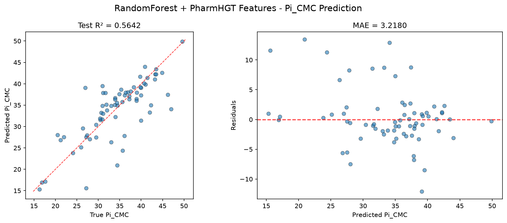
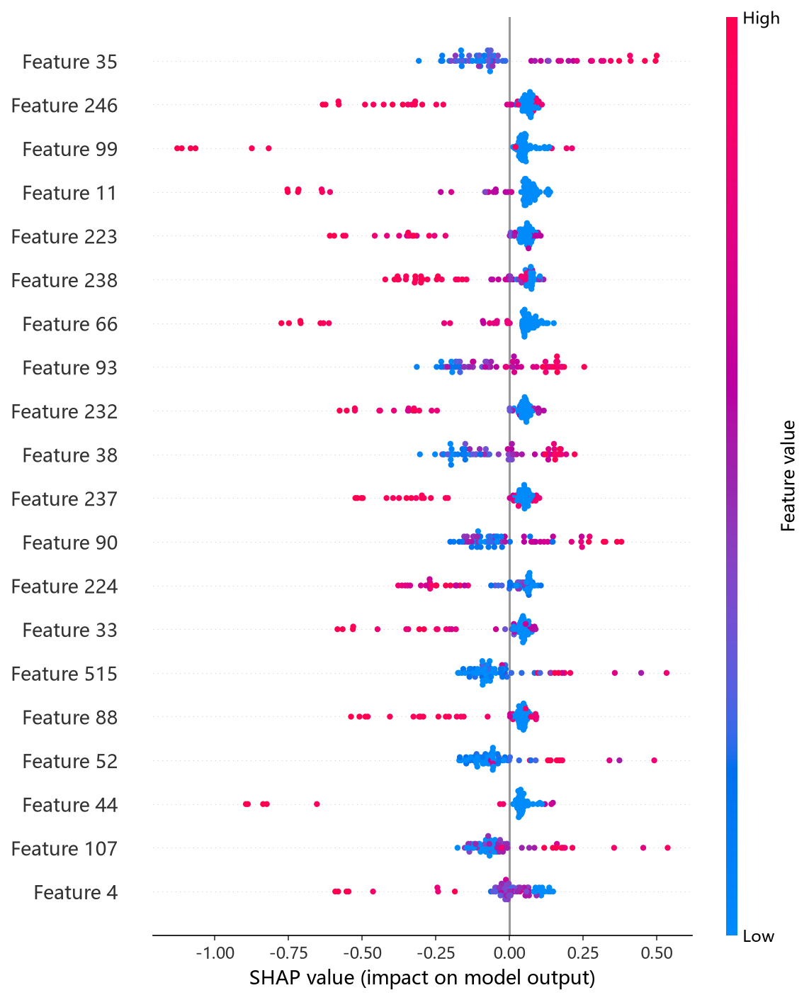
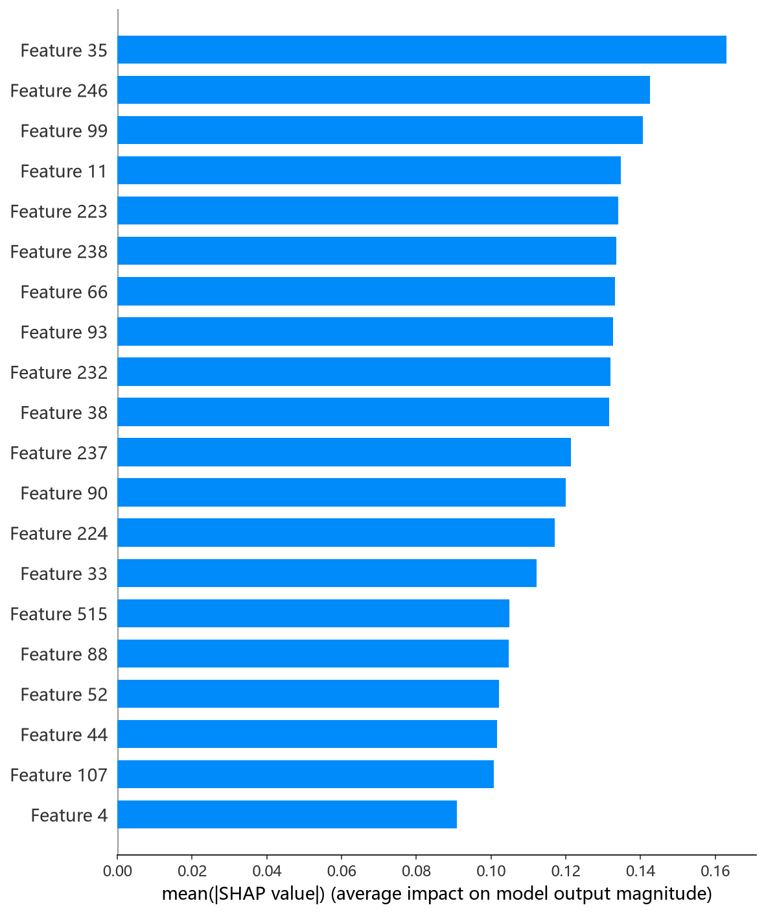

# RandomForest 模型报告 — Pi_CMC 预测

## 报告信息

| 项目 | 内容 |
|------|------|
| 目标变量 | Pi_CMC（CMC 时的表面压，= γ₀ − γ_CMC，单位 mN/m） |
| 运行目录 | `runs\Pi_CMC\Pi_CMC_rf_20260806_193704` |
| 运行时间 | 19:37 ~ 19:39（约 2 分钟，含 Optuna 50 轮调参与最终训练） |
| 特征类型 | PharmHGT 522 维手工特征 |
| 报告生成日期 | 2026-08-07 |

## 概述

随机森林（Random Forest）是 Breiman 提出的**Bagging + 随机特征子集**集成方法：每棵树在自助采样子集上训练，每次分裂仅考虑 `max_features` 个随机特征，最终取多棵树平均。它对特征尺度不敏感、天然抗过拟合，是 522 维高维稀疏特征下的稳健基线模型。本项目使用 Optuna 50 轮 × 5 折交叉验证搜索 `n_estimators / max_depth / min_samples_split` 等关键超参。

在 Pi_CMC 任务中，RandomForest 的 Test R² = 0.5642、Test RMSE = 4.7542，在 10 个模型中**排名第 7**，位于第二梯队后段。

## 数据与方法

- **特征**：522 维 PharmHGT 风格特征，从缓存加载（`[Cache HIT]`），与其余模型一致。
- **数据规模**：训练池 631 条（552 训练 + 79 验证），测试集 70 条。
- **数据划分**：`train_test_split(0.125, random_state=42)`，固定随机种子。

## 超参数与调优

采用 **Optuna 50 轮 × 5 折交叉验证**（TPE 采样器 + MedianPruner）。

**最优试验（Trial 44，CV RMSE = 4.1658）：**

| 参数 | 值 |
|------|-----|
| n_estimators | 1368 |
| max_depth | 24 |
| min_samples_split | 7 |
| min_samples_leaf | 1 |
| max_features | **sqrt** |
| bootstrap | False |
| Best CV RMSE | 4.1658 |

**调优过程观察：**
- 最优解偏好**深树（depth=24）＋sqrt 特征采样（√522≈23）＋bootstrap=False（全样本训练）**——即用"每树看全样本 + 随机列子集"代替传统 bagging 的行采样，在 552 样本的小数据上最大化每棵树的利用率。
- 早期试验（Trial 0/1）CV RMSE 高达 5.7/5.0，搜索通过减小 min_samples_leaf 与加深树收敛到 4.17 附近；Trial 42~49 稳定在 4.17~4.22，搜索收敛。
- 50 轮中约 15 轮被剪枝，每轮 5 折 CV 耗时约 1~3 秒，整个调参仅约 2 分钟。

## 训练过程

- **调参阶段**：50 轮 Optuna 内每轮 5 折 CV，CV RMSE 从 Trial 0 的 5.7302 收敛至 Trial 44 的 **4.1658**。
- **最终训练**：以最优参数（1368 棵树）在 552 条训练集上一次性训练完成，无早停机制（随机森林无迭代式早停），随后直接进行测试评估。

## 测试结果

| 指标 | 值 |
|------|-----|
| Test RMSE | **4.7542** |
| Test MAE | **3.2180** |
| Test R² | **0.5642** |
| 参考 CV RMSE（调参时） | 4.1658 |

> 图：预测值 vs 真实值散点图与残差图见 [pred_vs_true.png](../../../runs/Pi_CMC/Pi_CMC_rf_20260806_193704/pred_vs_true.png)。
>
> 

Test RMSE（4.7542）高于调参 CV（4.1658），存在明显的测试-调参差距，说明深树全样本训练（bootstrap=False）在小样本上有一定过拟合倾向。Test MSE = 22.6026 与之印证。RandomForest 的 R² = 0.5642 位列第 7，被同族的 CIF（ExtraTrees，R² = 0.6119）反超。

## 特征重要性（Top 20）

日志输出的 Top-20 特征重要度**数值均为 0.0**（sklearn 重要性取整展示口径问题），但排序仍指示特征分布：前四均为**原子聚合统计**（atom_std_44、atom_mean_44、atom_mean_4、atom_std_11），其后为 atom_std_38、atom_std_4、atom_std_40 与 **键级聚合（bond_std_12、bond_mean_3、bond_mean_12、bond_std_4）**。

Top-5 编号列表（取自日志 Top 20）：

1. **atom_std_44** —— 原子特征聚合（标准差）
2. **atom_mean_44** —— 原子特征聚合（均值）
3. **atom_mean_4** —— 原子特征聚合（均值）
4. **atom_std_11** —— 原子特征聚合（标准差）
5. **atom_mean_11** —— 原子特征聚合（均值）

**物理分析**：与 HistGB 相似，RandomForest 的重要性集中于**原子与键级聚合统计**，`atom_44`（Gasteiger 电荷类）与 `atom_11`（氢键相关）的入选提示**电荷分布与氢键能力**对 Pi_CMC 起主导作用——表面压取决于极性头基在界面的取向与相互作用，电荷/氢键特征正是这种相互作用的直接表征。

SHAP 分析（TreeExplainer）给出的 top-5 依赖图为 atom_mean_35、bond_std_12、atom_std_44、atom_mean_11、bond_mean_3，与排序大致呼应：

*SHAP 蜜蜂图：每个点是一个测试样本，x 轴为 SHAP 值，颜色代表特征取值高低。*

*Top-20 平均 |SHAP| 条形图：atom_mean_35、bond_std_12、atom_std_44 靠前。*

## 结论与评价

**优点：**
- **训练极快**（约 2 分钟），且无调参迭代早停，是 10 个模型中成本最低的之一。
- 对特征尺度不敏感、无需归一化，随机子采样天然抗噪声，模型稳定可复现。
- 精度第 7（R² = 0.5642），作为高维手工特征下的稳健基线可用。

**不足：**
- 相对第一梯队（XGBoost/CatBoost）有约 0.45~0.49 的 RMSE 差距，未进入 R² ≈ 0.64 梯队。
- 测试-调参差距（4.7542 vs 4.1658）偏大，深树 + bootstrap=False 在 552 样本上有过拟合倾向。
- 被同族的 CIF（ExtraTrees）显著反超（R² 差 0.048），说明在此任务上 ExtraTrees 的"随机阈值 + 全特征"策略优于随机森林的"列子采样"策略。

**横向定位（10 个模型中按 Test RMSE 排序）：**

| 排名 | 模型 | Test RMSE | Test R² |
|------|------|-----------|---------|
| 5 | CIF (ExtraTrees) | 4.4869 | 0.6119 |
| 6 | HistGB | 4.5919 | 0.5935 |
| **7** | **RandomForest** | **4.7542** | **0.5642** |
| 8 | MLP | 4.8837 | 0.5402 |
| 9 | RNN | 7.3144 | −0.0315 |

RandomForest 位于第二梯队后段。若在该族模型中择优，应优先 **CIF（ExtraTrees）**——同族更强且训练成本相近；RandomForest 更适合作为强调稳健可复现的基线。
