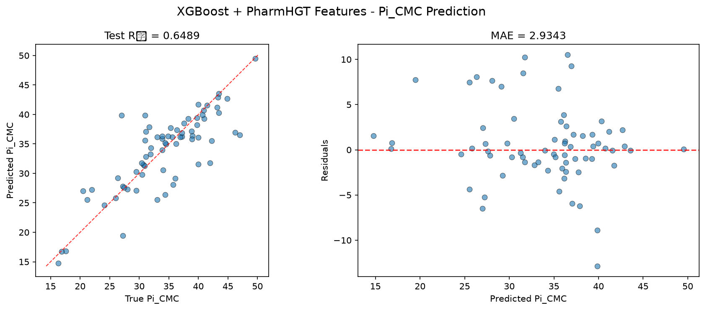

# XGBoost 模型报告 — Pi_CMC 预测

## 报告信息

| 项目 | 内容 |
|------|------|
| 目标变量 | Pi_CMC（CMC 时的表面压，= γ₀ − γ_CMC，单位 mN/m） |
| 运行目录 | `runs\Pi_CMC\Pi_CMC_xgboost_20260806_202114` |
| 运行时间 | 20:21 ~ 20:40（约 19 分钟，含 Optuna 200 轮调参、Top-K 筛选与最终训练） |
| 特征类型 | PharmHGT 522 维手工特征 |
| 报告生成日期 | 2026-08-07 |

## 概述

XGBoost 是陈天奇提出的梯度提升框架，以其对**二阶泰勒展开**、稀疏感知与列块并行的实现著称。本项目为 XGBoost 配置了**全模型最复杂的调参管线**：200 轮 Optuna × 5 折 CV（CV 样本 567），配合 **Top-K holdout 泛化性筛选**（独立 holdout 64 样本 + 训练-验证差距惩罚，防止过拟合的"虚高"参数被选中）。

在 Pi_CMC 任务中，XGBoost 的 Test R² = 0.6489、Test RMSE = 4.2675，在 10 个模型中**排名第 1**，为第一梯队之首（紧随其后的 CatBoost 与之仅差 0.0395 的 RMSE）。

## 数据与方法

- **特征**：522 维 PharmHGT 风格特征，从缓存加载（`[Cache HIT]`），与其余模型一致。
- **数据规模**：训练池 631 条（552 训练 + 79 验证），测试集 70 条；调参阶段进一步划分 CV 567 / Holdout 64。
- **数据划分**：`train_test_split(0.125, random_state=42)`，固定随机种子。

## 超参数与调优

Optuna 200 轮 × 5 折 CV（多变量 TPE + gap penalty），先取 CV 最优试验，再从 Top-5 候选中按 holdout 泛化性选出最终参数。

**CV 最优试验（Trial 143，CV RMSE = 4.0309）：**

| 参数 | 值 |
|------|-----|
| n_estimators | 2048 |
| max_depth | 7 |
| learning_rate | 0.01136 |
| subsample | 0.9660 |
| colsample_bytree / bylevel / bynode | 0.8938 / 0.4387 / 0.4686 |
| min_child_weight | 2.9445 |
| gamma | 0.1165 |
| reg_alpha / reg_lambda | 1.0e-4 / 2.9671 |
| max_delta_step | 5.6912 |
| booster | **dart** |

**Top-K 最终选定参数（holdout RMSE = 3.7673）：** 搜索未直接采用 CV 最优的 Trial 143，而是从 Top-5 候选中选择了在独立 holdout 上 RMSE 最低的一组（`n_estimators=1441, max_depth=11, learning_rate=0.01332, subsample=0.9014, colsample_bytree=0.6213, colsample_bynode=0.9019, min_child_weight=3.356, gamma=0.3102, booster='dart'`），表明 Top-5 中该候选对未见数据更稳健。

**Optuna 参数重要度：**

| 参数 | 重要度 |
|------|--------|
| **min_child_weight** | **0.3544** |
| learning_rate | 0.2023 |
| colsample_bytree | 0.1472 |
| colsample_bynode | 0.0669 |
| subsample | 0.0587 |
| 其余（colsample_bylevel 等） | < 0.06 |

与 pCMC 任务中 gamma 占压倒性不同，Pi_CMC 上 **min_child_weight（最小叶节点样本量，0.354）是头号重要参数**，其次为学习率与列采样——说明在样本量更小（567 vs 1083）的 Pi_CMC 任务中，控制叶节点最小样本量以抑制小样本上的分裂过拟合是决定性能的关键。

## 训练过程

- **调参阶段**：200 轮 Optuna 从 Trial 0 的 CV RMSE 4.2765 收敛至 Trial 143 的 **4.0309**，随后进入 Top-K holdout 筛选（选择在独立 holdout 上表现最泛化的参数而非仅 CV 最优），选定的最终参数在 holdout 上取得 **3.7673** 的 RMSE。
- **最终训练**：以 Top-K 选定参数在 567 条 CV 训练集上训练，直接输出测试评估（无早停重复）。日志 Top-20 特征重要度数值多为 0.0/0.1，属于 dart booster + 重要性输出口径的展示问题（详见下节），不影响模型本身。

## 测试结果

| 指标 | 值 |
|------|-----|
| Test RMSE | **4.2675** |
| Test MAE | **2.9343** |
| Test R² | **0.6489** |
| 参考 CV RMSE（调参时） | 4.0309 |
| Holdout RMSE（Top-K 筛选） | 3.7673 |

> 图：预测值 vs 真实值散点图与残差图见 [pred_vs_true.png](../../../runs/Pi_CMC/Pi_CMC_xgboost_20260806_202114/pred_vs_true.png)。
>
> 

Test RMSE（4.2675）略高于调参 CV（4.0309）但与 Top-K holdout 表现（3.7673）同量级，泛化正常、无严重过拟合。Test MSE = 18.2120 与之印证。XGBoost 以 R² = 0.6489 居 10 个模型首位，MAE（2.9343）也是全模型最低，说明其对多数分子的预测残差最小。

## 特征重要性（说明）

当前日志输出的 Top-20 特征重要度**数值多为 0.0/0.1**，但排序仍指示 **MACCS 药效团（maccs_161、maccs_102、maccs_49 等）与键级聚合特征（bond_mean_12、bond_mean_3、bond_std_3）靠前**，另有 `NumRings`、`atom_min_54`、`atom_std_44` 等结构特征。数值接近零的原因是 dart 模式下模型对特征重要性（默认 weight/分类型）的口径输出异常，属于**日志展示缺陷**。

Top-5 编号列表（取自日志 Top 20）：

1. **maccs_161** —— MACCS 药效团子结构键
2. **bond_mean_12** —— 键特征聚合（均值）
3. **bond_mean_3** —— 键特征聚合（均值）
4. **bond_std_3** —— 键特征聚合（标准差）
5. **atom_min_54** —— 原子特征聚合（最小）

**物理分析**：与 pCMC 任务中 LogP/NAtoms 等疏水性-尺寸描述符主导不同，Pi_CMC 的特征排序由 **MACCS 药效团与键级统计特征**主导，这与其物理定义（Pi_CMC = γ₀ − γ_CMC，衡量表面活性剂把表面张力降低到 CMC 水平时的压差）相呼应——表面压更取决于分子的**极性基团排列与化学键环境**（决定吸附层的分子间作用力），而非单纯的疏水链长度。需要注意的是，本运行**未生成 SHAP 图**（该运行目录下仅有 pred_vs_true.png）；若要精确归因，应运行 `shap_xgboost.py` 借助 TreeExplainer 的 SHAP 分析补充。

## 结论与评价

**优点：**
- 精度第 1（R² = 0.6489，Test RMSE = 4.2675），且 **MAE 全模型最低**（2.9343）。
- 最严谨的调参流程（200 轮 + Top-K 泛化筛选 + 差距惩罚），holdout 泛化验证（3.7673）佐证了参数选择可信度、过拟合风险被主动压制。
- 参数重要度（min_child_weight=0.354）给出小样本任务正则方向的具体指导。

**不足：**
- 调参成本高（200 轮约 19 分钟），在 10 个模型中耗时前列。
- dart booster 的特征重要性输出异常，可解释性文档化需依赖 SHAP 补充；本运行尚未生成 SHAP 图。
- R² = 0.6489 仍处于中上水平，对 Pi_CMC 高值区间的预测残差偏大，未能逼近 AW_ST_CMC 任务的精度量级。

**横向定位（10 个模型中按 Test RMSE 排序）：**

| 排名 | 模型 | Test RMSE | Test R² |
|------|------|-----------|---------|
| **1** | **XGBoost** | **4.2675** | **0.6489** |
| 2 | CatBoost | 4.3069 | 0.6424 |
| 3 | NGBoost | 4.3943 | 0.6277 |

XGBoost 与 CatBoost 位列第一梯队（R² ≈ 0.64），两者 RMSE 差仅 0.0395，几乎并列。XGBoost 凭借全模型最低的 MAE（2.9343），在"多数分子都预测准"的语义下表现最佳，是 Pi_CMC 任务当前**精度基准**。
