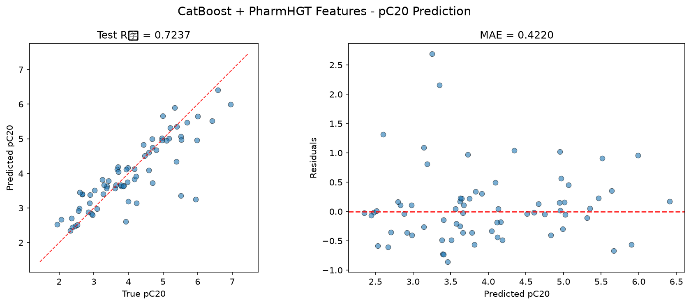
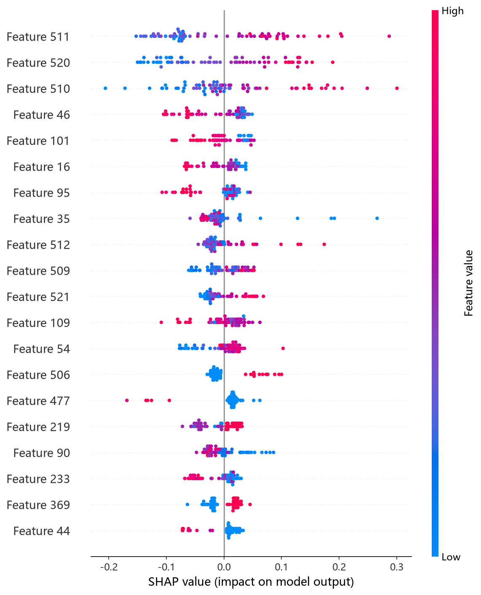
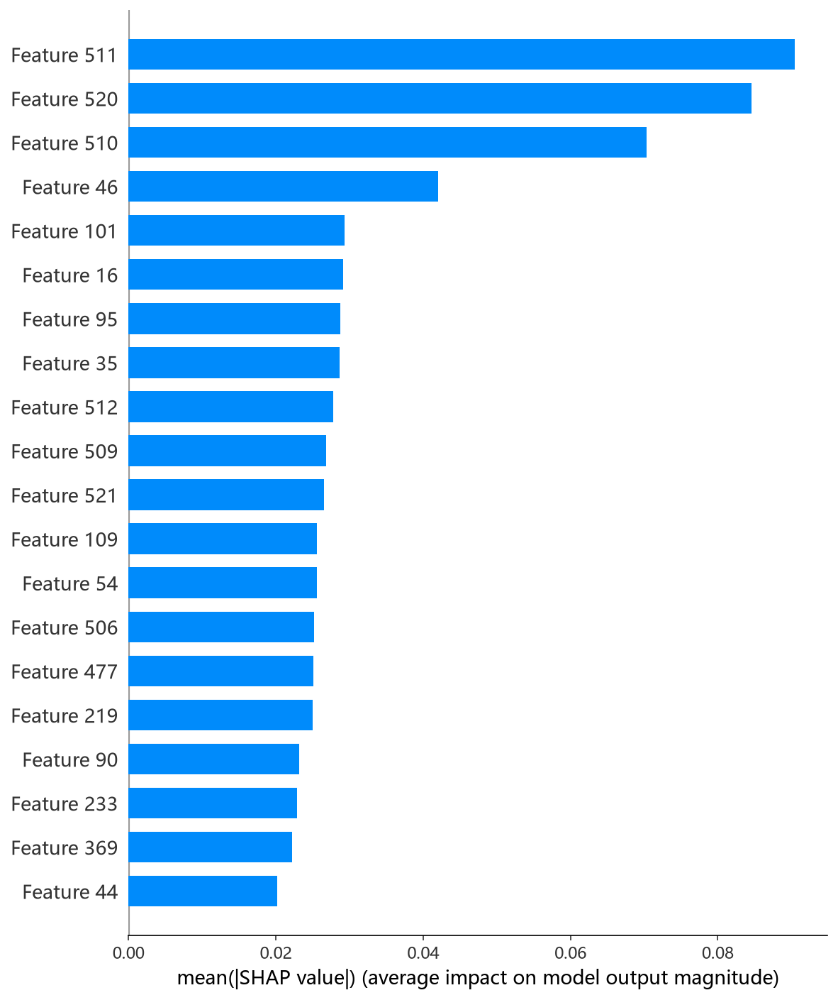

# CatBoost 模型报告 — pC20 预测

## 报告信息

| 项目 | 内容 |
|------|------|
| 目标变量 | pC20（表面活性剂效率，log(1/C20)） |
| 运行目录 | `runs\pC20\pC20_catboost_20260806_104441` |
| 运行时间 | 10:44 ~ 12:04（约 80 分钟，含 Optuna 50 轮调参） |
| 特征类型 | PharmHGT 522 维手工特征 |
| 报告生成日期 | 2026-08-07 |

## 概述

CatBoost 是 Yandex 提出的梯度提升框架，以**对称树（oblivious tree）**、**有序提升（Ordered Boosting）**对类别特征的原生支持著称。在本项目 522 维全数值特征下，其有序提升天然抑制预测偏移，配合 Optuna 50 轮 × 5 折交叉验证调参。

在 pC20 任务中，CatBoost 的 Test R² = 0.7237、Test RMSE = 0.6276，在 10 个模型中排名第 2，仅落后最优 MLP（0.8127），是**树模型中的最优者**。pC20 是表面活性剂效率（使表面张力降低 20 mN/m 所需浓度的负对数），刻画分子在界面上的"高效性"，其预测价值与疏水尾结构强相关。

## 数据与方法

- **特征**：522 维 PharmHGT 风格特征。本模型是 pC20 target 的**首个运行**，日志显示 `[Cache MISS] Computing features...`（564/564 训练分子、70/70 测试分子全部有效），特征计算完成后写入缓存 `data\features\surfpro\pC20/`，供后续模型复用。
- **数据规模**：训练池 564 条（493 训练 + 71 验证），测试集 70 条。
- **数据划分**：`train_test_split(0.125, random_state=42)`，固定随机种子。

## 超参数与调优

采用 **Optuna 50 轮 × 5 折交叉验证**（TPE 采样器 + MedianPruner）。

**最优试验（Trial 15，CV RMSE = 0.5527）：**

| 参数 | 值 |
|------|-----|
| depth | 7 |
| learning_rate | 0.0327 |
| iterations | 2023 |
| l2_leaf_reg | 5.3555 |
| random_strength | 6.3216 |
| bagging_temperature | 0.2091 |
| border_count | 140 |
| one_hot_max_size | 17 |
| leaf_estimation_iterations | 3 |
| min_data_in_leaf | 38 |

**Optuna 参数重要度：**

| 参数 | 重要度 |
|------|--------|
| **random_strength** | **0.3798** |
| **l2_leaf_reg** | **0.2597** |
| iterations | 0.0813 |
| learning_rate | 0.0732 |
| one_hot_max_size | 0.0589 |
| depth | 0.0539 |
| 其余（min_data_in_leaf 等） | < 0.06 |

参数重要度显示 **random_strength（随机强度）与 l2_leaf_reg（叶子 L2 正则）合计贡献约 0.64**，是决定 pC20 预测质量的两大因素——两者共同抑制分裂随机性与叶子过拟合，说明 522 维特征上的树模型依旧对正则敏感。最优解 depth=7（中等深度）、iterations=2023、lr=0.0327 的组合体现了"足够深但不过分"的取舍，与 pCMC 任务中的 CatBoost 结论一致。

## 训练过程

- **调参阶段**：50 轮 Optuna 中 21 轮被剪枝。最优 Trial 15（CV RMSE 0.5527）在早期即建立优势，此后 Trial 13（0.5574）、Trial 36（0.5549）、Trial 44（0.5541）多次逼近但均未超越，搜索在深度 7、lr≈0.03 附近收敛稳定。
- **最终训练**：以最优参数在 493 条数据上训练，**过拟合检测器在第 150 轮等待后触发早停**（`Stopped by overfitting detector`），`bestTest = 0.5479660` 出现在 **bestIteration = 1066**，模型收缩至前 1067 轮迭代——最终实际用于预测的树数与调参设定的 2023 相比被大幅截断，有效抑制了过拟合。

## 测试结果

| 指标 | 值 |
|------|-----|
| Test RMSE | **0.6276** |
| Test MAE | **0.4220** |
| Test R² | **0.7237** |
| Best CV RMSE | 0.5527 |

> 图：预测值 vs 真实值散点图与残差图见 [pred_vs_true.png](../../../runs/pC20/pC20_catboost_20260806_104441/pred_vs_true.png)。
>
> 

Test RMSE（0.6276）高于调参 CV（0.5527）约 0.075，且 Test R²（0.7237）明显低于 CV 隐含水平，存在一定**调参-测试口径差距**——这与 pC20 训练池仅 564 条、测试集仅 70 条有关，小样本下测试波动被放大。Test MSE = 0.3939 与之印证。

## 特征重要性（Top 20）

日志输出的 Top-20 特征重要度：

1. **HeavyAtoms**（重原子数）5.0
2. **MolWt**（分子量）4.4
3. **LogP**（脂水分配系数）3.8
4. TPSA（极性表面积）1.7
5. atom_mean_46 1.5
6. atom_mean_35 1.5
7. atom_std_40 1.5
8. atom_std_54 1.4
9. atom_std_20 1.3
10. brics_7 1.3

Top-3 均为**全局疏水性/尺寸描述符**（HeavyAtoms、MolWt、LogP），与 pC20 的物理机制高度吻合：pC20 衡量表面活性剂降低表面张力的效率，**疏水尾越长（重原子越多、LogP 越高），C20 越低、pC20 越大**。TPSA 与原子级特征（atom_mean_35 等）次之，说明极性与局部电子结构对界面效率也有调节作用。

SHAP 分析（TreeExplainer）给出了更精确的归因：

*SHAP 蜜蜂图：每个点是一个测试样本，x 轴为 SHAP 值，颜色代表特征取值高低。*

*Top-20 平均 |SHAP| 条形图：LogP、HeavyAtoms、MolWt 位列前三，与重要度排序一致。*

## 结论与评价

**优点：**
- **树模型最优**：R² = 0.7237，在 10 个模型中排名第 2，是除 MLP 外精度最高的模型。
- 有序提升 + 早停 + 强正则（l2_leaf_reg、random_strength），对 522 维小样本任务过拟合控制到位。
- 调参稳定：最优解收敛明确，21 轮被剪枝佐证搜索高效。

**不足：**
- 调参成本高（约 80 分钟），为所有模型中最长之一（Optuna 50 轮 × 5 折 + CatBoost 训练偏慢）。
- 相对最优 MLP（0.5168 / 0.8127）仍有约 0.11 的 RMSE 差距，未登顶——pC20 是深度模型胜出的 target。
- 调参 CV（0.5527）与测试（0.6276）存在约 0.075 的差距，小样本下测试波动明显。

**横向定位（10 个模型中按 Test RMSE 排序）：**

| 排名 | 模型 | Test RMSE | Test R² |
|------|------|-----------|---------|
| 1 | MLP | 0.5168 | 0.8127 |
| **2** | **CatBoost** | **0.6276** | **0.7237** |
| 3 | CIF (ExtraTrees) | 0.6422 | 0.7108 |
| 4 | XGBoost | 0.6498 | 0.7039 |

CatBoost 以树模型最优的成绩紧追 MLP，是**追求可解释性时的首选**；其 SHAP 归因与 Top-20 重要度共同确认了疏水性/尺寸描述符对 pC20 的主导作用。若可接受黑盒模型，MLP 精度更高；若需兼顾稳健与可解释，CatBoost 是最佳折中。
