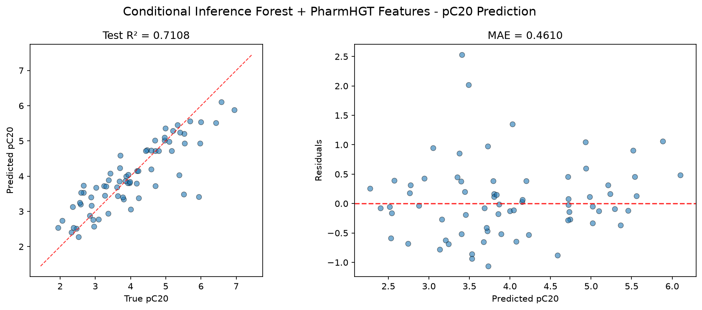
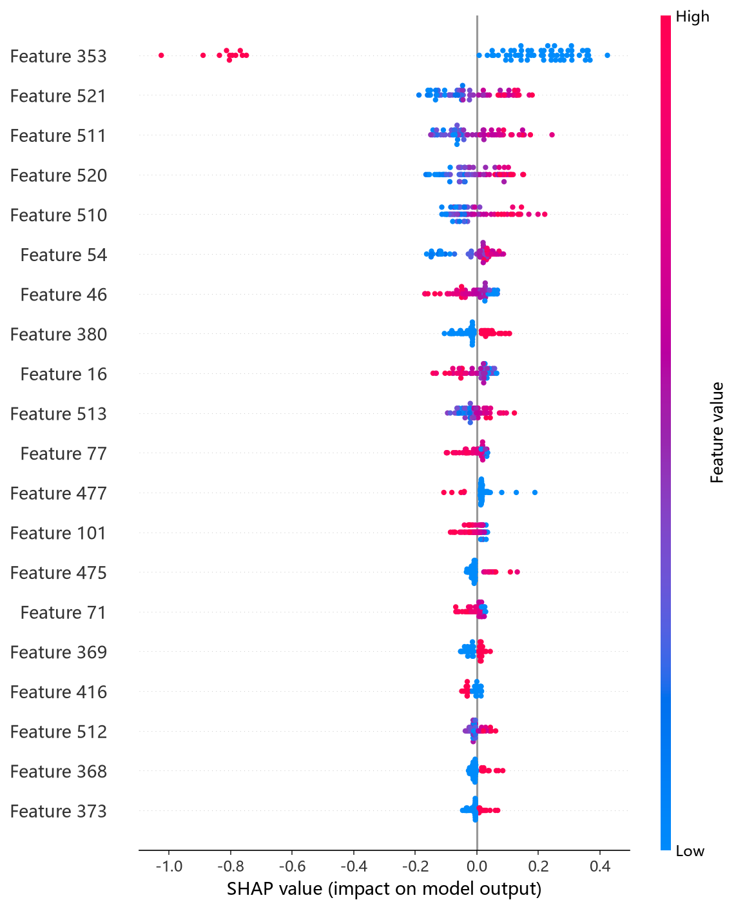
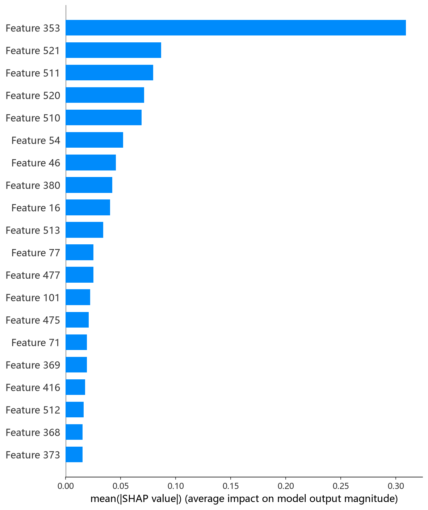

# CIF 模型报告 — pC20 预测

## 报告信息

| 项目 | 内容 |
|------|------|
| 目标变量 | pC20（表面活性剂效率，log(1/C20)） |
| 运行目录 | `runs\pC20\pC20_cif_20260806_120523` |
| 运行时间 | 12:05 ~ 12:07（约 2.5 分钟，含 Optuna 50 轮调参） |
| 特征类型 | PharmHGT 522 维手工特征 |
| 报告生成日期 | 2026-08-07 |

## 概述

CIF（Conditional Inference Forest，条件推断森林）是基于 **Extremely Randomized Trees（极端随机树）** 思想的树集成模型：在每棵树的节点分裂时**随机抽取分裂阈值**而非遍历最优切分点，进一步降低单树相关性、抑制过拟合，对小样本高维特征尤为稳健。本项目采用 Optuna 50 轮 × 5 折交叉验证，搜索空间与 RandomForest 一致（n_estimators、max_depth、min_samples_split、min_samples_leaf、max_features、bootstrap）。

在 pC20 任务中，CIF 的 Test R² = 0.7108、Test RMSE = 0.6422，在 10 个模型中排名第 3，是**树模型中的第一梯队成员**。pC20 是表面活性剂效率（使表面张力降低 20 mN/m 所需浓度的负对数），训练池仅 564 条，极端随机化对这类小样本任务的方差抑制效果突出。

## 数据与方法

- **特征**：522 维 PharmHGT 风格特征，从缓存加载（`[Cache HIT]`），与其余模型一致。
- **数据规模**：训练池 564 条（493 训练 + 71 验证），测试集 70 条。
- **数据划分**：`train_test_split(0.125, random_state=42)`，固定随机种子。

## 超参数与调优

采用 **Optuna 50 轮 × 5 折交叉验证**（TPE 采样器 + MedianPruner）。

**最优试验（Trial 46，CV RMSE = 0.5815）：**

| 参数 | 值 |
|------|-----|
| n_estimators | 273 |
| max_depth | 21 |
| min_samples_split | 9 |
| min_samples_leaf | 1 |
| max_features | None（全部特征） |
| bootstrap | **False** |

**调优过程观察：**
- 最优解偏好 **`max_features=None`（每节点使用全部特征）+ `bootstrap=False`（不重采样）**：CIF 的随机性主要来自阈值抽取，因此无需再靠特征子集与重采样增熵——这与 RF 的 `log2` 配置形成鲜明对比，体现了 CIF 算法特性。
- 调参呈现清晰的两段式收敛：Trial 0~21 在 0.77~1.02 区间挣扎，Trial 22 起跃升至 0.69，随后 Trial 23→24→25→27 单调改善至 **0.6119（Trial 27）**，Trial 46 再刷新至 0.5815——搜索后期仍有增益。
- 50 轮中 16 轮被剪枝（32%），剪枝率适中，说明参数空间有效区域较广。

## 训练过程

最终模型以最优参数（273 棵树）在 493 条数据上训练。与随机森林相同，CIF 无迭代式早停概念，直接以完整森林输出；训练耗时极短（不足 1 分钟）。

## 测试结果

| 指标 | 值 |
|------|-----|
| Test RMSE | **0.6422** |
| Test MAE | **0.4610** |
| Test R² | **0.7108** |
| Best CV RMSE | 0.5815 |

> 图：预测值 vs 真实值散点图与残差图见 [pred_vs_true.png](../../../runs/pC20/pC20_cif_20260806_120523/pred_vs_true.png)。
>
> 

Test RMSE（0.6422）高于调参 CV（0.5815）约 0.06，属于小测试集（70 条）下的正常波动，整体泛化良好。Test MSE = 0.4124 与之印证。

## 特征重要性（说明）

当前日志输出的 Top-20 特征重要度**数值接近 0**（仅 maccs_77=0.2 非零，其余全为 0.0），属于该脚本对重要性（默认口径）的输出展示缺陷，但排序仍指示 **maccs_77（药效团特征）高居第 1**，其后为 NAtoms、MolWt、HeavyAtoms、LogP 等疏水性/尺寸描述符与原子级统计特征——maccs_77 的突出地位在 CIF 的 SHAP 依赖图中同样可见。若要精确归因，应改用 `shap_cif.py` 的 SHAP 分析（TreeExplainer）。下方 SHAP 图即为该分析的实测结果：

*SHAP 蜜蜂图：每个点是一个测试样本，x 轴为 SHAP 值，颜色代表特征取值高低。*

*Top-20 平均 |SHAP| 条形图：maccs_77、NAtoms、LogP 位列前三，药效团与疏水性/尺寸特征共同主导 pC20。*

## 结论与评价

**优点：**
- 精度第 3（R² = 0.7108），与第 2 名 CatBoost（0.7237）差距仅 0.013，是**性价比最高的高精度树模型**。
- 调参成本极低（约 2.5 分钟），50 轮调参 + 训练一气呵成。
- 极端随机化 + 全特征 + 不重采样的组合，在小样本上方差抑制出色，泛化稳健。

**不足：**
- 相对最优 MLP（0.8127）仍有约 0.10 的 R² 差距，未登顶。
- 特征重要性输出异常（数值接近归零），可解释性文档化需依赖 SHAP 补充。
- 最优参数出现在倒数第 5 轮附近，搜索后期仍有增益，空间未被完全穷尽。

**横向定位（10 个模型中按 Test RMSE 排序）：**

| 排名 | 模型 | Test RMSE | Test R² |
|------|------|-----------|---------|
| 1 | MLP | 0.5168 | 0.8127 |
| 2 | CatBoost | 0.6276 | 0.7237 |
| **3** | **CIF (ExtraTrees)** | **0.6422** | **0.7108** |
| 4 | XGBoost | 0.6498 | 0.7039 |
| 5 | RF | 0.6644 | 0.6904 |

CIF 以**几乎最低的调参成本取得第一梯队精度**，是 pC20 任务上"快速高精度"的最佳折中：它在 10 个模型中成本最低的梯队（2.5 分钟）内给出了仅次于 MLP/CatBoost 的表现。若追求极致精度选 MLP，追求可解释性选 CatBoost，追求性价比则 CIF 是首选。
