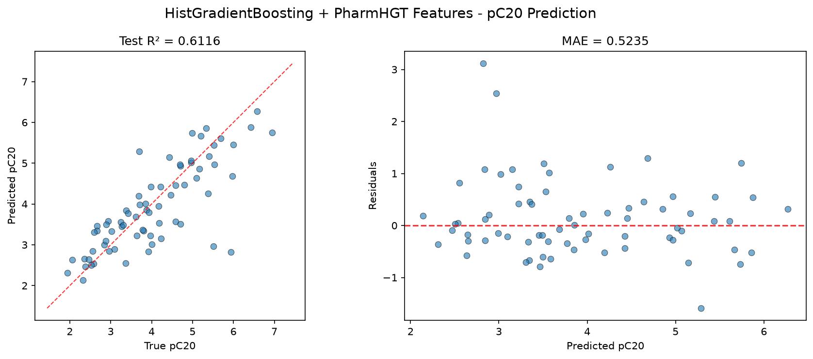
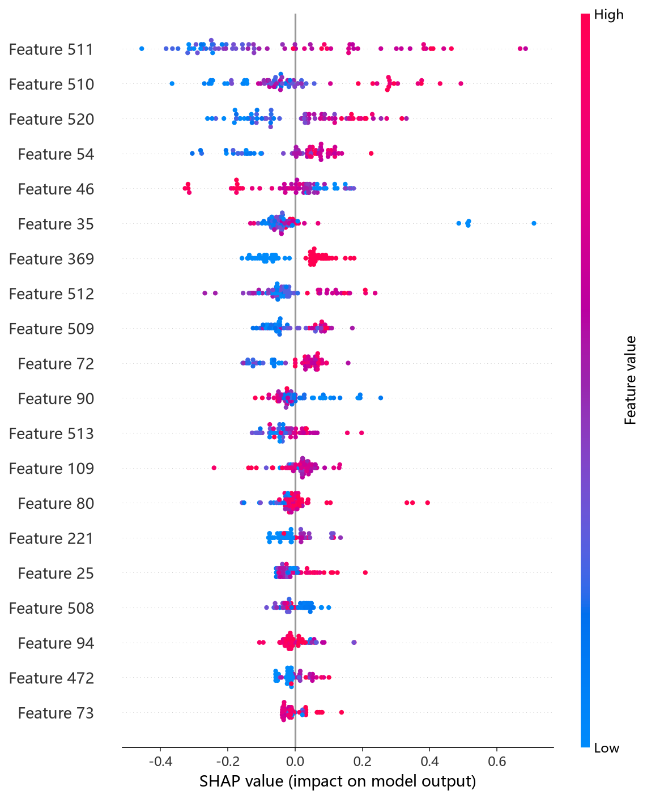
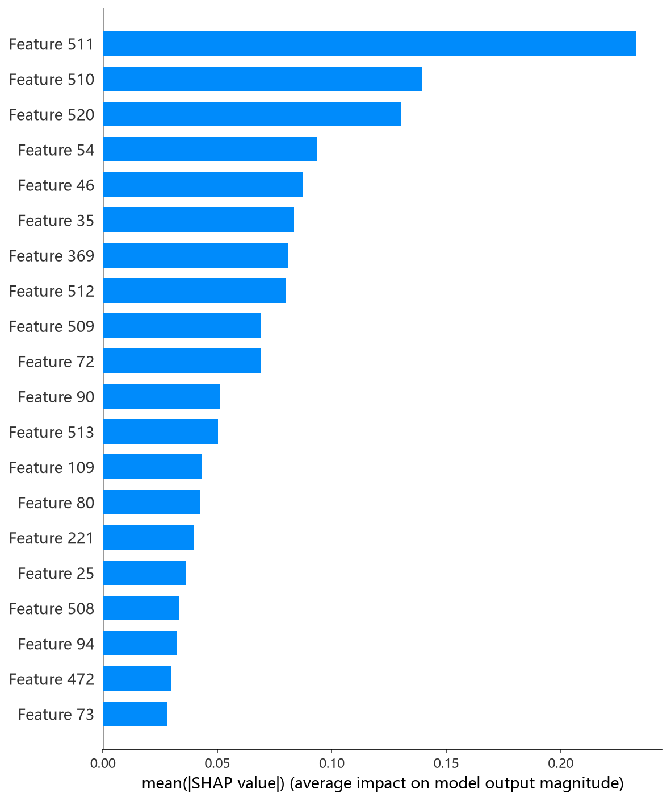

# HistGradientBoosting 模型报告 — pC20 预测

## 报告信息

| 项目 | 内容 |
|------|------|
| 目标变量 | pC20（表面活性剂效率，log(1/C20)） |
| 运行目录 | `runs\pC20\pC20_histgb_20260806_120916` |
| 运行时间 | 12:09 ~ 12:29（约 20 分钟，含 Optuna 50 轮调参） |
| 特征类型 | PharmHGT 522 维手工特征 |
| 报告生成日期 | 2026-08-07 |

## 概述

HistGradientBoosting（HistGB）是 scikit-learn 基于 **Histogram 直方图算法** 的梯度提升实现，与 LightGBM 同源但集成在 sklearn 生态，支持内置的**验证集早停**与原生缺失值处理。本项目采用 Optuna 50 轮 × 5 折交叉验证，对 learning_rate、max_iter、max_depth、max_leaf_nodes、min_samples_leaf、l2_regularization、max_bins 等参数联合搜索。

在 pC20 任务中，HistGB 的 Test R² = 0.6116、Test RMSE = 0.7441，在 10 个模型中排名第 8，处于中下游，仅优于深度模型 RNN 与 Transformer。pC20 是表面活性剂效率（使表面张力降低 20 mN/m 所需浓度的负对数），训练池仅 564 条，对小样本的拟合要求较高。

## 数据与方法

- **特征**：522 维 PharmHGT 风格特征，从缓存加载（`[Cache HIT]`），与其余模型一致。
- **数据规模**：训练池 564 条（493 训练 + 71 验证），测试集 70 条。
- **数据划分**：`train_test_split(0.125, random_state=42)`，固定随机种子。

## 超参数与调优

采用 **Optuna 50 轮 × 5 折交叉验证**（TPE 采样器 + MedianPruner）。

**最优试验（Trial 26，CV RMSE = 0.5976）：**

| 参数 | 值 |
|------|-----|
| learning_rate | 0.231 |
| max_iter | 740 |
| max_depth | 5 |
| max_leaf_nodes | 255 |
| min_samples_leaf | 5 |
| l2_regularization | 0.787 |
| max_bins | 164 |

**调优过程观察：**
- 最优解偏好 **较浅树（max_depth=5）+ 大学习率（0.231）+ 大量叶子（255）**，依赖浅树 + 高 lr 的"快速拟合"策略，而非深层小步长。
- Trial 4（0.6100）→ Trial 11（0.6034）→ Trial 12（0.6011）→ Trial 17（0.5990）→ Trial 26（0.5976），CV 单调缓降，搜索稳定收敛。
- 50 轮中 **29 轮被剪枝（58%）**，占比为所有模型中最高——多数试验在早期即被 MedianPruner 判定无法超越当前最优，说明 522 维特征上 HistGB 的参数敏感度较高、无效区域大。

## 训练过程

最终模型以最优参数在 493 条数据上训练。HistGradientBoostingRegressor 采用**内置基于验证集的早停**（日志未输出具体 best iteration），训练自动在验证指标不再改善时截断。该模型未配置额外早停日志，属于 sklearn 内部机制，交付模型为验证最优状态。

## 测试结果

| 指标 | 值 |
|------|-----|
| Test RMSE | **0.7441** |
| Test MAE | **0.5235** |
| Test R² | **0.6116** |
| Best CV RMSE | 0.5976 |

> 图：预测值 vs 真实值散点图与残差图见 [pred_vs_true.png](../../../runs/pC20/pC20_histgb_20260806_120916/pred_vs_true.png)。
>
> 

Test RMSE（0.7441）明显高于调参 CV（0.5976）约 0.15，是 10 个模型中测试-调参差距最大的之一，说明其在小测试集（70 条）上的泛化表现不及 CV 暗示的水平——浅树高 lr 配置在小样本上对分布偏移较敏感。Test MSE = 0.5537 与之印证。

## 特征重要性（Top 20）

HistGB 采用 **permutation-based 置换重要度**（数值为对指标下降的贡献，含标准差），比其余模型的树内增益口径更稳健：

1. **LogP**（脂水分配系数）0.2600 ± 0.0361
2. **HeavyAtoms**（重原子数）0.1720 ± 0.0375
3. **MolWt**（分子量）0.1553 ± 0.0329
4. TPSA（极性表面积）0.0620 ± 0.0129
5. atom_mean_54 0.0586 ± 0.0297
6. tail_ratio（尾部碳比例）0.0579 ± 0.0184
7. atom_mean_35 0.0556 ± 0.0124
8. atom_std_35 0.0528 ± 0.0197
9. atom_mean_25 0.0438 ± 0.0080
10. atom_mean_46 0.0378 ± 0.0099

Top-3（LogP、HeavyAtoms、MolWt）为**全局疏水性/尺寸描述符**，与 pC20 物理机制（疏水尾越长、界面效率越高）高度吻合，也与 CatBoost、LightGBM 等模型结论一致；tail_ratio 位列第 6，延续了 LightGBM 对"疏水尾占比"重要性的强调。TPSA 与 HBA（氢键受体）表明极性因素亦有一定贡献。

SHAP 分析（TreeExplainer）给出了更精确的归因：

*SHAP 蜜蜂图：每个点是一个测试样本，x 轴为 SHAP 值，颜色代表特征取值高低。*

*Top-20 平均 |SHAP| 条形图：LogP、MolWt、HeavyAtoms 位列前三，与置换重要度排序一致。*

## 结论与评价

**优点：**
- 采用 permutation-based 重要度，比树内增益口径更稳健，可解释性输出可信度高。
- sklearn 原生实现 + 内置早停，接口统一、易集成。
- 调参收敛明确（CV 从 0.61 单调降至 0.5976），搜索过程稳定。

**不足：**
- 精度仅第 8（R² = 0.6116），显著落后 MLP（0.8127）与 CatBoost（0.7237），处于中下游。
- Test（0.7441）与 CV（0.5976）差距约 0.15，为所有模型最大之一，小样本泛化压力明显。
- 剪枝率高达 58%，参数空间大量无效区域，说明浅树高 lr 策略在该任务上欠稳。

**横向定位（10 个模型中按 Test RMSE 排序）：**

| 排名 | 模型 | Test RMSE | Test R² |
|------|------|-----------|---------|
| 6 | NGBoost | 0.6652 | 0.6897 |
| 7 | LightGBM | 0.6919 | 0.6643 |
| **8** | **HistGB** | **0.7441** | **0.6116** |
| 9 | RNN | 0.8516 | 0.4913 |
| 10 | Transformer | 1.0480 | 0.2297 |

HistGB 在 pC20 上表现平庸：与同源的 LightGBM（0.6643）相比差距明显，主要受制于小样本下浅树高 lr 配置的泛化短板。作为 sklearn 生态的梯度提升默认选择，其**集成便利性**是主要价值；追求精度时应优先 MLP/CatBoost，追求速度可优先 LightGBM。
