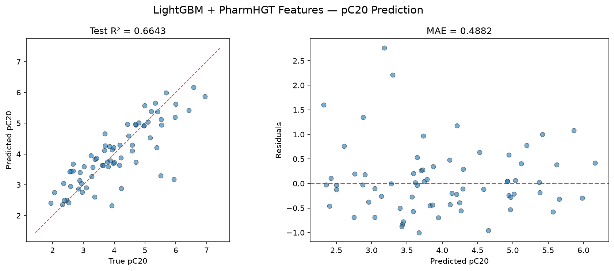
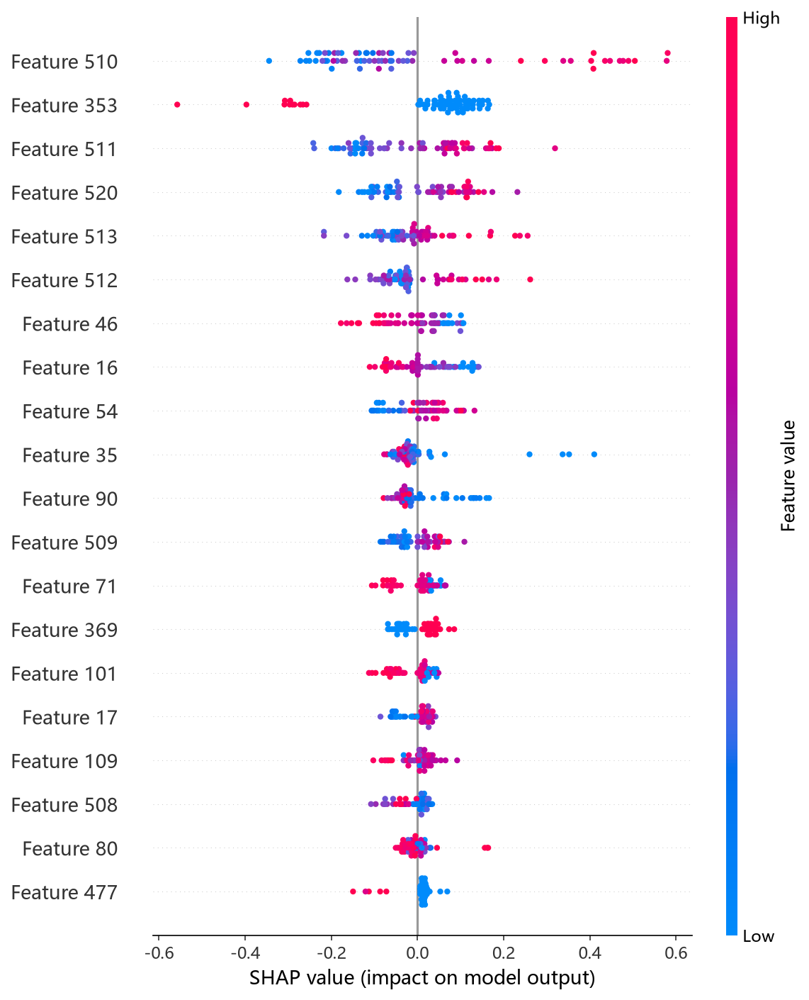
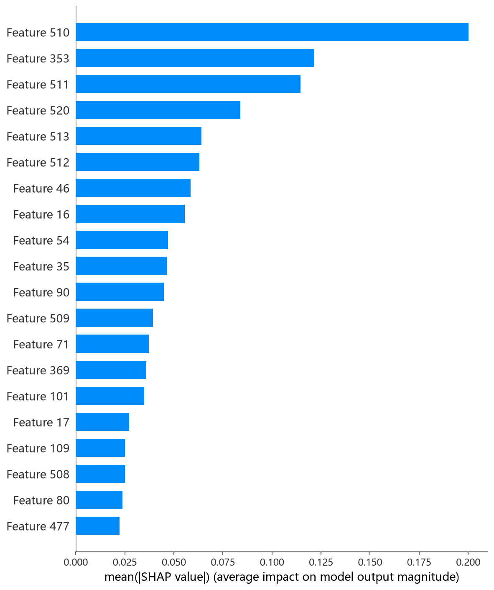

# LightGBM 模型报告 — pC20 预测

## 报告信息

| 项目 | 内容 |
|------|------|
| 目标变量 | pC20（表面活性剂效率，log(1/C20)） |
| 运行目录 | `runs\pC20\pC20_lightgbm_20260806_123004` |
| 运行时间 | 12:30 ~ 12:32（约 2 分钟，含 Optuna 50 轮调参） |
| 特征类型 | PharmHGT 522 维手工特征 |
| 报告生成日期 | 2026-08-07 |

## 概述

LightGBM 是微软开源的梯度提升框架，以 **Histogram-based 直方图算法**（将特征离散化为 bins）、**Leaf-wise 按叶子生长**与原生稀疏支持著称，训练速度通常为传统提升树的数倍。本项目采用 Optuna 50 轮 × 5 折交叉验证，搜索空间同时覆盖 **gbdt 与 dart** 两种 boosting 方式。

在 pC20 任务中，LightGBM 的 Test R² = 0.6643、Test RMSE = 0.6919，在 10 个模型中排名第 7，处于中游。pC20 是表面活性剂效率（使表面张力降低 20 mN/m 所需浓度的负对数），与 pCMC 强相关（r≈0.76），本任务训练池仅 564 条，对模型的正则能力要求较高。

## 数据与方法

- **特征**：522 维 PharmHGT 风格特征，从缓存加载（`[Cache HIT]`），与其余模型一致。
- **数据规模**：训练池 564 条（493 训练 + 71 验证），测试集 70 条。
- **数据划分**：`train_test_split(0.125, random_state=42)`，固定随机种子。

## 超参数与调优

采用 **Optuna 50 轮 × 5 折交叉验证**（TPE 采样器 + MedianPruner），boosting 方式在 gbdt / dart 间随机选择。

**最优试验（Trial 49，CV RMSE = 0.5869）：**

| 参数 | 值 |
|------|-----|
| boosting_type | **gbdt** |
| max_depth | 12 |
| num_leaves | 64 |
| learning_rate | 0.00855 |
| n_estimators | 1075 |
| subsample / subsample_freq | 0.928 / 4 |
| colsample_bytree | 0.697 |
| reg_alpha / reg_lambda | 7.6e-6 / 1.1e-6 |
| min_child_samples | 5 |
| cat_smooth / cat_l2 | 43.9 / 13.7 |

**调优过程观察：**
- 早期 Trial 0/1 表现极差（CV RMSE 2.61 / 1.20），原因是 dart + 过深树（depth 12）组合在小样本上极度不稳定；**搜索迅速转向 gbdt + 中等叶子（64 叶）** 的稳健配置。
- 最优 Trial 49 在**最后一轮**才被刷新（50 轮末 CV 0.5869），说明搜索全程在 0.58~0.66 区间缓慢收敛，缺乏单调下降趋势——小样本（564）下 LightGBM 的调参收益有限。
- 50 轮中仅 8 轮被剪枝；单轮 5 折 CV 平均约 2 秒，LightGBM 是**调参成本最低的树模型**（全程约 2 分钟）。

## 训练过程

最终模型以最优参数在 493 条数据上训练，LightGBM 内置早停（验证集 50 轮不改善即停），**best iteration = 531**（valid_0 RMSE = 0.59575）。从收敛曲线看，验证 RMSE 在 400 轮左右进入平台期（0.5995 → 0.5958），随后早停在 531 轮截断，未过度训练。

## 测试结果

| 指标 | 值 |
|------|-----|
| Test RMSE | **0.6919** |
| Test MAE | **0.4882** |
| Test R² | **0.6643** |
| Best CV RMSE | 0.5869 |

> 图：预测值 vs 真实值散点图与残差图见 [pred_vs_true.png](../../../runs/pC20/pC20_lightgbm_20260806_123004/pred_vs_true.png)。
>
> 

Test RMSE（0.6919）高于调参 CV（0.5869）约 0.105，是 10 个模型中测试-调参差距较大的之一，反映小测试集（70 条）下的波动以及 LightGBM 在小样本上的泛化压力。Test MSE = 0.4787 与之印证。

## 特征重要性（Top 20）

日志输出的 Top-20 特征重要度（gain 口径）：

1. **MolWt**（分子量）1586
2. **tail_ratio**（尾部碳比例）1254
3. **LogP**（脂水分配系数）1254
4. atom_mean_35 1028
5. atom_std_54 759
6. atom_std_25 747
7. atom_mean_54 717
8. RotBonds 708
9. atom_mean_41 661
10. atom_std_35 639

Top-3 中 **tail_ratio 高居第 2 是 LightGBM 区别于其余模型的最大特色**——该特征直接刻画表面活性剂疏水尾占比，是 pC20 物理机制（疏水尾越长、界面效率越高）的最直接编码。MolWt、LogP、RotBonds 等疏水性/尺寸描述符整体靠前，与 CatBoost、RF 等模型结论一致。

SHAP 分析（TreeExplainer）给出了更精确的归因：

*SHAP 蜜蜂图：每个点是一个测试样本，x 轴为 SHAP 值，颜色代表特征取值高低。*

*Top-20 平均 |SHAP| 条形图：MolWt、LogP、maccs_77 位列前三，其中 maccs_77 为代表的药效团特征亦有贡献。*

## 结论与评价

**优点：**
- **调参成本全模型最低**：全程约 2 分钟，50 轮调参 + 最终训练一气呵成，性价比极高。
- Leaf-wise 生长 + gbdt 稳健配置，早停机制成熟，训练过程稳定。
- Top-20 重要度揭示 **tail_ratio 的关键作用**，为 pC20 物理机制提供了与其余模型互补的证据。

**不足：**
- 精度仅第 7（R² = 0.6643），明显落后 MLP（0.8127）与 CatBoost（0.7237），处于中游。
- Test（0.6919）与 CV（0.5869）差距约 0.105，为所有模型最大之一，小样本下泛化压力明显。
- 调参曲线收敛缓慢（最优出现在最后一轮），说明参数空间未完全稳定。

**横向定位（10 个模型中按 Test RMSE 排序）：**

| 排名 | 模型 | Test RMSE | Test R² |
|------|------|-----------|---------|
| 5 | RF | 0.6644 | 0.6904 |
| 6 | NGBoost | 0.6652 | 0.6897 |
| **7** | **LightGBM** | **0.6919** | **0.6643** |
| 8 | HistGB | 0.7441 | 0.6116 |
| 9 | RNN | 0.8516 | 0.4913 |

LightGBM 在 pC20 上表现中规中矩：**若以"秒级调参 + 可接受精度"为目标，它是首选**；但追求精度时应优先 MLP/CatBoost。其 tail_ratio 特征的高重要度提示，pC20 预测中"疏水尾占比"这类直接物理量应被后续模型充分保留。
