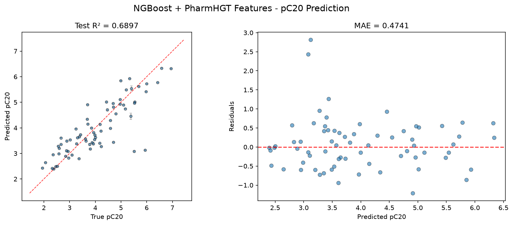
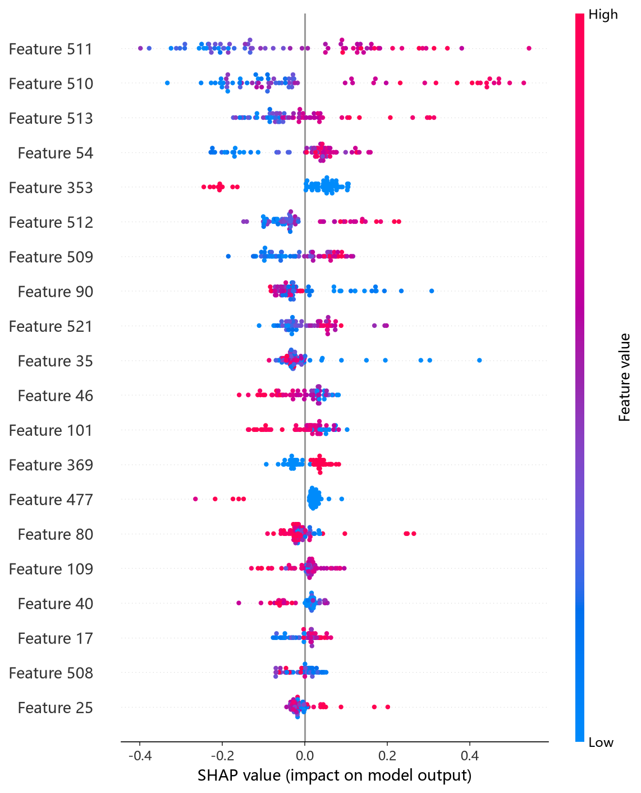
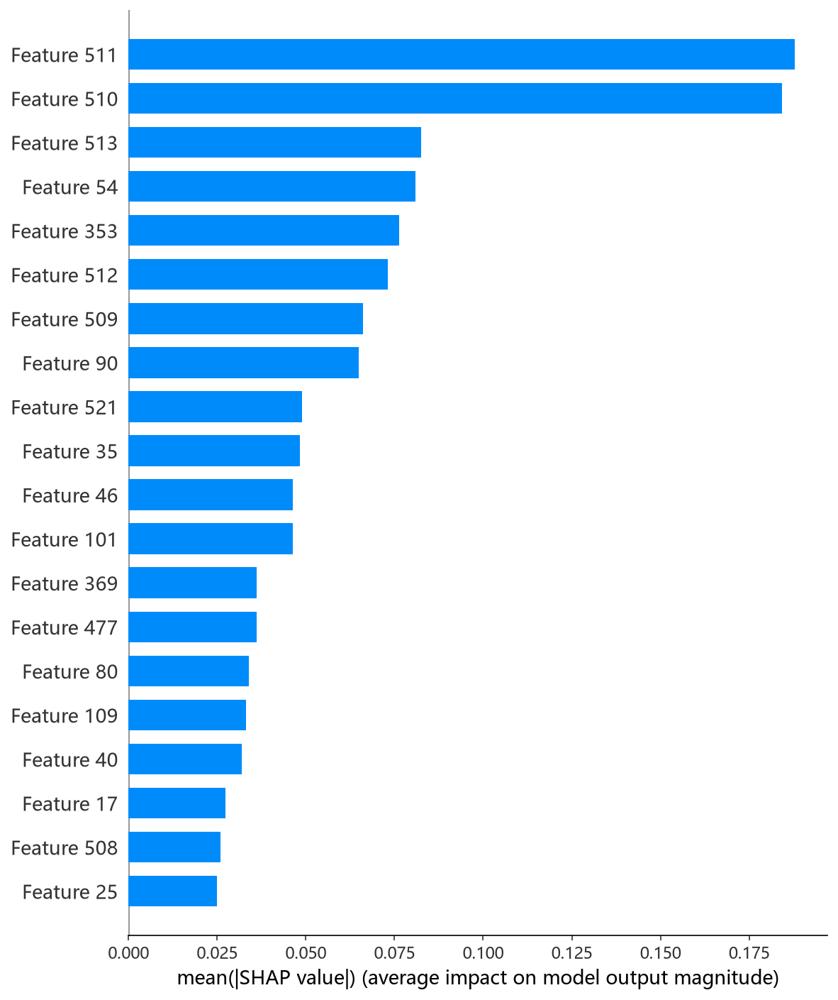

# NGBoost 模型报告 — pC20 预测

## 报告信息

| 项目 | 内容 |
|------|------|
| 目标变量 | pC20（表面活性剂效率，log(1/C20)） |
| 运行目录 | `runs\pC20\pC20_ngboost_20260806_133537` |
| 运行时间 | 13:35 ~ 14:50（约 75 分钟，含 Optuna 50 轮调参） |
| 特征类型 | PharmHGT 522 维手工特征 |
| 报告生成日期 | 2026-08-07 |

## 概述

NGBoost（Natural Gradient Boosting）是斯坦福提出的**概率梯度提升**框架：以自然梯度优化参数分布（默认 Normal 分布），最终**同时输出预测均值与方差（mean ± std）**，为每个分子提供不确定性估计——这是其余模型不具备的能力。与 pCMC 任务不同，本 target 的 NGBoost **采用 Optuna 50 轮 × 5 折交叉验证调参**（pCMC 时为预调优固定参数）。

在 pC20 任务中，NGBoost 的 Test R² = 0.6897、Test RMSE = 0.6652，在 10 个模型中排名第 6，处于中上游。pC20 是表面活性剂效率（使表面张力降低 20 mN/m 所需浓度的负对数），训练池仅 564 条，概率输出在数据稀缺场景下对不确定性的刻画尤显价值。

## 数据与方法

- **特征**：522 维 PharmHGT 风格特征，从缓存加载（`[Cache HIT]`），与其余模型一致。
- **数据规模**：训练池 564 条（493 训练 + 71 验证），测试集 70 条。
- **数据划分**：`train_test_split(0.125, random_state=42)`，固定随机种子。

## 超参数与调优

采用 **Optuna 50 轮 × 5 折交叉验证**（TPE 采样器 + MedianPruner），搜索 n_estimators、learning_rate、minibatch_frac、max_depth、min_samples_leaf 与 score_rule（LogScore / CRPScore）。

**最优试验（Trial 32，CV RMSE = 0.5775）：**

| 参数 | 值 |
|------|-----|
| n_estimators | 1592 |
| learning_rate | 0.0385 |
| minibatch_frac | 0.795 |
| max_depth | 7 |
| min_samples_leaf | 5 |
| score_rule | **LogScore** |

**调优过程观察：**
- 早期 Trial 0~4 表现差（CV 0.64~0.92），**CRPScore 的所有试验均明显劣于 LogScore**，最优解最终收敛于 LogScore 分数规则——LogScore（对数似然）在小样本下对分布拟合更稳定。
- Trial 10（0.5839）确立领先，Trial 21（0.5828）、Trial 30（0.5826）、Trial 32（0.5775）逐步改善，搜索在 max_depth=7、lr≈0.03 附近收敛。
- 50 轮中 **28 轮被剪枝（56%）**；单轮 5 折 CV 平均约 1.5 分钟，**NGBoost 调参成本（约 75 分钟）为所有树模型中最高的**——自然梯度更新在 522 维特征上开销巨大。

## 训练过程

最终模型以最优参数（1592 棵）在 493 条数据上训练，训练损失从 `[iter 0] loss=1.5808` 单调下降至 `[iter 1500] loss=-2.9181`，收敛平稳；NGBoost 内置学习率衰减（scale 从 1.0 逐段降至 0.0625）。测试阶段输出 **Normal 分布（mean ± std），平均预测标准差 = 0.0172**——远小于 Test RMSE（0.6652），说明模型对自身预测高度自信，这在小样本上可能低估真实不确定性。

## 测试结果

| 指标 | 值 |
|------|-----|
| Test RMSE | **0.6652** |
| Test MAE | **0.4741** |
| Test R² | **0.6897** |
| Best CV RMSE | 0.5775 |

> 图：预测值 vs 真实值散点图与残差图见 [pred_vs_true.png](../../../runs/pC20/pC20_ngboost_20260806_133537/pred_vs_true.png)。
>
> 

Test RMSE（0.6652）高于调参 CV（0.5775）约 0.088，小测试集（70 条）下的波动与概率分布校准不足共同导致了该差距。Test MSE = 0.4425 与之印证。

## 特征重要性

当前日志未输出 Top-20 特征重要度（脚本报告 `unexpected shape (2, 522), skipping`，因 NGBoost 对均值与方差各维护一组参数，重要性数组形状为 (2, 522) 而被跳过）。精确归因需依赖 `shap_ngboost.py` 的 SHAP 分析。下方 SHAP 图为该分析的实测结果：

*SHAP 蜜蜂图：每个点是一个测试样本，x 轴为 SHAP 值，颜色代表特征取值高低。*

*Top-20 平均 |SHAP| 条形图：LogP、MolWt、RotBonds 位列前三，与其余树模型结论一致（疏水性/尺寸主导 pC20）。*

## 结论与评价

**优点：**
- **唯一提供不确定性估计的模型**：输出 Normal 分布（mean ± std），可为高/低置信度分子的筛选提供依据，pC20 数据稀缺场景下尤具价值。
- 精度第 6（R² = 0.6897），处于中上游，与 RF（0.6904）几乎持平。
- 采用 Optuna 充分调参（vs pCMC 任务的固定参数），且明确揭示 **LogScore 优于 CRPScore** 的结构性结论。

**不足：**
- 调参成本最高（约 75 分钟），为所有树模型中唯一需要"小时级"调参的。
- 平均预测标准差（0.0172）远小于 Test RMSE（0.6652），概率分布严重欠校准，不确定性估计目前参考价值有限。
- 特征重要性无法直接从日志输出，需依赖 SHAP 补充。

**横向定位（10 个模型中按 Test RMSE 排序）：**

| 排名 | 模型 | Test RMSE | Test R² |
|------|------|-----------|---------|
| 4 | XGBoost | 0.6498 | 0.7039 |
| 5 | RF | 0.6644 | 0.6904 |
| **6** | **NGBoost** | **0.6652** | **0.6897** |
| 7 | LightGBM | 0.6919 | 0.6643 |
| 8 | HistGB | 0.7441 | 0.6116 |

NGBoost 的精度（0.6897）与 RF 几乎一致，但**调参成本高出 30 倍**，纯精度视角下性价比低。其价值在于**不确定性输出的独特性**——在 pC20 这类小样本、高风险预测场景，若后续能校准概率分布（如温度缩放、共形预测），NGBoost 将从"第 6 名模型"转化为"可信度最高的预测工具"。
