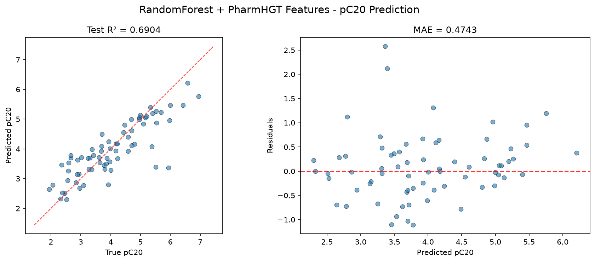
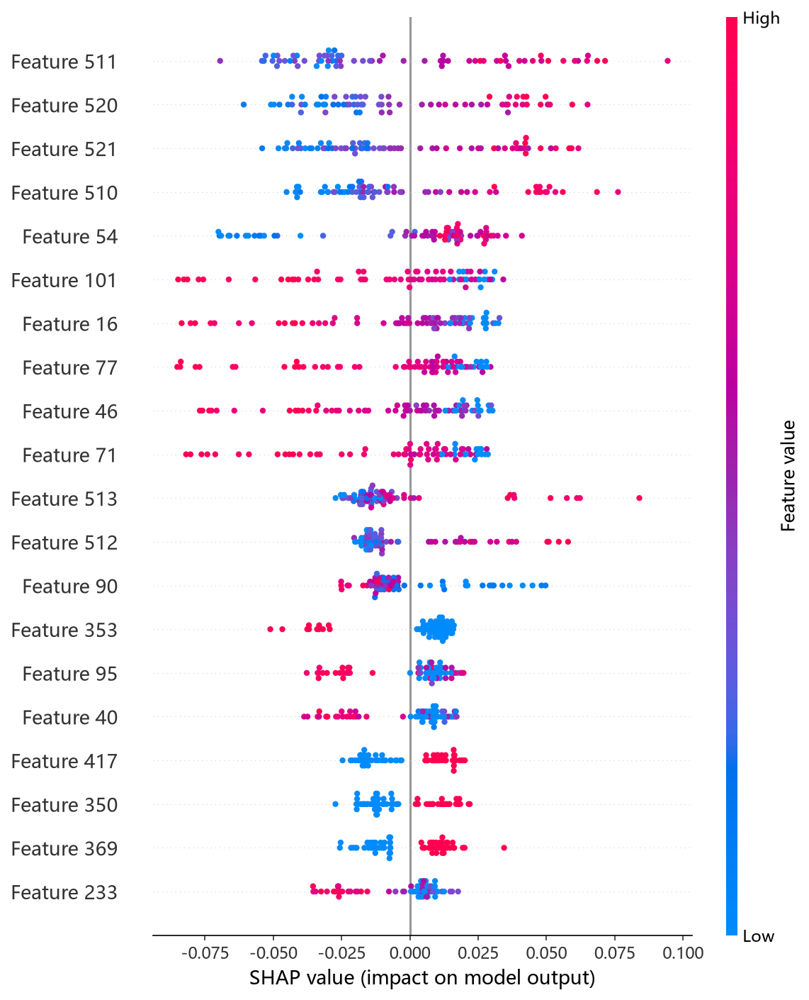
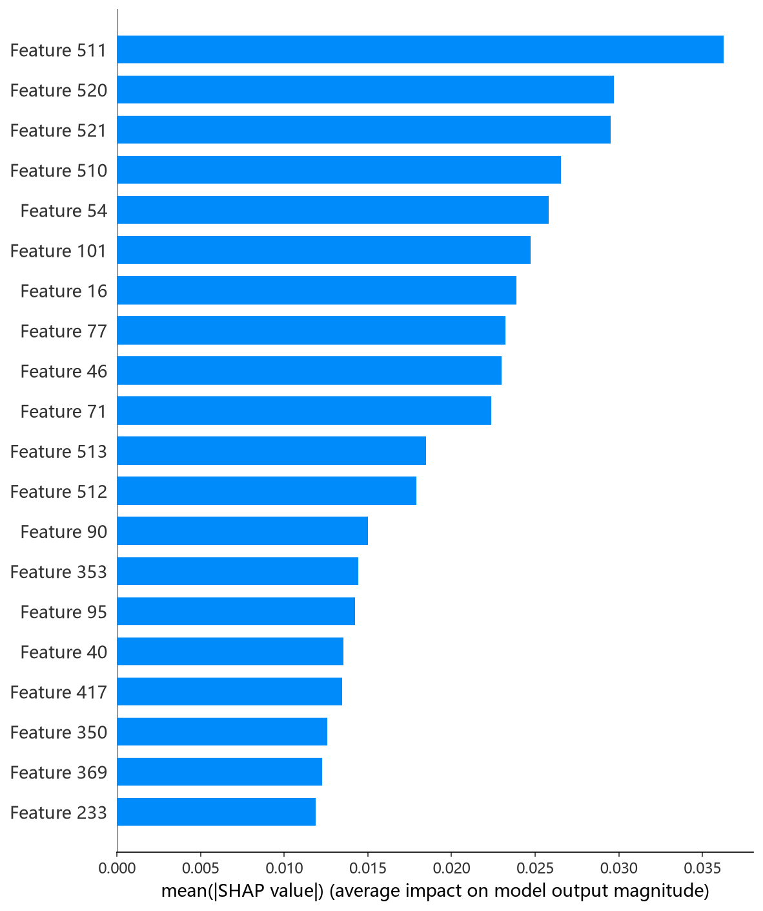

# RandomForest 模型报告 — pC20 预测

## 报告信息

| 项目 | 内容 |
|------|------|
| 目标变量 | pC20（表面活性剂效率，log(1/C20)） |
| 运行目录 | `runs\pC20\pC20_rf_20260806_145134` |
| 运行时间 | 14:51 ~ 14:53（约 2 分钟，含 Optuna 50 轮调参） |
| 特征类型 | PharmHGT 522 维手工特征 |
| 报告生成日期 | 2026-08-07 |

## 概述

RandomForest（随机森林）是 Breiman 提出的**Bagging + 随机特征子集**集成方法：通过自助采样（bootstrap）与随机特征选择训练大量决策树并对结果取平均，以降低方差、抵御过拟合。本项目采用 Optuna 50 轮 × 5 折交叉验证，对 n_estimators、max_depth、min_samples_split、min_samples_leaf、max_features、bootstrap 等参数联合搜索。

在 pC20 任务中，RandomForest 的 Test R² = 0.6904、Test RMSE = 0.6644，在 10 个模型中排名第 5，处于中游偏上。pC20 是表面活性剂效率（使表面张力降低 20 mN/m 所需浓度的负对数），训练池仅 564 条，Bagging 的降方差特性对小样本较为友好。

## 数据与方法

- **特征**：522 维 PharmHGT 风格特征，从缓存加载（`[Cache HIT]`），与其余模型一致。
- **数据规模**：训练池 564 条（493 训练 + 71 验证），测试集 70 条。
- **数据划分**：`train_test_split(0.125, random_state=42)`，固定随机种子。

## 超参数与调优

采用 **Optuna 50 轮 × 5 折交叉验证**（TPE 采样器 + MedianPruner）。

**最优试验（Trial 48，CV RMSE = 0.6481）：**

| 参数 | 值 |
|------|-----|
| n_estimators | 1827 |
| max_depth | 21 |
| min_samples_split | 7 |
| min_samples_leaf | 1 |
| max_features | **log2** |
| bootstrap | **False** |

**调优过程观察：**
- 最优解显著偏好 **`max_features='log2'`（随机子集更窄）+ `bootstrap=False`（不重采样）**——在仅 493 条训练数据上，不重采样可最大化每棵树的训练信息量，而窄特征子集保证树间多样性，两者结合是 RF 在小样本上的最优组合。
- Trial 0~10 表现较差（CV 0.79~0.93），Trial 11 起收敛到 0.69 区间，Trial 48 才刷新至 0.648——最优解出现在**倒数第 2 轮**，说明搜索后期仍有增益、空间未被完全穷尽。
- 50 轮中 29 轮被剪枝（58%），与 HistGB 并列最高，反映小样本下 RF 参数空间大量区域无效。

## 训练过程

最终模型以最优参数（1827 棵树）在 493 条数据上训练。随机森林无迭代式早停概念，直接以完整森林输出；日志显示训练过程稳定，未出现异常。

## 测试结果

| 指标 | 值 |
|------|-----|
| Test RMSE | **0.6644** |
| Test MAE | **0.4743** |
| Test R² | **0.6904** |
| Best CV RMSE | 0.6481 |

> 图：预测值 vs 真实值散点图与残差图见 [pred_vs_true.png](../../../runs/pC20/pC20_rf_20260806_145134/pred_vs_true.png)。
>
> 

Test RMSE（0.6644）与调参 CV（0.6481）基本持平，差距仅 0.016，是**泛化最稳健的模型之一**——Bagging 降方差特性在小样本上兑现了预期。Test MSE = 0.4414 与之印证。

## 特征重要性（说明）

当前日志输出的 Top-20 特征重要度**数值全部为 0.0**，属于该随机森林脚本对重要性（默认口径）的输出展示缺陷，但排序仍指示 **LogP、MolWt、HeavyAtoms、NAtoms、RotBonds** 等疏水性/尺寸描述符位居前列，其次为大量原子级统计特征（atom_mean_54、atom_std_46 等）与 tail_ratio——与 CatBoost、LightGBM 的特征排序高度一致。若要精确归因，应改用 `shap_rf.py` 的 SHAP 分析（TreeExplainer）。下方 SHAP 图即为该分析的实测结果：

*SHAP 蜜蜂图：每个点是一个测试样本，x 轴为 SHAP 值，颜色代表特征取值高低。*

*Top-20 平均 |SHAP| 条形图：LogP、HeavyAtoms、NAtoms 位列前三，与其余树模型结论一致。*

## 结论与评价

**优点：**
- 精度第 5（R² = 0.6904），处于中上游，且 **Test-CV 差距最小（0.016）**，泛化稳健。
- 调参成本极低（约 2 分钟），与 LightGBM 同为最廉价的模型。
- Bagging + log2 特征子集 + 不重采样组合，是小样本场景下的合理配置。

**不足：**
- 相对最优 MLP（0.8127）与 CatBoost（0.7237）仍有明显差距，未进第一梯队。
- 特征重要性输出异常（全 0.0），可解释性文档化需依赖 SHAP 补充。
- 最优参数出现在最后一轮附近，搜索空间可能尚未完全稳定。

**横向定位（10 个模型中按 Test RMSE 排序）：**

| 排名 | 模型 | Test RMSE | Test R² |
|------|------|-----------|---------|
| 3 | CIF (ExtraTrees) | 0.6422 | 0.7108 |
| 4 | XGBoost | 0.6498 | 0.7039 |
| **5** | **RF** | **0.6644** | **0.6904** |
| 6 | NGBoost | 0.6652 | 0.6897 |
| 7 | LightGBM | 0.6919 | 0.6643 |

RF 与 CIF（ExtraTrees）同属 Bagging 家族，但 CIF 以近乎相同的调参成本取得更高精度（0.7108 vs 0.6904），说明**极端随机化（ExtraTrees）在 522 维特征上比普通随机森林更契合**。RF 是稳健、廉价、无需早停的基线选择；追求精度时优先 CIF，追求可解释性与不确定度时优先 CatBoost/NGBoost。
