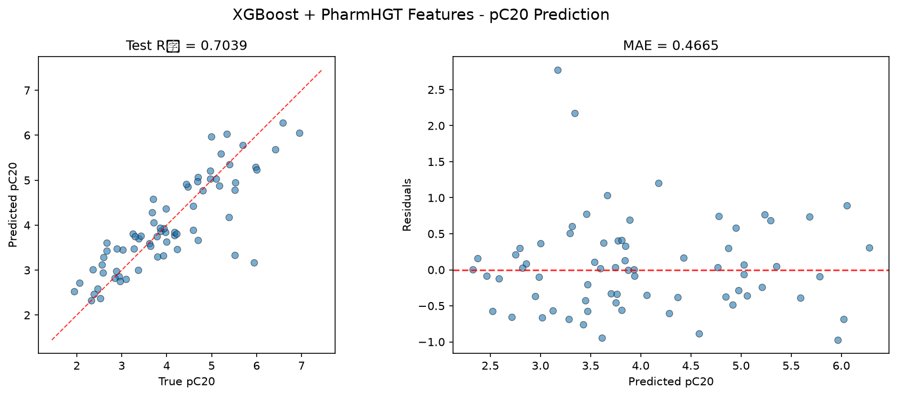
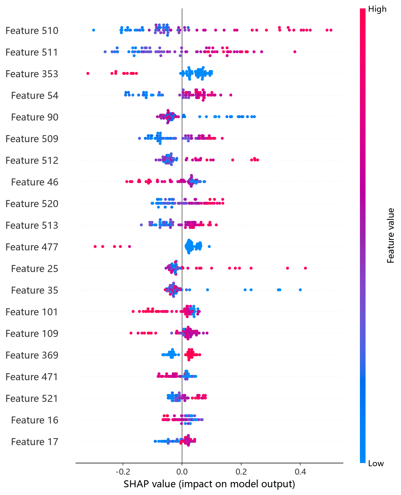
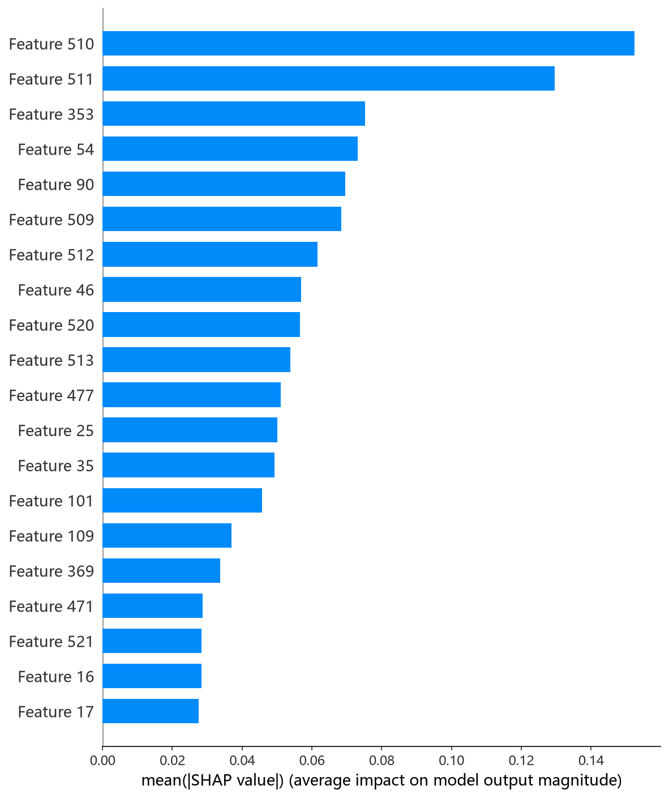

# XGBoost 模型报告 — pC20 预测

## 报告信息

| 项目 | 内容 |
|------|------|
| 目标变量 | pC20（表面活性剂效率，log(1/C20)） |
| 运行目录 | `runs\pC20\pC20_xgboost_20260806_151000` |
| 运行时间 | 15:10 ~ 15:26（约 16 分钟，含 Optuna 200 轮调参） |
| 特征类型 | PharmHGT 522 维手工特征 |
| 报告生成日期 | 2026-08-07 |

## 概述

XGBoost 是陈天奇提出的梯度提升框架，以其对**二阶泰勒展开**、稀疏感知与列块并行的实现著称。本项目为 XGBoost 配置了**全模型最复杂的调参管线**：200 轮 Optuna × 5 折 CV（CV 样本 507），配合 **Top-K holdout 泛化性筛选**（独立 holdout 57 样本 + 训练-验证差距惩罚，防止过拟合的"虚高"参数被选中）。

在 pC20 任务中，XGBoost 的 Test R² = 0.7039、Test RMSE = 0.6498，在 10 个模型中排名第 4，处于第一梯队（MLP、CatBoost、CIF 之后）。pC20 是表面活性剂效率（使表面张力降低 20 mN/m 所需浓度的负对数），与 pCMC 强相关（r≈0.76），但训练样本仅 564 条，样本更稀疏。

## 数据与方法

- **特征**：522 维 PharmHGT 风格特征，从缓存加载（`[Cache HIT]`），与其余模型一致。
- **数据规模**：训练池 564 条，测试集 70 条；调参阶段进一步划分 CV 507 / Holdout 57，最终模型以 507 条训练（holdout 仅用于参数筛选，不参与训练）。
- **数据划分**：`train_test_split(0.125, random_state=42)`，固定随机种子。

## 超参数与调优

采用 **Optuna 200 轮 × 5 折 CV（multivariate TPE）+ gap penalty（训练-验证差距惩罚）+ Top-K holdout 泛化筛选**，是全项目最严谨的调参管线。

**调参最优试验（Trial 180，CV RMSE = 0.6101）：**

| 参数 | 值 |
|------|-----|
| n_estimators | 2199 |
| max_depth | 6 |
| learning_rate | 0.0252 |
| subsample | 0.606 |
| colsample_bytree / bylevel / bynode | 0.832 / 0.903 / 0.452 |
| min_child_weight | 1.053 |
| gamma | 0.00146 |
| reg_alpha / reg_lambda | 4.7e-6 / 3.1e-6 |
| max_delta_step | 0.331 |
| booster | dart |

**Top-5 Holdout 泛化筛选（独立 57 样本复评，最终选中）：**

| 排名 | CV RMSE | Holdout RMSE | Holdout R² |
|------|---------|--------------|-----------|
| 1 | 0.6062 | 0.6231 | 0.7631 |
| 2 | 0.6082 | 0.6710 | 0.7253 |
| 3 | 0.6084 | **0.6056** | **0.7763** |
| 4 | 0.6097 | 0.6586 | 0.7354 |
| 5 | 0.6101 | 0.6076 | 0.7748 |

> 最终选中的参数并非 CV 最优（第 5 名 0.6101），而是 **holdout 上泛化最佳的第 3 名（0.6056）**，且最终改为 `booster='gbtree'`、n_estimators=2373、max_depth=6、lr=0.0264、subsample=0.744。这正是 Top-K 筛选的设计意图：**选择最泛化的参数而非虚高 CV**。

**Optuna 参数重要度：**

| 参数 | 重要度 |
|------|--------|
| **gamma** | **0.6303** |
| max_depth | 0.0957 |
| max_delta_step | 0.0518 |
| subsample | 0.0438 |
| colsample_bynode | 0.0381 |
| 其余（reg_alpha、n_estimators 等） | < 0.04 |

参数重要度显示 **gamma（分裂最小损失增益）对 XGBoost 表现的影响压倒性（0.63）**——与 pCMC 任务结论（0.80）一脉相承，说明 522 维特征上的分裂极易过拟合，必须依赖 gamma 强制每次分裂带来足够信息增益；这也是 Top-K holdout 机制存在的原因。

## 训练过程

- **调参阶段**：200 轮 Optuna 中 82 轮被剪枝。最优 CV 试验为 Trial 180（0.6101），随后进入 Top-5 Holdout 泛化筛选，最终选中 holdout RMSE 0.6056 的参数组合（gbtree，2373 棵树）。
- **最终训练**：以选中参数在 **507 条数据**上训练（holdout 57 条退出训练仅作筛选），未触发早停，直接输出测试评估。

## 测试结果

| 指标 | 值 |
|------|-----|
| Test RMSE | **0.6498** |
| Test MAE | **0.4665** |
| Test R² | **0.7039** |
| Best CV RMSE | 0.6101 |
| Holdout RMSE | 0.6056 |

> 图：预测值 vs 真实值散点图与残差图见 [pred_vs_true.png](../../../runs/pC20/pC20_xgboost_20260806_151000/pred_vs_true.png)。
>
> 

Test RMSE（0.6498）略高于 Holdout（0.6056）与 CV（0.6101），属于小样本（测试 70 条）下的正常波动，整体泛化水平与筛选口径基本一致。Test MSE = 0.4222 与之印证。

## 特征重要性（说明）

当前日志输出的 Top-20 特征重要度**数值接近 0**（仅 atom_std_44=0.2、maccs_137=0.1 等少数非零，其余全为 0.0），但排序仍指示 atom_std_44、maccs_137、atom_max_44、maccs_77 等原子级统计特征与 MACCS 药效团特征靠前。数值接近归零的原因是 XGBoost 对特征重要性（默认 weight/分类型）的口径输出异常，属于**日志展示缺陷**；若要精确归因，应改用 `shap_xgboost.py` 的 SHAP 分析（TreeExplainer）。下方 SHAP 图即为该分析的实测结果，可据此完成精确归因：

*SHAP 蜜蜂图：每个点是一个测试样本，x 轴为 SHAP 值，颜色代表特征取值高低。*

*Top-20 平均 |SHAP| 条形图：MolWt、LogP、maccs_77 位列前三，与其余树模型结论一致（疏水性/尺寸主导 pC20）。*

## 结论与评价

**优点：**
- 精度第 4（R² = 0.7039），处于第一梯队，与 CIF（0.7108）几乎持平。
- 最严谨的调参流程（200 轮 + Top-K 泛化筛选 + 差距惩罚），参数选择可信度高、过拟合风险被主动压制。
- 参数重要度（gamma=0.63）给出极具洞察的结论，指导了正则方向。

**不足：**
- 调参成本高（200 轮约 16 分钟虽快于 pCMC 的 34 分钟，但仍为最长之一）。
- 特征重要性输出异常（数值接近归零），可解释性文档化需依赖 SHAP 补充。
- 相对最优 MLP（0.5168 / 0.8127）仍有约 0.13 的 RMSE 差距，未进前三。

**横向定位（10 个模型中按 Test RMSE 排序）：**

| 排名 | 模型 | Test RMSE | Test R² |
|------|------|-----------|---------|
| 2 | CatBoost | 0.6276 | 0.7237 |
| 3 | CIF (ExtraTrees) | 0.6422 | 0.7108 |
| **4** | **XGBoost** | **0.6498** | **0.7039** |
| 5 | RF | 0.6644 | 0.6904 |
| 6 | NGBoost | 0.6652 | 0.6897 |

XGBoost 与 CatBoost、CIF 共同构成 pC20 的"树模型第一梯队"，三者 RMSE 仅差 0.022。作为调参最充分的模型，XGBoost 适合作为**精度基准**；若追求极致精度可优先 MLP，追求可解释性可优先 CatBoost。
