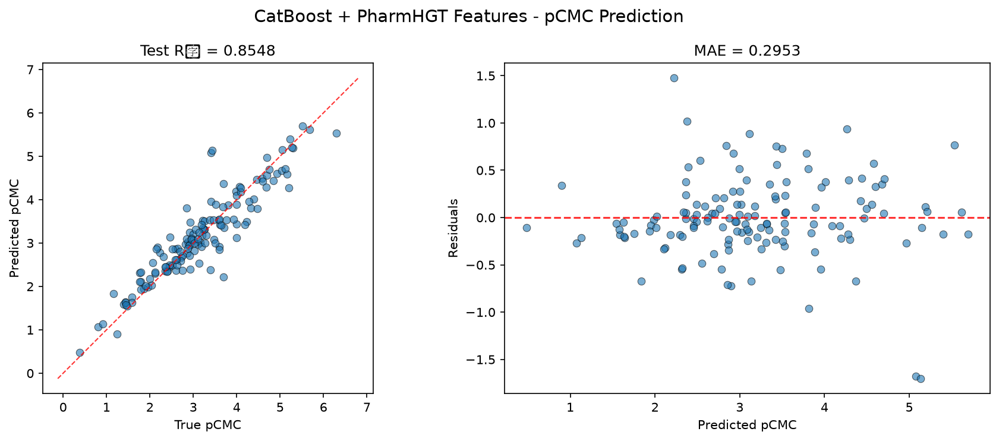
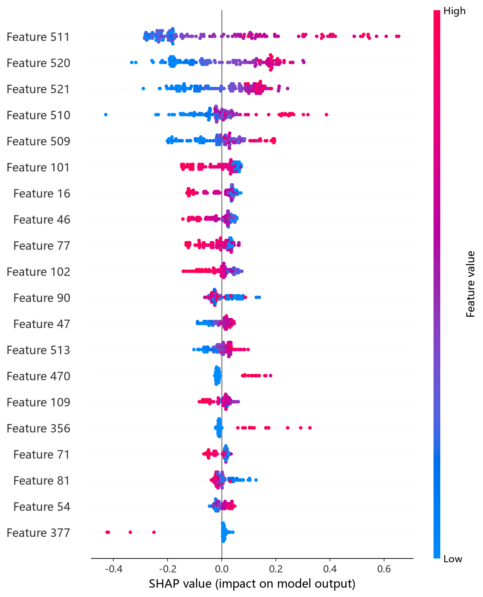
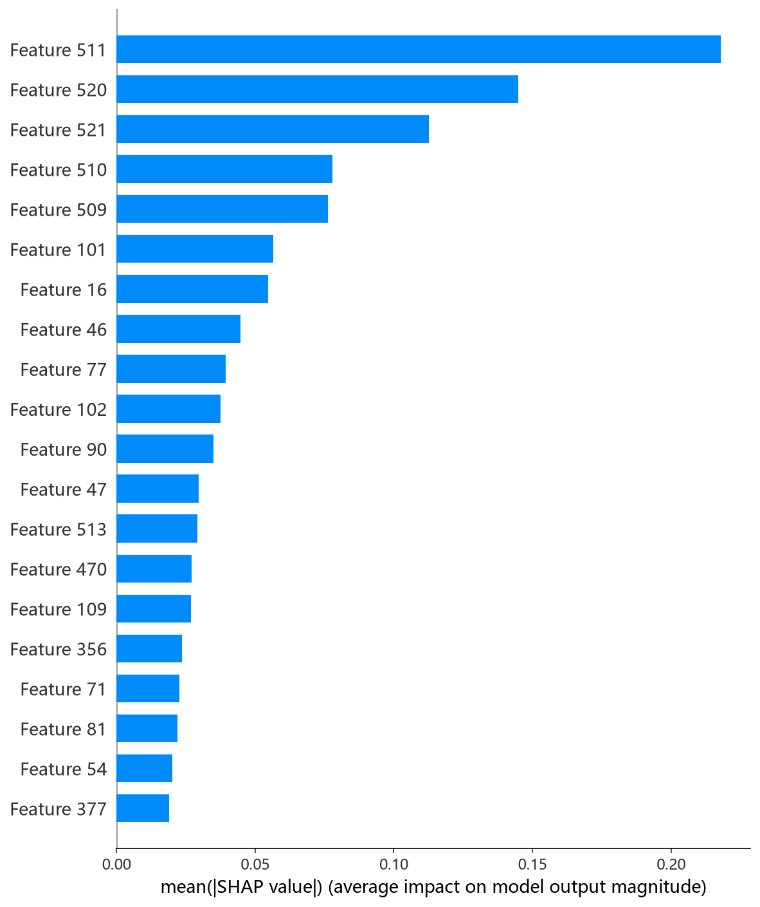

# CatBoost 模型报告 — pCMC 预测

## 报告信息

| 项目 | 内容 |
|------|------|
| 目标变量 | pCMC（log CMC） |
| 运行目录 | `runs\pCMC\pCMC_catboost_20260802_121541` |
| 运行时间 | 2026-08-02 12:15 ~ 13:26（约 71 分钟） |
| 特征类型 | PharmHGT 522 维手工特征 |
| 报告生成日期 | 2026-08-02 |

## 概述

CatBoost 是 Yandex 开发的梯度提升树（GBDT）算法，其核心优势在于采用**对称树**结构（oblivious trees）、原生支持**有序目标统计量**（ordered target statistics）处理类别特征，并通过 ordered boosting 缓解预测偏移。本项目中的输入是 522 维扁平特征向量（无显式类别列），因此主要发挥的是 CatBoost 对数值特征的高效分箱（border_count）、叶子估计迭代（leaf_estimation_iterations）与 L2 正则（l2_leaf_reg）等机制。

在 pCMC 预测任务中，CatBoost 的测试 R² = 0.8548，在 10 个模型中排名第 4，属于性能稳定的第一梯队成员。

## 数据与方法

- **特征**：522 维 PharmHGT 风格特征（原子聚合 220 + 键聚合 56 + 药效团 MACCS 194 + 反应活性 BRICS 34 + 表面活性剂类型 4 + 头尾比 2 + 分子描述符 12），通过 `load_or_compute_features()` 从缓存加载（`[Cache HIT]`）。
- **数据规模**：训练集 1204 条（其中 1053 训练 + 151 验证），测试集 140 条。
- **数据划分**：`train_test_split(0.125, random_state=42)`，随机种子固定，与其他模型一致，保证可比性。

## 超参数与调优

采用 **Optuna 50 轮 × 5 折交叉验证**（TPE 采样器 + MedianPruner，配置见 `config.json`）。

**最优试验（Trial 17，CV RMSE = 0.4622）：**

| 参数 | 值 |
|------|-----|
| depth | 5 |
| learning_rate | 0.0366 |
| iterations | 1566 |
| l2_leaf_reg | 5.957 |
| random_strength | 1.227 |
| bagging_temperature | 9.027 |
| border_count | 224 |
| one_hot_max_size | 43 |
| leaf_estimation_iterations | 9 |
| min_data_in_leaf | 42 |

**Optuna 参数重要度排序：**

| 参数 | 重要度 |
|------|--------|
| one_hot_max_size | 0.3189 |
| l2_leaf_reg | 0.2358 |
| min_data_in_leaf | 0.1356 |
| learning_rate | 0.1057 |
| iterations | 0.0897 |
| 其余（random_strength 等） | < 0.05 |

参数重要度显示，**one_hot_max_size 与 l2_leaf_reg 对 CV 表现影响最大**，说明 522 维特征中存在部分高基数离散型变量（如 MACCS/BRICS 的类别性分桶特征），类别处理的粒度与正则强度是决定性能的关键；深度（depth）本身重要度很低（0.0079），表明浅树即可捕捉结构，过深反而易过拟合。

## 训练过程

- **调参阶段**：50 轮试验中 5 轮被 MedianPruner 提前剪枝（Trial 7/25/35/39/40），其 CV RMSE 普遍偏高（0.48~0.68），剪枝机制有效节约了约 10% 算力。CV RMSE 从 Trial 0 的 0.4876 逐步收敛至最优 0.4622。
- **最终训练**：使用最优参数在 1053 条训练集上重新训练。CatBoost 内置**过拟合检测器**在迭代 800 轮时触发（150 轮等待窗口），在 **bestIteration = 681** 处取得最佳验证损失（bestTest = 0.4963），模型收缩至 682 棵树的集成。训练曲线显示：learn 损失从 1.054 单调降至 0.179，test 损失在迭代 681 附近触底后轻微回升，过拟合控制得当。

## 测试结果

| 指标 | 值 |
|------|-----|
| Test RMSE | **0.4235** |
| Test MAE | **0.2953** |
| Test R² | **0.8548** |
| Best CV RMSE | 0.4622 |

> 图：预测值 vs 真实值散点图与残差图见 [pred_vs_true.png](../../../runs/pCMC/pCMC_catboost_20260802_121541/pred_vs_true.png)。
>
> 

值得注意的是，测试 RMSE（0.4235）**低于**交叉验证 RMSE（0.4622），说明模型泛化能力良好，未见明显过拟合；Test MSE = 0.1794 与 RMSE 相互印证。

## 特征重要性（Top 20）

CatBoost 输出基于分裂次数加权的特征重要性，Top 5 为：

1. **LogP**（10.7）— 脂水分配系数，与表面活性剂降低界面张力的能力直接相关
2. **HeavyAtoms**（8.5）— 重原子数，反映分子大小
3. **NAtoms**（5.1）— 原子总数
4. **MolWt**（5.1）— 分子量
5. **tail_ratio**（2.8）— 疏水尾链碳占比，表面活性剂"头亲水尾疏水"结构的直接度量

前 4 个特征全部是分子尺度的全局描述符，说明 **pCMC 主要由分子整体疏水性与尺寸决定**，这与胶束化自由能的物理本质一致；药效团 MACCS 特征（maccs_101/105）、原子聚合特征（atom_mean_16/46 等）也进入前 20，贡献为辅。

**SHAP 特征重要性可视化**（基于测试集的 TreeExplainer 归因，与日志特征重要性互为补充）：

*SHAP 蜜蜂图：每个点是一个测试样本，x 轴为 SHAP 值（>0 推高 pCMC，<0 拉低），颜色代表特征取值高低。*

*Top-20 平均 |SHAP| 条形图：LogP、HeavyAtoms 显著领先，与日志输出一致。*

## 结论与评价

**优点：**
- 内置过拟合检测器自动确定迭代轮数，无需人工早停，训练稳定。
- 参数重要度诊断清晰，便于理解特征/参数结构。
- 测试性能优于交叉验证，泛化稳健，无过拟合迹象。

**不足：**
- 对称树结构对高维连续特征（522 维）的表征效率不如非对称 GBDT（LightGBM 的 leaf-wise 生长）。
- 训练耗时约 71 分钟（含 50 轮 Optuna），在 10 个模型中属于中等偏长。

**横向定位（10 个模型中按 Test RMSE 排序）：**

| 排名 | 模型 | Test RMSE | Test R² |
|------|------|-----------|---------|
| 1 | CIF (ExtraTrees) | 0.3928 | 0.8751 |
| 2 | NGBoost | 0.4150 | 0.8605 |
| 3 | XGBoost | 0.4199 | 0.8572 |
| **4** | **CatBoost** | **0.4235** | **0.8548** |
| 5 | MLP | 0.4241 | 0.8543 |
| 6 | LightGBM | 0.4311 | 0.8495 |

CatBoost 以微小差距（RMSE 差 < 0.004）落后于 XGBoost，与 MLP 几乎持平，是**稳定可靠的中游偏上选择**；若追求极致精度可优先考虑 CIF/NGBoost/XGBoost，但 CatBoost 在训练稳定性和参数可解释性上具有优势。
