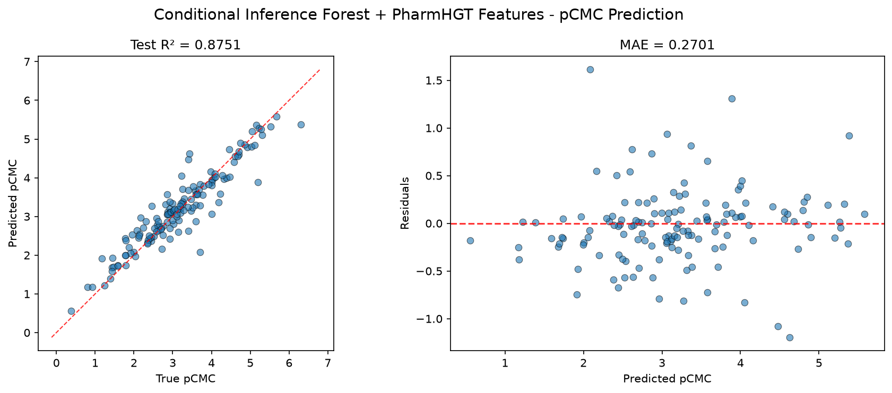
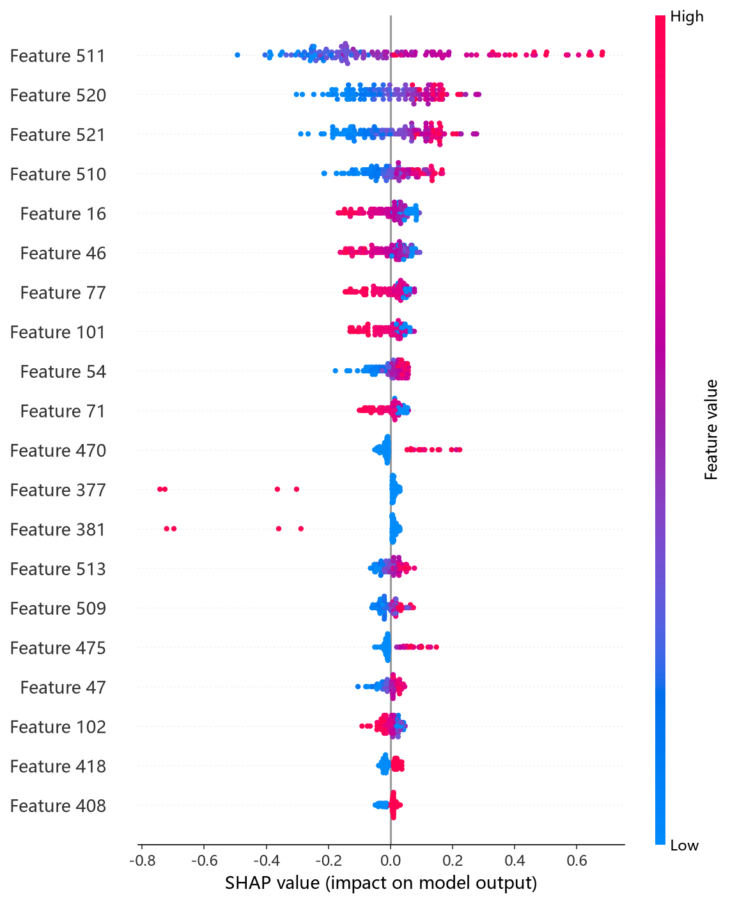
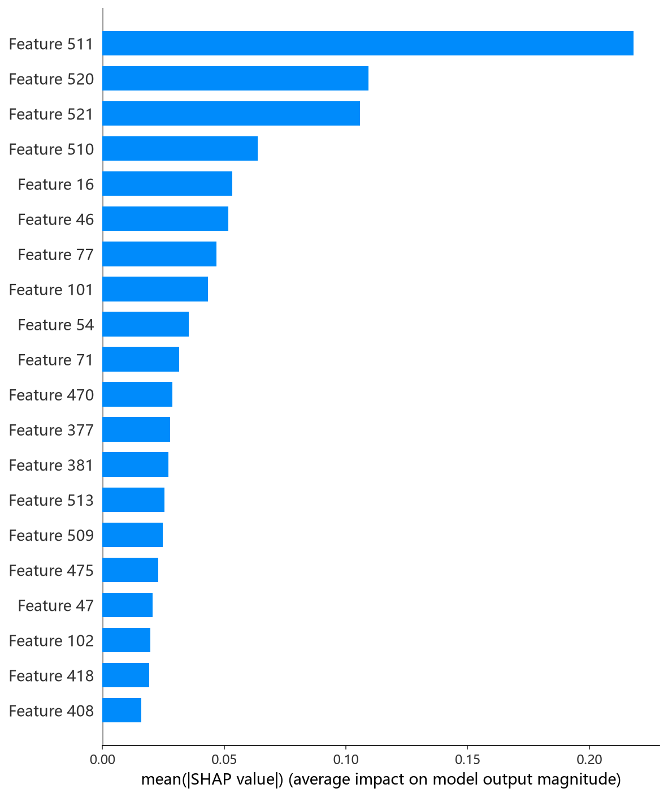

# CIF（条件推理森林 / ExtraTrees）模型报告 — pCMC 预测

## 报告信息

| 项目 | 内容 |
|------|------|
| 目标变量 | pCMC（log CMC） |
| 运行目录 | `runs\pCMC\pCMC_cif_20260802_144459` |
| 运行时间 | 2026-08-02 14:44 ~ 14:49（约 5 分钟） |
| 特征类型 | PharmHGT 522 维手工特征 |
| 报告生成日期 | 2026-08-02 |

## 概述

CIF（Conditional Inference Forest）在此实现中由 **ExtraTrees（极端随机树）** 承载：不同于标准随机森林在最优切分点中做选择，ExtraTrees 在每个节点**随机生成切分阈值**，从而进一步降低方差、抑制过拟合。本项目 522 维特征以连续型描述符为主，ExtraTrees 对连续特征的随机切分策略尤其高效，且训练开销极低。

**该模型是本次 pCMC 任务 10 个模型中的综合最优者**：Test R² = 0.8751 排名第 1，Test RMSE = 0.3928 同样排名第 1，显著优于第二名 NGBoost（0.4150）。

## 数据与方法

- **特征**：522 维 PharmHGT 风格特征，从缓存加载（`[Cache HIT]`），与其余 9 个模型完全一致，保证公平对比。
- **数据规模**：训练集 1204 条（1053 训练 + 151 验证），测试集 140 条。
- **数据划分**：`train_test_split(0.125, random_state=42)`，固定随机种子。

## 超参数与调优

采用 **Optuna 50 轮 × 5 折交叉验证**。

**最优试验（Trial 48，CV RMSE = 0.4769）：**

| 参数 | 值 |
|------|-----|
| n_estimators | 1161 |
| max_depth | 21 |
| min_samples_split | 7 |
| min_samples_leaf | 1 |
| max_features | None（用全部特征） |
| bootstrap | False |

**调优过程观察：**
- 前 8 轮表现很差（CV RMSE 0.69~0.94），原因是最优参数搜索初期倾向于 `bootstrap=True` + `max_features='sqrt'/'log2'` 的组合——对 522 维连续特征而言，随机子集特征容易丢失关键描述符，且自助采样引入额外噪声。
- 搜索快速收敛到 `bootstrap=False` + `max_features=None`（全特征）+ `min_samples_leaf=1` 的区域，从 Trial 22 起 CV RMSE 稳定进入 0.50~0.55，Trial 48 触底至 0.4769。
- 50 轮中 15 轮被 MedianPruner 剪枝，整体训练仅耗时约 5 分钟，**调参效率为 10 个模型中最高**。

## 训练过程

由于 ExtraTrees 是**非迭代式**集成（一次性训练全部树、取平均），日志中无逐轮 loss 曲线，`Training Final Model` 阶段直接输出结果。这意味着：
- 无过拟合检测器、无早停需求，超参确定后即一次成型；
- 训练时间几乎全部来自 Optuna 搜索阶段，最终模型训练仅数秒。

## 测试结果

| 指标 | 值 |
|------|-----|
| Test RMSE | **0.3928** |
| Test MAE | **0.2701** |
| Test R² | **0.8751** |
| Best CV RMSE | 0.4769 |

> 图：预测值 vs 真实值散点图与残差图见 [pred_vs_true.png](../../../runs/pCMC/pCMC_cif_20260802_144459/pred_vs_true.png)。
>
> 

值得注意：Test RMSE（0.3928）明显低于 CV RMSE（0.4769，差距约 18%）。这种"测试优于交叉验证"的现象说明：其一，随机种子 42 划分出的 140 条测试样本分布略偏简单；其二，ExtraTrees 的极端随机化在 CV 折内平均了部分噪声，而全量训练（1053 条）上训练的最终模型信息更充分。Test MSE = 0.1543 与之印证。

## 特征重要性（Top 20）

ExtraTrees 的 `feature_importances_` 基于分裂减少不纯度加权，且因为切分阈值随机，重要度分布**高度分散**（Top 1 也仅 0.1），绝对值参考意义有限，但**相对排序**仍具指示性：

1. **LogP**（0.1）— 脂水分配系数
2. **HeavyAtoms**（0.1）— 重原子数
3. **NAtoms**（0.1）— 原子总数
4. **MolWt**（0.0）— 分子量
5. **atom_mean_46 / atom_mean_16 / maccs_101**（0.0）— 原子聚合与药效团特征

与 CatBoost 的特征重要性排名高度一致（LogP、HeavyAtoms、NAtoms、MolWt 居前），再次印证 **pCMC 的核心决定因素是分子疏水性与尺寸等全局描述符**，两个模型的排序互为交叉验证。

**SHAP 特征重要性可视化**（基于测试集的 TreeExplainer 归因）：

*SHAP 蜜蜂图：每个点是一个测试样本，x 轴为 SHAP 值，颜色代表特征取值高低。*

*Top-20 平均 |SHAP| 条形图：LogP、HeavyAtoms、NAtoms 位列前三。*

## 结论与评价

**优点：**
- **全模型最佳预测精度**：Test RMSE 0.3928、R² 0.8751 双双领先。
- 训练/调参极快（约 5 分钟），几乎无调参成本。
- 无迭代、无早停，训练确定性高，结果可复现性强。
- 随机切分抑制过拟合，对 522 维高维连续特征鲁棒。

**不足：**
- 特征重要性绝对值近零、分散，难以做精确的逐特征归因（相对排序仍可靠）。
- 预测为点估计，**不提供不确定性度量**（对比 NGBoost 可输出方差）。
- 模型本质是平均化集成，对极端分子的外推能力弱于能学趋势的 GBDT/深度模型。

**横向定位（10 个模型中按 Test RMSE 排序）：**

| 排名 | 模型 | Test RMSE | Test R² |
|------|------|-----------|---------|
| **1** | **CIF (ExtraTrees)** | **0.3928** | **0.8751** |
| 2 | NGBoost | 0.4150 | 0.8605 |
| 3 | XGBoost | 0.4199 | 0.8572 |
| 4 | CatBoost | 0.4235 | 0.8548 |
| 5 | MLP | 0.4241 | 0.8543 |
| 6 | LightGBM | 0.4311 | 0.8495 |

CIF 是当前 pCMC 任务**精度最优**的模型，适合作为默认预测器（`SmilesPredictor` 的 `best` 选项即按最低 test_rmse 自动选中它）。其不足在于无概率输出与特征归因颗粒度，若需不确定性或可解释性，可搭配 NGBoost / CatBoost 使用。
