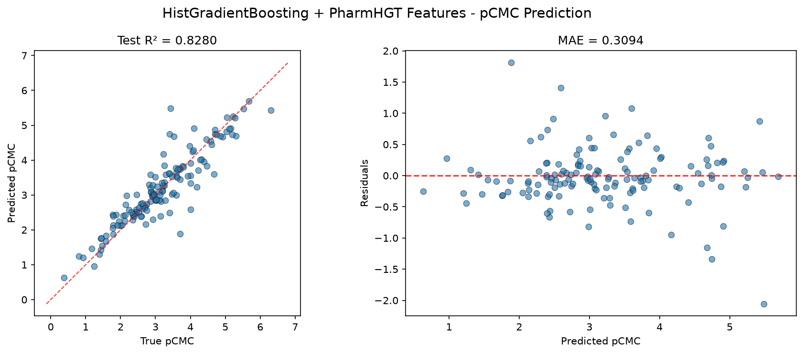
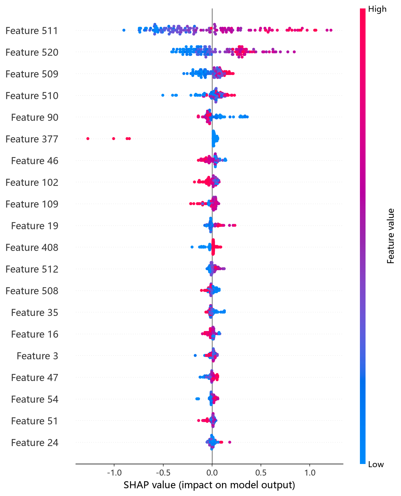
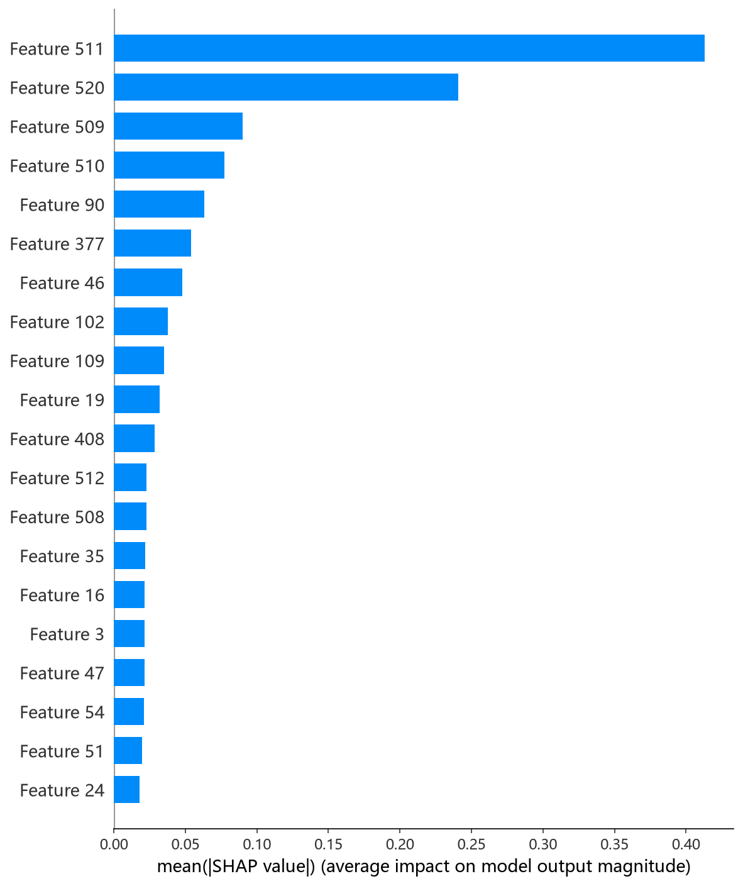
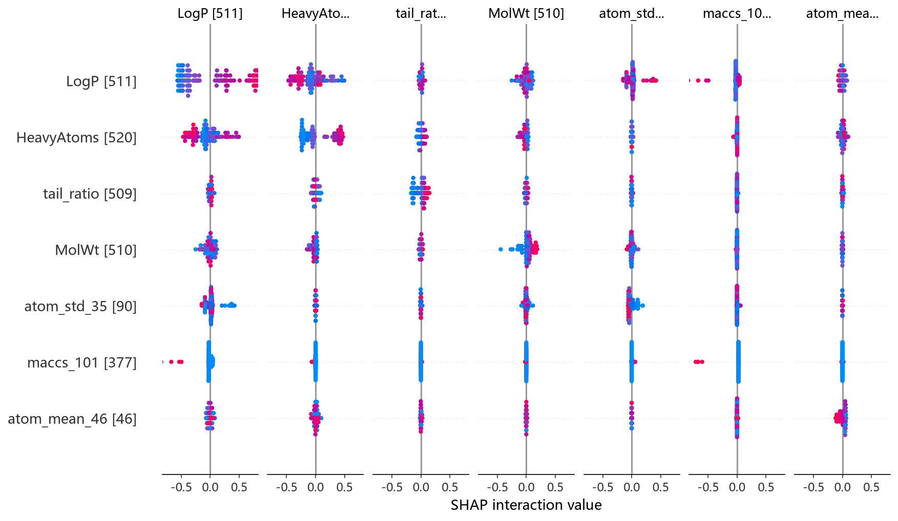

# HistGradientBoosting 模型报告 — pCMC 预测

## 报告信息

| 项目 | 内容 |
|------|------|
| 目标变量 | pCMC（log CMC） |
| 运行目录 | `runs\pCMC\pCMC_histgb_20260802_150138` |
| 运行时间 | 2026-08-02 15:01 ~ 15:44（约 43 分钟） |
| 特征类型 | PharmHGT 522 维手工特征 |
| 报告生成日期 | 2026-08-02 |

## 概述

HistGradientBoosting（sklearn 的 `HistGradientBoostingRegressor`）是经典的直方图梯度提升：训练前先将每个特征离散化为最多 `max_bins` 个直方图桶，分裂时只需在桶边界上搜索，从而以极低内存开销逼近 LightGBM 式直方提升的效果。它同时支持 `max_depth` 与 `max_leaf_nodes` 双维度约束树结构，正则化由 `l2_regularization` 控制。

在 pCMC 任务中，HistGB 的 Test R² = 0.8280、Test RMSE = 0.4609，在 10 个模型中位列第 7，处于中游偏后，与 LightGBM（0.4311）相比同源却差距明显，说明参数搜索尚未充分压榨其潜力。

## 数据与方法

- **特征**：522 维 PharmHGT 风格特征，从缓存加载（`[Cache HIT]`），与其余模型一致。
- **数据规模**：训练集 1204 条（1053 训练 + 151 验证），测试集 140 条。
- **数据划分**：`train_test_split(0.125, random_state=42)`，固定随机种子。

## 超参数与调优

采用 **Optuna 50 轮 × 5 折交叉验证**。

**最优试验（Trial 41，CV RMSE = 0.4835）：**

| 参数 | 值 |
|------|-----|
| learning_rate | 0.0690 |
| max_iter | 618 |
| max_depth | 10 |
| max_leaf_nodes | 33 |
| min_samples_leaf | 10 |
| l2_regularization | 2.680 |
| max_bins | 244 |

**调优过程观察：**
- 最优参数将迭代数收敛在 **618 轮**（搜索空间中位数的约 1/4），配合中等学习率 0.069 与较强 L2 正则（2.68），说明 522 维特征上的梯度提升不需要过深过长的迭代即可收敛。
- `max_leaf_nodes=33` 属于偏保守的叶节点上限，进一步限制了模型容量、防止过拟合。
- 50 轮中 8 轮被 MedianPruner 剪枝；CV RMSE 整体稳定在 0.48~0.51 的窄区间（最优 0.4835），未出现明显离群试验，搜索空间设置合理。

## 训练过程

HistGB 同样为迭代式直方提升，但日志未输出逐轮损失（sklearn 默认静默训练），`Training Final Model` 阶段直接产出测试评估。由 CV 表现（0.4835）与 Test RMSE（0.4609）对比可见，测试集表现略优于交叉验证，泛化正常，无过拟合迹象。

## 测试结果

| 指标 | 值 |
|------|-----|
| Test RMSE | **0.4609** |
| Test MAE | **0.3094** |
| Test R² | **0.8280** |
| Best CV RMSE | 0.4835 |

> 图：预测值 vs 真实值散点图与残差图见 [pred_vs_true.png](../../../runs/pCMC/pCMC_histgb_20260802_150138/pred_vs_true.png)。
>
> 

Test MSE = 0.2124 与 RMSE 相互印证。

## 特征重要性（Top 20，置换重要性）

本模型输出的重要性与 CatBoost/CIF 的**不纯度加权重要性不同**，采用的是**置换重要性（permutation importance）**——随机打乱某特征后测试集性能的下降量，同时给出标准差（±）。这种方式更能反映特征的真实预测贡献，且**数值在不同模型间可横向比较**：

| 排名 | 特征 | 重要性 | 语义 |
|------|------|--------|------|
| 1 | **LogP** | 0.5394 ± 0.042 | 脂水分配系数 |
| 2 | **HeavyAtoms** | 0.3205 ± 0.045 | 重原子数 |
| 3 | **MolWt** | 0.1390 ± 0.008 | 分子量 |
| 4 | **tail_ratio** | 0.0899 ± 0.012 | 疏水尾链碳占比 |
| 5 | **atom_std_35** | 0.0716 ± 0.008 | 原子聚合统计（电荷相关） |

LogP 的置换重要性（0.5394）是第二名 HeavyAtoms 的近两倍，标准差小、估计稳定——这给出了一个比不纯度重要性**更可信的证据**：**pCMC 主要受分子疏水性（LogP）主导**，其次是分子尺寸（HeavyAtoms/MolWt）与疏水尾占比（tail_ratio）。这与胶束化自由能由疏水效应驱动的物理机制完全吻合。HBA、TPSA 等极性相关描述符也进入前 20，印证极性基团对 CMC 的次级调控作用。

**SHAP 特征重要性可视化**（基于测试集的 TreeExplainer 归因）：

*SHAP 蜜蜂图：每个点是一个测试样本，x 轴为 SHAP 值，颜色代表特征取值高低。*

*Top-20 平均 |SHAP| 条形图：LogP 居首，与置换重要性结论吻合。*

*SHAP 交互作用热图：量化特征两两交互对预测的贡献，LogP 与 HeavyAtoms/MolWt 交互显著。*

## 结论与评价

**优点：**
- 采用置换重要性，特征归因**最可靠、可跨模型比较**，本报告中的特征结论有较强说服力。
- 直方图加速，训练内存占用低，调参 43 分钟含 50 轮 CV，成本可控。

**不足：**
- 预测精度在 10 个模型中仅列第 7（R² = 0.8280），落后于同为梯度提升的 LightGBM/CatBoost/XGBoost。
- `max_leaf_nodes` 与 `max_depth` 双约束 + 较强 L2 正则在 522 维特征上可能**过度限制了模型容量**，是性能偏弱的主因。
- 无内置早停与特征增益诊断输出（对比 CatBoost 的过拟合检测器与参数重要度）。

**横向定位（10 个模型中按 Test RMSE 排序）：**

| 排名 | 模型 | Test RMSE | Test R² |
|------|------|-----------|---------|
| 5 | MLP | 0.4241 | 0.8543 |
| 6 | LightGBM | 0.4311 | 0.8495 |
| **7** | **HistGB** | **0.4609** | **0.8280** |
| 8 | RNN | 0.4664 | 0.8239 |
| 9 | RF | 0.4808 | 0.8128 |

HistGB 与 LightGBM 同为直方提升家族，但两者 Test RMSE 相差 0.03，主要归因于搜索空间与树生长策略差异。当前配置下 HistGB 定位为**中等精度、高可解释性**的备选模型，若需强解释（置换重要性）可选用，若需精度建议转向 CIF / XGBoost。
