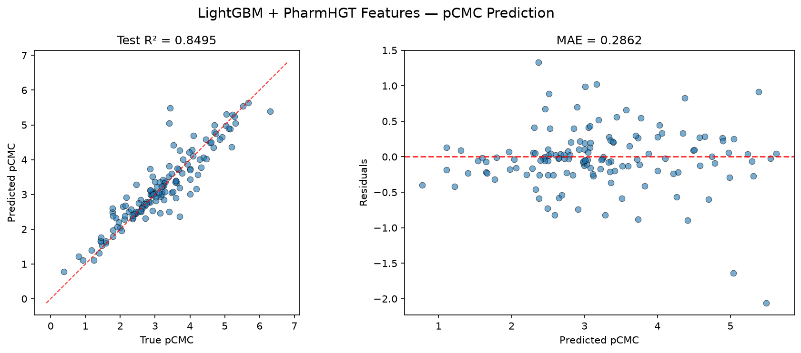
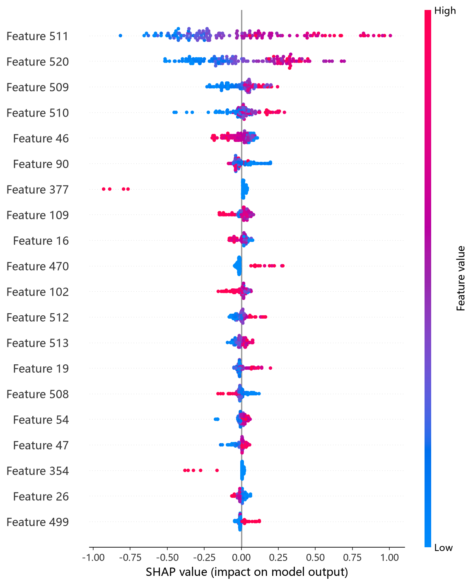
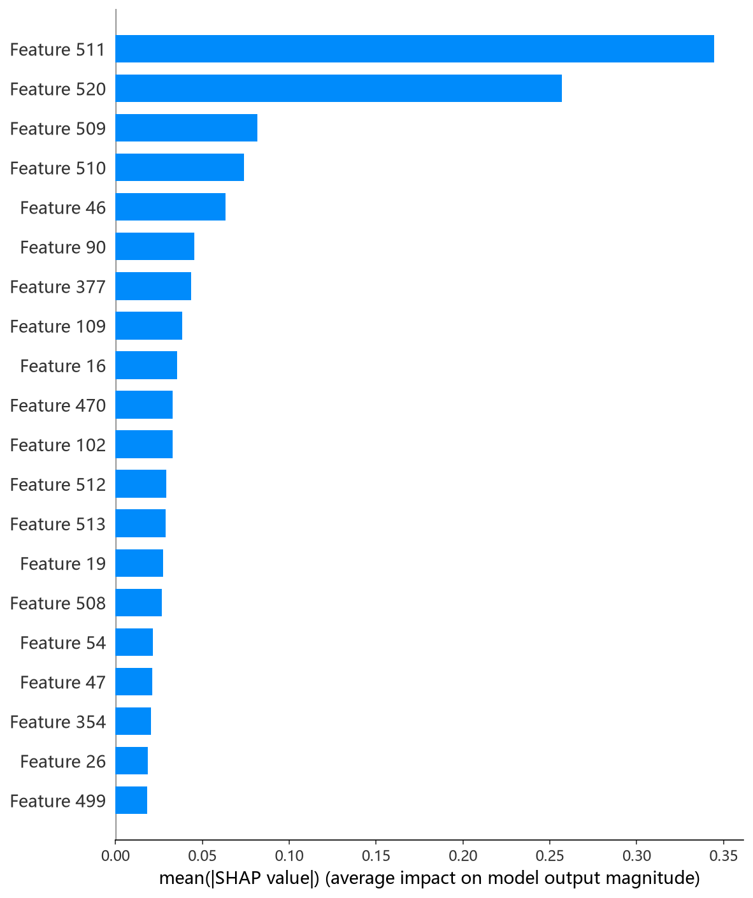

# LightGBM 模型报告 — pCMC 预测

## 报告信息

| 项目 | 内容 |
|------|------|
| 目标变量 | pCMC（log CMC） |
| 运行目录 | `runs\pCMC\pCMC_lightgbm_20260802_155314` |
| 运行时间 | 2026-08-02 15:53 ~ 15:56（约 3 分钟） |
| 特征类型 | PharmHGT 522 维手工特征 |
| 报告生成日期 | 2026-08-02 |

## 概述

LightGBM 是微软开源的梯度提升框架，采用**单边梯度采样（GOSS）**与**互斥特征捆绑（EFB）**加速，并以 **leaf-wise**（按叶子分裂）的树生长策略著称——相比 level-wise 生长，能在相同树深下获得更精确的拟合，但更易过拟合，因此 `num_leaves` 的约束至关重要。本项目搜索空间同时包含 `gbdt` 与 `dart` 两种 boosting 类型。

在 pCMC 任务中，LightGBM 的 Test R² = 0.8495、Test RMSE = 0.4311，在 10 个模型中排名第 6，处于中游，但训练耗时仅约 3 分钟，是**性价比极高**的选项。

## 数据与方法

- **特征**：522 维 PharmHGT 风格特征，从缓存加载（`[Cache HIT]`），与其余模型一致。
- **数据规模**：训练集 1204 条（1053 训练 + 151 验证），测试集 140 条。
- **数据划分**：`train_test_split(0.125, random_state=42)`，固定随机种子。

## 超参数与调优

采用 **Optuna 50 轮 × 5 折交叉验证**（每折内部使用 30 轮早停）。

**最优试验（Trial 16，CV RMSE = 0.4818）：**

| 参数 | 值 |
|------|-----|
| boosting_type | **gbdt** |
| max_depth | 10 |
| num_leaves | 31 |
| learning_rate | 0.0384 |
| n_estimators | 1972 |
| subsample / freq | 0.820 / 1 |
| colsample_bytree | 0.987 |
| reg_alpha / reg_lambda | ~0 / 6e-5 |
| min_child_samples | 13 |
| min_child_weight | 0.0185 |
| min_split_gain | 0.0537 |

**关键观察：boosting 类型的选择。**
- 搜索早期采样的 `dart` 变体表现灾难性：Trial 0（CV RMSE 2.07）、Trial 3（2.01）、Trial 1（0.96）均远超 gbdt 的最优值（0.48）。DART 通过 drop-out 丢弃已训练树来缓解过拟合，但在 1204 条小样本上收敛极不稳定，**Trial 16 之后搜索收敛于 gbdt 区域**。
- `num_leaves=31` 相对保守（对比搜索上限 255），配合 `max_depth=10` 双约束 + 几乎不设 L2 正则，说明 LightGBM 在 522 维特征上靠**较小的叶节点数**即可避免过拟合。
- 每折早停（30 轮）使单折训练往往在数百轮内收敛，5 折 × 50 试验全程仅约 3 分钟，**调参速度全模型第一**。

## 训练过程

- **调参阶段**：50 轮试验中仅 4 轮被 MedianPruner 剪枝，大量试验因早停快速收敛而无需剪枝。CV RMSE 主体集中在 0.48~0.53 的窄带，Trial 16 以 0.4818 触底。
- **最终训练**：使用最优参数在 1053 条数据上重新训练（早停窗口放宽到 50 轮），在**迭代 190 轮**处早停（valid RMSE = 0.5072），随后损失出现回升迹象，早停及时生效。

## 测试结果

| 指标 | 值 |
|------|-----|
| Test RMSE | **0.4311** |
| Test MAE | **0.2862** |
| Test R² | **0.8495** |
| Best CV RMSE | 0.4818 |

> 图：预测值 vs 真实值散点图与残差图见 [pred_vs_true.png](../../../runs/pCMC/pCMC_lightgbm_20260802_155314/pred_vs_true.png)。
>
> 

Test RMSE（0.4311）优于 CV（0.4818），泛化良好。Test MSE = 0.1859 与之印证。

## 特征重要性（Top 20）

LightGBM 默认输出**分裂次数重要性**（feature 被选为分裂点的次数），数值为计数而非加权得分。排名揭示了**表面活性剂结构特征的主导地位**：

1. **tail_ratio**（339 次分裂）— 疏水尾链碳占比
2. **LogP**（313）— 脂水分配系数
3. **MolWt**（262）— 分子量
4. **head_ratio**（184）— 亲水头基原子占比
5. **HeavyAtoms**（140）— 重原子数

值得注意：**tail_ratio 与 head_ratio 双双进入前 4**——这是本项目第一个把"头-尾结构比率"特征排到最前列的模型（CatBoost/CIF 中它们排 5 名开外）。说明 LightGBM 的 leaf-wise 分裂频繁利用头/尾占比这类**可解释的结构比率**做判别，与表面活性剂"亲水头 + 疏水尾"的两亲性本质高度契合。LogP、MolWt、HeavyAtoms 等全局描述符依然重要，与其余模型结论一致。

**SHAP 特征重要性可视化**（基于测试集的 TreeExplainer 归因）：

*SHAP 蜜蜂图：每个点是一个测试样本，x 轴为 SHAP 值，颜色代表特征取值高低。*

*Top-20 平均 |SHAP| 条形图：tail_ratio 与 LogP 并列前茅，印证头尾结构比率的价值。*

## 结论与评价

**优点：**
- **训练/调参极快**（约 3 分钟完成 50 轮 × 5 折），在 10 个模型中效率最高。
- 内置每折早停，自动控制迭代轮数，无过拟合风险。
- 特征重要性直观，且揭示了 tail_ratio / head_ratio 的结构性价值。

**不足：**
- 精度中等（R² = 0.8495，列第 6），未进入第一梯队（CIF/NGBoost/XGBoost）。
- `num_leaves=31` 的保守约束可能压制了 leaf-wise 本可达到的拟合上限。
- dart 变体在小样本上表现不稳定，搜索空间若含 dart 需额外注意收敛性。

**横向定位（10 个模型中按 Test RMSE 排序）：**

| 排名 | 模型 | Test RMSE | Test R² |
|------|------|-----------|---------|
| 4 | CatBoost | 0.4235 | 0.8548 |
| 5 | MLP | 0.4241 | 0.8543 |
| **6** | **LightGBM** | **0.4311** | **0.8495** |
| 7 | HistGB | 0.4609 | 0.8280 |
| 8 | RNN | 0.4664 | 0.8239 |

LightGBM 与 CatBoost/MLP 的差距均在 0.01 RMSE 以内，实际性能非常接近，但训练成本只有后者的 1/20 左右。**在精度要求不极端、强调迭代速度的场景下，LightGBM 是最优折中选择**。
