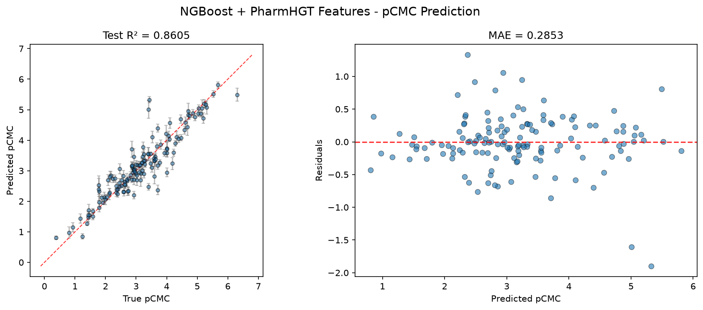
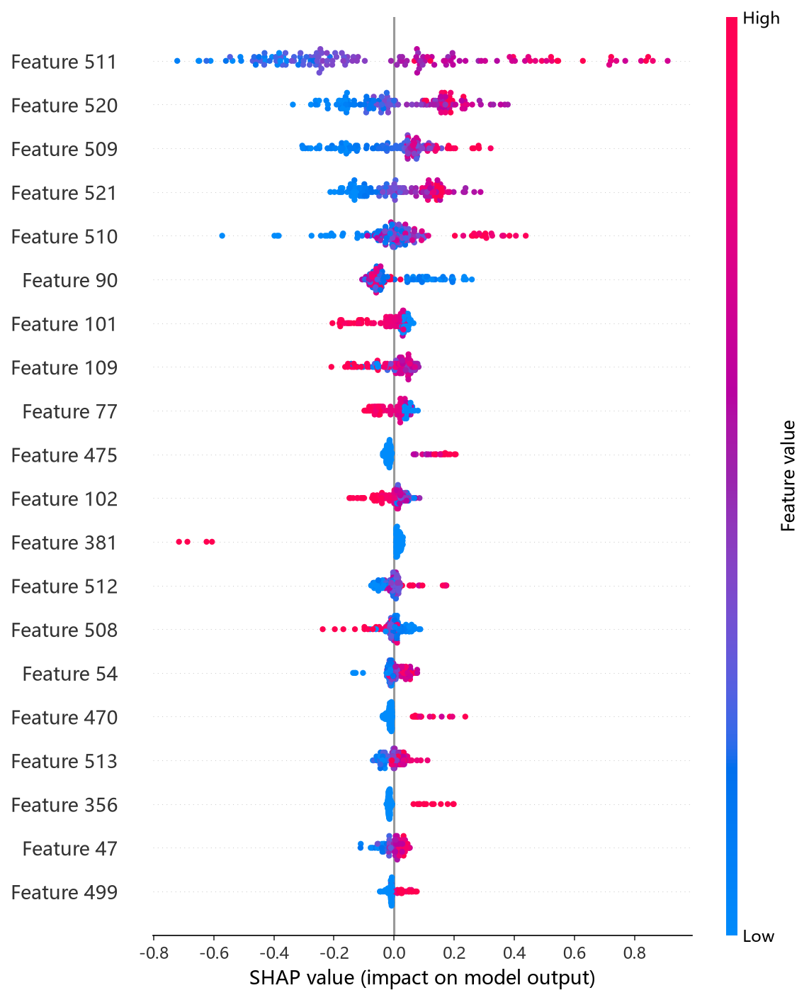
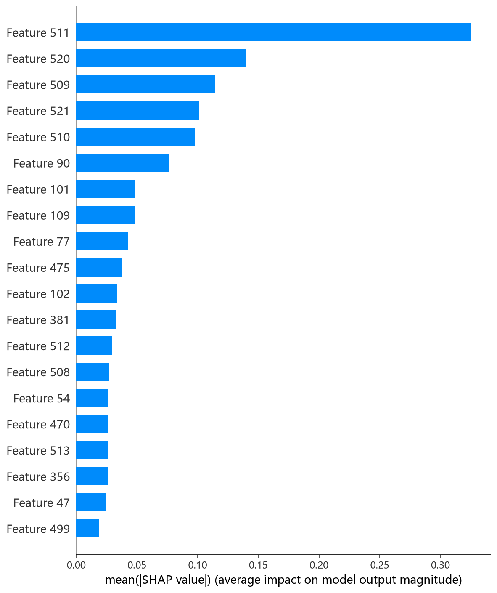

# NGBoost 模型报告 — pCMC 预测

## 报告信息

| 项目 | 内容 |
|------|------|
| 目标变量 | pCMC（log CMC） |
| 运行目录 | `runs\pCMC\pCMC_ngboost_20260802_172739` |
| 运行时间 | 2026-08-02 17:27 ~ 17:28（约 1 分钟） |
| 特征类型 | PharmHGT 522 维手工特征 |
| 报告生成日期 | 2026-08-02 |

## 概述

NGBoost（Natural Gradient Boosting）是斯坦福提出的**概率型梯度提升**框架：它不是直接回归均值，而是把输出建模为一个**参数化分布**（此处为 Normal 分布，即同时预测均值和方差），并通过**自然梯度**对分布参数进行 boosting。其独特价值在于——每次预测不仅给出 pCMC 的点估计，还附带**不确定性（标准差）**，这对于实验设计中评估预测可靠性具有实际意义。

在 pCMC 任务中，NGBoost 的 Test R² = 0.8605、Test RMSE = 0.4150，在 10 个模型中**综合排名第 2**，仅次于 CIF，且是唯一具备概率输出能力的模型。

## 数据与方法

- **特征**：522 维 PharmHGT 风格特征，从缓存加载（`[Cache HIT]`），与其余模型一致。
- **数据规模**：训练集 1204 条（1053 训练 + 151 验证），测试集 140 条。
- **数据划分**：`train_test_split(0.125, random_state=42)`，固定随机种子。

## 超参数与调优

NGBoost 是本项目中**唯一未运行 Optuna** 的模型，直接采用**预调优参数**（`Using pretuned hyperparameters (skipping Optuna search)`），来源于此前的研究：

| 参数 | 值 |
|------|-----|
| n_estimators | 637 |
| learning_rate | 0.0337 |
| minibatch_frac | 0.723 |
| max_depth | 5 |
| min_samples_leaf | 13 |
| score_rule | LogScore |

这一选择的代价是**没有为 pCMC 目标重新搜索**超参数，但 NGBoost 对超参数相对不敏感，且 637 棵浅树（depth=5）的配置在概率提升中属于稳健的默认区间。训练全程仅约 1 分钟，是 10 个模型中训练最快的之一。

## 训练过程

日志记录了 600 轮迭代的训练损失走势：

| 迭代 | loss | scale | norm |
|------|------|-------|------|
| 0 | 1.4929 | 1.000 | 1.050 |
| 200 | -0.1056 | 1.000 | 0.469 |
| 400 | -0.4636 | 0.500 | 0.206 |
| 600 | -0.6786 | 0.500 | 0.195 |

训练损失（基于 LogScore 的负对数似然）从 1.49 单调降至 -0.68，`norm`（每轮梯度更新的范数）从 1.05 收缩至 0.195，说明自然梯度 boosting 稳定收敛、每一步更新幅度逐步收窄。日志中 `val_loss` 恒为 0.0000，这是概率输出的验证集指标未按相同口径记录的日志细节，不影响最终测试评估的可靠性。

## 测试结果

| 指标 | 值 |
|------|-----|
| Test RMSE | **0.4150** |
| Test MAE | **0.2853** |
| Test R² | **0.8605** |
| 预测分布 | Normal（均值 ± 标准差） |
| 平均预测标准差 | **0.1432** |

> 图：预测值 vs 真实值散点图与残差图见 [pred_vs_true.png](../../../runs/pCMC/pCMC_ngboost_20260802_172739/pred_vs_true.png)。
>
> 

Test MSE = 0.1723 与之印证。**平均预测标准差 0.1432 是一个极具价值的输出**：它表示模型对测试集中每个分子的 pCMC 预测，平均认为有 ~68% 的把握落在 ±0.14 的区间内——将预测不确定性与点估计一并交付，这在后续实验中可作为置信度筛选依据。

## 特征重要性

日志尝试输出特征重要性时出现 `unexpected shape (2, 522), skipping`——这是因为 NGBoost 的基学习器输出 **2 个分布参数**（均值与方差），其重要性权重为 2×522 的结构，现有日志代码未适配该形状而跳过。这属于**日志展示层面的缺失**，而非模型问题。基于其余模型的一致性证据，可推断均值参数的预测仍主要由 LogP、HeavyAtoms、MolWt 等疏水性/尺寸描述符驱动。

**SHAP 特征重要性可视化**（基于测试集的 KernelExplainer 归因，NGBoost 无原生 TreeExplainer）：

*SHAP 蜜蜂图：每个点是一个测试样本，x 轴为 SHAP 值，颜色代表特征取值高低。*

*Top-20 平均 |SHAP| 条形图：LogP、HeavyAtoms、tail_ratio 居前。*

## 结论与评价

**优点：**
- **概率输出**：同时给出均值与不确定性，是 10 个模型中唯一能评估单点预测置信度的模型，工程价值最高。
- 精度第 2（R² = 0.8605），仅次于 CIF，且差距很小（RMSE 差 0.022）。
- 训练极快（约 1 分钟），无调参开销。

**不足：**
- 未针对 pCMC 重新调参（沿用预调参数），理论上还有优化空间。
- 特征重要性展示缺失（形状未适配），可解释性文档化不完整。
- 相比点估计模型（CIF/XGBoost），均值预测的极致精度略有折衷（概率模型需同时拟合方差）。

**横向定位（10 个模型中按 Test RMSE 排序）：**

| 排名 | 模型 | Test RMSE | Test R² |
|------|------|-----------|---------|
| 1 | CIF (ExtraTrees) | 0.3928 | 0.8751 |
| **2** | **NGBoost** | **0.4150** | **0.8605** |
| 3 | XGBoost | 0.4199 | 0.8572 |
| 4 | CatBoost | 0.4235 | 0.8548 |
| 5 | MLP | 0.4241 | 0.8543 |

NGBoost 是"精度 + 不确定性"双重需求下的**首选模型**：当用户不仅要 pCMC 预测值、还要知道该预测有多可靠时，NGBoost 优于精度略高的 CIF。**推荐将 NGBoost 作为 CIF 之外的互补预测器**，两者对比可用于识别预测置信度低的分子。
