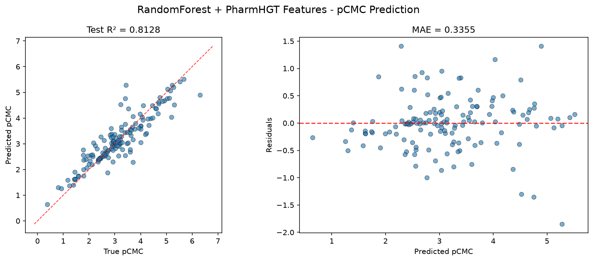
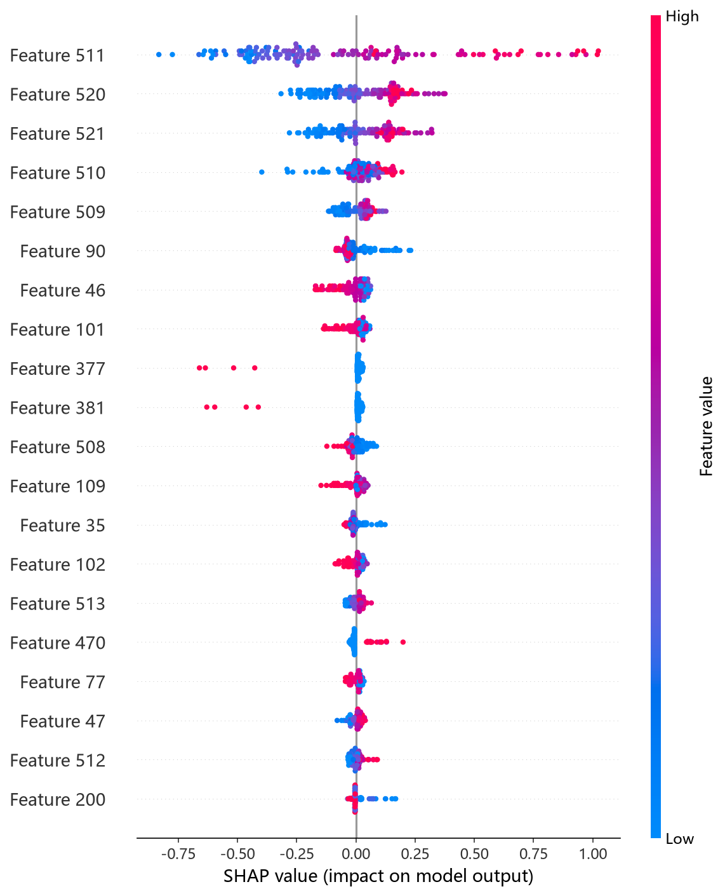
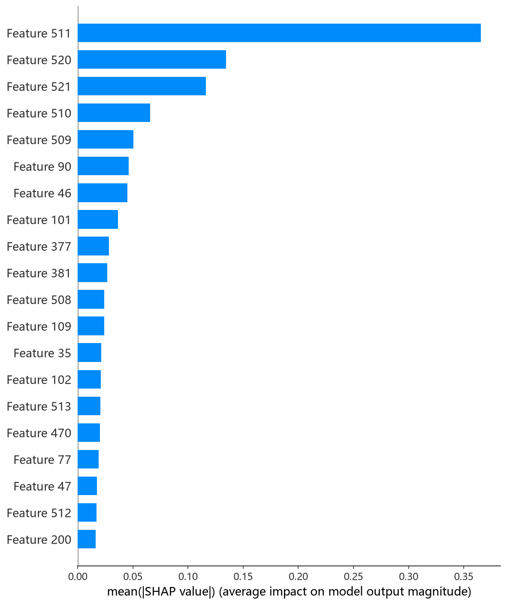

# RandomForest 模型报告 — pCMC 预测

## 报告信息

| 项目 | 内容 |
|------|------|
| 目标变量 | pCMC（log CMC） |
| 运行目录 | `runs\pCMC\pCMC_rf_20260802_172839` |
| 运行时间 | 2026-08-02 17:28 ~ 17:34（约 6 分钟） |
| 特征类型 | PharmHGT 522 维手工特征 |
| 报告生成日期 | 2026-08-02 |

## 概述

RandomForest（随机森林）是最经典的 bagging 集成：对训练集做有放回抽样（bootstrap）训练多棵决策树，每棵树在每个分裂点从随机特征子集中选择最优切分，最终取平均。相比其"姊妹模型"ExtraTrees（CIF），随机森林**在最优切分点中选择**，单树更强但方差更大，在 522 维高维特征上更依赖正则约束。

在 pCMC 任务中，RandomForest 的 Test R² = 0.8128、Test RMSE = 0.4808，在 10 个模型中排名第 9（仅优于 Transformer），是精度较弱的传统模型。

## 数据与方法

- **特征**：522 维 PharmHGT 风格特征，从缓存加载（`[Cache HIT]`），与其余模型一致。
- **数据规模**：训练集 1204 条（1053 训练 + 151 验证），测试集 140 条。
- **数据划分**：`train_test_split(0.125, random_state=42)`，固定随机种子。

## 超参数与调优

采用 **Optuna 50 轮 × 5 折交叉验证**（与 CIF 共用同一搜索空间）。

**最优试验（Trial 13，CV RMSE = 0.5200）：**

| 参数 | 值 |
|------|-----|
| n_estimators | 633 |
| max_depth | 24 |
| min_samples_split | 3 |
| min_samples_leaf | 2 |
| max_features | None（用全部特征） |
| bootstrap | True |
| max_samples | 0.732 |

**调优过程观察：**
- 50 轮中多达 **25 轮被 MedianPruner 剪枝**（一半试验），且多数集中在搜索中段，说明 RF 的 CV 收敛很慢——因为树多、每轮 CV 慢，且剪枝后剩余试验集中在少数方向。
- 搜索明确收敛到 **`max_features=None`（全特征）+ `bootstrap=True` + `max_samples≈0.73`（部分样本）** 的组合：全部特征保证单树信息量，bootstrap + 子采样控制树间方差。早期 `max_features='sqrt'/'log2'` 的试验表现差（CV RMSE 0.65~0.81）。
- 最终配置与 CIF（ExtraTrees）形成**关键对照**：CIF 收敛到 `bootstrap=False`，而 RF 需要 `bootstrap=True` 才能达到相近的方差控制——这正是 ExtraTrees 用"随机切分阈值"换取方差抑制、而随机森林必须依赖自助采样实现同样的效果。

## 训练过程

RF 为一次性集成训练（无迭代、无早停），`Training Final Model` 后直接输出测试评估。由 CV（0.5200）与 Test（0.4808）对比，测试表现优于交叉验证，泛化正常。

## 测试结果

| 指标 | 值 |
|------|-----|
| Test RMSE | **0.4808** |
| Test MAE | **0.3355** |
| Test R² | **0.8128** |
| Best CV RMSE | 0.5200 |

> 图：预测值 vs 真实值散点图与残差图见 [pred_vs_true.png](../../../runs/pCMC/pCMC_rf_20260802_172839/pred_vs_true.png)。
>
> 

Test MSE = 0.2311，在 10 个模型中偏高（仅次于 Transformer），说明 RF 对 pCMC 的拟合精度有限。Test MAE = 0.3355 同样是倒数第二（仅优于 Transformer），预测残差整体偏大。

## 特征重要性（Top 20）

RF 输出不纯度加权重要性，与 CIF 一样**高度分散**（Top 1 仅 0.2，多数近 0），相对排序仍有意义：

1. **LogP**（0.2）— 脂水分配系数
2. **HeavyAtoms / NAtoms / MolWt**（0.1）— 分子尺寸类
3. **atom_std_35 / maccs_101 / tail_ratio / head_ratio**（0.0）— 次级特征

排序与此前 CatBoost/CIF 的结论一致（LogP 与分子尺寸主导），此处不再赘述物理含义。值得注意的是 head_ratio 与 tail_ratio 均进入前 20，与 LightGBM 的结论相互印证，支持"头-尾结构比率"对 CMC 的重要作用。

**SHAP 特征重要性可视化**（基于测试集的 TreeExplainer 归因）：

*SHAP 蜜蜂图：每个点是一个测试样本，x 轴为 SHAP 值，颜色代表特征取值高低。*

*Top-20 平均 |SHAP| 条形图：LogP 领先，其余特征重要性分布较分散（与日志观察一致）。*

## 结论与评价

**优点：**
- 无需数据预处理、无迭代训练，模型稳定、几乎不可调参失败。
- 训练快（约 6 分钟含调参），baseline 级可用。

**不足：**
- **精度偏弱**（R² = 0.8128，排名第 9），显著落后于同类 ExtraTrees（CIF，0.8751）——同一搜索空间下，随机森林因"选最优切分"方差较大、在 522 维连续特征上欠拟合。
- 50 轮调参中一半被剪枝，搜索效率低。
- 点估计，无概率输出，特征重要性绝对值近零。

**横向定位（10 个模型中按 Test RMSE 排序）：**

| 排名 | 模型 | Test RMSE | Test R² |
|------|------|-----------|---------|
| 7 | HistGB | 0.4609 | 0.8280 |
| 8 | RNN | 0.4664 | 0.8239 |
| **9** | **RandomForest** | **0.4808** | **0.8128** |
| 10 | Transformer | 0.6136 | 0.6951 |

RF 与 CIF 的差距（RMSE 差 0.088、R² 差 0.062）是本次任务中最有启发性的对照组之一：**在同样的搜索空间与数据下，ExtraTrees 的随机切分策略显著优于随机森林的最优切分策略**。若需随机森林家族，直接采用 CIF 即可获得更好结果，RandomForest 适合作为兼容性 baseline 保留。
