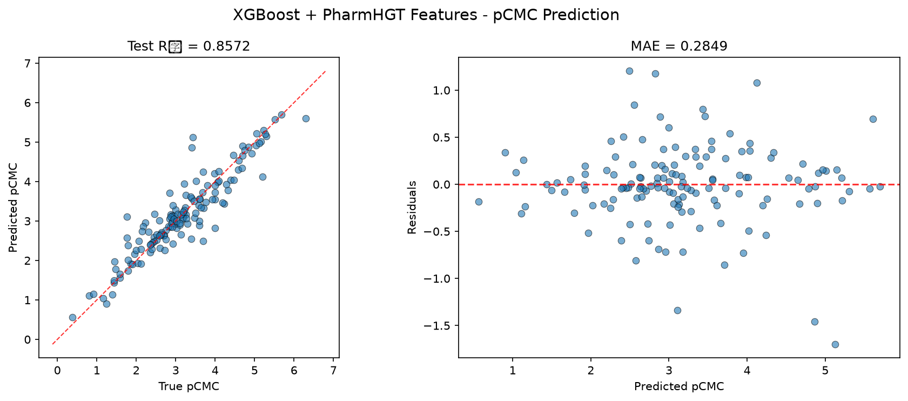
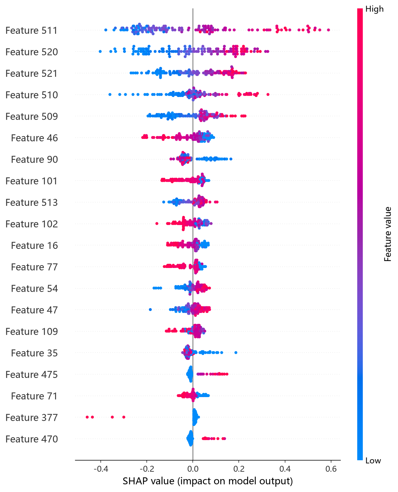
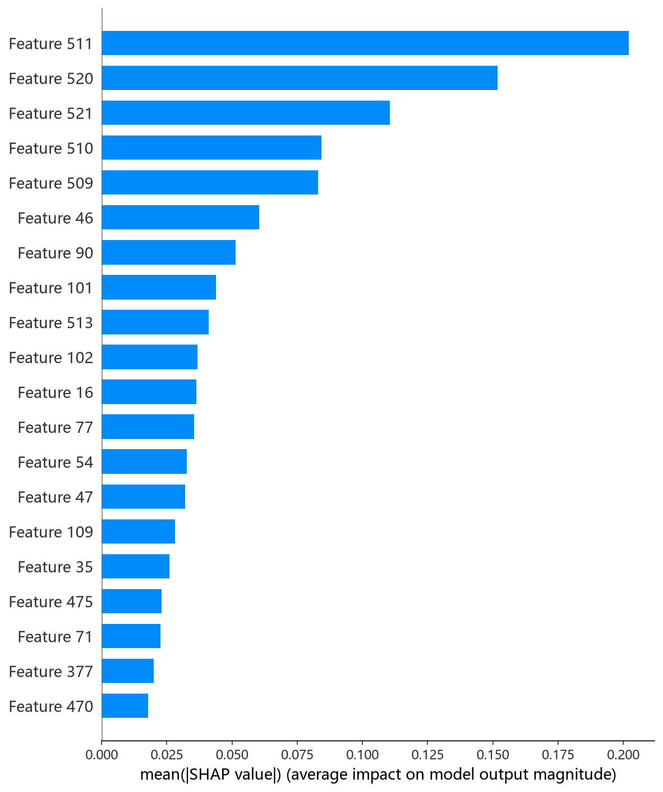

# XGBoost 模型报告 — pCMC 预测

## 报告信息

| 项目 | 内容 |
|------|------|
| 目标变量 | pCMC（log CMC） |
| 运行目录 | `runs\pCMC\pCMC_xgboost_20260802_201550` |
| 调参日志 | `runs\pCMC\pCMC_xgboost_20260802_193437\train.log`（Optuna 200 轮） |
| 运行时间 | 调参 19:34 ~ 20:08（约 34 分钟），最终运行 20:15 ~ 20:20 |
| 特征类型 | PharmHGT 522 维手工特征 |
| 报告生成日期 | 2026-08-02 |

## 概述

XGBoost 是陈天奇提出的梯度提升框架，以其对**二阶泰勒展开**、稀疏感知与列块并行的实现著称。本项目为 XGBoost 配置了**全模型最复杂的调参管线**：200 轮 Optuna × 5 折 CV（CV 样本 1083），配合 **Top-K holdout 泛化性筛选**（独立 holdout 121 样本 + 训练-验证差距惩罚，防止过拟合的"虚高"参数被选中）。

在 pCMC 任务中，XGBoost 的 Test R² = 0.8572、Test RMSE = 0.4199，在 10 个模型中排名第 3，处于第一梯队（CIF、NGBoost 之后）。

## 数据与方法

- **特征**：522 维 PharmHGT 风格特征，从缓存加载（`[Cache HIT]`），与其余模型一致。
- **数据规模**：训练集 1204 条（1053 训练 + 151 验证），测试集 140 条；调参阶段进一步划分 CV 1083 / Holdout 121。
- **数据划分**：`train_test_split(0.125, random_state=42)`，固定随机种子。

## 超参数与调优

**当前运行使用预调优参数**（`Using pretuned hyperparameters (skipping Optuna + Top-K)`），来源为旧调参日志（200 轮 Optuna 的 Trial 128）：

| 参数 | 值 |
|------|-----|
| n_estimators | 1636 |
| max_depth | 6 |
| learning_rate | 0.0203 |
| subsample | 0.766 |
| colsample_bytree / bylevel / bynode | 0.821 / 0.676 / 0.537 |
| min_child_weight | 1.241 |
| gamma | 0.0227 |
| reg_alpha / reg_lambda | 0.154 / 0.0021 |
| max_delta_step | 0.981 |
| booster | **dart** |

**Optuna 参数重要度（旧调参日志）：**

| 参数 | 重要度 |
|------|--------|
| **gamma** | **0.7991** |
| max_delta_step | 0.0802 |
| colsample_bynode | 0.0296 |
| max_depth | 0.0274 |
| 其余（colsample_bytree 等） | < 0.02 |

参数重要度显示 **gamma（分裂最小损失增益）对 XGBoost 表现的影响压倒性（0.80）**，这是本项目所有模型中单个参数重要度最高的信号——说明 522 维特征上的分裂极易过拟合，**必须依赖 gamma 强制每次分裂带来足够的信息增益**。最终参数 `booster='dart'`（drop-out 正则化提升）与保守的 `max_depth=6`、`gamma=0.023` 相互印证了这一判断。

## 训练过程

- **调参阶段（旧日志）**：200 轮 Optuna 从 Trial 0 的 0.558 收敛至 Trial 128 的 **CV RMSE = 0.4916**，随后进入 Top-K holdout 筛选（选择在独立 holdout 上表现最泛化的参数，而非仅 CV 最优），体现项目对过拟合的一贯警惕。
- **最终训练（当前日志）**：直接以预调优参数在 1053 条训练集上训练（无 Optuna、无早停重复），输出测试评估。日志中 Top-20 特征重要度全部为 0.0，属于 dart booster + 重要性输出口径的展示问题（详见下节），不影响模型本身。

## 测试结果

| 指标 | 值 |
|------|-----|
| Test RMSE | **0.4199** |
| Test MAE | **0.2849** |
| Test R² | **0.8572** |
| 参考 CV RMSE（调参时） | 0.4916 |

> 图：预测值 vs 真实值散点图与残差图见 [pred_vs_true.png](../../../runs/pCMC/pCMC_xgboost_20260802_201550/pred_vs_true.png)。
>
> 

Test RMSE（0.4199）显著优于调参 CV（0.4916），且 MAE（0.2849）是 10 个模型中最低的，说明其预测残差整体最小、对多数分子都接近真实值。Test MSE = 0.1763 与之印证。

## 特征重要性（说明）

当前日志输出的 Top-20 特征重要度**数值全部为 0.0**，但排序仍指示 LogP、NAtoms、HeavyAtoms、MolWt 等疏水性/尺寸描述符与 MACCS 药效团特征靠前——这与 CatBoost/CIF/HistGB 的特征排序**高度一致**。数值归零的原因是 dart 模式下模型对特征重要性（默认 weight/分类型）的口径输出异常，属于**日志展示缺陷**；若要精确归因，应改用 `shap_xgboost.py` 的 SHAP 分析（TreeExplainer）。下方 SHAP 图即为该分析的实测结果，可据此完成精确归因：

*SHAP 蜜蜂图：每个点是一个测试样本，x 轴为 SHAP 值，颜色代表特征取值高低。*

*Top-20 平均 |SHAP| 条形图：LogP、HeavyAtoms、NAtoms 位列前三，与其余树模型结论一致。*

## 结论与评价

**优点：**
- 精度第 3（R² = 0.8572），与 NGBoost（0.8605）几乎持平，且 **MAE 全模型最低**（0.2849）。
- 最严谨的调参流程（200 轮 + Top-K 泛化筛选 + 差距惩罚），参数选择可信度高、过拟合风险被主动压制。
- 参数重要度（gamma=0.80）给出极具洞察的结论，指导了后续正则方向。

**不足：**
- 调参成本高（200 轮约 34 分钟 + 后续训练），在 10 个模型中耗时前列。
- dart booster 的特征重要性输出异常，可解释性文档化需依赖 SHAP 补充。
- 相对 CIF（0.3928）仍有 0.027 的 RMSE 差距，未登顶。

**横向定位（10 个模型中按 Test RMSE 排序）：**

| 排名 | 模型 | Test RMSE | Test R² |
|------|------|-----------|---------|
| 1 | CIF (ExtraTrees) | 0.3928 | 0.8751 |
| 2 | NGBoost | 0.4150 | 0.8605 |
| **3** | **XGBoost** | **0.4199** | **0.8572** |
| 4 | CatBoost | 0.4235 | 0.8548 |
| 5 | MLP | 0.4241 | 0.8543 |

XGBoost 与 CatBoost 几乎并列（RMSE 差 0.004），是**稳健的高精度选择**；其 MAE 优势（0.2849 vs CatBoost 0.2953）意味着在"多数分子都预测准"的语义下表现更优。作为调参最充分的模型，XGBoost 适合作为**精度基准**；若追求极致精度可优先 CIF，追求不确定性可优先 NGBoost。
