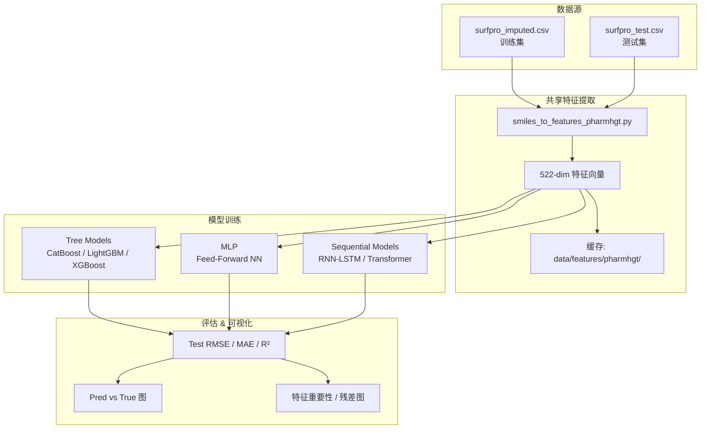
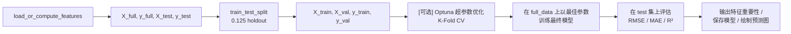
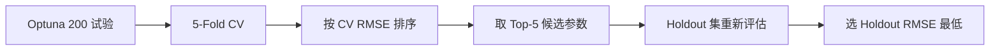
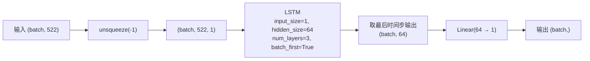
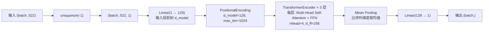
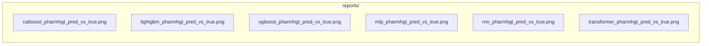
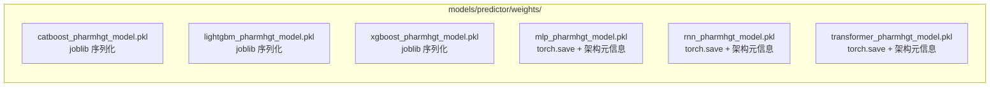

# PharmHGT-Style 表面活性剂性质预测流水线 — 技术文档

> **版本**: 1.0  
> **日期**: 2026-07-21  
> **目标**: 从 SMILES 分子结构出发，通过 522 维 PharmHGT 风格特征工程 + 多种回归模型，预测表面活性剂关键界面性质（pCMC）

---

## 1. 项目总览

### 1.1 背景与目标

本项目构建了一条完整的机器学习流水线，用于预测表面活性剂（surfactant）的**临界胶束浓度对数值（pCMC，即 log CMC）** 及其他界面性质。

**核心策略**：从 SMILES 字符串中提取 522 维手工设计的分子特征（受 PharmHGT 异构图表征启发），再分别用 6 种回归模型（CatBoost、LightGBM、XGBoost、MLP、RNN-LSTM、Transformer-Encoder）进行训练与预测。

### 1.2 文件清单

| 文件 | 功能 | 模型类型 |
|------|------|---------|
| `smiles_to_features_pharmhgt.py` | **共享特征提取模块** — 522 维特征计算与缓存 | — |
| `train_catboost_use_pharmhgt_features.py` | CatBoost 训练 + Optuna 调参 | 梯度提升树 |
| `train_lightgbm_use_pharmhgt_features.py` | LightGBM 训练 + Optuna 调参 | 梯度提升树 |
| `train_xgboost_use_pharmhgt_features.py` | XGBoost 训练 + Optuna 调参 + Holdout 二次筛选 | 梯度提升树 |
| `train_mlp_use_pharmhgt_features.py` | MLP（多层感知机）训练 | 深度前馈网络 |
| `train_rnn_use_pharmhgt_features.py` | RNN-LSTM 训练 | 循环神经网络 |
| `train_transformer_use_pharmhgt_features.py` | Transformer Encoder 训练 | Transformer |

### 1.3 数据流总图



---

## 2. 共享特征提取模块

> 对应文件：`smiles_to_features_pharmhgt.py`

### 2.1 522 维特征构成

| 模块 | 维度 | 计算方式 | 子维度 |
|------|------|---------|--------|
| 原子级聚合特征 | 220 | 55 维原子特征 × 4 统计量 (mean/std/min/max) | 55 × 4 |
| 键级聚合特征 | 56 | 14 维键特征 × 4 统计量 | 14 × 4 |
| 药效团特征 | 194 | MACCS 键指纹填充至 194 维 | 194 |
| 反应性特征 | 34 | BRICS 碎片 CRC32 分桶直方图 | 34 |
| 表面活性剂类型 | 4 | 阴/阳/非/两性 one-hot | 4 |
| 头基/尾链比例 | 2 | 头基原子占比、尾链碳链占比 | 2 |
| 分子描述符 | 12 | 归一化的 RDKit 全局描述符 | 12 |
| **总计** | **522** | | |

### 2.2 原子特征（55 维）

对每个原子编码以下信息，再通过全分子聚合（mean/std/min/max）得到 220 维：

| 索引范围 | 维度 | 内容 | 编码方式 |
|---------|------|------|---------|
| [0:16) | 16 | 原子序数 (H, Li, B, C, N, O, F, Na, Si, P, S, Cl, K, Br, I, Au) | one-hot |
| [16:22) | 6 | 度数 (0-5+) | one-hot |
| [22] | 1 | 形式电荷 clip(-2,2)/2 | 标量 |
| [23:28) | 5 | 隐氢数 (0-4+) | one-hot |
| [28:33) | 5 | 杂化方式 (SP/SP2/SP3/SP3D/SP3D2) | one-hot |
| [33] | 1 | 芳香性 | 二值 |
| [34] | 1 | 在环中 | 二值 |
| [35] | 1 | 原子质量/100 | 标量 |
| [36] | 1 | 手性中心 | 二值 |
| [37] | 1 | 自由基电子数/2 | 标量 |
| [38:42) | 4 | 显式化合价 (1-5+) | one-hot |
| [42:46) | 4 | 环大小 (3,4,5,6) | one-hot |
| [46:50) | 4 | Gasteiger 电荷分桶 | 分桶编码 |
| [50] | 1 | 环大小 ≥ 7 | 二值 |
| [51] | 1 | 是否为 N 或 O | 二值 |
| [52] | 1 | H 键供体 | 二值 |
| [53] | 1 | H 键受体 | 二值 |
| [54] | 1 | 重原子邻居数/4 | 标量 |

### 2.3 键特征（14 维）

| 索引范围 | 维度 | 内容 | 编码方式 |
|---------|------|------|---------|
| [0:4) | 4 | 键类型 (SINGLE/DOUBLE/TRIPLE/AROMATIC) | one-hot |
| [4] | 1 | 共轭 | 二值 |
| [5] | 1 | 在环中 | 二值 |
| [6:12) | 6 | 立体构型 (NONE/ANY/Z/E/CIS/TRANS) | one-hot |
| [12] | 1 | 芳香键（冗余） | 二值 |
| [13] | 1 | 在环中（冗余） | 二值 |

聚合方式同原子特征（mean/std/min/max），得到 14 × 4 = 56 维。

### 2.4 表面活性剂检测

专门为表面活性剂分子设计的领域知识模块：

**类型判定** — 通过检测带电原子判定：
- 同时含 `[O-]/[S-]` 和 `[N+]/[n+]` → 两性离子
- 仅 `[O-]/[S-]` → 阴离子
- 仅 `[N+]/[n+]` → 阳离子
- 均不含 → 非离子

**头基检测** — 根据类型匹配 SMARTS 子结构模式（磺酸盐、硫酸酯、羧酸盐、磷酸酯、季铵、铵、吡啶、咪唑、羟基、醚、酰胺、酯等）。

**尾链检测** — 使用 DFS 搜索最长连续碳链（≥ 4 个碳），标记为疏水尾链。

### 2.5 分子描述符（12 维，均经归一化）

MolWt/500、LogP/10、TPSA/200、RotBonds/NAtoms、HBA/NAtoms、HBD/NAtoms、NumRings/20、AroRings/10、AliRings/10、FracSP3（原生[0,1]）、HeavyAtoms/100、NAtoms/200。

### 2.6 缓存机制

- **缓存位置**：`data/features/pharmhgt/`
- **缓存文件**：`X_train.npy`, `y_train.npy`, `X_test.npy`, `y_test.npy`, `metadata.json`
- **失效策略**：基于 `hashlib.md5` 对 SMILES 列求哈希，训练/测试集哈希分别存储于 `metadata.json`，任一改变即触发重计算
- **强制重算**：`force_recompute=True`

### 2.7 API

```python
# 批量（训练脚本使用）
from smiles_to_features_pharmhgt import load_or_compute_features
X_train, y_train, X_test, y_test = load_or_compute_features()

# 单分子推理
from smiles_to_features_pharmhgt import smiles_to_features_pharmhgt
vec = smiles_to_features_pharmhgt("CCO")  # shape: (522,)
```

---

## 3. 训练框架通用设计

### 3.1 数据准备流程

所有 6 个训练脚本遵循统一的结构：



### 3.2 公共参数

| 参数 | 值 | 说明 |
|------|-----|------|
| 训练数据 | `./data/surfpro_imputed.csv` | 插补后的训练集 |
| 测试数据 | `./data/surfpro_test.csv` | 测试集 |
| 目标变量 | `pCMC` | 临界胶束浓度对数 |
| SMILES 列 | `SMILES` | 分子结构列 |
| 验证集比例 | 0.125 | 训练数据中划出 |
| 随机种子 | 42 | 全局随机种子 |

### 3.3 输出产物

| 产出 | 路径 |
|------|------|
| 预测 vs 真值图 + 残差图 | `reports/{model}_pharmhgt_pred_vs_true.png` |
| 模型权重 | `models/predictor/weights/{model}_pharmhgt_model.pkl` |

---

## 4. 模型详细说明

### 4.1 CatBoost

> 文件：`train_catboost_use_pharmhgt_features.py`

#### 4.1.1 模型概述

**CatBoost**（Categorical Boosting）是 Yandex 开发的梯度提升框架，原生支持类别特征、对称决策树（oblivious trees）和排序提升（ordered boosting），对含噪声的分子特征数据具有良好鲁棒性。

#### 4.1.2 超参数优化

- **优化框架**：Optuna，10 次试验 × 5 折交叉验证
- **目标函数**：CV RMSE（均方根误差）
- **搜索空间**：

| 参数 | 范围 | 说明 |
|------|------|------|
| `depth` | [4, 10] | 树深度 |
| `learning_rate` | [0.005, 0.3] (log) | 学习率 |
| `iterations` | [500, 3000] | 迭代次数 |
| `l2_leaf_reg` | [1.0, 50.0] (log) | L2 正则化 |
| `random_strength` | [0.0, 10.0] | 分裂点随机噪声 |
| `bagging_temperature` | [0.0, 10.0] | 贝叶斯 Bagging 强度 |
| `border_count` | [32, 255] | 特征分桶数 |
| `one_hot_max_size` | [2, 50] | 类别特征 one-hot 上限 |
| `leaf_estimation_iterations` | [1, 10] | 叶值估计迭代 |
| `min_data_in_leaf` | [1, 50] | 叶节点最小样本数 |

- **早停**：验证集 100 轮无改进即停止
- **修剪器**：`MedianPruner`（中位数修剪）

#### 4.1.3 最终训练

- 使用 Optuna 得到的最佳参数，迭代数提升至 max(3000, best_iterations)
- 早停阈值 150 轮
- 模型保存为 `catboost_pharmhgt_model.pkl`（joblib）

---

### 4.2 LightGBM

> 文件：`train_lightgbm_use_pharmhgt_features.py`

#### 4.2.1 模型概述

**LightGBM**（Light Gradient Boosting Machine）是微软推出的梯度提升框架，基于直方图算法和叶子优先（leaf-wise）树生长策略，训练速度快、内存占用低。

#### 4.2.2 超参数优化

- **优化框架**：Optuna，50 次试验 × 5 折交叉验证
- **搜索空间**：

| 参数 | 范围/选项 | 说明 |
|------|----------|------|
| `boosting_type` | ['gbdt', 'dart'] | 提升类型 |
| `max_depth` | [3, 15] | 树深度限制 |
| `num_leaves` | [15, 255] | 叶子节点数（核心参数） |
| `learning_rate` | [0.005, 0.3] (log) | 学习率 |
| `n_estimators` | [500, 3000] | 迭代轮数 |
| `subsample` | [0.5, 1.0] | 数据采样比例 |
| `subsample_freq` | [1, 10] | 采样频率 |
| `colsample_bytree` | [0.3, 1.0] | 特征采样比例 |
| `reg_alpha` | [1e-8, 10.0] (log) | L1 正则化 |
| `reg_lambda` | [1e-8, 10.0] (log) | L2 正则化 |
| `min_child_samples` | [5, 100] | 叶子最小样本数 |
| `min_child_weight` | [1e-5, 1e-1] (log) | 叶子最小权重和 |
| `min_split_gain` | [0.0, 1.0] | 分裂最小增益 |
| `cat_smooth` | [0.0, 50.0] | 类别特征平滑 |
| `cat_l2` | [0.0, 50.0] | 类别特征 L2 正则 |

DART 特有额外参数（当 `boosting_type='dart'` 时启用）：

| 参数 | 范围 | 说明 |
|------|------|------|
| `drop_rate` | [0.01, 0.3] | Dropout 比例 |
| `max_drop` | [1, 50] | 最大 Dropout 树数 |
| `skip_drop` | [0.01, 0.3] | 跳过 Dropout 概率 |

- **早停**：验证集 30 轮无改进
- **注意**：若最终模型使用 `gbdt`，DART 特有参数会被移除

---

### 4.3 XGBoost

> 文件：`train_xgboost_use_pharmhgt_features.py`

#### 4.3.1 模型概述

**XGBoost**（Extreme Gradient Boosting）是经典型梯度提升框架，支持列采样、正则化、自定义损失，在结构化数据领域是强基准模型。

#### 4.3.2 超参数优化

- **优化框架**：Optuna，200 次试验 × 5 折交叉验证
- **独特设计**：使用**多变量 TPE 采样器**（multivariate TPE），捕捉参数间的联合分布
- **搜索空间**：

| 参数 | 范围/选项 | 说明 |
|------|----------|------|
| `n_estimators` | [800, 3000] | 树数量 |
| `max_depth` | [4, 12] | 树深度 |
| `learning_rate` | [0.01, 0.2] (log) | 学习率 |
| `subsample` | [0.6, 1.0] | 行采样 |
| `colsample_bytree` | [0.3, 1.0] | 列采样（树级） |
| `colsample_bylevel` | [0.3, 1.0] | 列采样（层级） |
| `colsample_bynode` | [0.3, 1.0] | 列采样（节点级） |
| `min_child_weight` | [1.0, 30.0] (log) | 叶子最小权重 |
| `gamma` | [0.0, 2.0] | 分裂最小损失下降 |
| `reg_alpha` | [1e-8, 10.0] (log) | L1 正则 |
| `reg_lambda` | [1e-8, 10.0] (log) | L2 正则 |
| `max_delta_step` | [0.0, 8.0] | 最大增量步长 |
| `booster` | ['gbtree', 'dart'] | 基础提升器 |

#### 4.3.3 过拟合惩罚机制

XGBoost 训练脚本独有设计——在 CV 折内计算**训练-验证差距（gap）**，若 gap > 0.3 则在 CV RMSE 上增加 5% 惩罚系数：

```python
gap = rmse_train - rmse_val
adjusted_rmse = rmse_val * (1.0 + 0.05 * max(0.0, gap - 0.3))
```

这确保 Optuna 选择的参数不仅在验证集上表现好，而且训练-验证差距小（泛化能力强）。

#### 4.3.4 Top-K Holdout 二次筛选

XGBoost 独有设计——从全量训练数据中额外划出 **10% 作为 holdout 集**，在 Optuna 完成后，取 CV RMSE 前 **5 名（Top-K=5）** 的候选参数，在 holdout 集上重新评估，选择 holdout RMSE 最低的参数作为最终参数。



这种方式减少了 CV 上的过拟合对参数选择的误导，进一步提升泛化性。

---

### 4.4 MLP（多层感知机）

> 文件：`train_mlp_use_pharmhgt_features.py`

#### 4.4.1 模型架构


| 参数 | 值 |
|------|-----|
| 层数 | 4 个隐藏层 |
| 隐藏维度 | 512 |
| 激活函数 | GELU（高斯误差线性单元） |
| 正则化 | BatchNorm1d + Dropout(0.1) |
| 优化器 | AdamW |
| 学习率 | 1e-3 |
| 权重衰减 | 1e-6 |
| 批次大小 | 64 |
| 最大轮数 | 800 |
| 早停轮数 | 50 |

#### 4.4.2 训练细节

- **无 Optuna 调参**：使用固定超参数
- 每个 epoch 用全量训练集（`X_full`）训练，每 5 个 epoch 在验证集上评估一次
- 早停轮数 50：验证 RMSE 连续 50 轮无改善即停止
- 保存最佳验证 RMSE 对应的状态字典

#### 4.4.3 模型保存格式

```python
torch.save({
    'model_type': 'mlp',
    'input_dim': 522,
    'n_layers': 4,
    'hidden_dim': 512,
    'dropout': 0.1,
    'activation': 'gelu',
    'state_dict': model.state_dict(),
}, 'mlp_pharmhgt_model.pkl')
```

---

### 4.5 RNN-LSTM

> 文件：`train_rnn_use_pharmhgt_features.py`

#### 4.5.1 模型架构

**设计理念**：将 522 维特征向量视为 **522 个时间步 × 1 个特征** 的序列，用 LSTM 捕捉维度间的序列依赖关系。



| 参数 | 值 |
|------|-----|
| LSTM 层数 | 3 |
| 隐藏维度 | 64 |
| Dropout（层间） | 0.2 |
| 优化器 | AdamW |
| 学习率 | 1e-3 |
| 权重衰减 | 1e-5 |
| 批次大小 | 32 |
| 最大轮数 | 800 |
| 早停轮数 | 50 |

#### 4.5.2 序列处理策略

LSTM 逐时间步处理 522 维向量，**最后时间步的隐藏状态**经全连接层映射为预测值。注意这种设计假设特征维度之间存在有意义的顺序依赖——特征的前后排列（原子特性在前、分子描述符在后）决定了模型"读"特征的顺序。

#### 4.5.3 模型保存格式

```python
torch.save({
    'model_type': 'rnn',
    'input_dim': 522,
    'n_layers': 3,
    'hidden_dim': 64,
    'dropout': 0.2,
    'activation': 'relu',
    'state_dict': model.state_dict(),
}, 'rnn_pharmhgt_model.pkl')
```

---

### 4.6 Transformer Encoder

> 文件：`train_transformer_use_pharmhgt_features.py`

#### 4.6.1 模型架构

**设计理念**：同样将 522 维向量视为 522 个时间步，但用 Transformer Encoder 的**自注意力机制**替代 LSTM，让每个维度可以关注所有其他维度。



| 参数 | 值 |
|------|-----|
| d_model（模型维度） | 128 |
| nhead（注意力头数） | 4 |
| num_layers（编码器层数） | 3 |
| dim_feedforward（FFN 维度） | 256 |
| dropout | 0.1 |
| 激活函数 | GELU |
| 优化器 | AdamW |
| 学习率 | 1e-3 |
| 权重衰减 | 1e-5 |
| 批次大小 | 16 |
| 最大轮数 | 500 |
| 早停轮数 | 30 |
| 梯度裁剪 | 5.0 |
| 学习率调度 | CosineAnnealingLR（T_max=500） |

#### 4.6.2 关键设计

- **位置编码**：标准正弦-余弦位置编码（`PositionalEncoding`），让模型感知 522 维特征中每个维度的位置
- **均值池化**：使用 mean pooling 而非 `[CLS]` 标记，将所有时间步的信息平均汇聚为全局表征
- **梯度裁剪**：max_norm=5.0，防止梯度爆炸
- **Warmup 预热**：正式训练前使用随机输入进行前向预热，触发 CUDA kernel 编译

#### 4.6.3 模型保存格式

```python
torch.save({
    'model_type': 'transformer',
    'input_dim': 522,
    'd_model': 128,
    'nhead': 4,
    'num_layers': 3,
    'dim_feedforward': 256,
    'dropout': 0.1,
    'activation': 'gelu',
    'state_dict': model.state_dict(),
}, 'transformer_pharmhgt_model.pkl')
```

---

## 5. 模型对比总表

### 5.1 架构对比

| 维度 | CatBoost | LightGBM | XGBoost | MLP | RNN-LSTM | Transformer |
|------|----------|----------|---------|-----|----------|-------------|
| **模型类型** | 梯度提升树 | 梯度提升树 | 梯度提升树 | 前馈神经网络 | 循环神经网络 | Transformer Encoder |
| **框架** | CatBoost | LightGBM | XGBoost | PyTorch | PyTorch | PyTorch |
| **特征处理** | 原生 522 维向量 | 原生 522 维向量 | 原生 522 维向量 | 原生 522 维向量 | 522 时间步 | 522 序列 |
| **调参方式** | Optuna (10 trials) | Optuna (50 trials) | Optuna (200 trials, Top-K holdout) | 固定参数 | 固定参数 | 固定参数 |
| **CV 折数** | 5 | 5 | 5 | — | — | — |
| **早停策略** | 验证集 (100→150轮) | 验证集 (30轮) | 验证集 (100轮) | 验证集 (50轮) | 验证集 (50轮) | 验证集 (30轮) |
| **过拟合防御** | L2, RandomStrength, Bagging | L1+L2, MinChildW, Subsample | L1+L2, Gamma, Gap Penalty | Dropout, BatchNorm, WDecay | Dropout, WDecay | Dropout, WDecay, GradClip |

### 5.2 超参数搜索空间大小

| 模型 | 搜索参数数 | Optuna Trials | 总评估模型数 | 参数搜索方法 |
|------|-----------|---------------|-------------|-------------|
| CatBoost | 10 个 | 10 | 50 (10×5 CV) | TPE Sampler |
| LightGBM | 14 个 (GBDT) / 17 个 (DART) | 50 | 250 (50×5 CV) | TPE Sampler |
| XGBoost | 13 个 | 200 | 1,000 (200×5 CV) | **Multivariate TPE** |
| MLP | 固定，无搜索 | — | 1 | 人工设定 |
| RNN-LSTM | 固定，无搜索 | — | 1 | 人工设定 |
| Transformer | 固定，无搜索 | — | 1 | 人工设定 |

### 5.3 学习策略对比

| 模型 | 优化器 | 学习率调度 | 批次大小 | 最大 Epoch | 梯度裁剪 |
|------|--------|-----------|---------|-----------|---------|
| CatBoost | 内置排序提升 | 自适应 | 全量数据 | 3000 (树) | 无 |
| LightGBM | 内置直方图 | 自适应 | 全量数据 | 3000 (树) | 无 |
| XGBoost | 内置牛顿法 | 自适应 | 全量数据 | 3000 (树) | 无 |
| MLP | AdamW | 无 | 64 | 800 | 无 |
| RNN-LSTM | AdamW | 无 | 32 | 800 | 无 |
| Transformer | **AdamW** | **CosineAnnealingLR** | **16** | **500** | **5.0** |

---

## 6. 评估与输出

### 6.1 评估指标

所有模型统一使用以下指标在测试集上评估：

- **MSE**（均方误差）：\(\frac{1}{n}\sum(y_i - \hat{y}_i)^2\)
- **RMSE**（均方根误差）：\(\sqrt{MSE}\)，主评估指标
- **MAE**（平均绝对误差）：\(\frac{1}{n}\sum|y_i - \hat{y}_i|\)
- **R²**（决定系数）：\(1 - \frac{SS_{res}}{SS_{tot}}\)

### 6.2 可视化输出

每个模型生成一张预测 vs 真值 + 残差图，保存于 `reports/`：



### 6.3 特征重要性

CatBoost、LightGBM、XGBoost 三种树模型在训练完成后输出 **Top-20 特征重要性**，使用 `FEATURE_NAMES`（来自 `smiles_to_features_pharmhgt`）对特征进行命名，便于分析哪些分子特征对 pCMC 预测贡献最大。

### 6.4 模型权重保存

所有模型权重保存于统一目录：



树模型（CatBoost/LightGBM/XGBoost）使用 `joblib.dump`，加载时需相应的库。
深度学习模型（MLP/RNN/Transformer）使用 `torch.save` 存储包含架构配置的状态字典，加载时需先实例化模型再 `load_state_dict`。

---

## 7. 使用指南

### 7.1 快速开始

```bash
# 1. 特征提取 + CatBoost 训练
python train_catboost_use_pharmhgt_features.py

# 2. LightGBM
python train_lightgbm_use_pharmhgt_features.py

# 3. XGBoost
python train_xgboost_use_pharmhgt_features.py

# 4. 深度学习模型
python train_mlp_use_pharmhgt_features.py
python train_rnn_use_pharmhgt_features.py
python train_transformer_use_pharmhgt_features.py
```

首次运行会自动计算并缓存 522 维特征到 `data/features/pharmhgt/`。

### 7.2 依赖

- **Python** ≥ 3.8
- **RDKit**（分子解析、指纹、描述符）
- **PyTorch** + CUDA（可选，用于 MLP/RNN/Transformer）
- **scikit-learn**（数据划分、评估指标）
- **Optuna**（树模型的超参数优化）
- **CatBoost / LightGBM / XGBoost**
- **Matplotlib + Seaborn**（可视化）

### 7.3 自定义预测

```python
from smiles_to_features_pharmhgt import smiles_to_features_pharmhgt
import joblib

# 加载任意已训练模型
model = joblib.load('models/predictor/weights/catboost_pharmhgt_model.pkl')

# 单分子预测
smiles = "CCCCCCCCCCCCCCCCCCCC(=O)[O-]"
features = smiles_to_features_pharmhgt(smiles)
pCMC_pred = model.predict(features.reshape(1, -1))
print(f"Predicted pCMC: {pCMC_pred[0]:.4f}")
```

---

## 8. 设计要点与注意事项

### 8.1 特征设计要点

1. **多尺度融合**：522 维特征融合了原子级（55→220）、键级（14→56）、官能团级（MACCS 194）、碎片级（BRICS 34）和分子全局级（12+6=18）信息，覆盖从微观到宏观的分子结构描述
2. **受 PharmHGT 启发**：原始 PharmHGT 是端到端图神经网络，本项目将异构图表征转化为手工特征，使树模型也能利用类似的多元信息
3. **领域定制**：表面活性剂检测模块（头基 SMARTS 匹配 + DFS 尾链检测）是通用分子描述符无法提供的领域知识

### 8.2 训练设计要点

1. **树模型配置差异**：XGBoost 投入最大调参力度（200 trials + Top-5 holdout 筛选 + multivariate TPE + gap penalty），LightGBM 居中（50 trials），CatBoost 最少（10 trials）
2. **深度学习模型对比策略**：MLP、RNN-LSTM、Transformer 三者在相同输入上以固定参数训练，测试不同架构对 522 维特征的表征能力——MLP 捕捉特征组合，LSTM 捕捉顺序依赖，Transformer 通过注意力捕捉全局关联
3. **早停统一**：所有深度学习模型使用验证 RMSE 监控+早停，树模型也使用验证集早停，防止过拟合

### 8.3 注意事项

1. **Gasteiger 电荷依赖**：部分原子特征依赖 `ComputeGasteigerCharges`，大分子可能计算失败
2. **BRICS 性能安全**：BRICS 分解设置了 128 碎片上限防死循环
3. **尾链检测局限性**：DFS 最长碳链策略仅捕捉一条尾链，对支链/双尾链表面活性剂不完全
4. **特征排列敏感性**：RNN 和 Transformer 将 522 维视为序列，特征排列顺序影响模型读入逻辑，当前排列为：原子聚合→键聚合→MACCS→BRICS→表面活性剂→描述符
5. **MD5 缓存限制**：缓存仅依赖 SMILES 哈希，若数据文件中的非 SMILES 列（如目标值）改变但 SMILES 不变，缓存不会自动失效

---

## 9. 参考

- Jiang et al., "PharmHGT: A heterogeneous graph transformer for molecular representation learning", *Communications Chemistry*, 2023
- RDKit: https://www.rdkit.org/
- CatBoost: https://catboost.ai/
- LightGBM: https://lightgbm.readthedocs.io/
- XGBoost: https://xgboost.readthedocs.io/
- Optuna: https://optuna.org/
- MACCS keys: MDL Information Systems
- BRICS: Breaking of Retrosynthetically Interesting Chemical Substructures
